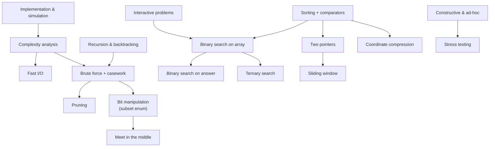

# Basics — Core Techniques & Problem-Solving Toolkit

The foundational **techniques** every competitive programmer and interviewee needs: how to
implement cleanly, analyze complexity, search, sweep, and reason about problems. Each topic has a
**complete guide** (theory, math, many Mermaid diagrams, complexity, pitfalls) and **curated
problems** solved in **both Python and C++**.

> This module is the on-ramp to the topic folders (Arrays, Strings, Trees, Graphs, ds_advanced,
> graph_advanced, maths). Master these patterns first — almost every harder problem is a
> combination of them.

## Structure

```
basics/
├── guide/      # one concept guide per technique (diagram-heavy)
└── problems/   # one file per curated problem (Python + C++, traces, diagrams, math)
```

## Topics & Guides

| # | Technique | Guide | Key problems |
|---|-----------|-------|--------------|
| 1 | Implementation & simulation | [01-implementation-simulation.md](guide/01-implementation-simulation.md) | Spiral Matrix, Game of Life, Robot simulation |
| 2 | Fast I/O & careful output | [02-fast-io-output.md](guide/02-fast-io-output.md) | Factory Machines, Sum of many ints, Float formatting |
| 3 | Time & space complexity | [03-time-space-complexity.md](guide/03-time-space-complexity.md) | Estimate from constraints, Recurrence trees, Amortized analysis |
| 4 | Bit manipulation | [04-bit-manipulation.md](guide/04-bit-manipulation.md) | Subsets, Counting Bits, SOS DP |
| 5 | Recursion & backtracking | [05-recursion-backtracking.md](guide/05-recursion-backtracking.md) | Permutations, N-Queens, Combination Sum |
| 6 | Constructive algorithms | [06-constructive-algorithms.md](guide/06-constructive-algorithms.md) | Constructive permutation, Rearrange no-adjacent-equal, XOR array |
| 7 | Ad-hoc / observation | [07-adhoc-observation.md](guide/07-adhoc-observation.md) | Min ops to equalize, Min moves, Parity game |
| 8 | Casework & brute force with pruning | [08-casework-brute-force-pruning.md](guide/08-casework-brute-force-pruning.md) | Combination Sum II, Restore IP, Subset-sum B&B |
| 9 | Interactive problems | [09-interactive-problems.md](guide/09-interactive-problems.md) | Guess number, Find hidden index, Query budget |
| 10 | Stress testing / random generation | [10-stress-testing-random-generation.md](guide/10-stress-testing-random-generation.md) | Stress harness, Random tree gen, Minimize failing case |
| 11 | Sorting + custom comparators | [11-sorting-custom-comparators.md](guide/11-sorting-custom-comparators.md) | Largest Number, Merge Intervals, Multi-key sort |
| 12 | Binary search on a sorted array | [12-binary-search-sorted-array.md](guide/12-binary-search-sorted-array.md) | Binary Search, First/Last Position, Search Insert |
| 13 | Binary search on the answer | [13-binary-search-on-answer.md](guide/13-binary-search-on-answer.md) | Koko Bananas, Split Array Largest Sum, Aggressive Cows |
| 14 | Ternary search (unimodal) | [14-ternary-search.md](guide/14-ternary-search.md) | Peak in Mountain Array, Minimize convex fn, Bitonic max |
| 15 | Two pointers | [15-two-pointers.md](guide/15-two-pointers.md) | Two Sum II, Container With Most Water, 3Sum |
| 16 | Sliding window (fixed & variable) | [16-sliding-window.md](guide/16-sliding-window.md) | Longest Substring, Min Size Subarray Sum, Find Anagrams |
| 17 | Coordinate compression | [17-coordinate-compression.md](guide/17-coordinate-compression.md) | Count Smaller After Self, Inversions, Interval coverage |
| 18 | Meet in the middle | [18-meet-in-the-middle.md](guide/18-meet-in-the-middle.md) | CSES Meet in the Middle, Target Sum, Closest subset sum |

## How the pieces fit together



## Recommended study order

1. **Implementation & simulation** (1) and **Complexity analysis** (3) — write correct code and know if it's fast enough.
2. **Fast I/O** (2) — never lose points to TLE on input.
3. **Sorting + comparators** (11) — the universal preprocessing step.
4. **Binary search** family (12 → 13 → 14) — search a value, then the answer, then unimodal optima.
5. **Two pointers** (15) → **Sliding window** (16) — linear-scan power tools.
6. **Bit manipulation** (4) and **Recursion & backtracking** (5) — enumeration foundations.
7. **Casework & brute force with pruning** (8) and **Meet in the middle** (18) — taming exponential search.
8. **Coordinate compression** (17) — shrink huge value domains for indexing structures.
9. **Constructive** (6), **Ad-hoc** (7), **Interactive** (9), **Stress testing** (10) — the contest mindset & tooling.

## Complexity cheat sheet

| Technique | Typical complexity | Notes |
|-----------|-------------------|-------|
| Simulation | $O(\text{steps})$ | translate the statement literally |
| Fast I/O | — | $\approx 10\times$ faster reads; flush only when needed |
| Bit subset enumeration | $O(2^n)$ / submasks $O(3^n)$ | masks, popcount, SOS DP |
| Recursion / backtracking | $O(b^d)$ | branching factor $b$, depth $d$; prune hard |
| Sorting | $O(n \log n)$ | use a strict weak ordering comparator |
| Binary search (array) | $O(\log n)$ | `lower_bound` / `upper_bound` |
| Binary search on answer | $O(n \log(\text{range}))$ | monotone feasibility predicate |
| Ternary search | $O(\log(\text{range}))$ probes | unimodal functions only |
| Two pointers | $O(n)$ | monotonic structure required |
| Sliding window | $O(n)$ | fixed or expand/shrink variable |
| Coordinate compression | $O(n \log n)$ | sort + unique + `lower_bound` |
| Meet in the middle | $O(2^{n/2} \cdot n)$ | $n \le 40$ subset problems |

---

> Every code sample appears in **both Python and C++**. Problem files follow the repo format:
> meta table → statement → approaches → Python + C++ → iteration trace → Mermaid → math →
> complexity → takeaway. Guides follow: TOC → concepts → paired code → Mermaid (lots!) → math →
> complexity → pitfalls → patterns.
