# Implementation & Simulation

Implementation (also called *simulation* or *ad-hoc*) problems are the most direct kind of programming challenge: the problem statement **tells you exactly what to do**, and your only job is to translate that description into correct code. There is rarely a clever trick or a deep algorithm hiding underneath. Instead, the difficulty comes from **reading carefully**, **modeling the world faithfully**, and **handling every edge case** the statement mentions (and a few it only implies).

Because the algorithm is "spelled out", the failure mode is almost never *"I didn't know the technique"*. It is *"I misread the rules"*, *"I went out of bounds"*, *"I mixed up rows and columns"*, or *"I mutated state while still reading it"*. Mastering implementation problems is therefore mostly about **discipline**: model the state explicitly, change one thing at a time, and test against the worked example in the statement before submitting.

This guide walks through the core toolkit — grid and matrix simulation, the direction-array (`dx`/`dy`) idiom, state machines, and wrap-around (clock / calendar / modular) arithmetic — and then shows three fully worked, dual-language examples: a grid robot, a $90°$ matrix rotation, and a spiral-order traversal.

## Table of Contents

1. [What "Implementation / Simulation" Problems Are](#what-implementation--simulation-problems-are)
2. [Grid & Matrix Simulation](#grid--matrix-simulation)
3. [The Direction-Array (dx/dy) Technique](#the-direction-array-dxdy-technique)
4. [State Machines](#state-machines)
5. [Clock / Calendar / Modular Wrap-Around Arithmetic](#clock--calendar--modular-wrap-around-arithmetic)
6. [Reading the Statement Precisely & Edge Cases](#reading-the-statement-precisely--edge-cases)
7. [Structuring Clean Code to Avoid Bugs](#structuring-clean-code-to-avoid-bugs)
8. [Worked Example 1 — Grid Robot with Direction Arrays](#worked-example-1--grid-robot-with-direction-arrays)
9. [Worked Example 2 — Matrix 90° Rotation](#worked-example-2--matrix-90-rotation)
10. [Worked Example 3 — Spiral-Order Traversal](#worked-example-3--spiral-order-traversal)
11. [Complexity Summary](#complexity-summary)
12. [Common Pitfalls](#common-pitfalls)
13. [Patterns](#patterns)

---

## What "Implementation / Simulation" Problems Are

An implementation problem hands you a precise procedure and asks for its result. The mental model is a **pipeline**: read the rules, build a faithful model of the state, apply each rule step by step, and report the final state.

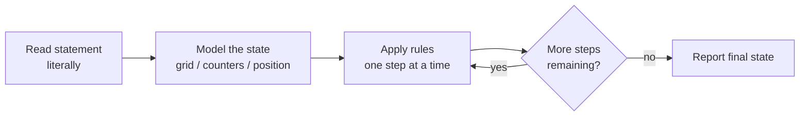

The single most important habit is to **translate the statement literally**. If the statement says *"the robot turns right, then moves forward one cell"*, your code should have a turn step and then a move step, in that order — not a fused shortcut that you *think* is equivalent. Faithful translation is what makes these problems reliable.

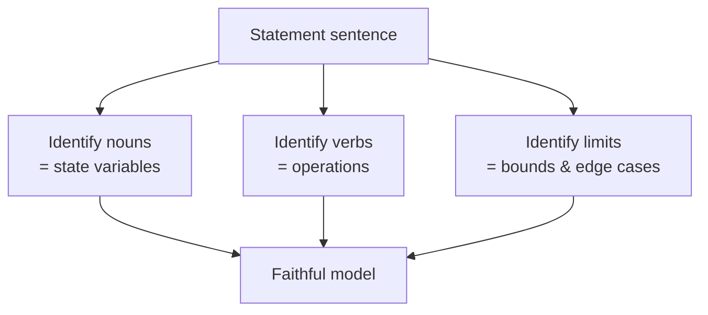

---

## Grid & Matrix Simulation

A grid is just a 2D array `grid[r][c]` where `r` is the row (which row, counted top to bottom) and `c` is the column (which column, left to right). The classic confusion is mixing up `(r, c)` with `(x, y)`: in most grid problems we index **row first**, and increasing `r` moves **down**, not up.

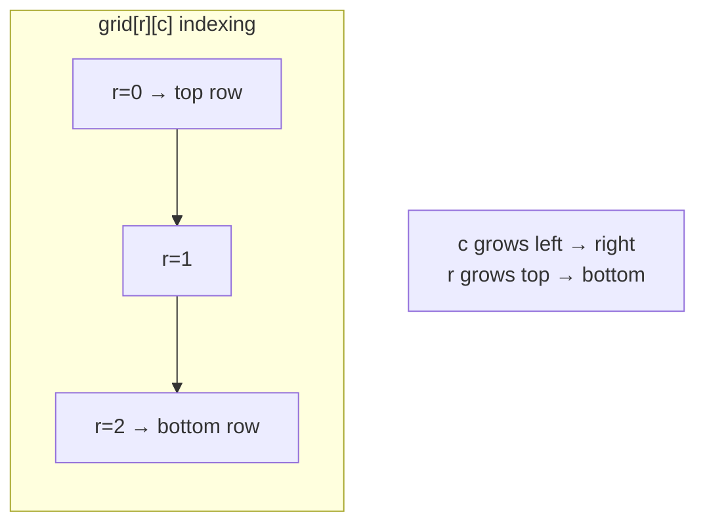

Movement, rotation, and spiral traversal are all just controlled walks over this array. The shared discipline is a **bounds check** before every access: a cell `(r, c)` is valid only when $0 \le r < R$ and $0 \le c < C$.

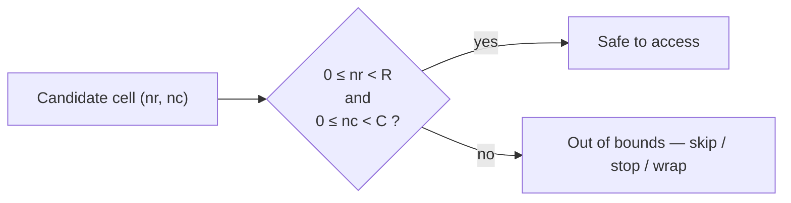

---

## The Direction-Array (dx/dy) Technique

Instead of writing four near-identical branches for up/down/left/right, store the offsets in parallel arrays and **loop over directions**. This is the single highest-leverage idiom in grid problems: it removes copy-paste bugs and makes "turn right" a one-line index update.

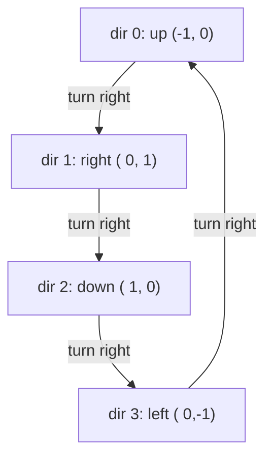

Ordering the directions **clockwise** means *turn right* is `dir = (dir + 1) % 4` and *turn left* is `dir = (dir + 3) % 4`. The next cell is always `(r + dr[dir], c + dc[dir])`.

```python
# Clockwise direction arrays: up, right, down, left
dr = [-1, 0, 1, 0]
dc = [0, 1, 0, -1]

def step(r, c, d):
    return r + dr[d], c + dc[d]

def turn_right(d):
    return (d + 1) % 4

def turn_left(d):
    return (d + 3) % 4
```

```cpp
#include <bits/stdc++.h>
using namespace std;

// Clockwise direction arrays: up, right, down, left
const int dr[4] = {-1, 0, 1, 0};
const int dc[4] = {0, 1, 0, -1};

pair<int,int> step(int r, int c, int d) {
    return {r + dr[d], c + dc[d]};
}

int turn_right(int d) { return (d + 1) % 4; }
int turn_left(int d)  { return (d + 3) % 4; }
```

For 8-directional movement (kings, neighbors in Game of Life), extend the arrays to all eight offsets and skip the `(0, 0)` self-cell.

```python
# 8 neighbors (exclude the cell itself)
DIRS8 = [(-1,-1), (-1,0), (-1,1),
         (0,-1),          (0,1),
         (1,-1),  (1,0),  (1,1)]

def neighbors(r, c, R, C):
    for dx, dy in DIRS8:
        nr, nc = r + dx, c + dy
        if 0 <= nr < R and 0 <= nc < C:
            yield nr, nc
```

```cpp
#include <bits/stdc++.h>
using namespace std;

// 8 neighbors (exclude the cell itself)
const int DIRS8[8][2] = {{-1,-1},{-1,0},{-1,1},
                         {0,-1},        {0,1},
                         {1,-1},{1,0},{1,1}};

vector<pair<int,int>> neighbors(int r, int c, int R, int C) {
    vector<pair<int,int>> res;
    for (auto &d : DIRS8) {
        int nr = r + d[0], nc = c + d[1];
        if (0 <= nr && nr < R && 0 <= nc && nc < C)
            res.push_back({nr, nc});
    }
    return res;
}
```

---

## State Machines

When the rules say *"depending on the current mode, do X and switch to mode Y"*, you have a **state machine**. Model the current state explicitly (an enum or integer), and write the transition rules as a table or `switch`. The robot's facing direction above is already a 4-state machine; many parsing and traffic-light style problems are state machines too.

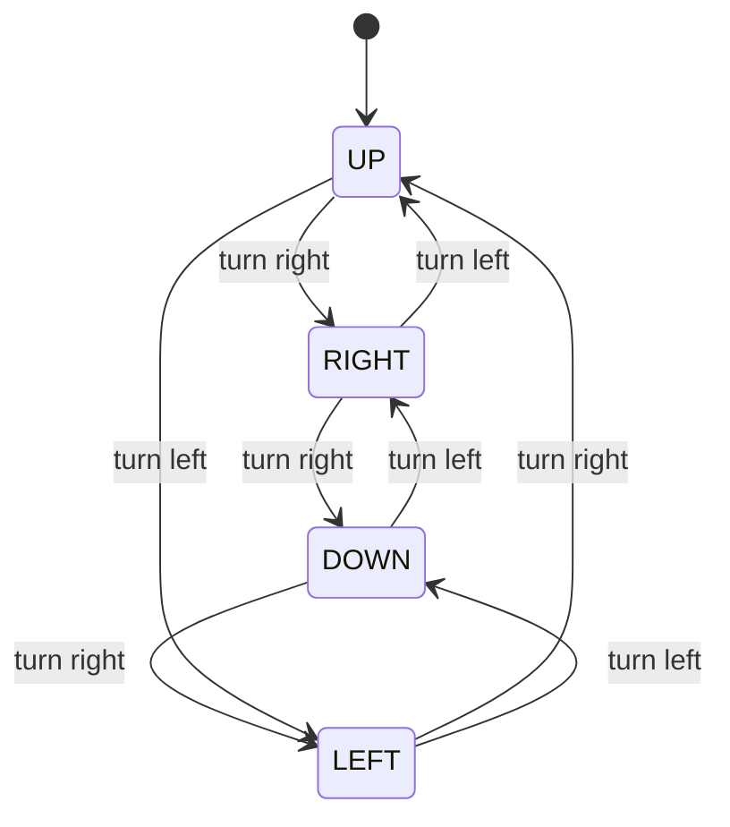

A traffic-light controller is a clean example of an explicit transition table driven by time.

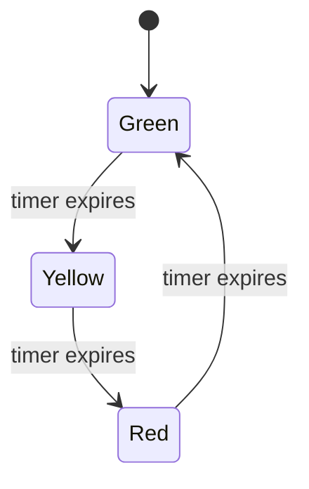

```python
# Traffic light as an explicit state machine
NEXT = {"GREEN": "YELLOW", "YELLOW": "RED", "RED": "GREEN"}

def advance(state, ticks):
    for _ in range(ticks):
        state = NEXT[state]
    return state
```

```cpp
#include <bits/stdc++.h>
using namespace std;

// Traffic light as an explicit state machine
string advance(string state, int ticks) {
    unordered_map<string,string> NEXT = {
        {"GREEN", "YELLOW"}, {"YELLOW", "RED"}, {"RED", "GREEN"}
    };
    for (int i = 0; i < ticks; i++) state = NEXT[state];
    return state;
}
```

---

## Clock / Calendar / Modular Wrap-Around Arithmetic

Anything that *cycles* — hours on a clock, days of the week, directions, positions on a ring — is **modular arithmetic**. The golden rule: to advance by $k$ within a cycle of size $m$, compute

$$\text{new} = (\text{cur} + k) \bmod m.$$

The subtle part is going **backward**. In C++ `%` can return a negative value, so to subtract safely use

$$\text{new} = ((\text{cur} - k) \bmod m + m) \bmod m.$$

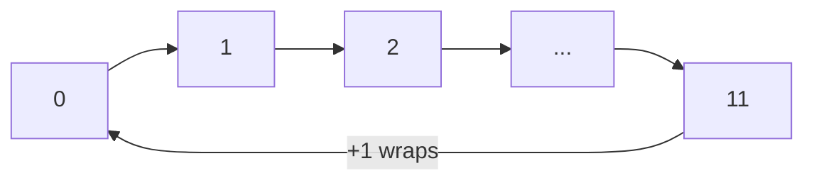

```python
def add_hours(hour, k, m=12):
    return (hour + k) % m

def sub_hours(hour, k, m=12):
    return (hour - k) % m  # Python % is always non-negative
```

```cpp
#include <bits/stdc++.h>
using namespace std;

int add_hours(int hour, int k, int m = 12) {
    return (hour + k) % m;
}

int sub_hours(int hour, int k, int m = 12) {
    // C++ % can be negative, so normalize back into [0, m)
    return ((hour - k) % m + m) % m;
}
```

For calendars, the recurring trap is leap years. A year is a leap year when it is divisible by $4$, **except** centuries not divisible by $400$:

$$\text{leap}(y) = (y \bmod 4 = 0 \land y \bmod 100 \ne 0) \lor (y \bmod 400 = 0).$$

```python
def is_leap(y):
    return (y % 4 == 0 and y % 100 != 0) or (y % 400 == 0)

def days_in_month(month, year):
    md = [31, 29 if is_leap(year) else 28, 31, 30, 31, 30,
          31, 31, 30, 31, 30, 31]
    return md[month - 1]
```

```cpp
#include <bits/stdc++.h>
using namespace std;

bool is_leap(int y) {
    return (y % 4 == 0 && y % 100 != 0) || (y % 400 == 0);
}

int days_in_month(int month, int year) {
    int md[12] = {31, is_leap(year) ? 29 : 28, 31, 30, 31, 30,
                  31, 31, 30, 31, 30, 31};
    return md[month - 1];
}
```

---

## Reading the Statement Precisely & Edge Cases

Most wrong answers on implementation problems trace back to a misread sentence, not a coding bug. Before writing code, extract the rules into a checklist and note every boundary condition.

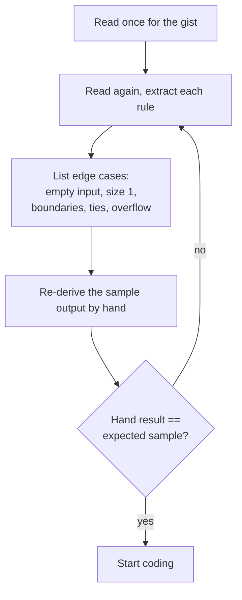

A practical edge-case checklist for grid/simulation problems:

- **Empty / minimal input**: zero rows, a single cell, a single step.
- **Boundaries**: the robot starts on an edge; the spiral has a single row or column left.
- **Ties & ordering**: when two rules could apply, which wins? The statement's wording decides.
- **Overflow**: large step counts or coordinate sums — use `long long` in C++.
- **Mutation while reading**: never overwrite state you still need (see Game of Life).

---

## Structuring Clean Code to Avoid Bugs

Clean structure is not cosmetic here — it is how you avoid the bugs that simulation problems punish.

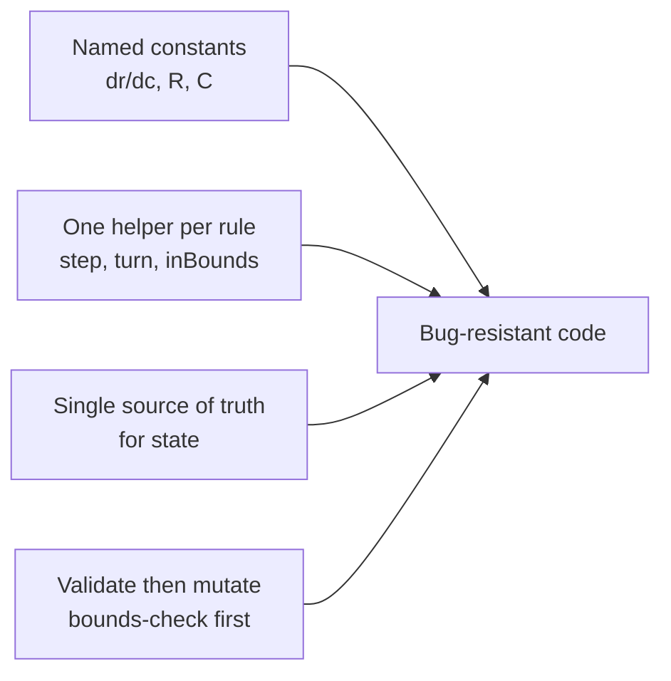

Guidelines that pay off repeatedly:

1. **Factor a `in_bounds(r, c)` helper** and call it before every access. One check, used everywhere.
2. **Use direction arrays** instead of four branches.
3. **Separate "compute next state" from "commit next state"** when rules read neighbors (avoid mutating mid-scan).
4. **Mirror the statement's order of operations** exactly.
5. **Test against the provided example** before anything else.

---

## Worked Example 1 — Grid Robot with Direction Arrays

> A robot starts at `(0, 0)` facing **up** on an $R \times C$ grid. It processes a command string of `'F'` (move forward one cell if in bounds, else stay), `'L'` (turn left), `'R'` (turn right). Report the final position and facing.

The direction array makes this almost a transcription of the rules. We keep `d` as the facing index into the clockwise arrays.

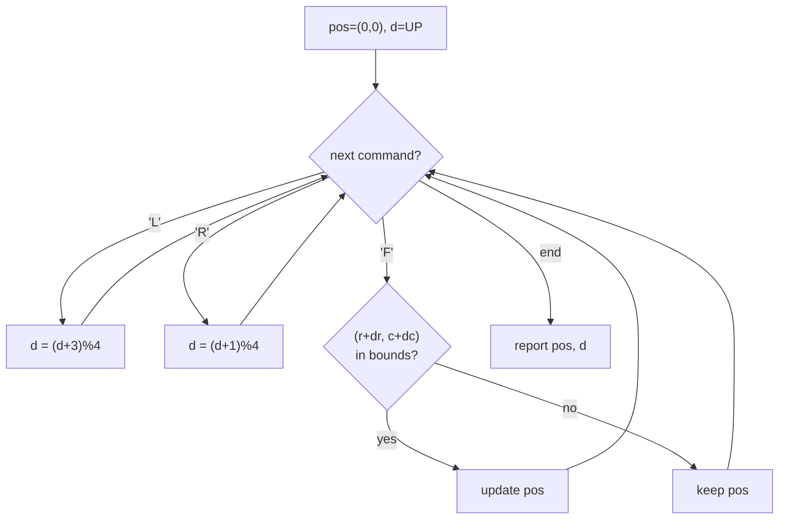

```python
def simulate_robot(R, C, commands):
    dr = [-1, 0, 1, 0]   # up, right, down, left
    dc = [0, 1, 0, -1]
    names = ["UP", "RIGHT", "DOWN", "LEFT"]
    r, c, d = 0, 0, 0    # start facing up

    for cmd in commands:
        if cmd == 'L':
            d = (d + 3) % 4
        elif cmd == 'R':
            d = (d + 1) % 4
        elif cmd == 'F':
            nr, nc = r + dr[d], c + dc[d]
            if 0 <= nr < R and 0 <= nc < C:
                r, c = nr, nc
    return r, c, names[d]

print(simulate_robot(3, 3, "FFRFF"))  # (2, 2, 'RIGHT')
```

```cpp
#include <bits/stdc++.h>
using namespace std;

tuple<int,int,string> simulate_robot(int R, int C, const string &commands) {
    const int dr[4] = {-1, 0, 1, 0};   // up, right, down, left
    const int dc[4] = {0, 1, 0, -1};
    const string names[4] = {"UP", "RIGHT", "DOWN", "LEFT"};
    int r = 0, c = 0, d = 0;           // start facing up

    for (char cmd : commands) {
        if (cmd == 'L') {
            d = (d + 3) % 4;
        } else if (cmd == 'R') {
            d = (d + 1) % 4;
        } else if (cmd == 'F') {
            int nr = r + dr[d], nc = c + dc[d];
            if (0 <= nr && nr < R && 0 <= nc && nc < C) {
                r = nr; c = nc;
            }
        }
    }
    return {r, c, names[d]};
}

int main() {
    auto [r, c, f] = simulate_robot(3, 3, "FFRFF");
    cout << r << " " << c << " " << f << "\n"; // 2 2 RIGHT
    return 0;
}
```

Tracing `"FFRFF"` on a $3\times3$ grid starting at `(0,0)` facing up: the two `F`s would move up, but `(−1,0)` is out of bounds, so the robot stays at `(0,0)`. `R` turns it to face right. The next two `F`s move it to `(0,1)` then `(0,2)`. Final: `(0, 2, RIGHT)` — and this is exactly why testing the sample by hand matters: an edge-start robot ignores moves that leave the grid.

---

## Worked Example 2 — Matrix 90° Rotation

> Rotate an $n \times n$ matrix by $90°$ clockwise, **in place**.

The clean two-step recipe is: **transpose** (swap `m[i][j]` with `m[j][i]`), then **reverse each row**. Transposing flips across the main diagonal; reversing rows then sends each element to its rotated column.

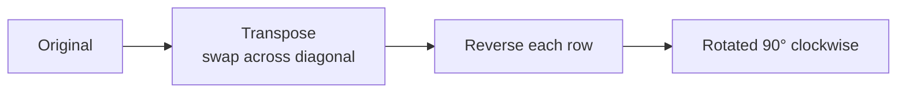

The element-level mapping for a clockwise rotation is

$$(i, j) \longrightarrow (j,\; n - 1 - i).$$

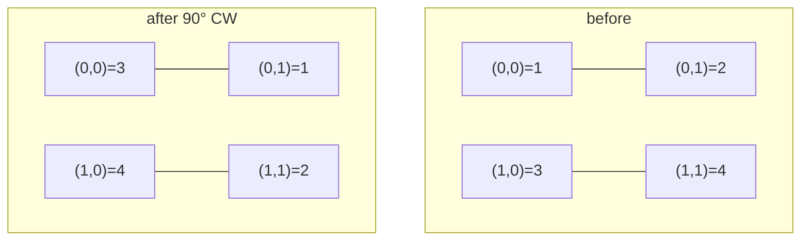

```python
def rotate_inplace(m):
    n = len(m)
    # 1) transpose
    for i in range(n):
        for j in range(i + 1, n):
            m[i][j], m[j][i] = m[j][i], m[i][j]
    # 2) reverse each row
    for i in range(n):
        m[i].reverse()
    return m

mat = [[1, 2, 3], [4, 5, 6], [7, 8, 9]]
print(rotate_inplace(mat))  # [[7,4,1],[8,5,2],[9,6,3]]
```

```cpp
#include <bits/stdc++.h>
using namespace std;

void rotate_inplace(vector<vector<int>> &m) {
    int n = (int)m.size();
    // 1) transpose
    for (int i = 0; i < n; i++)
        for (int j = i + 1; j < n; j++)
            swap(m[i][j], m[j][i]);
    // 2) reverse each row
    for (int i = 0; i < n; i++)
        reverse(m[i].begin(), m[i].end());
}

int main() {
    vector<vector<int>> mat = {{1,2,3},{4,5,6},{7,8,9}};
    rotate_inplace(mat);
    for (auto &row : mat) {
        for (int x : row) cout << x << ' ';
        cout << "\n";
    }
    return 0;
}
```

---

## Worked Example 3 — Spiral-Order Traversal

> Return all elements of an $R \times C$ matrix in spiral order (top row left-to-right, right column top-to-bottom, bottom row right-to-left, left column bottom-to-top, then shrink inward).

The robust approach maintains four shrinking boundaries — `top`, `bottom`, `left`, `right` — and peels one layer per loop, contracting the boundary after each side.

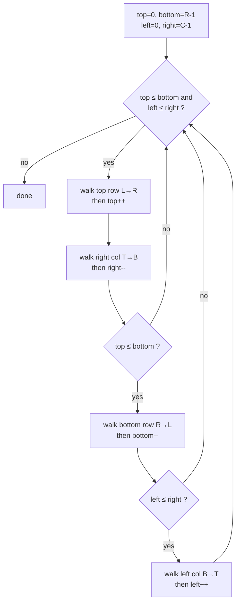

The arrows below show the order of travel as the spiral peels inward.

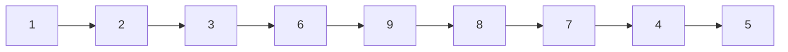

```python
def spiral_order(matrix):
    if not matrix or not matrix[0]:
        return []
    R, C = len(matrix), len(matrix[0])
    top, bottom, left, right = 0, R - 1, 0, C - 1
    res = []
    while top <= bottom and left <= right:
        for c in range(left, right + 1):          # top row L->R
            res.append(matrix[top][c])
        top += 1
        for r in range(top, bottom + 1):          # right col T->B
            res.append(matrix[r][right])
        right -= 1
        if top <= bottom:
            for c in range(right, left - 1, -1):  # bottom row R->L
                res.append(matrix[bottom][c])
            bottom -= 1
        if left <= right:
            for r in range(bottom, top - 1, -1):  # left col B->T
                res.append(matrix[r][left])
            left += 1
    return res

print(spiral_order([[1,2,3],[4,5,6],[7,8,9]]))  # [1,2,3,6,9,8,7,4,5]
```

```cpp
#include <bits/stdc++.h>
using namespace std;

vector<int> spiral_order(const vector<vector<int>> &matrix) {
    if (matrix.empty() || matrix[0].empty()) return {};
    int R = (int)matrix.size(), C = (int)matrix[0].size();
    int top = 0, bottom = R - 1, left = 0, right = C - 1;
    vector<int> res;
    while (top <= bottom && left <= right) {
        for (int c = left; c <= right; c++)        // top row L->R
            res.push_back(matrix[top][c]);
        top++;
        for (int r = top; r <= bottom; r++)        // right col T->B
            res.push_back(matrix[r][right]);
        right--;
        if (top <= bottom) {
            for (int c = right; c >= left; c--)    // bottom row R->L
                res.push_back(matrix[bottom][c]);
            bottom--;
        }
        if (left <= right) {
            for (int r = bottom; r >= top; r--)    // left col B->T
                res.push_back(matrix[r][left]);
            left++;
        }
    }
    return res;
}

int main() {
    vector<vector<int>> m = {{1,2,3},{4,5,6},{7,8,9}};
    for (int x : spiral_order(m)) cout << x << ' ';
    cout << "\n"; // 1 2 3 6 9 8 7 4 5
    return 0;
}
```

---

## Complexity Summary

| Task | Time | Space | Notes |
|------|------|-------|-------|
| Robot command simulation | $O(L)$ | $O(1)$ | $L$ = number of commands |
| Grid full sweep (8-neighbor) | $O(R \cdot C)$ | $O(1)$ extra | each cell visited once |
| Matrix $90°$ rotation (in place) | $O(n^2)$ | $O(1)$ | transpose + row reverse |
| Spiral traversal | $O(R \cdot C)$ | $O(1)$ extra | each cell emitted once |
| Modular wrap (advance by $k$) | $O(1)$ | $O(1)$ | one `%` operation |
| Calendar day-of-week | $O(1)$ | $O(1)$ | constant arithmetic |

For most simulation problems the time is simply *"the number of steps you must perform"* — there is no asymptotic cleverness, so the bound follows directly from the size of the world times the number of ticks.

---

## Common Pitfalls

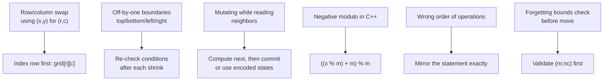

- **Confusing `(row, col)` with `(x, y)`** — decide a convention and never deviate.
- **Off-by-one in spiral boundaries** — re-test the `if top <= bottom` / `if left <= right` guards on single-row and single-column inputs.
- **In-place mutation hazards** — when a rule reads neighbors (Game of Life), compute the next generation without destroying the current one.
- **Negative `%` in C++** — normalize with `((x % m) + m) % m` whenever you subtract.
- **Skipping the bounds check** — always validate the candidate cell before reading or writing it.
- **Reordering the statement's steps** — *turn then move* is not the same as *move then turn*.

---

## Patterns

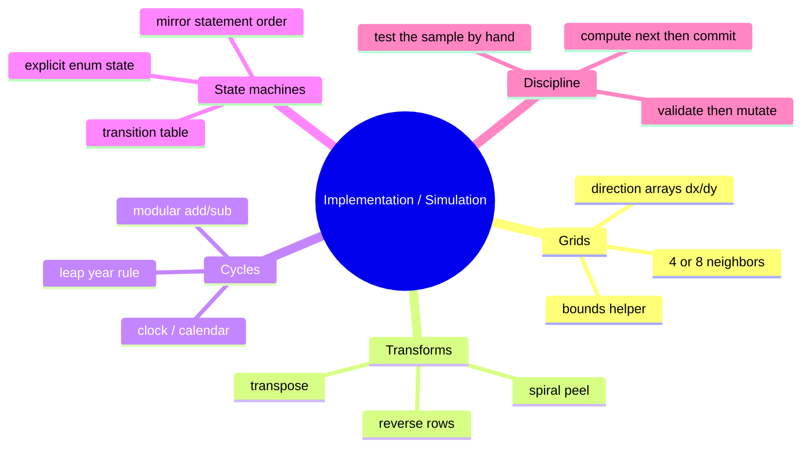

- **Direction-array walk**: replace four branches with `dr[]`/`dc[]` loops; *turn right* = `(d+1)%4`.
- **Boundary peeling**: shrink `top/bottom/left/right` to spiral or layer-process a matrix.
- **Transpose + reverse**: a two-line recipe for $90°$ rotations.
- **Modular wrap-around**: any cyclic quantity is `(cur + k) % m`; normalize for subtraction.
- **Explicit state machine**: name states, write the transition table, mirror the statement.
- **Compute-then-commit**: never overwrite state you still need to read.
