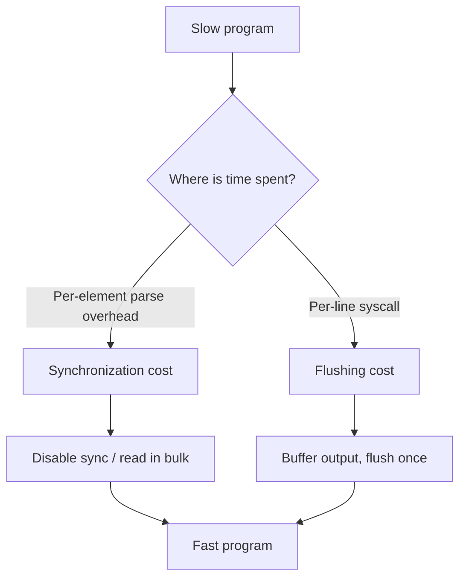
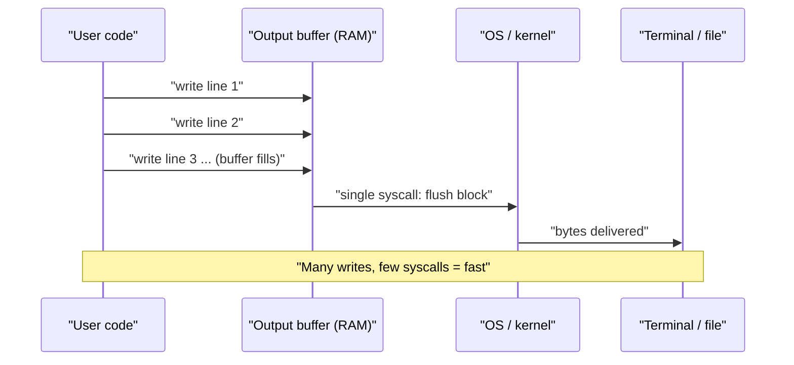
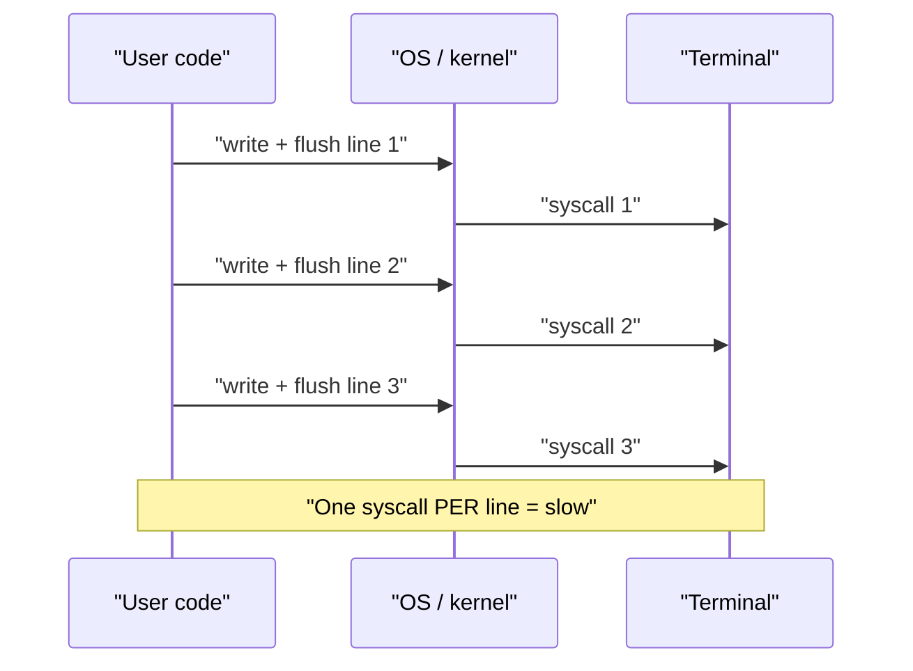
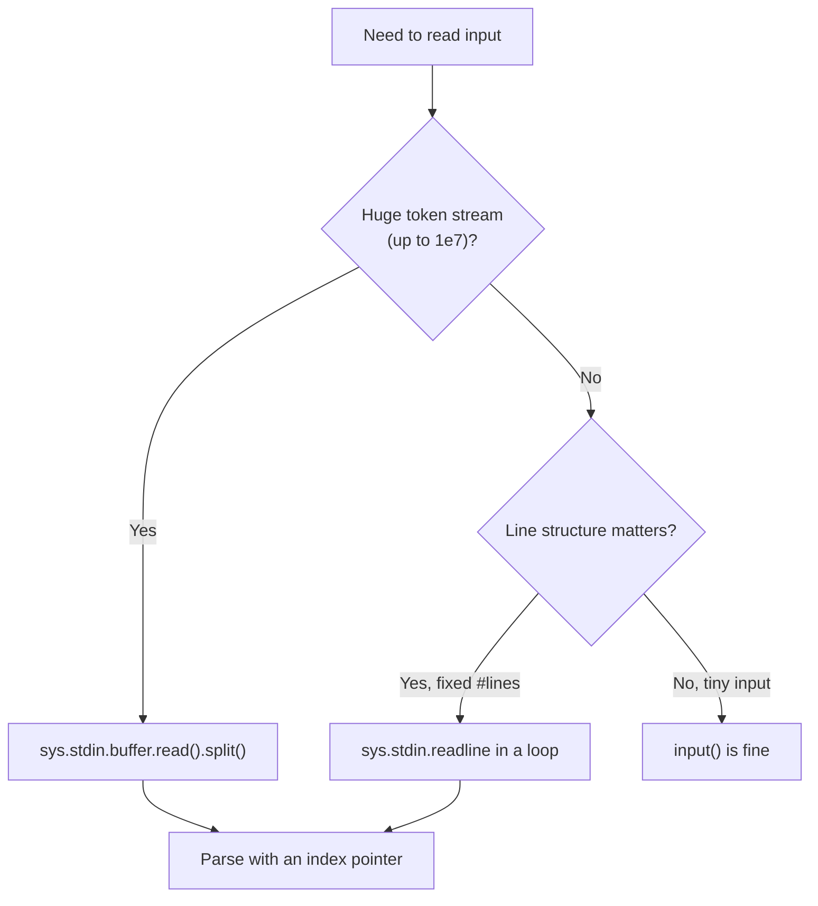
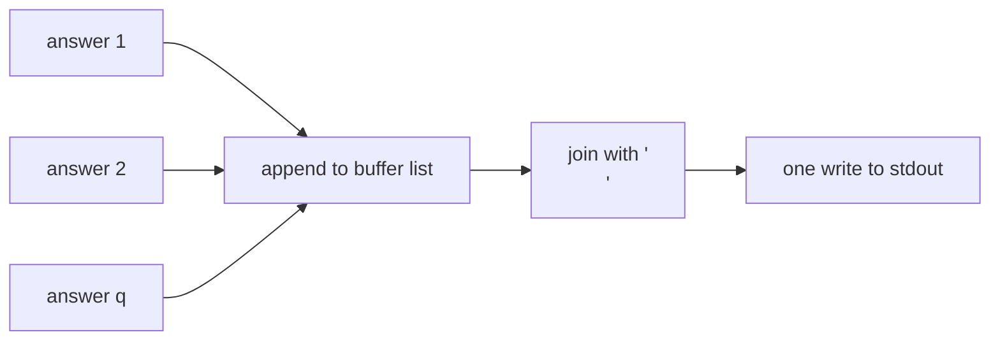
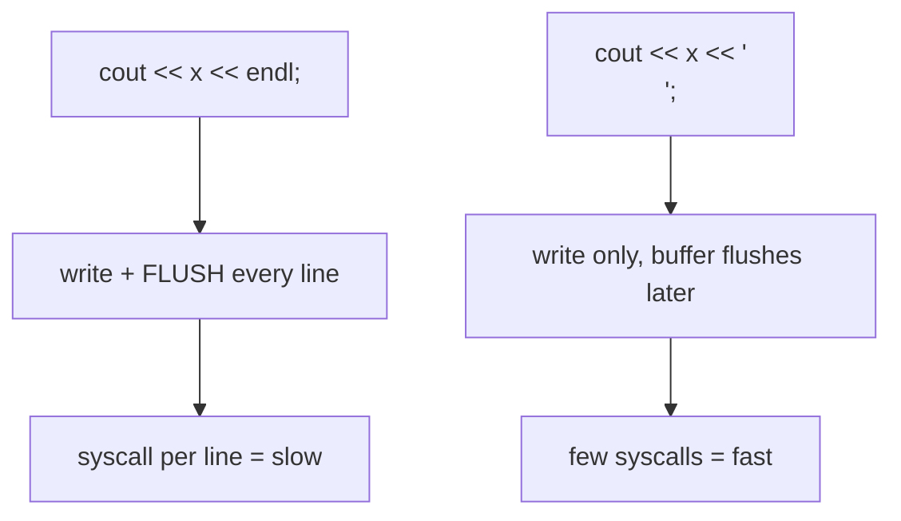
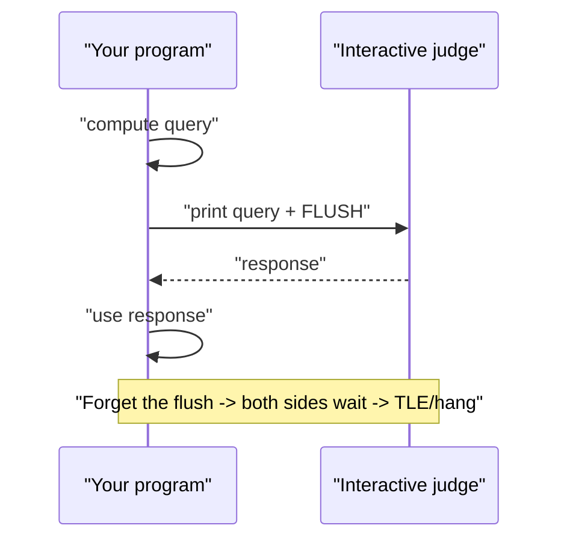
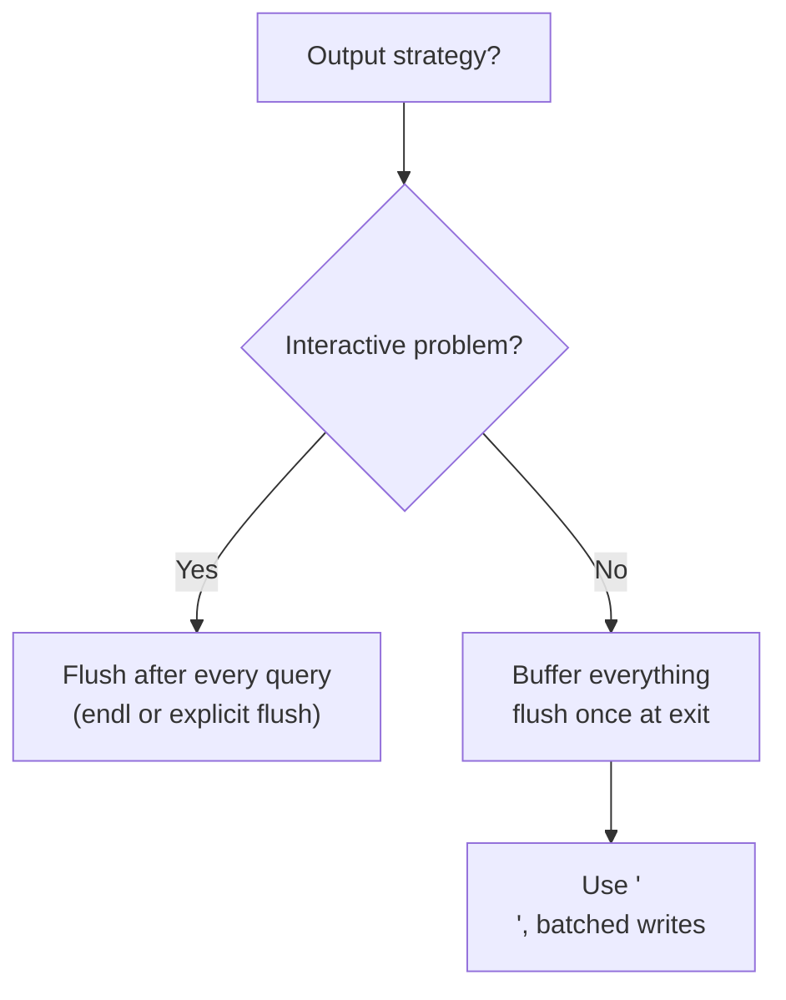

# Fast I/O & Careful Output

In competitive programming and large-scale batch processing, the **bottleneck is often not your algorithm — it's how you read input and write output**. A perfectly optimal $O(n)$ solution can still time out if you read $10^7$ integers one slow call at a time, or flush the output buffer after every single line.

This guide explains *why* default I/O is slow, how to make it fast in both Python and C++, and how to format output (especially floating point) correctly. Every Python snippet is paired with an equivalent C++ snippet.

## Table of Contents

1. [Why Default I/O Is Slow](#why-default-io-is-slow)
2. [The I/O Buffer Model](#the-io-buffer-model)
3. [C++: `sync_with_stdio(false)` + `cin.tie(nullptr)`](#c-sync_with_stdiofalse--cintienullptr)
4. [Reading Until EOF](#reading-until-eof)
5. [Python Fast Reading](#python-fast-reading)
6. [Building Output Once (Batched Output)](#building-output-once-batched-output)
7. [`'\n'` vs `endl`](#n-vs-endl)
8. [Floating Point Precision & Formatting](#floating-point-precision--formatting)
9. [Printing Big Arrays](#printing-big-arrays)
10. [Locale & Whitespace Pitfalls](#locale--whitespace-pitfalls)
11. [Cost of `flush`: Interactive vs Batch](#cost-of-flush-interactive-vs-batch)
12. [Worked Examples](#worked-examples)
13. [Complexity Summary](#complexity-summary)
14. [Common Pitfalls](#common-pitfalls)
15. [Patterns](#patterns)

---

## Why Default I/O Is Slow

Two separate costs make naive I/O slow:

1. **Synchronization** — By default C++ streams (`cin`/`cout`) are kept synchronized with C's `stdio` (`scanf`/`printf`) so you can mix them. This synchronization adds overhead on every operation. In Python, the high-level `input()` builds a `str` object and decodes text every call.
2. **Flushing** — Writing to the terminal or a pipe is a system call. If you flush after every line, you pay a syscall per line. Buffering means you batch many lines into one syscall.

If $n = 10^7$ and each `cin >> x` costs even a few hundred nanoseconds of overhead, that overhead alone can exceed a 1-second limit.



---

## The I/O Buffer Model

Input and output do not talk to the disk/terminal directly per character. They go through an in-memory **buffer**. Understanding the buffer explains every optimization below.



Contrast that with flushing on every line:



---

## C++: `sync_with_stdio(false)` + `cin.tie(nullptr)`

The single most important C++ speedup is to **untie the C++ streams from C stdio** and **untie `cin` from `cout`**.

- `ios_base::sync_with_stdio(false);` removes the C/C++ stream synchronization. After this you should **not** mix `scanf`/`printf` with `cin`/`cout`.
- `cin.tie(nullptr);` stops `cout` from being flushed automatically before every `cin`. Normally `cin` is tied to `cout` so prompts appear before input — irrelevant for batch judging.

```python
import sys
input = sys.stdin.readline  # rebind input to the fast buffered reader

def main():
    data = sys.stdin.buffer.read().split()
    # ... use data ...

main()
```

```cpp
#include <bits/stdc++.h>
using namespace std;

int main() {
    ios_base::sync_with_stdio(false);
    cin.tie(nullptr);
    // ... use cin/cout ...
    return 0;
}
```

> Rule of thumb: put those two lines at the top of `main()` in **every** competitive C++ program.

---

## Reading Until EOF

Many problems do not give a count $n$; you read tokens until the input ends.

```python
import sys

def main():
    total = 0
    for token in sys.stdin.buffer.read().split():
        total += int(token)
    print(total)

main()
```

```cpp
#include <bits/stdc++.h>
using namespace std;

int main() {
    ios_base::sync_with_stdio(false);
    cin.tie(nullptr);
    long long total = 0, x;
    while (cin >> x) {   // loop ends at EOF
        total += x;
    }
    cout << total << '\n';
    return 0;
}
```

The `while (cin >> x)` idiom stops cleanly at end-of-file because the stream conversion fails and the loop condition becomes false.

---

## Python Fast Reading

Python's `input()` is convenient but slow for large inputs. Two fast alternatives:

- **`sys.stdin.readline`** — line-oriented, good when you read a known number of lines.
- **`sys.stdin.buffer.read().split()`** — reads the *entire* input as bytes in one syscall and splits on whitespace. Fastest for token streams.

```python
import sys

def main():
    data = sys.stdin.buffer.read().split()
    idx = 0
    n = int(data[idx]); idx += 1
    nums = [int(data[idx + i]) for i in range(n)]
    idx += n
    print(sum(nums))

main()
```

```cpp
#include <bits/stdc++.h>
using namespace std;

int main() {
    ios_base::sync_with_stdio(false);
    cin.tie(nullptr);
    int n;
    cin >> n;
    vector<long long> nums(n);
    long long s = 0;
    for (int i = 0; i < n; ++i) {
        cin >> nums[i];
        s += nums[i];
    }
    cout << s << '\n';
    return 0;
}
```

Choosing a Python reading method:



---

## Building Output Once (Batched Output)

Just as reading in bulk is fast, **writing in bulk** is fast. Append every answer to a list (Python) or `string`/`ostringstream` (C++), join with `'\n'`, and print/flush **once**.

```python
import sys

def main():
    data = sys.stdin.buffer.read().split()
    q = int(data[0])
    out = []
    for i in range(1, q + 1):
        x = int(data[i])
        out.append(str(x * x))
    sys.stdout.write('\n'.join(out) + '\n')

main()
```

```cpp
#include <bits/stdc++.h>
using namespace std;

int main() {
    ios_base::sync_with_stdio(false);
    cin.tie(nullptr);
    int q;
    cin >> q;
    string out;
    for (int i = 0; i < q; ++i) {
        long long x;
        cin >> x;
        out += to_string(x * x);
        out += '\n';
    }
    cout << out;   // single write
    return 0;
}
```



---

## `'\n'` vs `endl`

This is the most common C++ output mistake. `std::endl` writes a newline **and flushes** the stream. `'\n'` just writes a newline and lets the buffer flush naturally.

```python
# In Python, print() does NOT flush by default (unless flush=True),
# so a normal newline string is already cheap:
import sys
sys.stdout.write("line\n")
```

```cpp
#include <bits/stdc++.h>
using namespace std;

int main() {
    // BAD in a loop: cout << x << endl;  // flushes every iteration
    // GOOD:
    cout << "line" << '\n';   // no forced flush
    return 0;
}
```



Use `endl` **only** when you genuinely need an immediate flush (interactive problems — see below).

---

## Floating Point Precision & Formatting

Default floating output may print too few digits or use scientific notation. Control it explicitly.

- C++: `cout << fixed << setprecision(k)` prints exactly `k` digits after the decimal point.
- Python: f-string format `f"{x:.{k}f}"` or `format(x, f".{k}f")`.

```python
import sys

def main():
    x = 2.0 / 3.0
    # 6 decimals, fixed notation, rounded half-to-even by format spec
    sys.stdout.write(f"{x:.6f}\n")   # 0.666667

main()
```

```cpp
#include <bits/stdc++.h>
using namespace std;

int main() {
    double x = 2.0 / 3.0;
    cout << fixed << setprecision(6) << x << '\n';  // 0.666667
    return 0;
}
```

`fixed` is **sticky** in C++: once set on the stream it stays until you change it, so set it once.

The rounding behavior: with $k$ decimals, the printed value is the original rounded to the nearest multiple of $10^{-k}$. For an average of integers $a_1,\dots,a_n$,

$$\bar{a} = \frac{1}{n}\sum_{i=1}^{n} a_i, \qquad \text{printed} = \mathrm{round}\!\left(\bar{a}\cdot 10^{k}\right)\cdot 10^{-k}.$$

---

## Printing Big Arrays

Printing a large array element-by-element with separate writes is slow. Join once.

```python
import sys

def main():
    arr = list(range(1, 1000001))
    # space-separated on one line, single write
    sys.stdout.write(' '.join(map(str, arr)))
    sys.stdout.write('\n')

main()
```

```cpp
#include <bits/stdc++.h>
using namespace std;

int main() {
    ios_base::sync_with_stdio(false);
    cin.tie(nullptr);
    vector<int> arr(1000000);
    iota(arr.begin(), arr.end(), 1);
    string out;
    for (size_t i = 0; i < arr.size(); ++i) {
        if (i) out += ' ';
        out += to_string(arr[i]);
    }
    out += '\n';
    cout << out;
    return 0;
}
```

---

## Locale & Whitespace Pitfalls

- **Hidden trailing whitespace / Windows line endings** (`\r\n`): `split()` handles all whitespace including `\r`, so `sys.stdin.buffer.read().split()` is robust. Reading with `readline()` may leave a trailing `\r`; strip it.
- **Locale-dependent number formatting**: some locales use `,` as a decimal separator. Competitive judges expect `.`; avoid `setlocale`/`std::locale` with grouping. Plain `cout`/`printf` use the C locale by default — keep it that way.
- **Mixing `cin >>` and `getline`**: a leftover newline in the buffer makes the next `getline` read an empty line. Consume the newline first.

```python
import sys

def main():
    # robust: split() ignores \r, \n, spaces, tabs uniformly
    data = sys.stdin.buffer.read().split()
    print(len(data))

main()
```

```cpp
#include <bits/stdc++.h>
using namespace std;

int main() {
    ios_base::sync_with_stdio(false);
    cin.tie(nullptr);
    int n;
    cin >> n;
    cin.ignore();           // consume the leftover '\n' before getline
    string line;
    getline(cin, line);
    cout << line.size() << '\n';
    return 0;
}
```

---

## Cost of `flush`: Interactive vs Batch

- **Batch problems** (the usual case): the judge feeds all input at once and reads all output at the end. Flush **once**, implicitly at program exit. Never use `endl` in loops.
- **Interactive problems**: you print a query, the judge responds, and you must **flush after every query** or you deadlock (your output sits in the buffer, the judge waits forever).



```python
import sys

def ask(q):
    sys.stdout.write(f"? {q}\n")
    sys.stdout.flush()              # REQUIRED for interactive
    return int(sys.stdin.readline())
```

```cpp
#include <bits/stdc++.h>
using namespace std;

int ask(int q) {
    cout << "? " << q << endl;     // endl flushes; or cout << ... << '\n' << flush;
    int resp;
    cin >> resp;
    return resp;
}
```

Decision guide:



---

## Worked Examples

### 1. Fast read of `n` ints + print sum

```python
import sys

def main():
    data = sys.stdin.buffer.read().split()
    n = int(data[0])
    s = 0
    for i in range(1, n + 1):
        s += int(data[i])
    sys.stdout.write(str(s) + '\n')

main()
```

```cpp
#include <bits/stdc++.h>
using namespace std;

int main() {
    ios_base::sync_with_stdio(false);
    cin.tie(nullptr);
    int n;
    cin >> n;
    long long s = 0, x;
    for (int i = 0; i < n; ++i) {
        cin >> x;
        s += x;
    }
    cout << s << '\n';
    return 0;
}
```

### 2. Batched output of `q` answers

```python
import sys

def main():
    data = sys.stdin.buffer.read().split()
    q = int(data[0])
    out = []
    for i in range(1, q + 1):
        v = int(data[i])
        out.append(str(v * v + 1))
    sys.stdout.write('\n'.join(out) + '\n')

main()
```

```cpp
#include <bits/stdc++.h>
using namespace std;

int main() {
    ios_base::sync_with_stdio(false);
    cin.tie(nullptr);
    int q;
    cin >> q;
    string out;
    for (int i = 0; i < q; ++i) {
        long long v;
        cin >> v;
        out += to_string(v * v + 1);
        out += '\n';
    }
    cout << out;
    return 0;
}
```

### 3. Formatted float output

```python
import sys

def main():
    data = sys.stdin.buffer.read().split()
    n = int(data[0])
    vals = [int(data[1 + i]) for i in range(n)]
    avg = sum(vals) / n
    sys.stdout.write(f"{avg:.3f}\n")

main()
```

```cpp
#include <bits/stdc++.h>
using namespace std;

int main() {
    ios_base::sync_with_stdio(false);
    cin.tie(nullptr);
    int n;
    cin >> n;
    long long s = 0, x;
    for (int i = 0; i < n; ++i) { cin >> x; s += x; }
    double avg = (double)s / n;
    cout << fixed << setprecision(3) << avg << '\n';
    return 0;
}
```

---

## Complexity Summary

| Operation | Time | Notes |
|---|---|---|
| Bulk read of $n$ tokens | $O(n)$ | one syscall + linear parse |
| Per-token `input()` (Python) | $O(n)$ but huge constant | avoid for large $n$ |
| Buffered write of $m$ lines | $O(\text{total chars})$, one syscall | join + single write |
| `endl` per line in a loop | $O(m)$ **syscalls** | dominant hidden cost |
| `setprecision(k)` formatting | $O(k)$ per number | constant in practice |

For $n$ items the work is unavoidably $\Theta(n)$; fast I/O shrinks the **constant factor**, which is exactly what separates AC from TLE.

---

## Common Pitfalls

- Using `endl` inside a tight loop (forces a flush each iteration).
- Mixing `scanf`/`printf` with `cin`/`cout` **after** `sync_with_stdio(false)` — output can interleave wrongly.
- Forgetting to flush in **interactive** problems → hang/TLE.
- Using `input()` for $10^6$–$10^7$ lines in Python → TLE; switch to `sys.stdin.buffer.read()`.
- Printing floats with default precision → wrong/too-few digits or scientific notation.
- Leaving a dangling `\n` in the buffer before `getline` → reads an empty line.
- Forgetting `long long` for sums that exceed $2^{31}-1 \approx 2.1\times10^9$.

---

## Patterns

1. **Always** start C++ with `sync_with_stdio(false); cin.tie(nullptr);`.
2. **Read in bulk**: `sys.stdin.buffer.read().split()` in Python; `while (cin >> x)` or a custom fast reader in C++.
3. **Write in bulk**: accumulate into a list/string, emit once.
4. **Use `'\n'`, not `endl`**, except for interactive flushing.
5. **Set float format once**: `fixed << setprecision(k)` / f-string `:.kf`.
6. **Use 64-bit accumulators** (`long long`) for large sums.
7. **Interactive ⇒ flush every query**; batch ⇒ flush once.
