# Time & Space Complexity Analysis — Complete Guide

Complexity analysis is the language we use to talk about **how an algorithm scales** as its input grows. Instead of timing code on one machine (which depends on CPU, compiler, cache, mood of the OS scheduler...), we count the **number of fundamental operations** as a function of the input size $n$ and describe its **growth rate**.

This guide builds the full toolkit: the asymptotic notations ($O$, $\Theta$, $\Omega$), the growth-rate hierarchy, how to count loops and solve recurrences, the **Master Theorem**, **amortized analysis**, **space** and the recursion stack, and the single most useful rule in competitive programming: the **$\approx 10^8$ operations per second** rule of thumb that lets you read a constraint and instantly know which complexity will pass.

---

## Table of Contents

1. [Why Asymptotics?](#why-asymptotics)
2. [Big-O, Big-Theta, Big-Omega](#big-o-big-theta-big-omega)
3. [The Growth-Rate Hierarchy](#the-growth-rate-hierarchy)
4. [Counting Loops](#counting-loops)
5. [Recurrences](#recurrences)
6. [The Master Theorem](#the-master-theorem)
7. [Amortized Analysis](#amortized-analysis)
8. [Space Complexity & the Recursion Stack](#space-complexity--the-recursion-stack)
9. [The $10^8$ Rule of Thumb](#the-108-rule-of-thumb)
10. [Estimating From Constraints](#estimating-from-constraints)
11. [Complexity Summary](#complexity-summary)
12. [Common Pitfalls](#common-pitfalls)
13. [Patterns](#patterns)

---

## Why Asymptotics?

We care about behavior **as $n \to \infty$**. Constant factors and lower-order terms are dropped because, for large enough $n$, the **dominant term** decides everything. For example $3n^2 + 100n + 5000$ is $O(n^2)$: once $n$ is large the $n^2$ term dwarfs the rest.

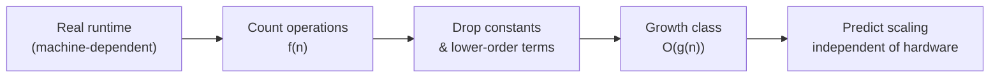

The whole point: a $O(n \log n)$ algorithm will **eventually** beat a $O(n^2)$ one, no matter how fast the slow algorithm's machine is.

---

## Big-O, Big-Theta, Big-Omega

These three notations bound a function's growth from **above**, **tightly**, and from **below**.

- **Big-O (upper bound).** $f(n) = O(g(n))$ if there exist constants $c > 0$ and $n_0$ such that
$$0 \le f(n) \le c \cdot g(n) \quad \text{for all } n \ge n_0.$$
"$f$ grows no faster than $g$." This is the *worst-case* guarantee we quote most often.

- **Big-Omega (lower bound).** $f(n) = \Omega(g(n))$ if there exist $c > 0$ and $n_0$ such that
$$0 \le c \cdot g(n) \le f(n) \quad \text{for all } n \ge n_0.$$
"$f$ grows at least as fast as $g$."

- **Big-Theta (tight bound).** $f(n) = \Theta(g(n))$ iff $f(n) = O(g(n))$ **and** $f(n) = \Omega(g(n))$. "$f$ grows exactly like $g$ up to constants."

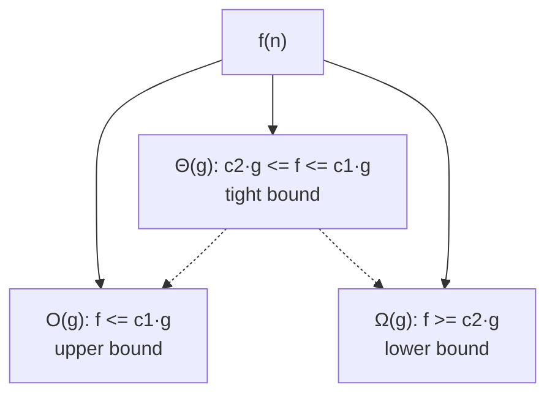

A picture of the tight ($\Theta$) sandwich:

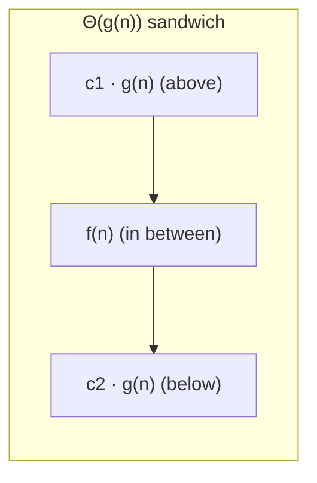

> Casual usage: people say "this is $O(n^2)$" even when they mean a tight bound. Strictly, if you know it is tight, say $\Theta$.

---

## The Growth-Rate Hierarchy

Memorize this ordering. Each class is **strictly dominated** by the next as $n \to \infty$:

$$O(1) < O(\log n) < O(\sqrt n) < O(n) < O(n\log n) < O(n^2) < O(2^n) < O(n!)$$

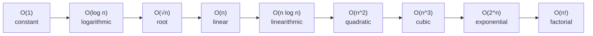

A relative sense of how fast these explode (smaller is better; values are illustrative "work units"):

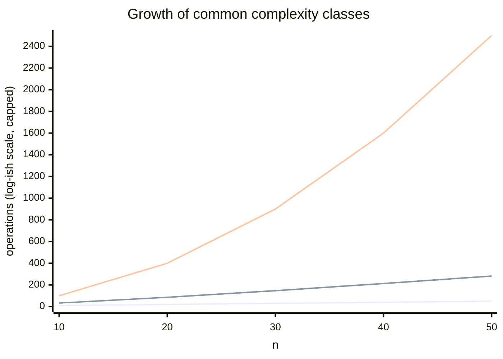

The exponential ones leave the chart almost immediately: $2^{50} \approx 1.13 \times 10^{15}$ and $50! \approx 3 \times 10^{64}$ — utterly hopeless to enumerate.

| Class | Name | Doubling $n$ does what to the work? |
|---|---|---|
| $O(1)$ | constant | nothing |
| $O(\log n)$ | logarithmic | adds a constant |
| $O(\sqrt n)$ | root | multiplies by $\approx 1.41$ |
| $O(n)$ | linear | doubles |
| $O(n \log n)$ | linearithmic | a bit more than doubles |
| $O(n^2)$ | quadratic | quadruples |
| $O(n^3)$ | cubic | $\times 8$ |
| $O(2^n)$ | exponential | **squares** the work |
| $O(n!)$ | factorial | beyond catastrophic |

---

## Counting Loops

The mechanical skill: read nested structure and turn it into a sum/product.

A single loop over $n$ is $O(n)$. Two **independent** nested loops over $n$ are $O(n^2)$. A loop whose index multiplies/divides by a constant each step is $O(\log n)$.

Consider counting pairs with a triangular nested loop — note the inner loop starts at `i`, so it does $n + (n-1) + \dots + 1 = \frac{n(n+1)}{2}$ iterations, which is still $\Theta(n^2)$:

```python
def count_pairs(a):
    n = len(a)
    count = 0
    for i in range(n):
        for j in range(i, n):   # triangular: ~ n(n+1)/2 iterations
            if a[i] + a[j] == 0:
                count += 1
    return count
```

```cpp
#include <bits/stdc++.h>
using namespace std;

long long count_pairs(const vector<long long>& a) {
    int n = (int)a.size();
    long long count = 0;
    for (int i = 0; i < n; i++) {
        for (int j = i; j < n; j++) {   // triangular: ~ n(n+1)/2 iterations
            if (a[i] + a[j] == 0) {
                count++;
            }
        }
    }
    return count;
}
```

The total is $\sum_{i=0}^{n-1}(n-i) = \frac{n(n+1)}{2} = \Theta(n^2)$. Constants and the $\frac12$ vanish in Big-O.

Now a **logarithmic** loop — the index is multiplied by 2 each step, so it runs $\lfloor \log_2 n \rfloor + 1$ times:

```python
def count_log_steps(n):
    steps = 0
    i = 1
    while i <= n:
        steps += 1
        i *= 2          # geometric growth -> O(log n) iterations
    return steps
```

```cpp
#include <bits/stdc++.h>
using namespace std;

long long count_log_steps(long long n) {
    long long steps = 0;
    long long i = 1;
    while (i <= n) {
        steps++;
        i *= 2;         // geometric growth -> O(log n) iterations
    }
    return steps;
}
```

Combine the two ideas — an outer linear loop with an inner logarithmic loop gives $O(n \log n)$:

```python
def n_log_n_work(n):
    total = 0
    for i in range(n):          # O(n)
        j = 1
        while j <= n:           # O(log n) each
            total += 1
            j *= 2
    return total                # overall O(n log n)
```

```cpp
#include <bits/stdc++.h>
using namespace std;

long long n_log_n_work(long long n) {
    long long total = 0;
    for (long long i = 0; i < n; i++) {     // O(n)
        long long j = 1;
        while (j <= n) {                    // O(log n) each
            total++;
            j *= 2;
        }
    }
    return total;                            // overall O(n log n)
}
```

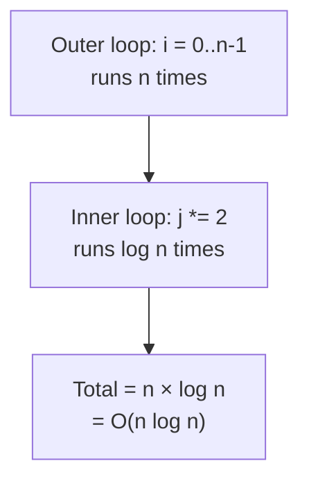

---

## Recurrences

Recursive algorithms are described by **recurrence relations** $T(n)$ that express the cost in terms of smaller inputs. To find the closed-form growth, draw the **recurrence tree** and sum the work across all levels.

Take merge sort: it splits into two halves and does $O(n)$ work to merge:
$$T(n) = 2\,T(n/2) + O(n).$$

```python
def merge_sort(a):
    n = len(a)
    if n <= 1:
        return a
    mid = n // 2
    left = merge_sort(a[:mid])      # T(n/2)
    right = merge_sort(a[mid:])     # T(n/2)
    # merge step is O(n)
    res = []
    i = j = 0
    while i < len(left) and j < len(right):
        if left[i] <= right[j]:
            res.append(left[i]); i += 1
        else:
            res.append(right[j]); j += 1
    res.extend(left[i:]); res.extend(right[j:])
    return res
```

```cpp
#include <bits/stdc++.h>
using namespace std;

vector<long long> merge_sort(vector<long long> a) {
    int n = (int)a.size();
    if (n <= 1) {
        return a;
    }
    int mid = n / 2;
    vector<long long> left(a.begin(), a.begin() + mid);
    vector<long long> right(a.begin() + mid, a.end());
    left = merge_sort(left);        // T(n/2)
    right = merge_sort(right);      // T(n/2)
    // merge step is O(n)
    vector<long long> res;
    int i = 0, j = 0;
    while (i < (int)left.size() && j < (int)right.size()) {
        if (left[i] <= right[j]) {
            res.push_back(left[i++]);
        } else {
            res.push_back(right[j++]);
        }
    }
    while (i < (int)left.size()) res.push_back(left[i++]);
    while (j < (int)right.size()) res.push_back(right[j++]);
    return res;
}
```

The recurrence tree: each level does a total of $O(n)$ work, and there are $\log_2 n$ levels, so the total is $O(n \log n)$.

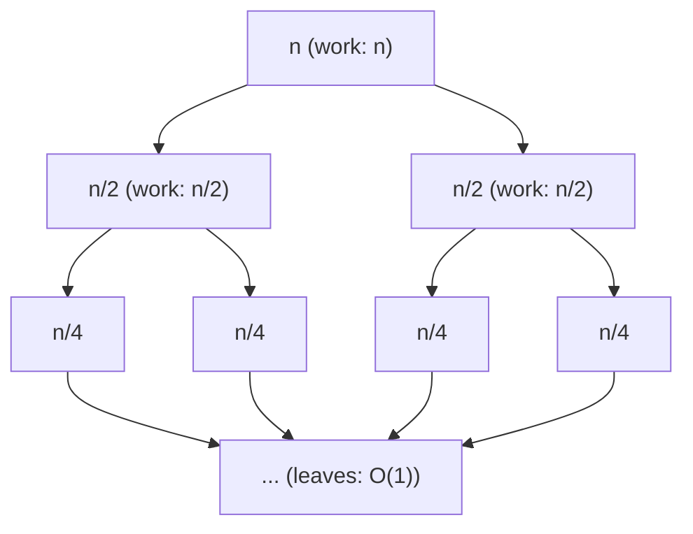

Per-level accounting:

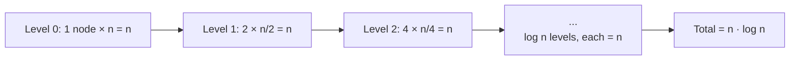

$$T(n) = \underbrace{n + n + \dots + n}_{\log_2 n \text{ levels}} = n \log_2 n = O(n \log n).$$

---

## The Master Theorem

For divide-and-conquer recurrences of the form
$$T(n) = a\,T(n/b) + f(n), \qquad a \ge 1,\; b > 1,$$
the Master Theorem compares $f(n)$ against the **watershed** $n^{\log_b a}$. Let $c_{\text{crit}} = \log_b a$.

- **Case 1 (leaves dominate).** If $f(n) = O(n^{c_{\text{crit}} - \epsilon})$ for some $\epsilon > 0$, then
$$T(n) = \Theta\!\left(n^{\log_b a}\right).$$

- **Case 2 (balanced).** If $f(n) = \Theta\!\left(n^{c_{\text{crit}}} \log^k n\right)$ for $k \ge 0$, then
$$T(n) = \Theta\!\left(n^{\log_b a} \log^{k+1} n\right).$$

- **Case 3 (root dominates).** If $f(n) = \Omega(n^{c_{\text{crit}} + \epsilon})$ for some $\epsilon > 0$ **and** the regularity condition $a\,f(n/b) \le c\,f(n)$ holds for some $c < 1$, then
$$T(n) = \Theta(f(n)).$$

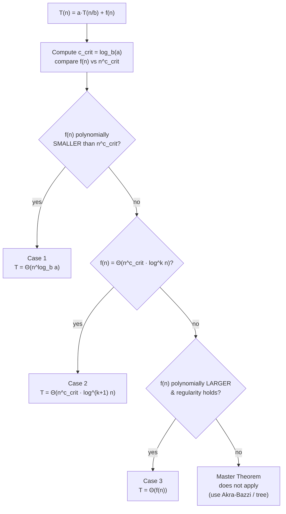

**Worked examples:**

| Recurrence | $a$ | $b$ | $\log_b a$ | $f(n)$ | Case | Result |
|---|---|---|---|---|---|---|
| $T(n)=2T(n/2)+n$ | 2 | 2 | 1 | $n$ | 2 ($k=0$) | $\Theta(n\log n)$ |
| $T(n)=2T(n/2)+1$ | 2 | 2 | 1 | $1$ | 1 | $\Theta(n)$ |
| $T(n)=4T(n/2)+n$ | 4 | 2 | 2 | $n$ | 1 | $\Theta(n^2)$ |
| $T(n)=T(n/2)+1$ | 1 | 2 | 0 | $1$ | 2 ($k=0$) | $\Theta(\log n)$ |
| $T(n)=2T(n/2)+n^2$ | 2 | 2 | 1 | $n^2$ | 3 | $\Theta(n^2)$ |
| $T(n)=3T(n/2)+n$ | 3 | 2 | $\log_2 3\approx1.585$ | $n$ | 1 | $\Theta(n^{\log_2 3})$ |

---

## Amortized Analysis

Sometimes a single operation is occasionally expensive, but the expensive cases are **rare** enough that the **average over a sequence** is cheap. Amortized analysis proves a tight bound on a *sequence* of $m$ operations.

**Aggregate method.** Bound the total cost of any sequence of $m$ operations by $T(m)$, then the amortized cost per operation is $T(m)/m$.

**Accounting method.** Charge each operation an *amortized cost* (possibly more than its real cost). The surplus is stored as **credit** on the data structure and spent later to pay for expensive operations. Invariant: stored credit never goes negative.

The classic example is `push_back` on a **doubling dynamic array**. Most pushes are $O(1)$; occasionally the array is full and we reallocate + copy everything ($O(n)$). Yet over $n$ pushes the **total** copying work is bounded by a geometric series:
$$1 + 2 + 4 + \dots + n < 2n \;\Rightarrow\; \text{amortized } O(1) \text{ per push}.$$

```python
class DynamicArray:
    def __init__(self):
        self.cap = 1
        self.size = 0
        self.data = [None] * self.cap
        self.total_copies = 0

    def push_back(self, x):
        if self.size == self.cap:          # full -> grow
            self.cap *= 2
            new_data = [None] * self.cap
            for i in range(self.size):     # O(size) copy, but rare
                new_data[i] = self.data[i]
                self.total_copies += 1
            self.data = new_data
        self.data[self.size] = x           # O(1) amortized
        self.size += 1
```

```cpp
#include <bits/stdc++.h>
using namespace std;

struct DynamicArray {
    long long cap = 1;
    long long size = 0;
    long long total_copies = 0;
    vector<long long> data;

    DynamicArray() {
        data.assign(cap, 0);
    }

    void push_back(long long x) {
        if (size == cap) {                 // full -> grow
            cap *= 2;
            vector<long long> new_data(cap, 0);
            for (long long i = 0; i < size; i++) {  // O(size) copy, but rare
                new_data[i] = data[i];
                total_copies++;
            }
            data = move(new_data);
        }
        data[size] = x;                    // O(1) amortized
        size++;
    }
};
```

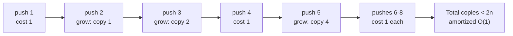

Accounting view: pay **3 credits** per push (1 to insert, 2 saved). When a resize copies an element, the 2 saved credits per element cover the copy + re-copy. Credit stays non-negative, so the amortized bound $O(1)$ holds.

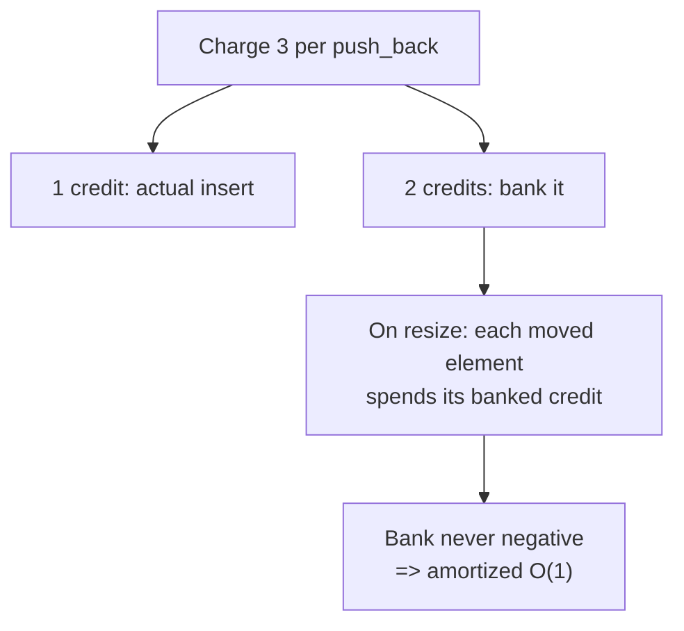

---

## Space Complexity & the Recursion Stack

Space complexity counts **extra memory** as a function of $n$ (usually excluding the input itself, called *auxiliary* space). Recursion is sneaky: even with no explicit arrays, each pending recursive call holds a **stack frame**, so the **maximum recursion depth** is part of your space cost.

Compare an iterative sum ($O(1)$ extra space) with a recursive one ($O(n)$ stack space):

```python
def sum_iter(a):
    total = 0
    for x in a:        # O(1) extra space
        total += x
    return total

def sum_rec(a, i=0):
    if i == len(a):    # recursion depth n -> O(n) stack space
        return 0
    return a[i] + sum_rec(a, i + 1)
```

```cpp
#include <bits/stdc++.h>
using namespace std;

long long sum_iter(const vector<long long>& a) {
    long long total = 0;
    for (long long x : a) {    // O(1) extra space
        total += x;
    }
    return total;
}

long long sum_rec(const vector<long long>& a, int i = 0) {
    if (i == (int)a.size()) {  // recursion depth n -> O(n) stack space
        return 0;
    }
    return a[i] + sum_rec(a, i + 1);
}
```

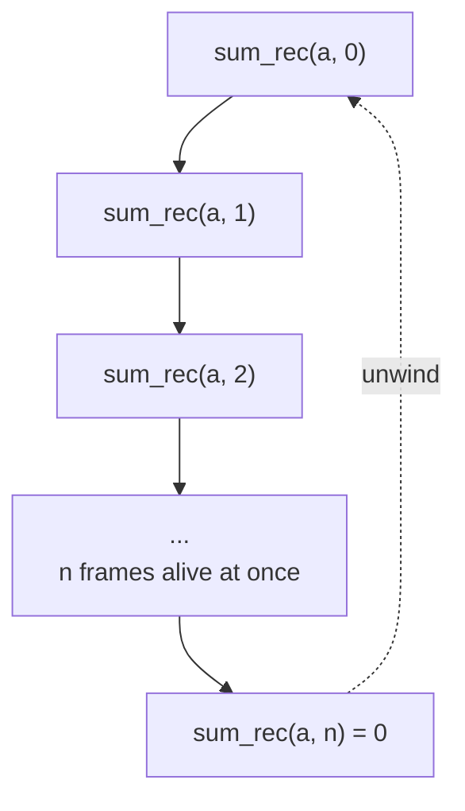

> Deep recursion ($n \sim 10^5$+) can overflow the stack. Convert to iteration or increase the stack limit. A **balanced** divide-and-conquer (depth $\log n$) is safe; a **linear-chain** recursion (depth $n$) is dangerous.

---

## The $10^8$ Rule of Thumb

The single most useful estimate in competitive programming:

> A typical judge executes on the order of **$10^8$ simple operations per second** (often quoted as $10^7$–$10^9$ depending on the constant factor of each "operation"). For a 1-second limit, aim for an algorithm whose operation count is at most a few times $10^8$.

Use it backwards: read $n$, figure out the **largest complexity** whose value at that $n$ stays near $10^8$.

| Max $n$ | Budget ($\approx 10^8$) | Largest feasible complexity | Typical technique |
|---|---|---|---|
| $n \le 11$ | $n!$ | $O(n!)$ | permutations / brute force |
| $n \le 25$ | $2^n$ | $O(2^n)$ or $O(2^{n/2})$ | subset enumeration, meet-in-middle |
| $n \le 100$ | $n^4 = 10^8$ | $O(n^4)$ | small DP |
| $n \le 500$ | $n^3 \approx 1.2\times10^8$ | $O(n^3)$ | Floyd–Warshall, matrix DP |
| $n \le 5\,000$ | $n^2 = 2.5\times10^7$ | $O(n^2)$ | quadratic DP / pairs |
| $n \le 10^5$ | $n\log n \approx 1.7\times10^6$ | $O(n \log n)$ | sorting, segment tree |
| $n \le 10^6$ | $n\log n \approx 2\times10^7$ | $O(n \log n)$ / $O(n)$ | linear scans, sieve |
| $n \le 10^8$ | $n = 10^8$ | $O(n)$ | tight linear, $O(1)$ memory |
| $n \le 10^{18}$ | $\log n \approx 60$ | $O(\log n)$ / $O(\sqrt n)$ | binary search, number theory |

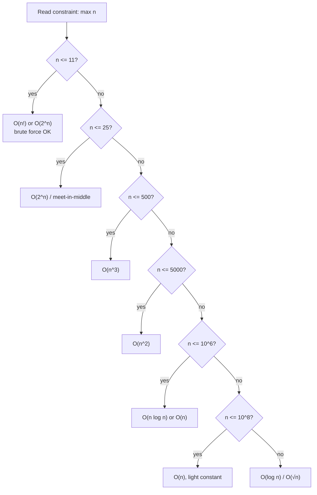

---

## Estimating From Constraints

The constraints in a problem statement are a **hint** about the intended complexity. Workflow:

1. Find the **largest** input dimension(s). If several, multiply where the algorithm nests them (e.g. $n \cdot m$).
2. Multiply by the **number of test cases** $T$ if the sum is not bounded — many problems say "sum of $n$ over all tests $\le X$", which means you budget against $X$, not $T \cdot n_{\max}$.
3. Pick the largest complexity that stays under a few $\times 10^8$.
4. Add headroom for **constant factors** (modular arithmetic, pointer chasing, recursion overhead, big constants in segment trees).

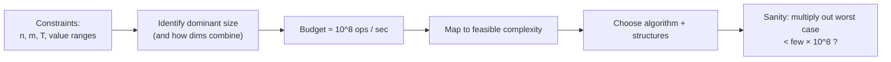

Worked snippet: estimate operations for a given $(n, \text{complexity})$ and decide pass/fail against a budget.

```python
def will_pass(n, kind, budget=2 * 10**8):
    import math
    if kind == "n":          ops = n
    elif kind == "nlogn":    ops = n * max(1, math.ceil(math.log2(n)))
    elif kind == "n2":       ops = n * n
    elif kind == "n3":       ops = n * n * n
    elif kind == "2^n":      ops = 2 ** n
    else:                    ops = float("inf")
    return ops <= budget, ops
```

```cpp
#include <bits/stdc++.h>
using namespace std;

pair<bool, double> will_pass(long long n, const string& kind,
                             double budget = 2e8) {
    double ops;
    if (kind == "n")            ops = (double)n;
    else if (kind == "nlogn")   ops = (double)n * max(1.0, ceil(log2((double)n)));
    else if (kind == "n2")      ops = (double)n * (double)n;
    else if (kind == "n3")      ops = (double)n * (double)n * (double)n;
    else if (kind == "2^n")     ops = pow(2.0, (double)n);
    else                        ops = numeric_limits<double>::infinity();
    return {ops <= budget, ops};
}
```

---

## Complexity Summary

| Concept | Key formula / fact |
|---|---|
| Big-O | $f \le c\,g$ for $n \ge n_0$ — upper bound |
| Big-Omega | $f \ge c\,g$ for $n \ge n_0$ — lower bound |
| Big-Theta | both — tight bound |
| Hierarchy | $1 < \log n < \sqrt n < n < n\log n < n^2 < 2^n < n!$ |
| Loops | independent nesting multiplies; geometric index $\Rightarrow \log$ |
| Master Thm | compare $f(n)$ vs $n^{\log_b a}$ → 3 cases |
| Amortized | aggregate ($T(m)/m$) or accounting (credits) |
| Recursion space | $\Theta(\text{max depth})$ stack frames |
| Rule of thumb | $\approx 10^8$ simple ops per second |

---

## Common Pitfalls

- **Forgetting hidden costs.** `a[1:]` slicing in Python copies $O(n)$; `x in list` is $O(n)$; string concatenation in a loop can be $O(n^2)$.
- **Ignoring constant factors.** Two $O(n \log n)$ algorithms can differ $10\times$ in practice (e.g. a segment tree vs a sort). Near the limit, constants matter.
- **Confusing average and worst case.** Quicksort is $O(n\log n)$ average but $O(n^2)$ worst; hash maps are $O(1)$ average but $O(n)$ adversarial.
- **Recursion depth = space.** A "no extra arrays" recursion can still be $O(n)$ space and overflow the stack.
- **Misreading combined constraints.** $n, m \le 10^3$ with an $O(nm)$ pass is $10^6$ — fine; but $O(n^2 m)$ is $10^9$ — too slow.
- **Sum-of-$n$ traps.** With many test cases, budget against the *sum* bound, not $T \times n_{\max}$.
- **Treating $2^n$ as fine for $n=40$.** $2^{40} \approx 10^{12}$ — use meet-in-the-middle ($2^{20}$).

---

## Patterns

- **Read $n$ first.** Let the constraint pick your complexity before you design.
- **Count levels, sum per level.** Recurrence trees: total = (work per level) × (number of levels).
- **Geometric series ⇒ amortized constant.** Doubling/halving strategies almost always amortize nicely.
- **Drop, then compare.** Strip constants and lower-order terms before comparing two algorithms asymptotically.
- **Watch the watershed.** For divide-and-conquer, instantly compute $n^{\log_b a}$ and compare to $f(n)$.
- **Budget with headroom.** Target well under $10^8$ when constants are heavy (mod ops, recursion, pointers).
- **Prefer iteration for deep recursion.** Convert linear-depth recursion to loops to protect the stack.
