# Bit Manipulation (Masks, Popcount, Subset Enumeration)

Bit manipulation treats an integer as a fixed-width array of bits and lets you read, set, and combine
those bits in $O(1)$ machine operations. Mastering it unlocks compact set representations
(**bitmasks**), blazing-fast counting (**popcount**), and elegant enumeration of every subset or
submask. This guide builds from two's complement and the core boolean operators all the way up to the
classic $O(3^n)$ submask-enumeration trick used in Sum-over-Subsets DP.

Every code idea below is shown as a **Python** block immediately followed by an **equivalent C++**
block so you can map the language-agnostic logic onto contest-grade C++.

---

## Table of Contents

1. [Binary Representation & Two's Complement](#binary-representation--twos-complement)
2. [The Core Operations (AND / OR / XOR / NOT / Shifts)](#the-core-operations-and--or--xor--not--shifts)
3. [Set / Clear / Toggle / Test a Bit](#set--clear--toggle--test-a-bit)
4. [Lowest Set Bit `x & -x`](#lowest-set-bit-x---x)
5. [Clearing the Lowest Set Bit `x & (x-1)`](#clearing-the-lowest-set-bit-x--x-1)
6. [Popcount (Counting Set Bits)](#popcount-counting-set-bits)
7. [Iterating Over Bits](#iterating-over-bits)
8. [Bitmask as a Subset](#bitmask-as-a-subset)
9. [Enumerating All Submasks in $O(3^n)$](#enumerating-all-submasks-in-o3n)
10. [Enumerating All Subsets of n Elements](#enumerating-all-subsets-of-n-elements)
11. [XOR Tricks (Swap, Parity, Prefix XOR)](#xor-tricks-swap-parity-prefix-xor)
12. [Powers of Two Checks](#powers-of-two-checks)
13. [Gray Code](#gray-code)
14. [Complexity Summary](#complexity-summary)
15. [Common Pitfalls](#common-pitfalls)
16. [Patterns](#patterns)

---

## Binary Representation & Two's Complement

An unsigned integer is a sum of powers of two. Bit $k$ has place value $2^k$:

$$
x = \sum_{k=0}^{w-1} b_k \cdot 2^k, \qquad b_k \in \{0, 1\}.
$$

For a width-8 value, the layout (bit 7 is the most significant, bit 0 the least) looks like this:

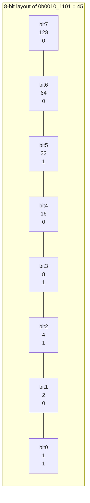

Here $45 = 32 + 8 + 4 + 1$.

**Two's complement** encodes negative numbers so that addition "just works" with no special cases. For
a width-$w$ integer, the negative of $x$ is:

$$
-x \equiv \lnot x + 1 \pmod{2^w}.
$$

The most significant bit acts as a sign bit. Flipping all bits then adding one negates the value:

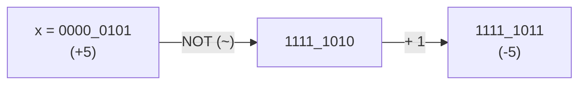

This is *why* `x & -x` isolates the lowest set bit — we'll exploit it shortly. Note that in Python
integers are arbitrary-precision (no fixed width, `~x == -x-1`), while in C++ you choose a fixed width
such as 32-bit `int` or 64-bit `long long`.

---

## The Core Operations (AND / OR / XOR / NOT / Shifts)

The four boolean operators act bitwise — independently on each bit position. Their truth values:

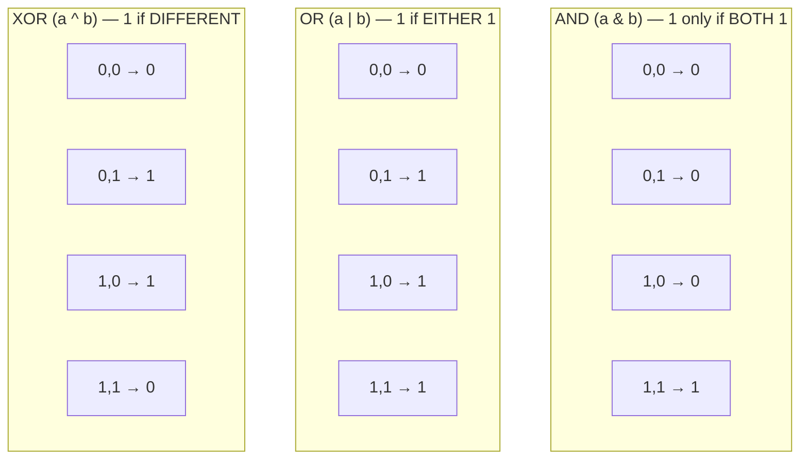

| Op | Symbol | Effect | Identity |
|----|--------|--------|----------|
| AND | `&` | mask / keep bits | `x & ~0 = x` |
| OR | `\|` | set bits | `x \| 0 = x` |
| XOR | `^` | toggle / difference | `x ^ 0 = x`, `x ^ x = 0` |
| NOT | `~` | flip all bits | `~x = -x - 1` |
| Left shift | `<<` | multiply by $2^k$ | `x << k = x * 2^k` |
| Right shift | `>>` | divide by $2^k$ | `x >> k = floor(x / 2^k)` |

A left shift moves every bit toward the high end and feeds in zeros from the right:

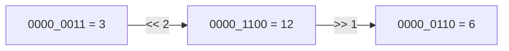

Shifting left by $k$ multiplies by $2^k$; shifting right by $k$ floor-divides by $2^k$.

---

## Set / Clear / Toggle / Test a Bit

The four single-bit primitives all build on a one-hot mask `1 << k`:

| Action | Expression | Idea |
|--------|------------|------|
| Test bit $k$ | `(x >> k) & 1` | shift it down, mask |
| Set bit $k$ | `x \| (1 << k)` | OR in the one-hot |
| Clear bit $k$ | `x & ~(1 << k)` | AND with the complement |
| Toggle bit $k$ | `x ^ (1 << k)` | XOR flips it |

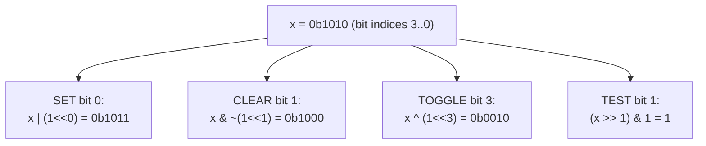

```python
def test_bit(x: int, k: int) -> int:
    return (x >> k) & 1

def set_bit(x: int, k: int) -> int:
    return x | (1 << k)

def clear_bit(x: int, k: int) -> int:
    return x & ~(1 << k)

def toggle_bit(x: int, k: int) -> int:
    return x ^ (1 << k)
```

```cpp
#include <bits/stdc++.h>
using namespace std;

int test_bit(long long x, int k) {
    return (int)((x >> k) & 1LL);
}
long long set_bit(long long x, int k) {
    return x | (1LL << k);
}
long long clear_bit(long long x, int k) {
    return x & ~(1LL << k);
}
long long toggle_bit(long long x, int k) {
    return x ^ (1LL << k);
}
```

> Always use `1LL << k` in C++ when `k` can be $\ge 31$; `1 << k` is a 32-bit `int` and overflows
> (undefined behavior) for `k = 31` upward.

---

## Lowest Set Bit `x & -x`

The expression `x & -x` isolates the **lowest** set bit (a power of two). Because `-x = ~x + 1`,
adding one flips the trailing zeros to ones and the lowest one to zero with a carry, so ANDing leaves
exactly the lowest set bit standing:

$$
x \mathbin{\&} (-x) = \text{the lowest set bit of } x.
$$

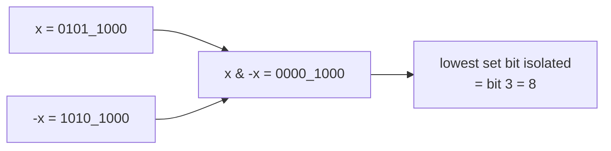

This is the engine of the Fenwick / Binary Indexed Tree. The index of that bit is the count of
trailing zeros, obtainable with `__builtin_ctzll`.

---

## Clearing the Lowest Set Bit `x & (x-1)`

Subtracting one flips the lowest set bit to zero and turns the trailing zeros into ones; ANDing with
the original therefore **removes** the lowest set bit:

$$
x \mathbin{\&} (x - 1) = x \text{ with its lowest set bit cleared}.
$$

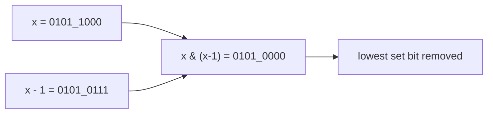

Repeatedly applying this until $x = 0$ visits each set bit exactly once — the basis of
Brian Kernighan's popcount.

---

## Popcount (Counting Set Bits)

**Popcount** (population count) is the number of 1-bits. Kernighan's method clears the lowest set bit
each iteration, so it loops exactly *popcount* times rather than $w$ times:

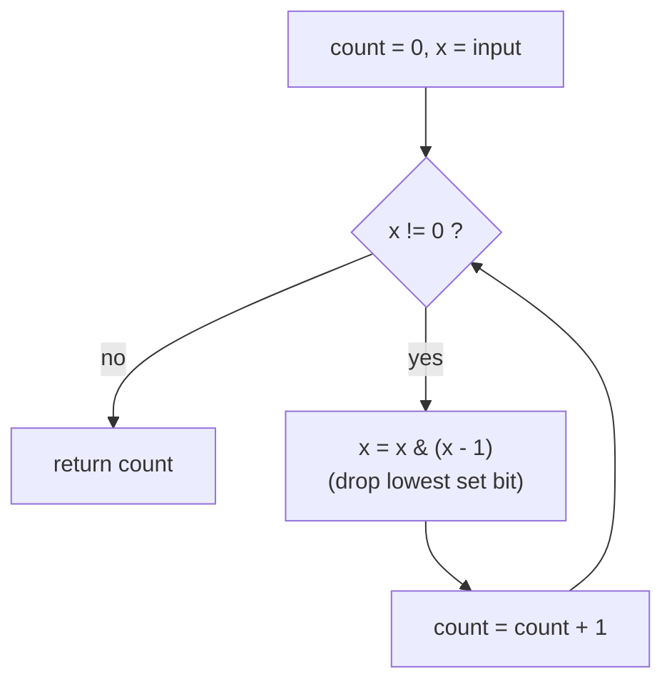

```python
def popcount(x: int) -> int:
    count = 0
    while x:
        x &= x - 1          # drop lowest set bit
        count += 1
    return count

def lowbit(x: int) -> int:
    return x & (-x)         # isolate lowest set bit
```

```cpp
#include <bits/stdc++.h>
using namespace std;

int popcount(long long x) {
    int count = 0;
    while (x) {
        x &= x - 1;         // drop lowest set bit
        count++;
    }
    return count;
}
long long lowbit(long long x) {
    return x & (-x);        // isolate lowest set bit
}
```

In practice prefer the hardware intrinsic: Python has `int.bit_count()` (3.10+) or `bin(x).count('1')`,
and C++ has `__builtin_popcountll(x)` (and `__builtin_ctzll(x)` for trailing-zero index).

```python
n = 0b1011_0100
print(n.bit_count())        # 4
```

```cpp
#include <bits/stdc++.h>
using namespace std;

int main() {
    long long n = 0b10110100;
    cout << __builtin_popcountll(n) << "\n";   // 4
    return 0;
}
```

---

## Iterating Over Bits

Two common iteration styles: scan every position `0..w-1`, or jump directly from set bit to set bit
using `x & -x`. The second touches only the set bits.

```python
def set_bit_positions(x: int) -> list[int]:
    positions = []
    while x:
        low = x & (-x)          # lowest set bit (a power of two)
        positions.append(low.bit_length() - 1)
        x ^= low                # remove it
    return positions
```

```cpp
#include <bits/stdc++.h>
using namespace std;

vector<int> set_bit_positions(long long x) {
    vector<int> positions;
    while (x) {
        int idx = __builtin_ctzll(x);   // index of lowest set bit
        positions.push_back(idx);
        x &= x - 1;                     // remove it
    }
    return positions;
}
```

---

## Bitmask as a Subset

A bitmask of $n$ bits represents a subset of an $n$-element universe: bit $i$ set means element $i$ is
**in** the subset. The integer $0 \dots 2^n - 1$ then enumerates all $2^n$ subsets.

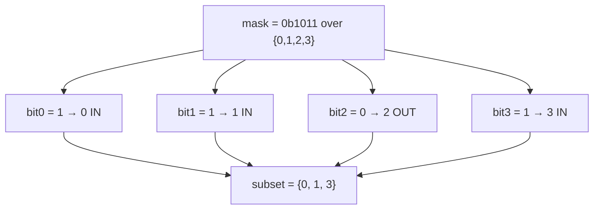

Set algebra maps directly onto bit operations:

| Set operation | Bit operation |
|---------------|---------------|
| Union $A \cup B$ | `a \| b` |
| Intersection $A \cap B$ | `a & b` |
| Difference $A \setminus B$ | `a & ~b` |
| Symmetric difference | `a ^ b` |
| Add element $i$ | `a \| (1 << i)` |
| Remove element $i$ | `a & ~(1 << i)` |
| Contains $i$? | `(a >> i) & 1` |
| Cardinality $|A|$ | `popcount(a)` |

---

## Enumerating All Submasks in $O(3^n)$

A **submask** $s$ of mask $m$ satisfies `s & m == s` (every bit of $s$ is also in $m$). The classic
trick walks all submasks in **descending** order:

```python
s = m
while s:                    # use s ...
    s = (s - 1) & m         # next submask; stops before 0
```

```cpp
for (int s = m; s; s = (s - 1) & m) { /* use s */ }
```

The step `s = (s - 1) & m` decrements then re-confines the bits to $m$, skipping invalid intermediate
values. It visits every nonzero submask exactly once; handle the empty submask `0` separately.

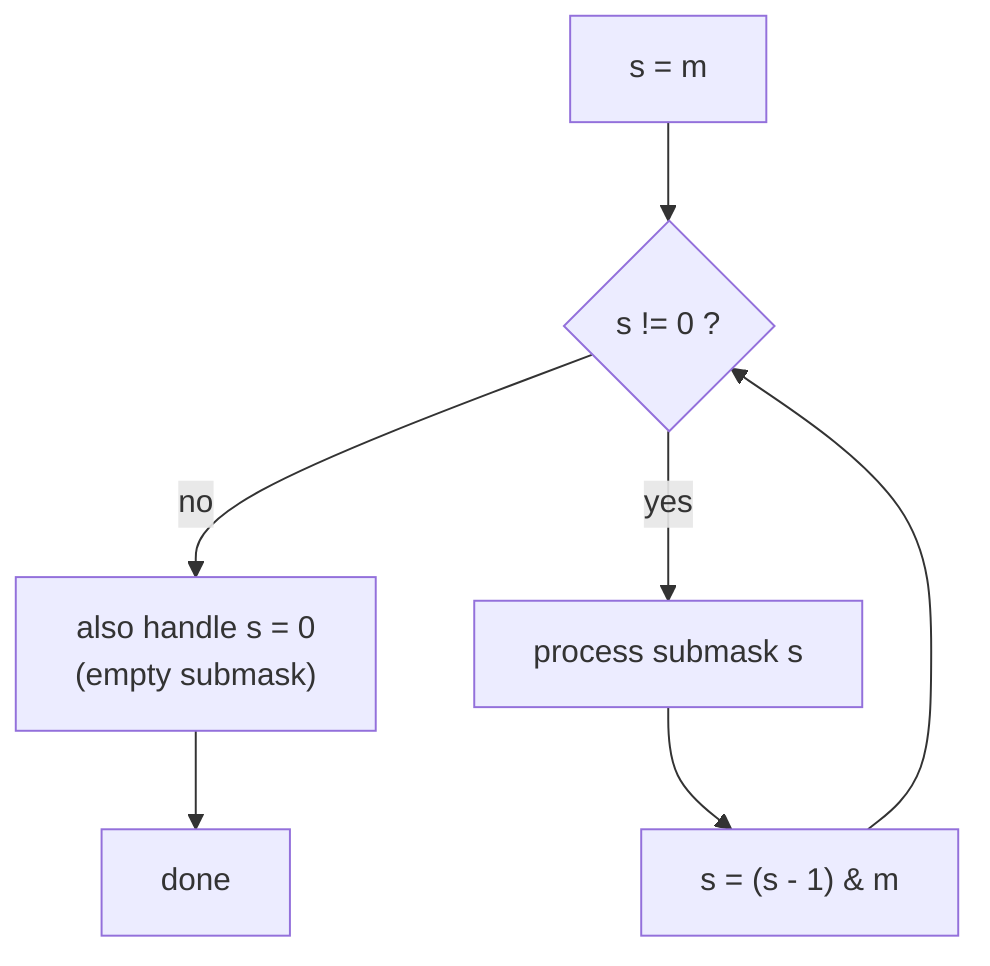

Why is the total work $O(3^n)$ across **all** masks $m$? Each bit position is independently in one of
three states across the (mask, submask) pair: **not in $m$**, **in $m$ but not in $s$**, or
**in both $m$ and $s$**. That gives $3^n$ (mask, submask) pairs total:

$$
\sum_{m=0}^{2^n - 1} 2^{\operatorname{popcount}(m)} = \sum_{k=0}^{n} \binom{n}{k} 2^{k} = 3^{n}.
$$

```python
def submasks(m: int):
    """Yield every submask of m, including 0, in descending order."""
    s = m
    while True:
        yield s
        if s == 0:
            break
        s = (s - 1) & m
```

```cpp
#include <bits/stdc++.h>
using namespace std;

// Collect every submask of m (including 0) in descending order.
vector<int> submasks(int m) {
    vector<int> out;
    int s = m;
    while (true) {
        out.push_back(s);
        if (s == 0) break;
        s = (s - 1) & m;
    }
    return out;
}
```

For example, the submasks of `m = 0b101` are `101, 100, 001, 000`:

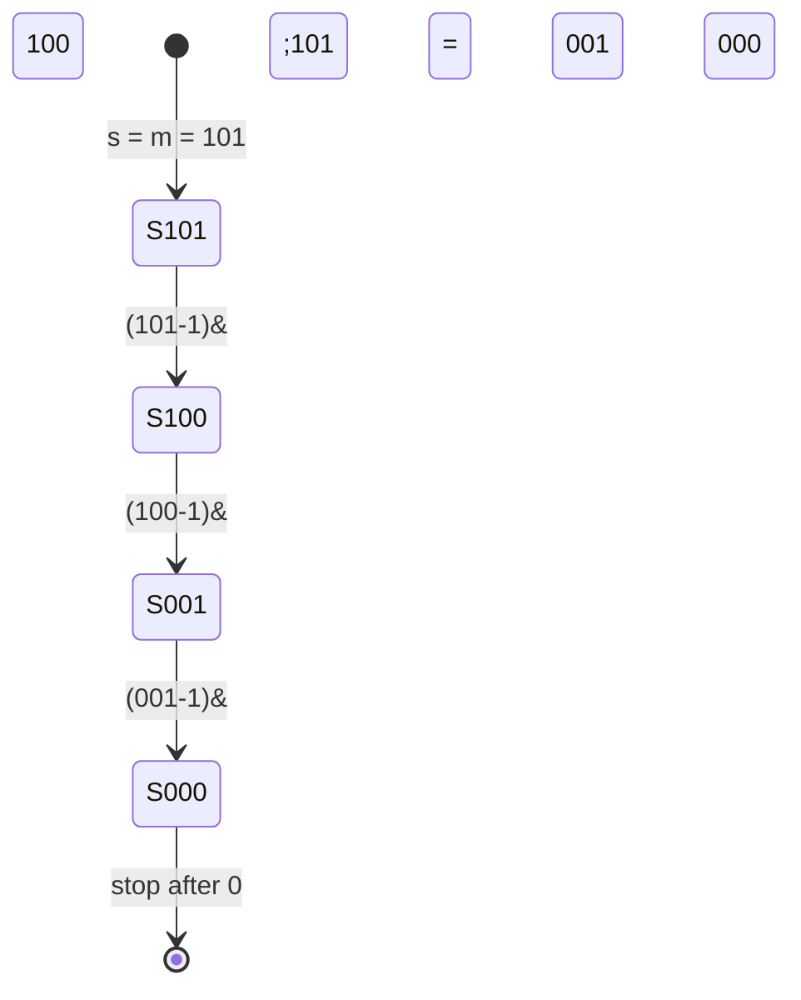

---

## Enumerating All Subsets of n Elements

To enumerate every subset of an $n$-element universe, loop a mask from $0$ to $2^n - 1$ and decode it:

```python
def all_subsets(elements: list[int]) -> list[list[int]]:
    n = len(elements)
    result = []
    for mask in range(1 << n):              # 0 .. 2^n - 1
        subset = [elements[i] for i in range(n) if (mask >> i) & 1]
        result.append(subset)
    return result
```

```cpp
#include <bits/stdc++.h>
using namespace std;

vector<vector<int>> all_subsets(const vector<int>& elements) {
    int n = (int)elements.size();
    vector<vector<int>> result;
    for (int mask = 0; mask < (1 << n); mask++) {   // 0 .. 2^n - 1
        vector<int> subset;
        for (int i = 0; i < n; i++)
            if ((mask >> i) & 1)
                subset.push_back(elements[i]);
        result.push_back(subset);
    }
    return result;
}
```

The masks form a lattice ordered by inclusion (edges add one element):

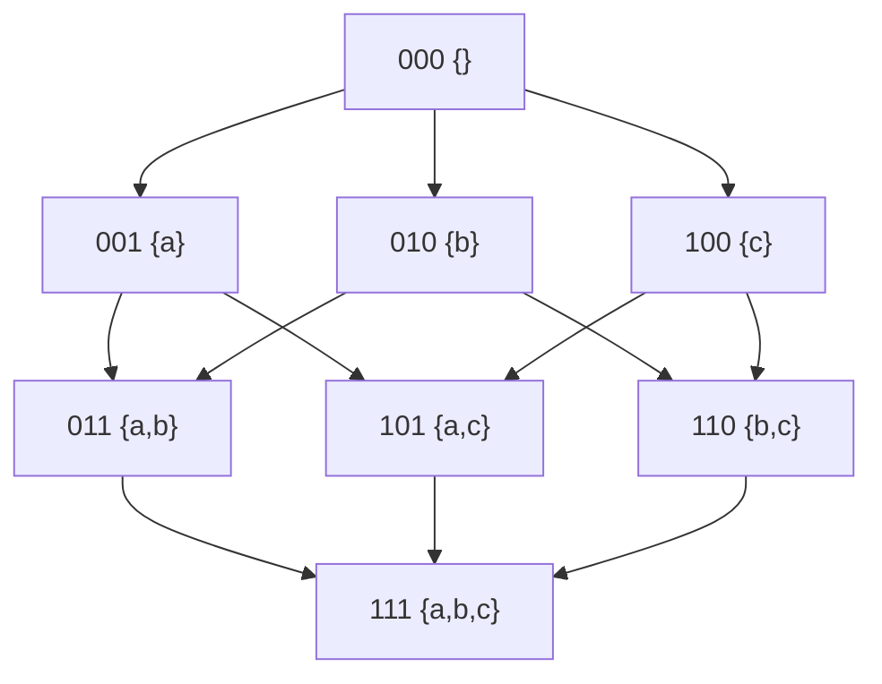

---

## XOR Tricks (Swap, Parity, Prefix XOR)

XOR has three properties that power many tricks: it is its own inverse (`a ^ a = 0`), has identity
$0$ (`a ^ 0 = a`), and is associative & commutative.

**Swap without a temporary:**

```python
a, b = 5, 9
a ^= b
b ^= a
a ^= b
# now a, b == 9, 5
```

```cpp
#include <bits/stdc++.h>
using namespace std;

int main() {
    long long a = 5, b = 9;
    a ^= b;
    b ^= a;
    a ^= b;             // now a == 9, b == 5
    cout << a << " " << b << "\n";
    return 0;
}
```

**Parity & "find the unique number":** XORing all elements cancels pairs, leaving the lone value,
since duplicates annihilate:

$$
\bigoplus_{i} a_i = (\text{value appearing an odd number of times}).
$$

```python
def find_single(nums: list[int]) -> int:
    acc = 0
    for v in nums:
        acc ^= v            # pairs cancel to 0
    return acc
```

```cpp
#include <bits/stdc++.h>
using namespace std;

long long find_single(const vector<long long>& nums) {
    long long acc = 0;
    for (long long v : nums) acc ^= v;   // pairs cancel to 0
    return acc;
}
```

**Prefix XOR** answers "XOR of subarray $[l, r]$" in $O(1)$, analogous to prefix sums, because XOR is
invertible:

$$
\text{xor}(l, r) = P[r+1] \oplus P[l], \qquad P[i] = a_0 \oplus a_1 \oplus \dots \oplus a_{i-1}.
$$

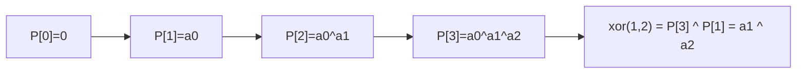

---

## Powers of Two Checks

A positive integer is a power of two iff it has exactly one set bit, which `x & (x - 1) == 0`
detects in $O(1)$:

$$
x > 0 \text{ is a power of two} \iff x \mathbin{\&} (x - 1) = 0.
$$

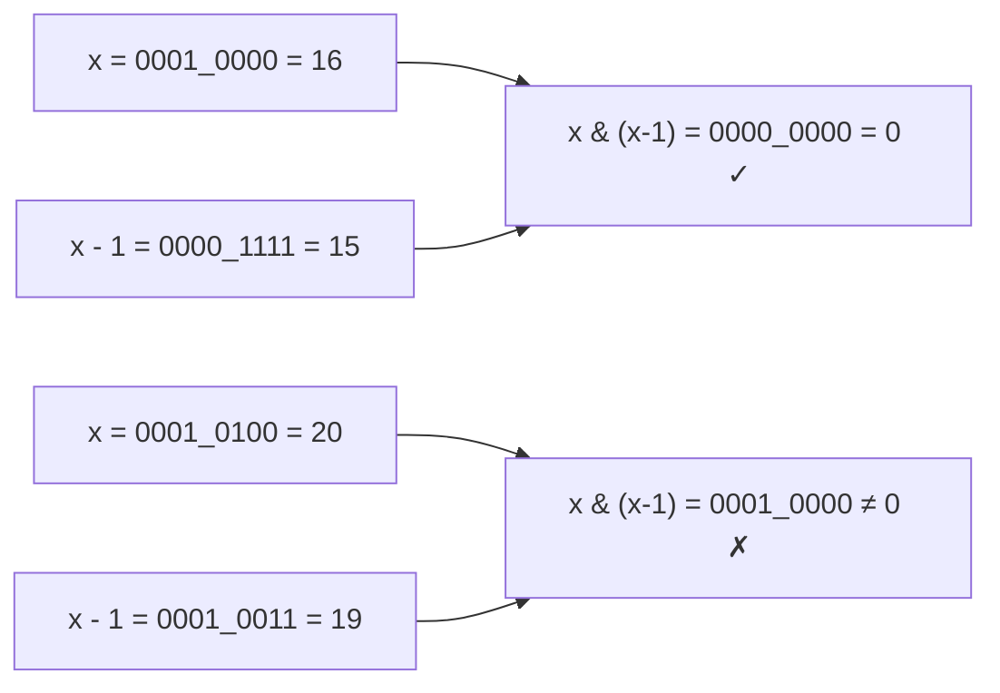

```python
def is_power_of_two(x: int) -> bool:
    return x > 0 and (x & (x - 1)) == 0
```

```cpp
#include <bits/stdc++.h>
using namespace std;

bool is_power_of_two(long long x) {
    return x > 0 && (x & (x - 1)) == 0;
}
```

The next power of two $\ge x$ can be found by rounding up via `bit_length`, useful for sizing arrays.

---

## Gray Code

A **Gray code** orders all $2^n$ values so that consecutive numbers differ in exactly **one** bit. The
$i$-th Gray code is `i ^ (i >> 1)`. Such single-bit transitions matter for error-resistant encoders and
some DP orderings.

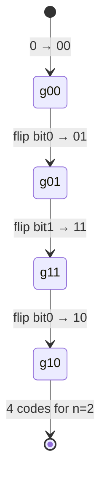

$$
G(i) = i \oplus \left\lfloor i / 2 \right\rfloor = i \oplus (i \gg 1).
$$

```python
def gray_code(n: int) -> list[int]:
    return [i ^ (i >> 1) for i in range(1 << n)]
```

```cpp
#include <bits/stdc++.h>
using namespace std;

vector<long long> gray_code(int n) {
    vector<long long> codes;
    for (long long i = 0; i < (1LL << n); i++)
        codes.push_back(i ^ (i >> 1));
    return codes;
}
```

To invert (Gray → binary), XOR the running prefix:

```python
def gray_to_binary(g: int) -> int:
    b = 0
    while g:
        b ^= g
        g >>= 1
    return b
```

```cpp
#include <bits/stdc++.h>
using namespace std;

long long gray_to_binary(long long g) {
    long long b = 0;
    while (g) {
        b ^= g;
        g >>= 1;
    }
    return b;
}
```

---

## Complexity Summary

| Operation | Time | Notes |
|-----------|------|-------|
| Test / set / clear / toggle a bit | $O(1)$ | single machine op |
| Lowest set bit `x & -x` | $O(1)$ | basis of Fenwick |
| Clear lowest set bit `x & (x-1)` | $O(1)$ | Kernighan step |
| Popcount (Kernighan) | $O(\text{popcount})$ | or $O(1)$ via intrinsic |
| Iterate set bits | $O(\text{popcount})$ | jump via `x & -x` |
| Enumerate all subsets of $n$ | $O(2^n \cdot n)$ | decode each mask |
| Submasks of one mask $m$ | $O(2^{\operatorname{popcount}(m)})$ | `(s-1)&m` walk |
| **All** submasks over all masks | $O(3^n)$ | SOS-style DP bound |
| SOS DP (per-bit relaxation) | $O(n \cdot 2^n)$ | beats naive $3^n$ |
| Gray code generation | $O(2^n)$ | one XOR per value |

---

## Common Pitfalls

- **Signed right shift:** in C++, `>>` on a negative signed integer is implementation-defined /
  arithmetic (sign-extending). Use unsigned types (`unsigned long long`) for logical shifts. Python's
  `>>` is always arithmetic on its infinite-precision ints.
- **`1 << k` vs `1LL << k`:** `1` is a 32-bit `int`; `1 << 31` and beyond overflow (UB). Always write
  `1LL << k` for 64-bit masks.
- **Operator precedence:** `&`, `|`, `^` bind *looser* than comparison operators in both Python and
  C++. `x & 1 == 0` parses as `x & (1 == 0)`. Always parenthesize: `(x & 1) == 0`.
- **Empty submask:** the `for (s = m; s; s = (s-1)&m)` loop **skips** `s = 0`; handle the empty
  submask separately if your problem needs it.
- **`~` in Python:** there is no fixed width, so `~x == -x - 1`. To emulate an 8-bit NOT, mask with
  `& 0xFF`.
- **Shift amount $\ge$ width:** shifting by $\ge$ the type width is undefined in C++. Keep `0 <= k < 64`.

---

## Patterns

- **Bitmask DP / "subset of items" state:** represent a chosen set as an integer; transition by
  `set_bit` / `clear_bit`. Classic in Traveling Salesman and assignment problems.
- **Sum / Max over Subsets (SOS) DP:** aggregate over all submasks in $O(n \cdot 2^n)$ using per-bit
  relaxation instead of the naive $O(3^n)$ submask walk.
- **Counting set bits incrementally:** `dp[x] = dp[x >> 1] + (x & 1)` builds popcount for all
  $0 \dots n$ in $O(n)$ (see *Counting Bits*).
- **XOR prefix for subarray queries:** invertibility makes range-XOR a prefix problem.
- **Lowest-set-bit decomposition:** Fenwick trees and "process each set bit" loops rely on `x & -x`.
- **Power-of-two & alignment tricks:** `x & (x-1)`, `x & (size-1)` for fast modulo when `size` is a
  power of two.
