# Recursion & Backtracking — Complete Guide (Beginner → Advanced)

> **Recursion** is when a function calls itself to solve a smaller version of the same
> problem. **Backtracking** is recursion with a twist: we *build* a candidate solution one
> choice at a time, and whenever a choice leads nowhere, we **undo it** and try another.
> Together they unlock permutations, combinations, subsets, puzzles like N-Queens, maze
> solving, and a huge family of "explore all possibilities" problems.

---

## Table of Contents
1. [Anatomy of Recursion](#1-anatomy-of-recursion)
2. [The Call Stack](#2-the-call-stack)
3. [Recursion Trees](#3-recursion-trees)
4. [The Backtracking Template (choose → explore → un-choose)](#4-the-backtracking-template-choose--explore--un-choose)
5. [Pruning](#5-pruning)
6. [Permutations, Combinations & Subsets](#6-permutations-combinations--subsets)
7. [The N-Queens / Grid-Path Archetype](#7-the-n-queens--grid-path-archetype)
8. [Complexity of Backtracking](#8-complexity-of-backtracking)
9. [Complexity Summary](#complexity-summary)
10. [Common Pitfalls](#common-pitfalls)
11. [Patterns](#patterns)

---

## 1. Anatomy of Recursion

Every correct recursive function has **two** ingredients:

1. **Base case** — the smallest input where the answer is known *directly*, with no further
   recursion. This is what stops the recursion.
2. **Recursive case** — express the answer in terms of a **smaller** sub-problem, then call
   yourself on that smaller input, making progress *toward* the base case.

The classic example is the factorial $n! = n \times (n-1)!$ with base case $0! = 1$.

$$
n! =
\begin{cases}
1 & \text{if } n = 0 \quad \text{(base case)}\\[4pt]
n \times (n-1)! & \text{if } n > 0 \quad \text{(recursive case)}
\end{cases}
$$

```python
def factorial(n):
    if n == 0:            # base case
        return 1
    return n * factorial(n - 1)   # recursive case: smaller sub-problem
```

```cpp
#include <bits/stdc++.h>
using namespace std;

long long factorial(long long n) {
    if (n == 0)                       // base case
        return 1;
    return n * factorial(n - 1);      // recursive case: smaller sub-problem
}
```

A recursive call **must** move toward the base case, otherwise the recursion never ends and
the program crashes with a *stack overflow*.

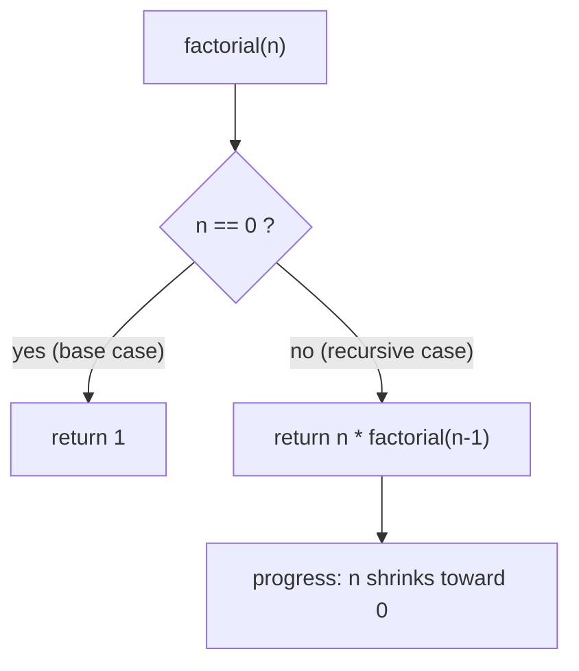

---

## 2. The Call Stack

Each function call gets its own **stack frame** holding its parameters and local variables.
When `factorial(3)` calls `factorial(2)`, the frame for `3` is *paused* (pushed) and waits
for the inner call to return. Frames are unwound (popped) in reverse order — **last in,
first out**.

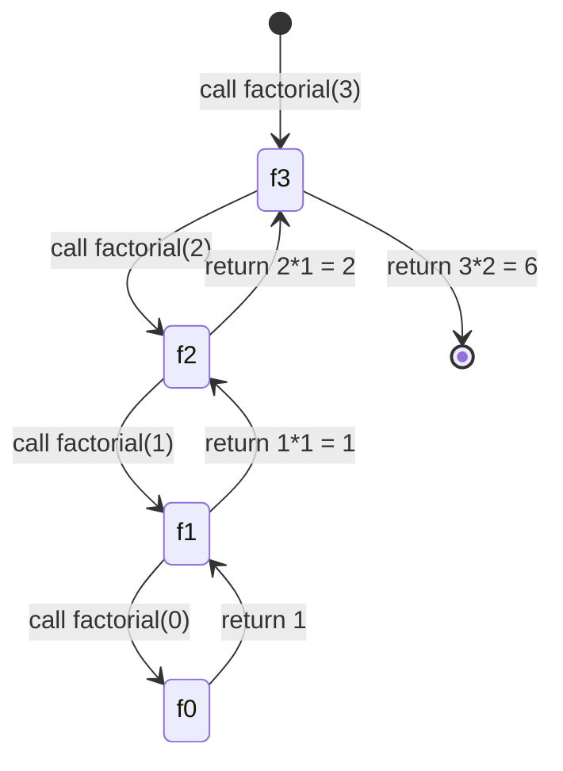

We can watch the stack grow and shrink:

```python
def factorial_traced(n, depth=0):
    print("  " * depth + f"-> factorial({n})")
    if n == 0:
        print("  " * depth + "<- 1")
        return 1
    result = n * factorial_traced(n - 1, depth + 1)
    print("  " * depth + f"<- {result}")
    return result
```

```cpp
#include <bits/stdc++.h>
using namespace std;

long long factorial_traced(long long n, int depth = 0) {
    cout << string(2 * depth, ' ') << "-> factorial(" << n << ")\n";
    if (n == 0) {
        cout << string(2 * depth, ' ') << "<- 1\n";
        return 1;
    }
    long long result = n * factorial_traced(n - 1, depth + 1);
    cout << string(2 * depth, ' ') << "<- " << result << "\n";
    return result;
}
```

The maximum stack depth equals the **recursion depth**. Deep recursion (millions of frames)
can overflow the stack — a key reason to bound depth or use iteration for very deep cases.

---

## 3. Recursion Trees

A **recursion tree** draws every call as a node and every sub-call as a child. It is the
single most useful tool for *seeing* what a recursive algorithm does and for analysing its
cost. Consider the naive Fibonacci $F(n) = F(n-1) + F(n-2)$.

```python
def fib(n):
    if n < 2:                 # base cases: F(0)=0, F(1)=1
        return n
    return fib(n - 1) + fib(n - 2)
```

```cpp
#include <bits/stdc++.h>
using namespace std;

long long fib(long long n) {
    if (n < 2)                        // base cases: F(0)=0, F(1)=1
        return n;
    return fib(n - 1) + fib(n - 2);
}
```

The branching structure of `fib(5)`:

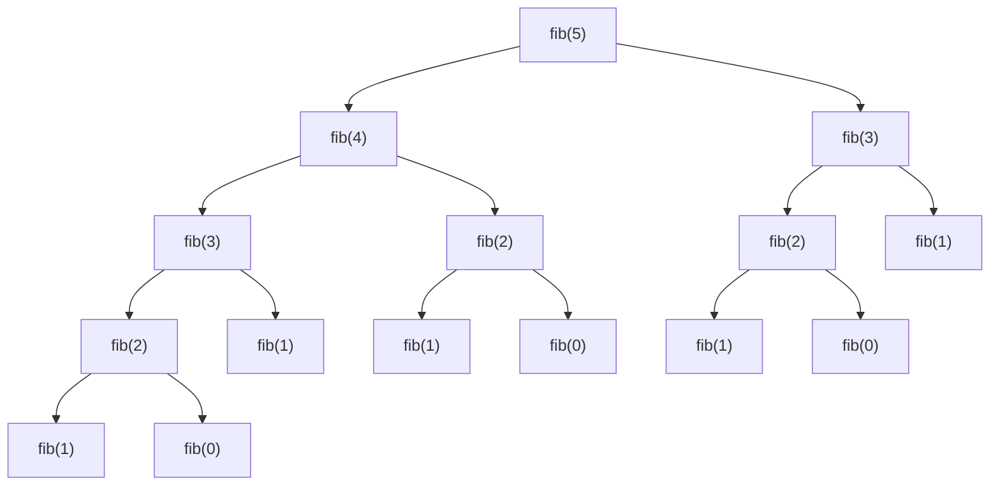

Notice `fib(3)` and `fib(2)` are recomputed many times — the tree has roughly $2^n$ nodes,
which is why naive Fibonacci is exponential. Recursion trees make such waste obvious.

---

## 4. The Backtracking Template (choose → explore → un-choose)

**Backtracking** systematically builds a solution by making a sequence of choices. At each
step it:

1. **Choose** — pick one available option and apply it to the current partial state.
2. **Explore** — recurse to make the *next* choice on top of this one.
3. **Un-choose** — undo the choice (restore state) so the next option starts clean.

This "make → recurse → undo" rhythm is the heartbeat of every backtracking algorithm.

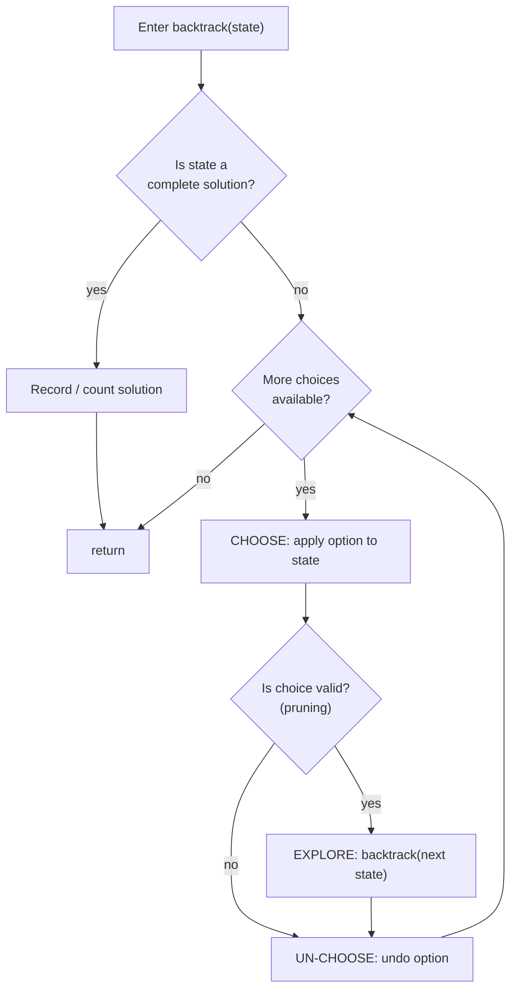

A generic skeleton:

```python
def backtrack(state, choices, solutions):
    if is_complete(state):
        solutions.append(list(state))   # record a copy
        return
    for option in choices:
        if not is_valid(state, option):
            continue                    # prune invalid branches
        state.append(option)            # CHOOSE
        backtrack(state, choices, solutions)  # EXPLORE
        state.pop()                     # UN-CHOOSE
```

```cpp
#include <bits/stdc++.h>
using namespace std;

void backtrack(vector<int>& state, const vector<int>& choices,
               vector<vector<int>>& solutions) {
    if (is_complete(state)) {
        solutions.push_back(state);     // record a copy
        return;
    }
    for (int option : choices) {
        if (!is_valid(state, option))
            continue;                   // prune invalid branches
        state.push_back(option);        // CHOOSE
        backtrack(state, choices, solutions);  // EXPLORE
        state.pop_back();               // UN-CHOOSE
    }
}
```

The **decision tree** below shows backtracking exploring a tiny set of choices `{A, B}` to a
depth of two. Each downward edge is a CHOOSE; returning back up an edge is an UN-CHOOSE.

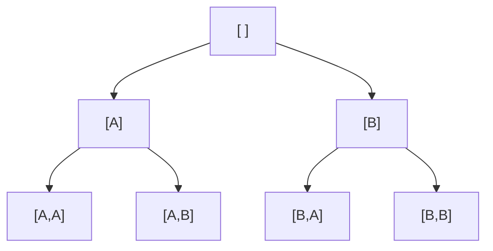

---

## 5. Pruning

The full decision tree can be astronomically large. **Pruning** means cutting off a branch as
early as possible once we can *prove* it cannot lead to a valid solution. Good pruning is the
difference between a program that finishes instantly and one that runs for years.

Two common pruning ideas:
- **Constraint pruning** — abandon a branch the moment a constraint is violated (e.g. two
  queens attack each other, or a running sum exceeds the target).
- **Bound pruning** — abandon a branch when even the best-case completion cannot beat the
  current best answer (used in optimisation / branch-and-bound).

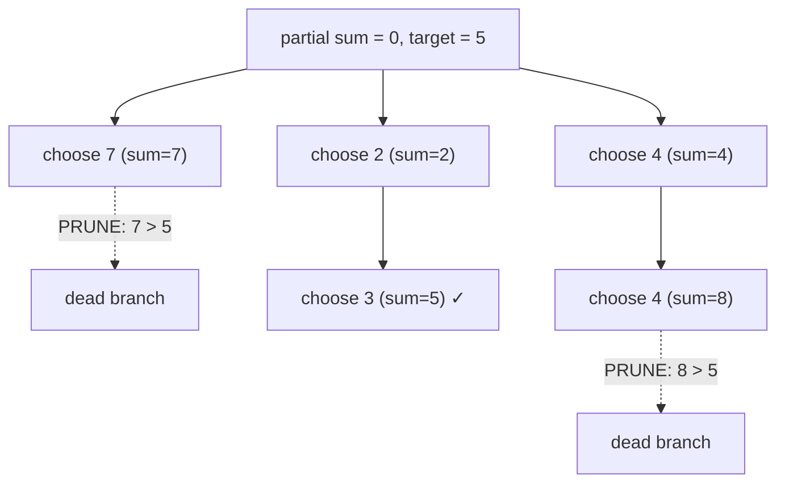

Here, the inequality $\text{sum} > \text{target}$ lets us discard whole subtrees without
exploring them, because all numbers are positive and the sum can only grow.

```python
def count_ways(nums, target):
    nums.sort()                         # enables early stop
    def dfs(start, remaining):
        if remaining == 0:
            return 1
        total = 0
        for i in range(start, len(nums)):
            if nums[i] > remaining:     # PRUNE: sorted, so rest are bigger too
                break
            total += dfs(i, remaining - nums[i])
        return total
    return dfs(0, target)
```

```cpp
#include <bits/stdc++.h>
using namespace std;

int dfs(const vector<int>& nums, int start, int remaining) {
    if (remaining == 0)
        return 1;
    int total = 0;
    for (int i = start; i < (int)nums.size(); i++) {
        if (nums[i] > remaining)        // PRUNE: sorted, so rest are bigger too
            break;
        total += dfs(nums, i, remaining - nums[i]);
    }
    return total;
}

int count_ways(vector<int> nums, int target) {
    sort(nums.begin(), nums.end());     // enables early stop
    return dfs(nums, 0, target);
}
```

---

## 6. Permutations, Combinations & Subsets

These three generation problems are the *bread and butter* of backtracking. They differ only
in how choices are made.

| Problem      | Order matters? | Reuse elements? | Count for set of size $n$ |
|--------------|----------------|-----------------|---------------------------|
| Permutations | yes            | no              | $n!$                      |
| Subsets      | no             | no              | $2^n$                     |
| Combinations | no             | no              | $\binom{n}{k}$            |

### 6.1 Generate Permutations

A permutation uses **every** element exactly once, and order matters. At each level we choose
an element that has not yet been used.

```python
def permutations(nums):
    result = []
    used = [False] * len(nums)
    path = []

    def backtrack():
        if len(path) == len(nums):      # base case: full permutation
            result.append(path[:])      # record a copy
            return
        for i in range(len(nums)):
            if used[i]:
                continue                # skip already-used element
            used[i] = True              # CHOOSE
            path.append(nums[i])
            backtrack()                 # EXPLORE
            path.pop()                  # UN-CHOOSE
            used[i] = False

    backtrack()
    return result
```

```cpp
#include <bits/stdc++.h>
using namespace std;

void permute_helper(vector<int>& nums, vector<bool>& used,
                    vector<int>& path, vector<vector<int>>& result) {
    if (path.size() == nums.size()) {   // base case: full permutation
        result.push_back(path);         // record a copy
        return;
    }
    for (int i = 0; i < (int)nums.size(); i++) {
        if (used[i])
            continue;                   // skip already-used element
        used[i] = true;                 // CHOOSE
        path.push_back(nums[i]);
        permute_helper(nums, used, path, result);  // EXPLORE
        path.pop_back();                // UN-CHOOSE
        used[i] = false;
    }
}

vector<vector<int>> permutations(vector<int> nums) {
    vector<vector<int>> result;
    vector<bool> used(nums.size(), false);
    vector<int> path;
    permute_helper(nums, used, path, result);
    return result;
}
```

Decision tree of `permutations([1, 2, 3])` — each leaf is a complete permutation:

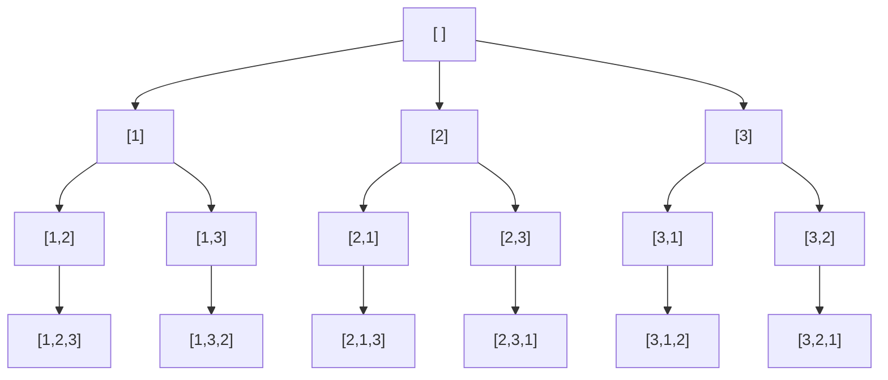

### 6.2 Generate Subsets

For subsets, each element is independently **in** or **out**. We can model this as a binary
decision at each index.

```python
def subsets(nums):
    result = []
    path = []

    def backtrack(start):
        result.append(path[:])          # every node is a valid subset
        for i in range(start, len(nums)):
            path.append(nums[i])        # CHOOSE: include nums[i]
            backtrack(i + 1)            # EXPLORE: move past i
            path.pop()                  # UN-CHOOSE: exclude nums[i]

    backtrack(0)
    return result
```

```cpp
#include <bits/stdc++.h>
using namespace std;

void subsets_helper(const vector<int>& nums, int start,
                    vector<int>& path, vector<vector<int>>& result) {
    result.push_back(path);             // every node is a valid subset
    for (int i = start; i < (int)nums.size(); i++) {
        path.push_back(nums[i]);        // CHOOSE: include nums[i]
        subsets_helper(nums, i + 1, path, result);  // EXPLORE: move past i
        path.pop_back();                // UN-CHOOSE: exclude nums[i]
    }
}

vector<vector<int>> subsets(vector<int>& nums) {
    vector<vector<int>> result;
    vector<int> path;
    subsets_helper(nums, 0, path, result);
    return result;
}
```

The **in / out** decision tree for `subsets([1, 2, 3])`:

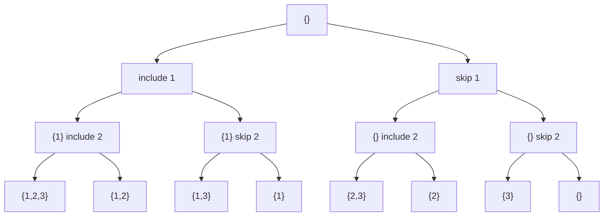

There are exactly $2^3 = 8$ leaves, matching $2^n$ subsets.

---

## 7. The N-Queens / Grid-Path Archetype

Many puzzles are "place items on a grid subject to constraints." **N-Queens** asks: place $N$
queens on an $N \times N$ board so that no two share a row, column, or diagonal. We place one
queen per row and backtrack whenever a column or diagonal is already attacked.

A queen at row $r$, column $c$ occupies:
- column $c$,
- the **"↘ diagonal"** identified by $r - c$,
- the **"↙ diagonal"** identified by $r + c$.

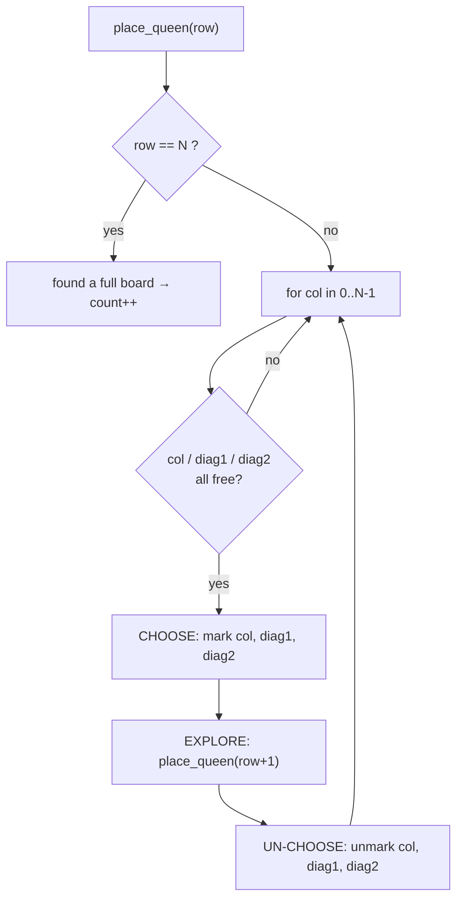

```python
def count_n_queens(n):
    cols = set()
    diag1 = set()                       # r - c
    diag2 = set()                       # r + c
    count = 0

    def place(row):
        nonlocal count
        if row == n:                    # base case: all rows filled
            count += 1
            return
        for col in range(n):
            if col in cols or (row - col) in diag1 or (row + col) in diag2:
                continue                # PRUNE: square is attacked
            cols.add(col)               # CHOOSE
            diag1.add(row - col)
            diag2.add(row + col)
            place(row + 1)              # EXPLORE
            cols.remove(col)            # UN-CHOOSE
            diag1.remove(row - col)
            diag2.remove(row + col)

    place(0)
    return count
```

```cpp
#include <bits/stdc++.h>
using namespace std;

void place(int row, int n, set<int>& cols, set<int>& diag1,
           set<int>& diag2, long long& count) {
    if (row == n) {                     // base case: all rows filled
        count++;
        return;
    }
    for (int col = 0; col < n; col++) {
        if (cols.count(col) || diag1.count(row - col) || diag2.count(row + col))
            continue;                   // PRUNE: square is attacked
        cols.insert(col);               // CHOOSE
        diag1.insert(row - col);
        diag2.insert(row + col);
        place(row + 1, n, cols, diag1, diag2, count);  // EXPLORE
        cols.erase(col);                // UN-CHOOSE
        diag1.erase(row - col);
        diag2.erase(row + col);
    }
}

long long count_n_queens(int n) {
    set<int> cols, diag1, diag2;
    long long count = 0;
    place(0, n, cols, diag1, diag2, count);
    return count;
}
```

A slice of the search tree for the $4 \times 4$ board (placing queens row by row, columns
shown). Crossed branches are pruned by the diagonal/column constraints:

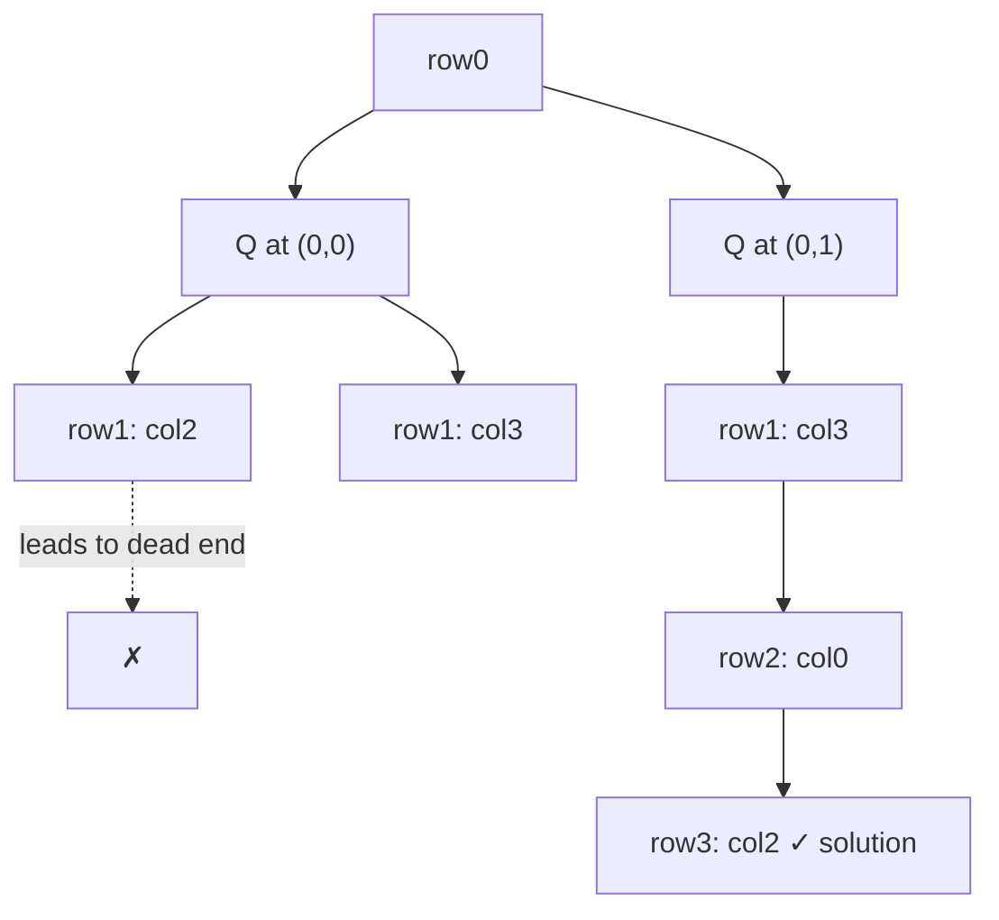

The same template solves **grid-path** problems (count paths in a maze, word search): treat
each cell as a state, try each neighbour as a choice, mark cells visited (CHOOSE), recurse
(EXPLORE), then unmark (UN-CHOOSE).

```python
def count_paths(grid):
    rows, cols = len(grid), len(grid[0])
    visited = [[False] * cols for _ in range(rows)]

    def dfs(r, c):
        if r == rows - 1 and c == cols - 1:   # base case: reached the goal
            return 1
        total = 0
        for dr, dc in ((1, 0), (0, 1)):
            nr, nc = r + dr, c + dc
            if 0 <= nr < rows and 0 <= nc < cols and not visited[nr][nc] and grid[nr][nc] == 0:
                visited[nr][nc] = True        # CHOOSE
                total += dfs(nr, nc)          # EXPLORE
                visited[nr][nc] = False       # UN-CHOOSE
        return total

    return dfs(0, 0)
```

```cpp
#include <bits/stdc++.h>
using namespace std;

int dfs(int r, int c, vector<vector<int>>& grid, vector<vector<bool>>& visited) {
    int rows = grid.size(), cols = grid[0].size();
    if (r == rows - 1 && c == cols - 1)       // base case: reached the goal
        return 1;
    int total = 0;
    int dr[2] = {1, 0}, dc[2] = {0, 1};
    for (int k = 0; k < 2; k++) {
        int nr = r + dr[k], nc = c + dc[k];
        if (nr >= 0 && nr < rows && nc >= 0 && nc < cols && !visited[nr][nc] && grid[nr][nc] == 0) {
            visited[nr][nc] = true;           // CHOOSE
            total += dfs(nr, nc, grid, visited);  // EXPLORE
            visited[nr][nc] = false;          // UN-CHOOSE
        }
    }
    return total;
}

int count_paths(vector<vector<int>>& grid) {
    int rows = grid.size(), cols = grid[0].size();
    vector<vector<bool>> visited(rows, vector<bool>(cols, false));
    return dfs(0, 0, grid, visited);
}
```

---

## 8. Complexity of Backtracking

The cost of a backtracking search is governed by the **shape of its decision tree**. If every
node has up to $b$ children (the **branching factor**) and the tree has depth $d$, the number
of nodes is bounded by:

$$
1 + b + b^2 + \dots + b^d = \frac{b^{d+1} - 1}{b - 1} = O(b^{\,d})
$$

So the rule of thumb is **branching factor raised to the depth**:

$$
\text{work} \approx O(b^{\,d}) \times (\text{cost per node})
$$

| Problem        | Branching $b$ | Depth $d$ | Rough cost            |
|----------------|---------------|-----------|-----------------------|
| Permutations   | up to $n$     | $n$       | $O(n \cdot n!)$       |
| Subsets        | $2$           | $n$       | $O(n \cdot 2^n)$      |
| Combination Sum| $n$           | up to $T / \min$ | exponential   |
| N-Queens       | $n$           | $n$       | $O(n!)$ (with pruning)|

Pruning shrinks the *effective* branching factor, often turning an impossible search into a
fast one even though the worst-case bound stays exponential.

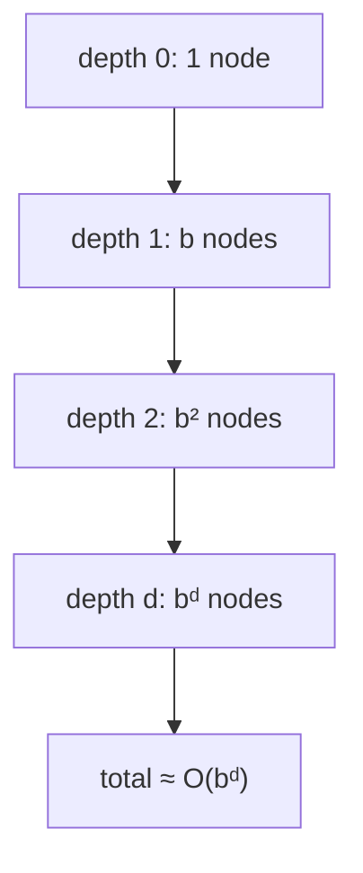

---

## Complexity Summary

| Algorithm          | Time                  | Space (stack + state)     |
|--------------------|-----------------------|---------------------------|
| Factorial          | $O(n)$                | $O(n)$ stack              |
| Naive Fibonacci    | $O(2^n)$              | $O(n)$ stack              |
| Permutations       | $O(n \cdot n!)$       | $O(n)$ path + $O(n)$ used |
| Subsets            | $O(n \cdot 2^n)$      | $O(n)$ path               |
| Combination Sum    | exponential (pruned)  | $O(\text{target}/\min)$   |
| N-Queens (count)   | $O(n!)$ worst (pruned)| $O(n)$ sets + stack       |

---

## Common Pitfalls

- **Missing or wrong base case.** Without a reachable base case, the recursion never stops
  and overflows the stack. Always ask: *"What is the smallest input, and does every recursive
  call move toward it?"*
- **Mutating shared state without copying.** When you record a solution, store a **copy**
  (`path[:]` in Python, push the vector by value in C++). Appending the live `path` reference
  means every recorded "solution" later mutates into garbage.
- **Forgetting to undo (un-choose).** If you CHOOSE and EXPLORE but never UN-CHOOSE, state
  leaks across sibling branches and you generate wrong or duplicate results. Every CHOOSE
  must have a matching UN-CHOOSE on the way back up.
- **Not pruning.** Exploring branches that cannot possibly succeed turns a feasible search
  into a timeout. Prune as early as the constraint can be checked.
- **Unbounded depth.** Very deep recursion can exceed the language stack limit; raise the
  limit, add memoization, or convert to iteration when depth is large.

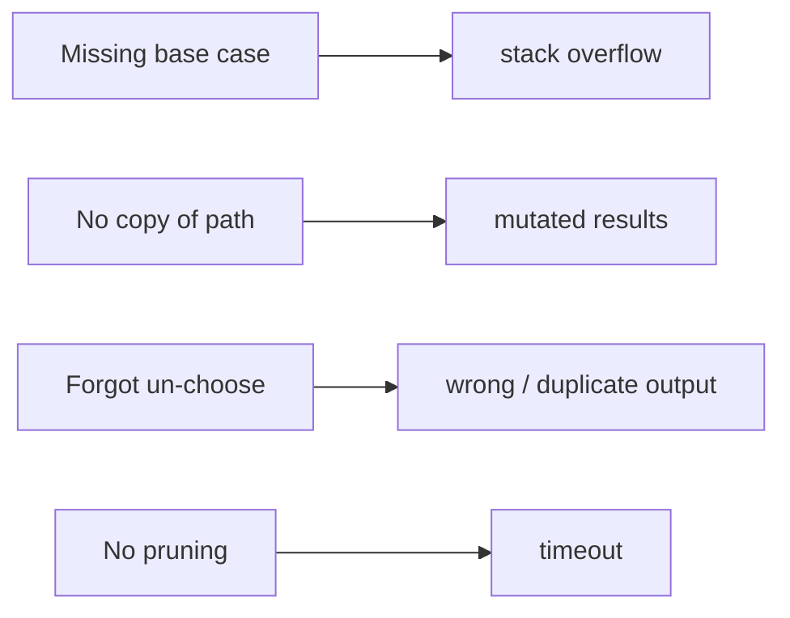

---

## Patterns

- **Generate-all (permutations / subsets / combinations).** Build the answer position by
  position; loop over candidate choices; CHOOSE → EXPLORE → UN-CHOOSE.
- **Constraint satisfaction (N-Queens, Sudoku).** Maintain fast "is this safe?" sets/bitmasks;
  prune the moment a constraint is violated.
- **Grid / maze DFS.** Treat cells as states, neighbours as choices, a `visited` marker as the
  CHOOSE/UN-CHOOSE pair.
- **Target / sum decomposition (Combination Sum).** Sort first; subtract the chosen value;
  stop the loop once a candidate exceeds the remaining target.
- **Branch-and-bound (optimisation).** Carry the best answer so far and prune any branch whose
  optimistic bound cannot beat it.

> **Mental model:** backtracking is a depth-first walk over a decision tree where every step
> *down* is a CHOOSE, every step *back up* is an UN-CHOOSE, and pruning lets you skip whole
> subtrees you can prove are hopeless.
