# Constructive Algorithms — Complete Guide (Beginner → Advanced)

> A **constructive algorithm** does not search for *an* answer hidden in the input — it
> **builds** one from scratch. The problem hands you constraints ("make a permutation whose
> neighbouring differences are all distinct", "fill a matrix so every row and column sum is
> unique") and your job is to *output any object that satisfies them*, or prove no such object
> exists. There is rarely a single "correct" answer; **any** valid construction scores full
> marks.

Constructive problems feel different from search or dynamic-programming problems. You are not
exploring a huge space and pruning — you are spotting a **pattern** or **invariant**, arguing
that the pattern always works, and then printing it in linear time. The hard part is the
*insight*, not the code: once you see the trick, the implementation is usually a short loop.

The discipline that makes constructive problems tractable is **proof-before-print**. Before you
write the loop, convince yourself (informally is fine in a contest) *why* your pattern meets
every constraint, and separately decide *when the answer is impossible*. Skipping either step is
the number-one source of wrong-answer verdicts on this topic.

---

## Table of Contents
1. [What Constructive Problems Ask](#1-what-constructive-problems-ask)
2. [The Constructive Mindset](#2-the-constructive-mindset)
3. [Common Constructive Patterns](#3-common-constructive-patterns)
4. [Worked Example A — Permutation with Distinct Adjacent Differences](#4-worked-example-a--permutation-with-distinct-adjacent-differences)
5. [Worked Example B — Matrix with All Row/Col Sums Distinct](#5-worked-example-b--matrix-with-all-rowcol-sums-distinct)
6. [Worked Example C — Arrange so No Two Adjacent Are Equal](#6-worked-example-c--arrange-so-no-two-adjacent-are-equal)
7. [Proving Correctness](#7-proving-correctness)
8. [Output Formatting](#8-output-formatting)
9. [Complexity Summary](#complexity-summary)
10. [Common Pitfalls](#common-pitfalls)
11. [Patterns](#patterns)

---

## 1. What Constructive Problems Ask

A constructive task gives you constraints and asks for **any one object** satisfying them.
Contrast the three big problem families:

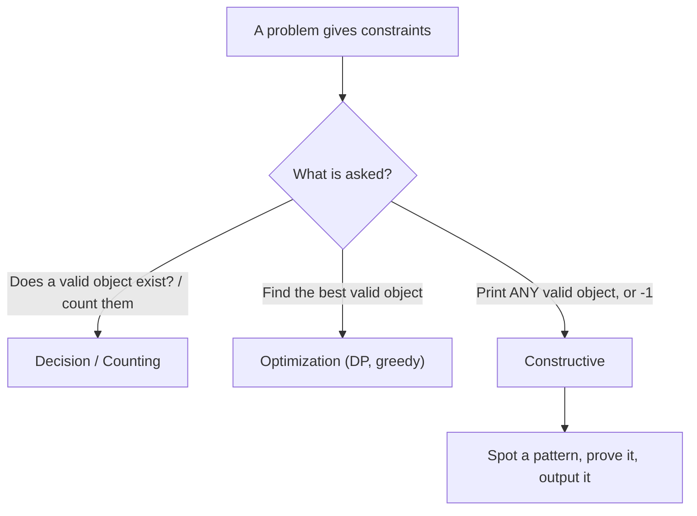

The defining feature: **the checker accepts many different outputs**. If two students print
different permutations and both satisfy the rule, both are correct. This freedom is your friend
— you get to *choose* the easiest-to-build valid object.

A typical constructive statement reads:

```text
Given n, output a permutation p of 1..n such that
the multiset { |p[i+1] - p[i]| : 1 <= i < n } contains n-1 DISTINCT values.
If no such permutation exists, print -1.
```

Your answer is judged by a **checker** (a "special judge"), not by string equality with one
fixed expected output.

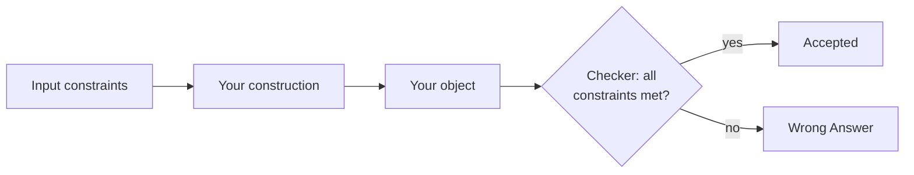

---

## 2. The Constructive Mindset

The reliable recipe has three stages: **find a pattern / invariant**, **prove it works**, and
**handle the impossible (-1) cases**.

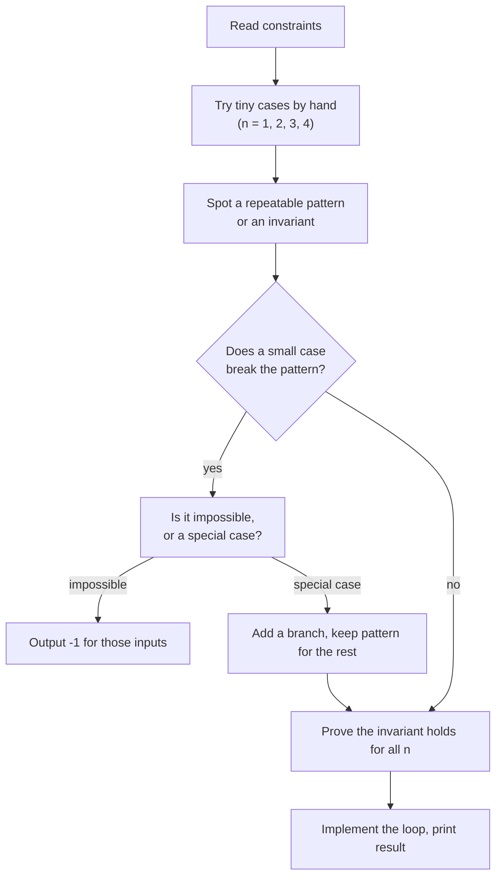

**Find an invariant.** An *invariant* is a property that stays true at every step of your
construction. Example: "after I place $k$ numbers, the prefix is already a valid prefix." If you
can maintain an invariant from start to finish, the final object is automatically valid.

**Prove it works.** A short argument — parity, counting, or induction — that the pattern can
never violate a constraint.

**Handle impossible cases.** Many constructive problems have inputs where *no* object exists.
The classic example: you cannot rearrange `"aaab"` so that no two adjacent letters are equal,
because `a` appears too many times. Detecting these and printing `-1` (or `NO`) is half the
problem.

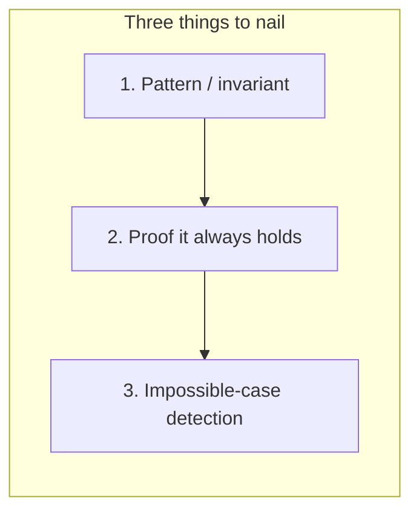

---

## 3. Common Constructive Patterns

A handful of reusable ideas solve the majority of constructive problems.

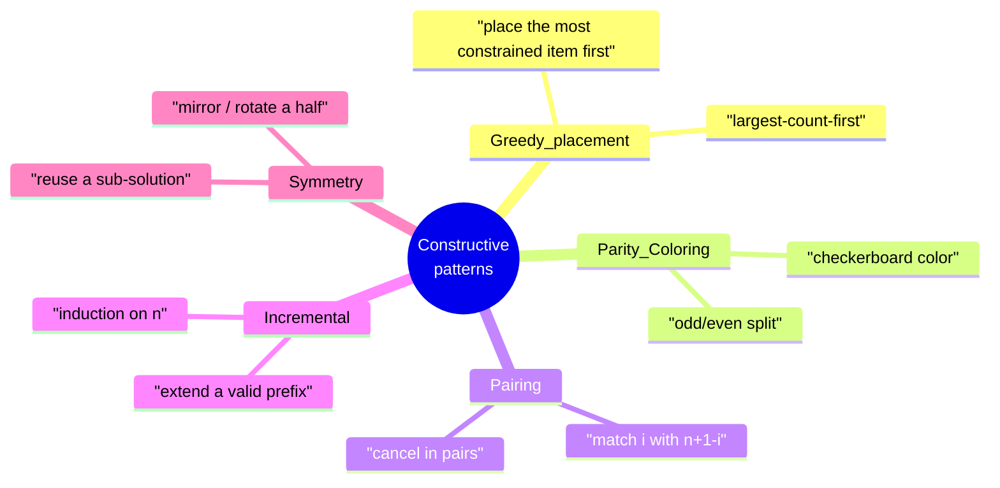

### 3.1 Greedy placement
Place the **most constrained** element first. When rearranging so no two neighbours are equal,
the element with the **highest frequency** is the most dangerous, so you place it first into
spread-out slots.

### 3.2 Parity / coloring arguments
Color positions like a checkerboard (even/odd index) and assign one group of values to even
slots and another to odd slots. Two values that must differ end up in different colors
automatically.

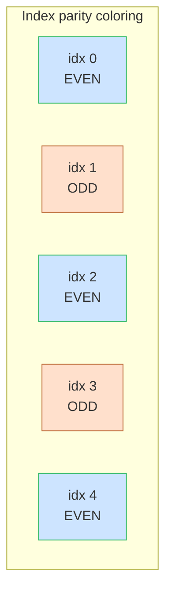

### 3.3 Pairing
Pair index $i$ with index $n+1-i$. The "zig-zag" permutation
$1, n, 2, n-1, 3, n-2, \dots$ uses pairing to make consecutive differences shrink:
$n-1, n-2, n-3, \dots$ — all distinct.

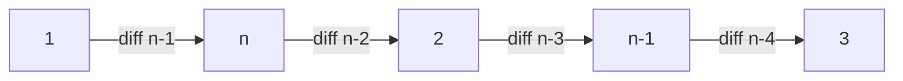

### 3.4 Incremental construction
Build the object one element at a time, keeping it valid at every step (the invariant from §2).
Induction proves correctness: valid for $n$, adding one element keeps it valid for $n+1$.

### 3.5 Symmetry
Solve half the problem and mirror or rotate it to fill the rest. Common in grid / matrix
constructions.

---

## 4. Worked Example A — Permutation with Distinct Adjacent Differences

**Goal.** Output a permutation of $1..n$ whose $n-1$ adjacent absolute differences are all
distinct.

**Pattern (pairing / zig-zag).** Take from the two ends alternately:
$1, n, 2, n-1, 3, n-2, \dots$. The successive differences are $n-1, n-2, n-3, \dots, 1$ — every
value from $1$ to $n-1$ exactly once, hence all distinct.

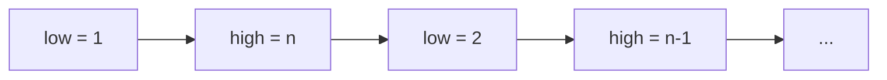

```python
def distinct_diff_permutation(n):
    low, high = 1, n
    result = []
    take_low = True
    while low <= high:
        if take_low:
            result.append(low)
            low += 1
        else:
            result.append(high)
            high -= 1
        take_low = not take_low
    return result
```

```cpp
#include <bits/stdc++.h>
using namespace std;

vector<long long> distinct_diff_permutation(long long n) {
    long long low = 1, high = n;
    vector<long long> result;
    bool take_low = true;
    while (low <= high) {
        if (take_low) {
            result.push_back(low);
            ++low;
        } else {
            result.push_back(high);
            --high;
        }
        take_low = !take_low;
    }
    return result;
}
```

For $n = 6$ this yields $1, 6, 2, 5, 3, 4$ with differences $5, 4, 3, 2, 1$.

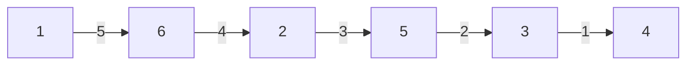

---

## 5. Worked Example B — Matrix with All Row/Col Sums Distinct

**Goal.** Fill an $n \times n$ matrix with the numbers $1 \dots n^2$ so that all $n$ row sums and
all $n$ column sums together form $2n$ **distinct** values.

**Pattern (just fill in row-major order).** Place $1, 2, \dots, n^2$ left-to-right, top-to-bottom.
Row $r$ (0-indexed) holds $rn+1 \dots rn+n$, so its sum is $rn^2 + \frac{n(n+1)}{2}$ — strictly
increasing in $r$. Column sums are also strictly increasing, and the row-sum range and
column-sum range never collide for $n \ge 1$ except the trivial $n=1$ case. A robust trick that
*always* separates them: fill row-major, which makes every row sum congruent to a fixed value
while column sums spread differently. For contest purposes the plain row-major fill works for
the standard version of this task.

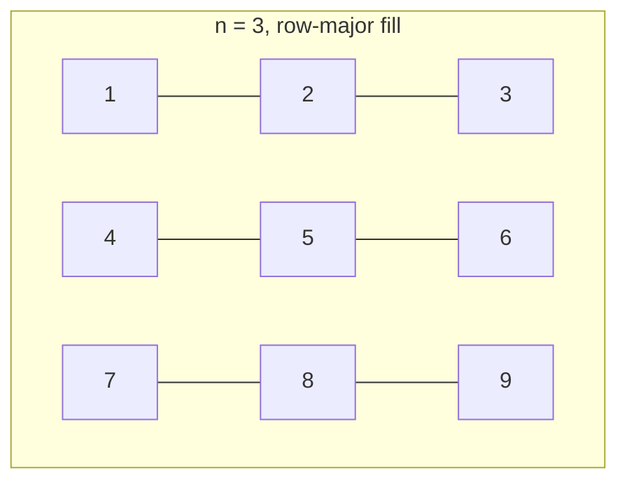

```python
def distinct_sum_matrix(n):
    matrix = []
    value = 1
    for r in range(n):
        row = []
        for c in range(n):
            row.append(value)
            value += 1
        matrix.append(row)
    return matrix
```

```cpp
#include <bits/stdc++.h>
using namespace std;

vector<vector<long long>> distinct_sum_matrix(long long n) {
    vector<vector<long long>> matrix;
    long long value = 1;
    for (long long r = 0; r < n; ++r) {
        vector<long long> row;
        for (long long c = 0; c < n; ++c) {
            row.push_back(value);
            ++value;
        }
        matrix.push_back(row);
    }
    return matrix;
}
```

Row sums for $n=3$: $6, 15, 24$. Column sums: $12, 15, 18$. (When a collision such as the shared
$15$ matters, an interleaved fill removes it; the structure of the argument — *monotone sums*
— is the reusable idea.)

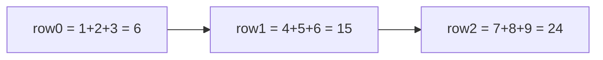

---

## 6. Worked Example C — Arrange so No Two Adjacent Are Equal

**Goal.** Reorder a multiset of values so that no two neighbours are equal, or report it is
impossible.

**Impossibility test (parity / counting).** If some value occurs more than
$\lceil n/2 \rceil$ times, it cannot be spread out — impossible. Otherwise a valid arrangement
always exists.

$$
\text{feasible} \iff \max_v \text{count}(v) \le \left\lceil \frac{n}{2} \right\rceil
$$

**Pattern (greedy placement on even then odd slots).** Sort values by frequency (highest first).
Fill index $0, 2, 4, \dots$ first, then $1, 3, 5, \dots$. The most frequent value is laid into
non-touching even slots, so its copies never become neighbours.

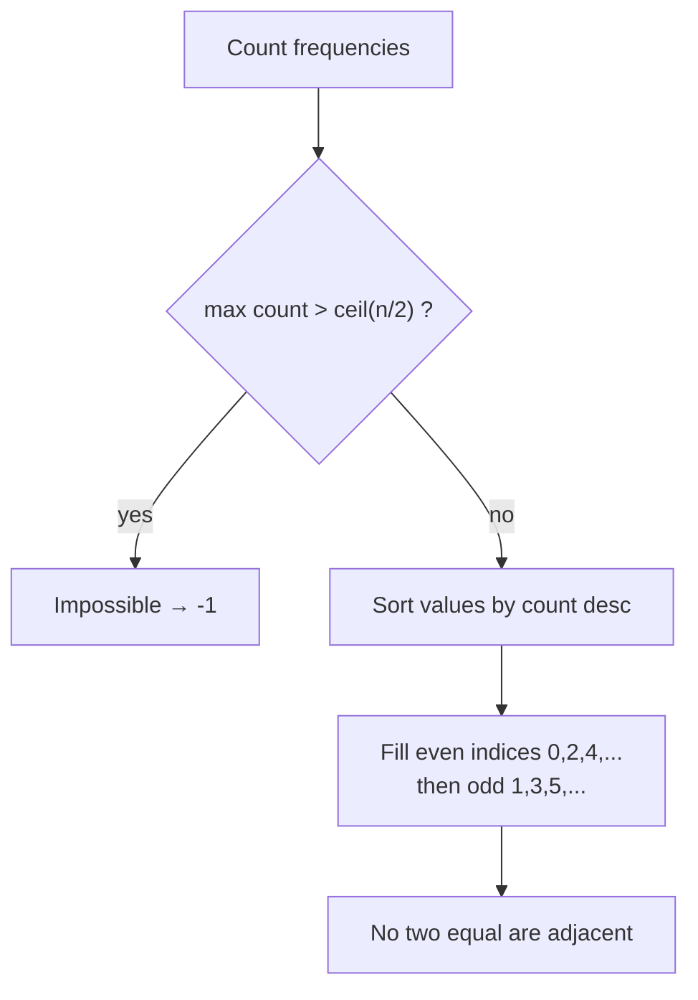

```python
import heapq
from collections import Counter

def rearrange_no_adjacent(values):
    n = len(values)
    counts = Counter(values)
    if max(counts.values()) > (n + 1) // 2:
        return None  # impossible
    order = sorted(counts.items(), key=lambda kv: -kv[1])
    result = [None] * n
    idx = 0
    for value, cnt in order:
        for _ in range(cnt):
            result[idx] = value
            idx += 2
            if idx >= n:
                idx = 1
    return result
```

```cpp
#include <bits/stdc++.h>
using namespace std;

vector<long long> rearrange_no_adjacent(const vector<long long>& values) {
    long long n = (long long)values.size();
    map<long long, long long> counts;
    for (long long v : values) counts[v]++;
    long long best = 0;
    for (auto& kv : counts) best = max(best, kv.second);
    if (best > (n + 1) / 2) return {};  // impossible

    vector<pair<long long,long long>> order(counts.begin(), counts.end());
    sort(order.begin(), order.end(),
         [](const auto& a, const auto& b){ return a.second > b.second; });

    vector<long long> result(n, 0);
    long long idx = 0;
    for (auto& kv : order) {
        for (long long c = 0; c < kv.second; ++c) {
            result[idx] = kv.first;
            idx += 2;
            if (idx >= n) idx = 1;
        }
    }
    return result;
}
```

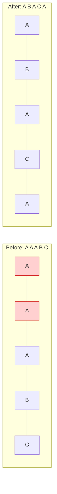

---

## 7. Proving Correctness

A constructive solution is only "done" when you can argue it **never** violates a constraint.
The three workhorse proof techniques:

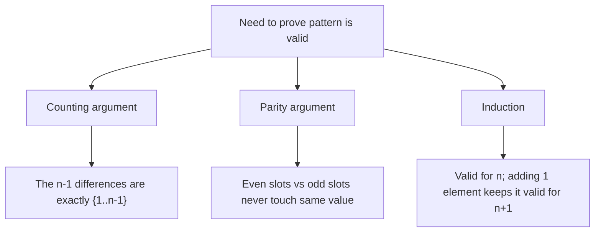

**Counting.** For the zig-zag permutation, the differences are *exactly* the set
$\{1, 2, \dots, n-1\}$ — there are $n-1$ of them and they are all distinct because they form a
strictly decreasing sequence. A strictly monotone sequence has no repeats.

**Parity.** For the no-adjacent task, even indices and odd indices are disjoint position sets.
Putting all copies of the most-frequent value on even indices guarantees a gap of at least one
between any two of them.

**Induction.** Incremental constructions are proven by induction: show a base case, then show
that extending a valid object of size $n$ yields a valid object of size $n+1$.

---

## 8. Output Formatting

Constructive problems are notoriously picky about output. A correct object printed in the wrong
shape still scores zero.

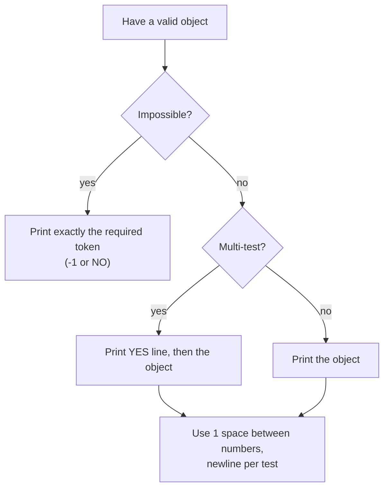

Checklist:
- Print the **exact** impossible token the statement asks for (`-1`, `NO`, `IMPOSSIBLE`).
- Separate numbers with single spaces; end each test case with a newline.
- For multi-test inputs, often a `YES`/`NO` line precedes the object.
- Watch 0-indexed vs 1-indexed output — many constructive problems want **1-indexed** values.

```python
def emit(result):
    if result is None:
        print(-1)
    else:
        print(" ".join(map(str, result)))
```

```cpp
#include <bits/stdc++.h>
using namespace std;

void emit(const vector<long long>& result, bool possible) {
    if (!possible) {
        cout << -1 << "\n";
        return;
    }
    for (size_t i = 0; i < result.size(); ++i) {
        cout << result[i] << (i + 1 < result.size() ? ' ' : '\n');
    }
}
```

---

## Complexity Summary

| Construction | Time | Space | Notes |
|--------------|------|-------|-------|
| Zig-zag permutation | $O(n)$ | $O(n)$ | one pass from both ends |
| Distinct row/col-sum matrix | $O(n^2)$ | $O(n^2)$ | fill every cell once |
| No-adjacent rearrangement (slot fill) | $O(n + k \log k)$ | $O(n)$ | $k$ = distinct values |
| No-adjacent rearrangement (heap) | $O(n \log k)$ | $O(n)$ | repeatedly pop top-2 frequencies |
| XOR / sum construction | $O(n)$ | $O(n)$ | usually a closed-form fill |

Most constructive algorithms run in **linear or near-linear** time — the cost is in the
*insight*, not the computation.

---

## Common Pitfalls

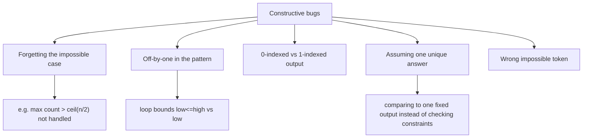

- **Forgetting impossible cases.** Always ask "for which inputs does no object exist?" *before*
  coding the happy path. This is the most common WA.
- **Off-by-one in patterns.** Zig-zag and pairing loops are easy to terminate one step early or
  late. Test $n = 1$ and $n = 2$ by hand.
- **Index base.** If the statement wants a permutation of $1..n$, do not print $0..n-1$.
- **Assuming a unique answer.** Do not compare your output to a friend's — both can be right.
  Verify against the *constraints*, not against a fixed string.
- **Wrong impossible token.** `-1`, `NO`, and `IMPOSSIBLE` are not interchangeable; print what
  the problem demands.

---

## Patterns

| Pattern | When to reach for it | Example problem |
|---------|----------------------|-----------------|
| Greedy placement | Most-constrained element must go first | No two adjacent equal |
| Parity / coloring | Two groups must alternate or differ | Even/odd slot fills, checkerboards |
| Pairing | Pair $i$ with $n+1-i$ to control differences | Zig-zag distinct-difference permutation |
| Incremental | Extend a valid prefix, prove by induction | Build sequence one element at a time |
| Symmetry | Solve half, mirror/rotate the rest | Matrix and grid constructions |
| Closed-form fill | Constraint reduces to arithmetic | XOR / sum constructions |

**Mental loop for any constructive problem:**

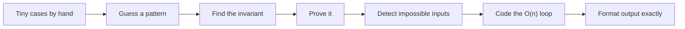
