# Ad-hoc / Observation Problems — Complete Guide (Beginner → Advanced)

> An **ad-hoc** problem is one with *no off-the-shelf algorithm* to reach for. There is no
> "this is clearly a graph problem" or "this is binary search". Instead, the whole solution
> hinges on a **key observation** — a small insight about the structure of the problem that
> collapses a scary search space into a one-line formula or a single linear pass. This guide
> builds a *toolbox of heuristics* for finding that observation quickly, proving it cheaply,
> and turning it into clean $O(1)$ or $O(n)$ code.

---

## Table of Contents
1. [What "Ad-hoc" Really Means](#1-what-ad-hoc-really-means)
2. [A Toolbox of Observation Heuristics](#2-a-toolbox-of-observation-heuristics)
3. [Try Small Cases](#3-try-small-cases)
4. [Invariants & Monovariants](#4-invariants--monovariants)
5. [Parity Arguments](#5-parity-arguments)
6. [Extremes & Sorting](#6-extremes--sorting)
7. [Symmetry & Working Backwards](#7-symmetry--working-backwards)
8. [Reformulating the Problem](#8-reformulating-the-problem)
9. [Testing a Conjecture Quickly](#9-testing-a-conjecture-quickly)
10. [From Observation to O(1)/O(n) Code](#10-from-observation-to-o1on-code)
11. [Worked Examples](#11-worked-examples)
12. [Complexity Summary](#complexity-summary)
13. [Common Pitfalls](#common-pitfalls)
14. [Patterns](#patterns)

---

## 1. What "Ad-hoc" Really Means

In most topics you *recognize* a pattern and apply a known technique. Ad-hoc problems are
different: the difficulty is **discovery**, not implementation. Once you spot the trick, the
code is usually trivial.

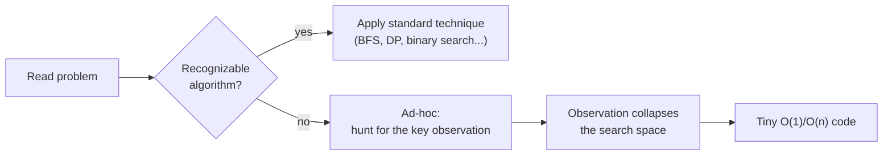

The emotional signature of an ad-hoc problem: the brute force is obvious but too slow, and
you feel there *must* be a shortcut. There is — and finding it is a *skill you can train*.

---

## 2. A Toolbox of Observation Heuristics

When stuck, walk through this mental checklist. Each branch is a lens that has cracked
thousands of problems.

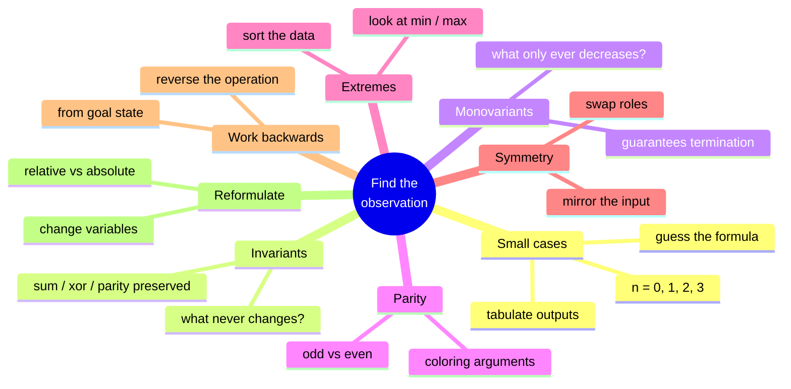

We will visit each lens in turn.

---

## 3. Try Small Cases

The single most productive habit: **compute the answer by hand for $n = 0, 1, 2, 3, 4$**, write
the results in a table, and *stare* at them. Most numeric ad-hoc answers are a simple closed
form hiding in the sequence.

Suppose a problem's answers for inputs $1,2,3,4,5$ come out as $0,1,3,6,10$. Lay them out:

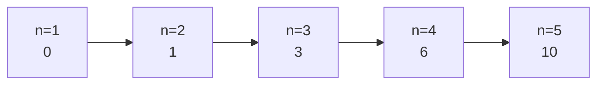

The differences are $1,2,3,4$ — so the answer is the sum $0+1+\cdots+(n-1)$, i.e.

$$
f(n) = \frac{n(n-1)}{2}.
$$

A tiny brute force confirms or refutes a guessed formula instantly:

```python
def brute(n):
    # whatever the slow definition is; here: count unordered pairs
    return sum(1 for i in range(n) for j in range(i + 1, n))

def guess(n):
    return n * (n - 1) // 2

print(all(brute(n) == guess(n) for n in range(0, 50)))  # True => conjecture holds
```

```cpp
#include <bits/stdc++.h>
using namespace std;

long long brute(long long n) {
    long long c = 0;
    for (long long i = 0; i < n; i++)
        for (long long j = i + 1; j < n; j++)
            c++;
    return c;
}

long long guess(long long n) {
    return n * (n - 1) / 2;
}

int main() {
    bool ok = true;
    for (long long n = 0; n < 50; n++)
        if (brute(n) != guess(n)) ok = false;
    cout << (ok ? "True" : "False") << '\n';   // True => conjecture holds
    return 0;
}
```

---

## 4. Invariants & Monovariants

An **invariant** is a quantity that *never changes* no matter which operation you apply. If
the goal state has a different invariant value than the start state, the goal is
**unreachable** — proof done, no search needed.

A **monovariant** is a quantity that changes *monotonically* (always up, or always down).
Monovariants prove that a process **terminates** and often bound the number of steps.

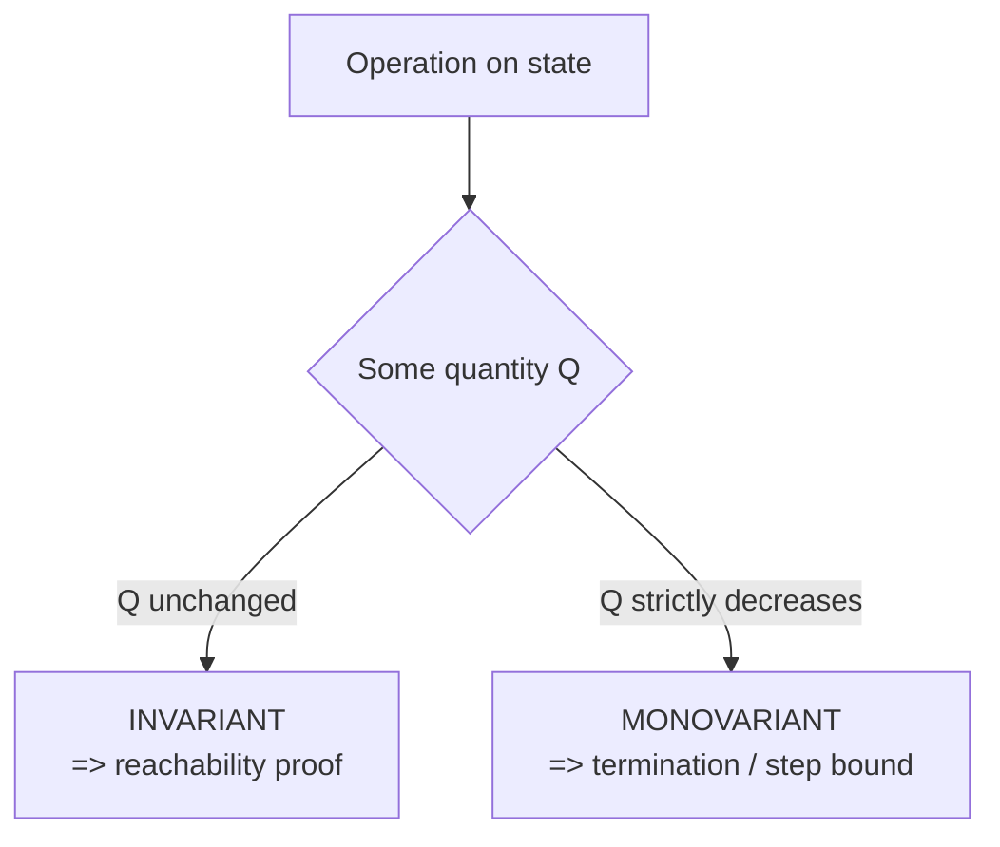

**Example invariant.** You have numbers on a board; repeatedly erase two and write their
sum. The *total sum* is invariant, so the last remaining number is always the original sum —
regardless of order. No simulation required.

```python
def last_number(nums):
    return sum(nums)   # the sum is invariant under "erase two, write their sum"
```

```cpp
#include <bits/stdc++.h>
using namespace std;

long long last_number(const vector<long long>& nums) {
    long long s = 0;
    for (long long x : nums) s += x;   // sum is invariant
    return s;
}
```

---

## 5. Parity Arguments

**Parity** (odd/even) is the most common invariant in disguise. Many operations flip or
preserve parity, and the *answer depends only on whether some count is odd or even*.

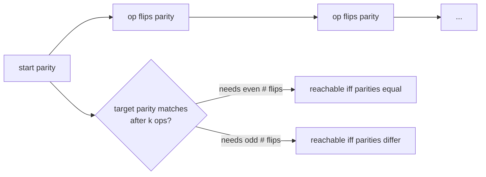

**Classic coloring.** A chessboard has equal black and white squares; a domino always covers
one of each. Remove two *same-colored* corners and the counts become unequal — so a full
tiling is **impossible**, proved by parity with zero computation.

```python
def domino_tiling_possible(black, white):
    # a tiling needs an equal number of black and white squares
    return black == white
```

```cpp
#include <bits/stdc++.h>
using namespace std;

bool domino_tiling_possible(long long black, long long white) {
    return black == white;   // each domino covers one black + one white
}
```

---

## 6. Extremes & Sorting

When order does not matter, **sorting** often reveals the structure, and the **minimum** or
**maximum** element frequently *is* the answer or controls it. Ask: *what does the largest
element force? what does the smallest allow?*

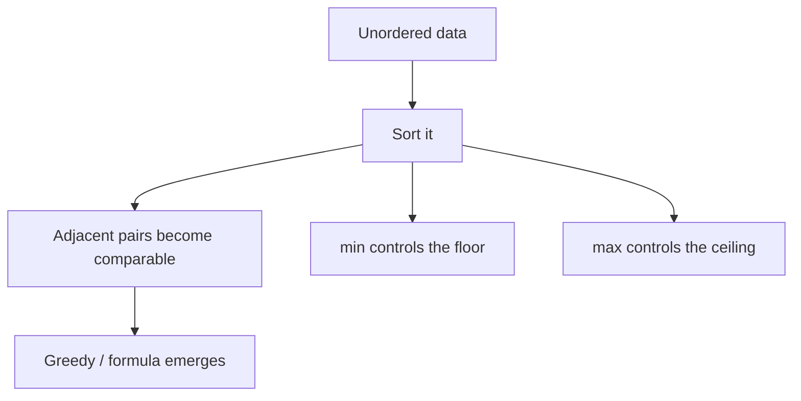

**Example.** To make all elements equal by *only increasing* smaller ones up to the maximum,
each element $a_i$ needs $\max - a_i$ increments, so the total is

$$
\sum_i (\max(a) - a_i) = n\cdot\max(a) - \sum_i a_i.
$$

```python
def increments_to_max(a):
    m = max(a)
    return n_times_max_minus_sum(a, m)

def n_times_max_minus_sum(a, m):
    return len(a) * m - sum(a)
```

```cpp
#include <bits/stdc++.h>
using namespace std;

long long n_times_max_minus_sum(const vector<long long>& a, long long m) {
    return (long long)a.size() * m - accumulate(a.begin(), a.end(), 0LL);
}

long long increments_to_max(const vector<long long>& a) {
    long long m = *max_element(a.begin(), a.end());
    return n_times_max_minus_sum(a, m);
}
```

---

## 7. Symmetry & Working Backwards

**Symmetry**: if swapping two roles (players, indices, colors) leaves the problem unchanged,
the answer must respect that symmetry — often halving the cases.

**Working backwards**: start from the *goal* and reverse each operation. A move that looks
hard to plan forwards is frequently *forced* in reverse.

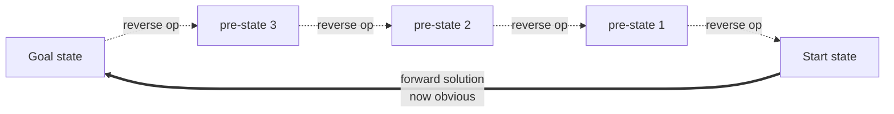

Reframing "make all elements equal by adding 1 to $n-1$ of them" as "subtract 1 from **one**
element" (its mirror image) is a working-backwards / symmetry trick that turns an unbounded
search into a sum — we use exactly this in the LeetCode 453 problem file.

---

## 8. Reformulating the Problem

Sometimes a **change of variables** makes the answer obvious. Switching from *absolute*
positions to *relative* differences, or from values to their *prefix sums*, can turn a 2-D
mess into a 1-D line.

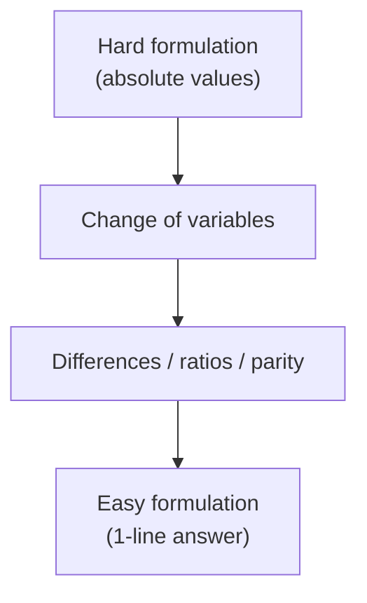

The "add 1 to $n-1$ elements" vs "subtract 1 from one element" swap is a reformulation: only
the *gaps* between elements matter, and increasing all-but-one shrinks every gap to the max
by exactly the same amount as decreasing the one.

---

## 9. Testing a Conjecture Quickly

Never trust an observation you have not tested. The fastest validation is a **brute-force vs
formula** harness over small inputs — if they agree on every small case, the formula is almost
certainly right (and disagreement instantly localizes the bug).

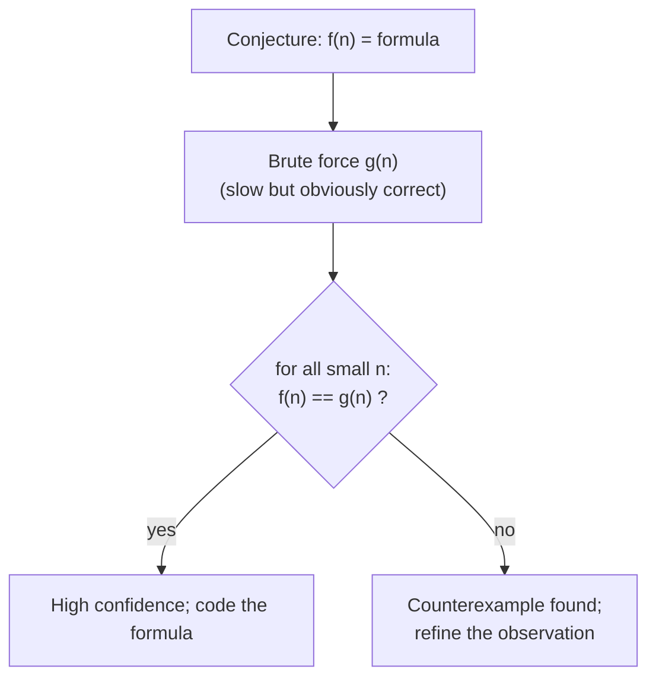

```python
def stress_test(formula, brute, lo=0, hi=200):
    for n in range(lo, hi):
        if formula(n) != brute(n):
            return ("FAIL", n, formula(n), brute(n))
    return ("OK",)

print(stress_test(lambda n: n * (n - 1) // 2,
                  lambda n: sum(range(n))))
```

```cpp
#include <bits/stdc++.h>
using namespace std;

string stress_test() {
    auto formula = [](long long n) { return n * (n - 1) / 2; };
    auto brute   = [](long long n) { long long s = 0; for (long long i = 0; i < n; i++) s += i; return s; };
    for (long long n = 0; n < 200; n++)
        if (formula(n) != brute(n))
            return "FAIL at n=" + to_string(n);
    return "OK";
}

int main() {
    cout << stress_test() << '\n';
    return 0;
}
```

---

## 10. From Observation to O(1)/O(n) Code

Once the observation is proven, implementation collapses:

- A **closed-form** observation → $O(1)$ arithmetic.
- A **single-pass** observation (e.g. "compare to the min/sum") → $O(n)$.
- A **sort-then-scan** observation → $O(n\log n)$, dominated by the sort.

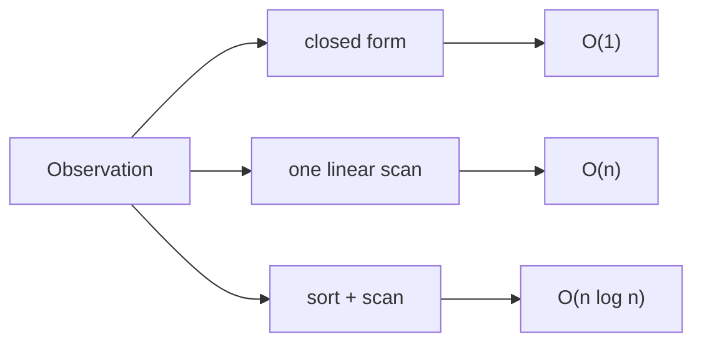

The discipline: **prove first, then code**. The code is the easy part.

---

## 11. Worked Examples

### 11.1 Sum-parity trick

*Can you split $\{1,2,\dots,n\}$ into two groups with equal sums?* The total is
$S = \tfrac{n(n+1)}{2}$. A split into equal halves needs $S$ even — a pure **parity** check, no
partition search.

$$
\text{splittable} \iff \frac{n(n+1)}{2} \equiv 0 \pmod 2.
$$

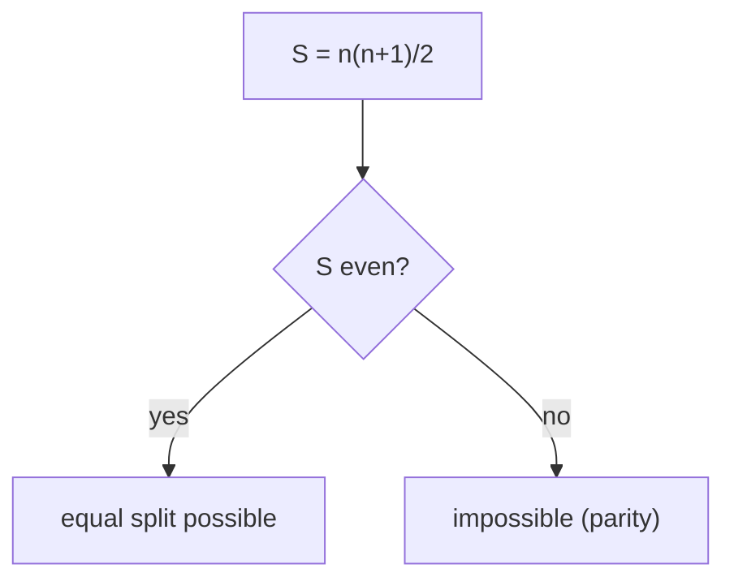

```python
def can_split_equal(n):
    total = n * (n + 1) // 2
    return total % 2 == 0
```

```cpp
#include <bits/stdc++.h>
using namespace std;

bool can_split_equal(long long n) {
    long long total = n * (n + 1) / 2;
    return total % 2 == 0;
}
```

### 11.2 Minimum operations via a formula

*Minimum unit increments to make every element equal to the maximum* — derived in §6 as
$n\cdot\max - \sum a$. One pass, no simulation.

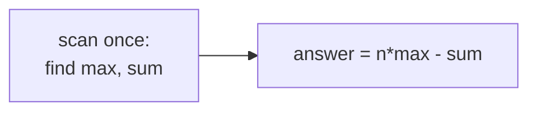

```python
def min_increments(a):
    return len(a) * max(a) - sum(a)
```

```cpp
#include <bits/stdc++.h>
using namespace std;

long long min_increments(const vector<long long>& a) {
    long long m = *max_element(a.begin(), a.end());
    long long s = accumulate(a.begin(), a.end(), 0LL);
    return (long long)a.size() * m - s;
}
```

### 11.3 A parity game in one line

Two players alternately remove $1$ stone from a single pile of $n$; the player who takes the
last stone wins. Whoever moves on an **odd** count wins — pure parity again.

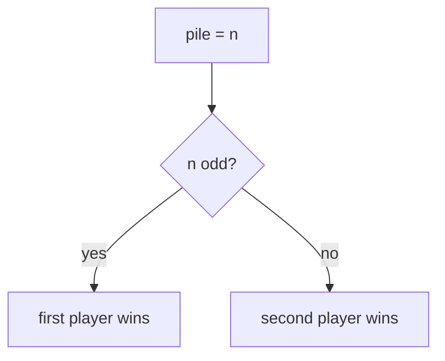

```python
def first_player_wins(n):
    return n % 2 == 1
```

```cpp
#include <bits/stdc++.h>
using namespace std;

bool first_player_wins(long long n) {
    return n % 2 == 1;
}
```

---

## Complexity Summary

| Observation type | Work after observation | Time | Space |
|------------------|------------------------|------|-------|
| Closed form (parity, sum) | arithmetic | $O(1)$ | $O(1)$ |
| Compare to min/max/sum | one linear scan | $O(n)$ | $O(1)$ |
| Sort then scan | sort dominates | $O(n\log n)$ | $O(1)$–$O(n)$ |
| Invariant reachability | check one quantity | $O(n)$ | $O(1)$ |
| Monovariant step bound | bound = initial value | depends | $O(1)$ |

The *finding* of the observation is the expensive (human) part; the resulting code is almost
always cheap.

---

## Common Pitfalls

- **Coding before proving.** A plausible-looking formula that fails on $n=0$ or $n=1$ wastes
  far more time than a 10-second stress test would have.
- **Ignoring edge cases.** Empty input, single element, all-equal, negatives, and overflow
  (use `long long`!) break many "obvious" formulas.
- **Confusing invariant with monovariant.** Invariants prove *impossibility*; monovariants
  prove *termination*. Mixing them up leads to wrong conclusions.
- **Forgetting parity is mod 2 of a sum.** Many parity arguments are really "is this total
  even?" — compute the total's parity directly instead of simulating.
- **Overfitting small cases.** Two or three data points can match many formulas; test up to
  $n \approx 50$–$200$ before trusting.

---

## Patterns

- **Tabulate → diff → guess.** Compute small answers, take differences, recognize the
  sequence, conjecture a closed form, stress-test it.
- **Hunt the invariant.** Ask "what never changes?" to settle reachability without search.
- **Hunt the monovariant.** Ask "what strictly decreases?" to prove termination and bound
  steps.
- **Parity first.** Before anything complex, check whether the answer is decided by an
  odd/even count or a coloring argument.
- **Sort and look at the ends.** The min and max often *are* the answer or its bounds.
- **Reframe by symmetry / reverse.** Swap roles or run the operation backwards to expose a
  forced, simple structure.
- **Prove, then write one line.** The observation does the work; the code merely records it.
