# Casework & Brute Force with Pruning — Complete Guide (Beginner → Advanced)

> **Brute force** means *try everything*: enumerate every candidate in the search space and
> check each one. It is the most honest algorithm — if the space is small enough, it is also
> the *best* one because it is simple and impossible to get subtly wrong.
> **Casework** is the discipline of splitting a problem into a handful of **disjoint,
> exhaustive** cases so that every possibility is covered exactly once.
> **Pruning** is what makes brute force *fast enough*: we cut away branches of the search the
> moment we can prove they cannot lead to a better (or any) answer.
>
> This guide teaches you to (1) **estimate** whether brute force fits in the time budget,
> (2) write clean **exhaustive search** templates, (3) do **systematic casework**, and
> (4) apply **pruning** to turn an exponential search into something that finishes.

---

## Table of Contents
1. [When Brute Force Is Enough (Estimating the Search Space)](#1-when-brute-force-is-enough-estimating-the-search-space)
2. [Exhaustive Search Templates](#2-exhaustive-search-templates)
   - [2a. Nested Loops](#2a-nested-loops)
   - [2b. Bitmask Over Subsets](#2b-bitmask-over-subsets)
   - [2c. Recursion / Backtracking](#2c-recursion--backtracking)
3. [Systematic Casework](#3-systematic-casework)
4. [Pruning Techniques](#4-pruning-techniques)
   - [4a. Early Termination](#4a-early-termination)
   - [4b. Bounding / Feasibility Checks](#4b-bounding--feasibility-checks)
   - [4c. Ordering Choices](#4c-ordering-choices)
   - [4d. Symmetry Breaking](#4d-symmetry-breaking)
   - [4e. Memoization](#4e-memoization)
5. [Worked Example: Subset-Sum with Pruning](#5-worked-example-subset-sum-with-pruning)
6. [Worked Example: A Casework Solution](#6-worked-example-a-casework-solution)
7. [Meet-in-the-Middle (A Pruning Idea)](#7-meet-in-the-middle-a-pruning-idea)
8. [Complexity Summary](#complexity-summary)
9. [Common Pitfalls](#common-pitfalls)
10. [Patterns](#patterns)

---

## 1. When Brute Force Is Enough (Estimating the Search Space)

Before writing a single line of code, answer one question: **how many candidates will I
examine, and how much work per candidate?** Multiply the two and compare against the
machine's budget.

A modern judge does roughly $10^8$ to $10^9$ *simple* operations per second. A safe planning
rule for a 1–2 second limit is:

$$
(\text{search-space size}) \times (\text{work per candidate}) \;\lesssim\; 10^8.
$$

Here is how common search-space sizes scale. Notice how quickly they explode.

| Shape of the search | Size | Largest $n$ feasible (≈ $10^8$) |
|---------------------|------|----------------------------------|
| Single loop | $n$ | $\sim 10^8$ |
| All pairs | $n^2$ | $\sim 10^4$ |
| All triples | $n^3$ | $\sim 460$ |
| All subsets | $2^n$ | $\sim 26$ |
| All subsets, $O(n)$ each | $n\cdot 2^n$ | $\sim 22$ |
| All permutations | $n!$ | $\sim 11$ |

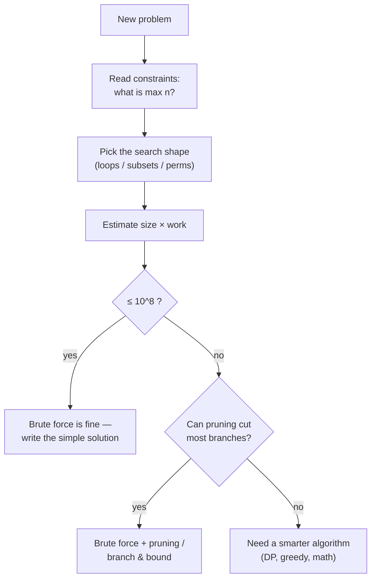

> **Key insight.** The constraints *are the hint*. If $n \le 20$, the setter is practically
> begging you to enumerate $2^n$ subsets. If $n \le 11$, permutations are on the table. If
> $n \le 10^5$, exponential is hopeless and you need something polynomial.

A quick estimator you can keep in your head:

```python
def feasible(space_size, work_per_candidate, budget=10**8):
    # True if a brute force is likely fast enough
    return space_size * work_per_candidate <= budget

print(feasible(2**20, 20))   # subsets of 20 items, O(20) each -> True
print(feasible(2**30, 1))    # 1e9 candidates -> False
```

```cpp
#include <bits/stdc++.h>
using namespace std;

bool feasible(long long space_size, long long work_per_candidate,
              long long budget = 100000000LL) {
    // True if a brute force is likely fast enough
    return space_size * work_per_candidate <= budget;
}

int main() {
    cout << boolalpha;
    cout << feasible(1LL << 20, 20) << "\n";  // -> true
    cout << feasible(1LL << 30, 1)  << "\n";  // -> false
    return 0;
}
```

---

## 2. Exhaustive Search Templates

There are only three shapes you really need. Memorize them.

### 2a. Nested Loops

Use when the candidate is a *fixed-length tuple* of indices — pairs, triples, grid cells.

```python
def has_pair_with_sum(arr, target):
    n = len(arr)
    for i in range(n):                  # O(n^2) over all unordered pairs
        for j in range(i + 1, n):
            if arr[i] + arr[j] == target:
                return True
    return False
```

```cpp
#include <bits/stdc++.h>
using namespace std;

bool has_pair_with_sum(const vector<long long>& arr, long long target) {
    int n = (int)arr.size();
    for (int i = 0; i < n; ++i)              // O(n^2) over all unordered pairs
        for (int j = i + 1; j < n; ++j)
            if (arr[i] + arr[j] == target)
                return true;
    return false;
}
```

### 2b. Bitmask Over Subsets

Every subset of an $n$-element set maps to an integer in $[0, 2^n)$. Bit $i$ set ⇔ element
$i$ chosen. This is the cleanest way to *iterate all subsets*.

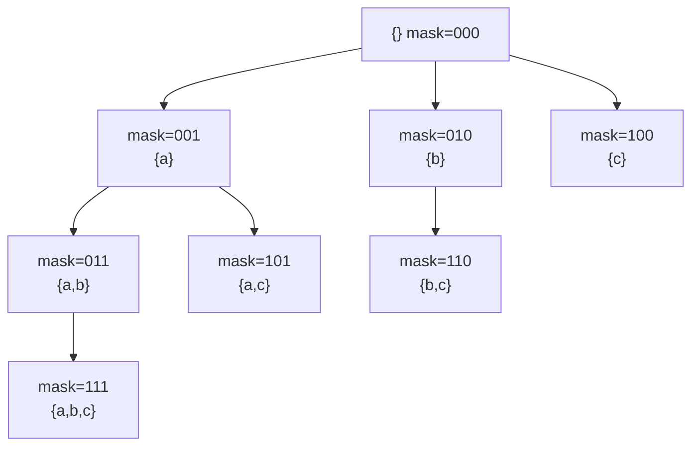

```python
def best_subset_sum_not_exceeding(weights, cap):
    n = len(weights)
    best = 0
    for mask in range(1 << n):          # all 2^n subsets
        total = 0
        for i in range(n):
            if mask & (1 << i):         # is element i in this subset?
                total += weights[i]
        if total <= cap:
            best = max(best, total)
    return best
```

```cpp
#include <bits/stdc++.h>
using namespace std;

long long best_subset_sum_not_exceeding(const vector<long long>& weights, long long cap) {
    int n = (int)weights.size();
    long long best = 0;
    for (int mask = 0; mask < (1 << n); ++mask) {   // all 2^n subsets
        long long total = 0;
        for (int i = 0; i < n; ++i)
            if (mask & (1 << i))                      // is element i in this subset?
                total += weights[i];
        if (total <= cap)
            best = max(best, total);
    }
    return best;
}
```

### 2c. Recursion / Backtracking

When choices are *sequential* and pruning matters, recursion beats bitmasks because you can
cut a whole subtree the instant a partial candidate becomes hopeless.

```python
def count_subsets_with_sum(nums, target):
    def dfs(i, remaining):
        if remaining == 0:
            return 1
        if i == len(nums) or remaining < 0:
            return 0
        # case A: take nums[i]   case B: skip nums[i]
        return dfs(i + 1, remaining - nums[i]) + dfs(i + 1, remaining)
    return dfs(0, target)
```

```cpp
#include <bits/stdc++.h>
using namespace std;

long long count_subsets_with_sum(const vector<long long>& nums, long long target) {
    function<long long(int, long long)> dfs = [&](int i, long long remaining) -> long long {
        if (remaining == 0) return 1;
        if (i == (int)nums.size() || remaining < 0) return 0;
        // case A: take nums[i]   case B: skip nums[i]
        return dfs(i + 1, remaining - nums[i]) + dfs(i + 1, remaining);
    };
    return dfs(0, target);
}
```

---

## 3. Systematic Casework

Casework means partitioning the universe of possibilities into cases that are

- **Exhaustive** — together they cover *everything* (nothing is missed), and
- **Mutually exclusive (disjoint)** — no possibility falls into two cases (nothing is
  double-counted).

If you remember one mantra, make it: **"cover everything, overlap nothing."**

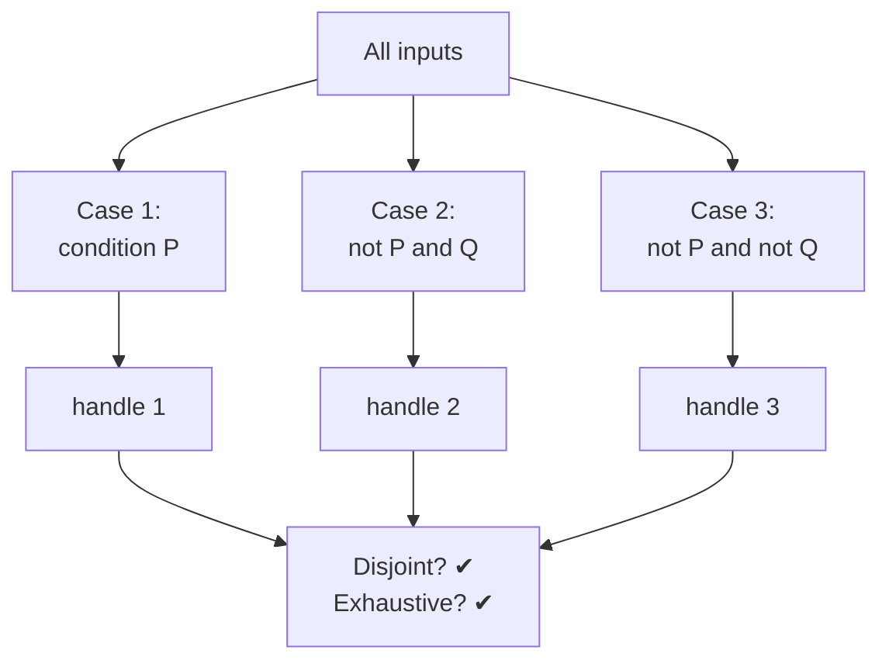

A reliable recipe for building disjoint cases is to **branch on one decision at a time**.
Each branch adds one more condition, and the two children of a node are "condition true" vs
"condition false" — automatically disjoint and exhaustive.

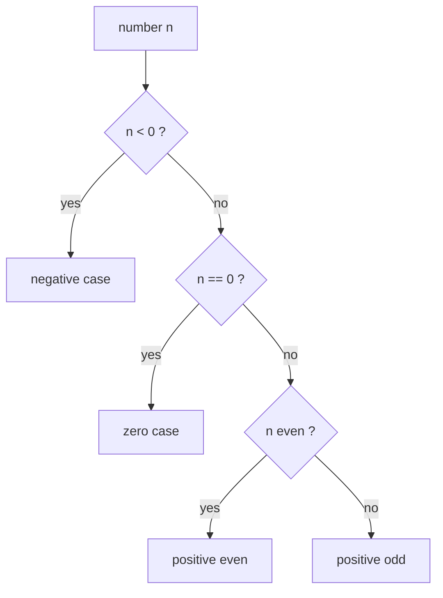

The sign/zero/even/odd split above is a textbook *exhaustive, disjoint* partition: every
integer lands in exactly one leaf.

```python
def classify(n):
    if n < 0:                 # case 1
        return "negative"
    elif n == 0:              # case 2 (disjoint from case 1: n >= 0 here)
        return "zero"
    elif n % 2 == 0:          # case 3 (n > 0 and even)
        return "positive even"
    else:                     # case 4 (n > 0 and odd) — the ONLY remaining option
        return "positive odd"
```

```cpp
#include <bits/stdc++.h>
using namespace std;

string classify(long long n) {
    if (n < 0)              return "negative";        // case 1
    else if (n == 0)        return "zero";            // case 2
    else if (n % 2 == 0)    return "positive even";   // case 3
    else                    return "positive odd";    // case 4 — only remaining option
}
```

> **Why `else` matters.** Ending a case ladder with a bare `else` guarantees
> *exhaustiveness*: whatever was not caught above is caught here. Ordering the conditions so
> each one assumes the negation of all previous ones guarantees *disjointness*.

---

## 4. Pruning Techniques

Pruning never changes *what* answers exist — it only avoids *exploring* branches that cannot
contain a (better) answer. A pruned search tree visits far fewer nodes than the full one.

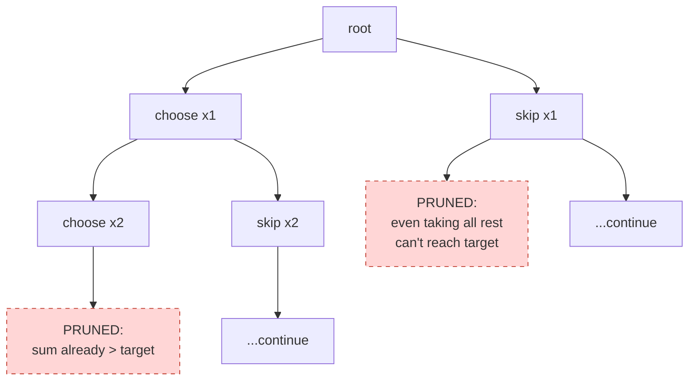

### 4a. Early Termination

Stop the moment the answer is decided. If you only need *existence*, return `True` on the
first hit instead of finishing the loop.

```python
def any_triple_zero_sum(nums):
    nums.sort()
    n = len(nums)
    for i in range(n):
        for j in range(i + 1, n):
            for k in range(j + 1, n):
                if nums[i] + nums[j] + nums[k] == 0:
                    return True          # EARLY EXIT: no need to look further
    return False
```

```cpp
#include <bits/stdc++.h>
using namespace std;

bool any_triple_zero_sum(vector<long long> nums) {
    sort(nums.begin(), nums.end());
    int n = (int)nums.size();
    for (int i = 0; i < n; ++i)
        for (int j = i + 1; j < n; ++j)
            for (int k = j + 1; k < n; ++k)
                if (nums[i] + nums[j] + nums[k] == 0)
                    return true;         // EARLY EXIT
    return false;
}
```

### 4b. Bounding / Feasibility Checks

Maintain cheap upper/lower bounds on what a branch *could* achieve. If the optimistic bound
is still worse than the best found, abandon the branch. This is the heart of
**branch-and-bound**.

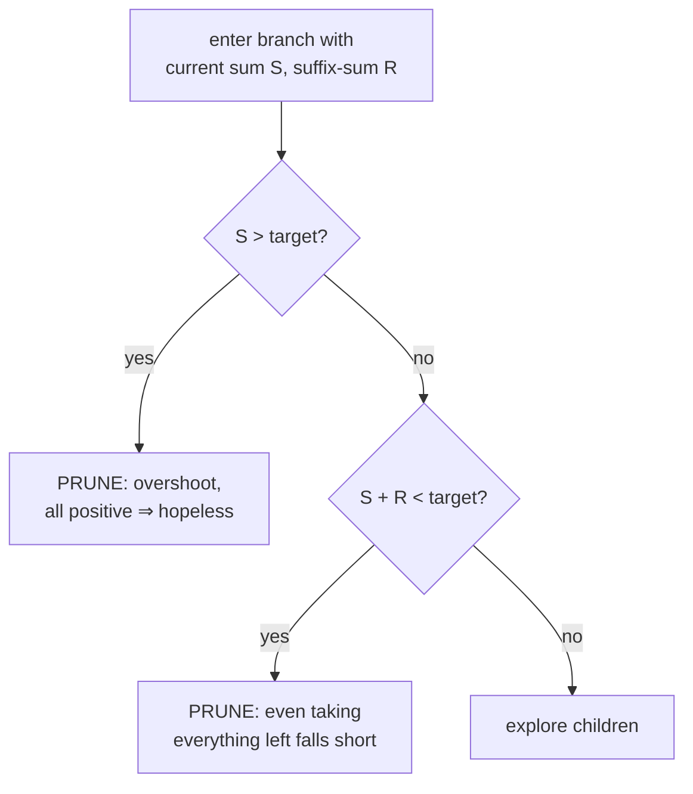

```python
def subset_sum_exists(nums, target):
    nums.sort(reverse=True)              # ordering helps the bound bite sooner
    suffix = [0] * (len(nums) + 1)
    for i in range(len(nums) - 1, -1, -1):
        suffix[i] = suffix[i + 1] + nums[i]

    def dfs(i, current):
        if current == target:
            return True
        if current > target:            # bound 1: overshoot (all positive)
            return False
        if current + suffix[i] < target: # bound 2: cannot reach even with all rest
            return False
        if i == len(nums):
            return False
        return dfs(i + 1, current + nums[i]) or dfs(i + 1, current)

    return dfs(0, 0)
```

```cpp
#include <bits/stdc++.h>
using namespace std;

bool subset_sum_exists(vector<long long> nums, long long target) {
    sort(nums.rbegin(), nums.rend());        // ordering helps the bound bite sooner
    int n = (int)nums.size();
    vector<long long> suffix(n + 1, 0);
    for (int i = n - 1; i >= 0; --i)
        suffix[i] = suffix[i + 1] + nums[i];

    function<bool(int, long long)> dfs = [&](int i, long long current) -> bool {
        if (current == target) return true;
        if (current > target) return false;              // bound 1: overshoot
        if (current + suffix[i] < target) return false;  // bound 2: can't reach
        if (i == n) return false;
        return dfs(i + 1, current + nums[i]) || dfs(i + 1, current);
    };
    return dfs(0, 0);
}
```

### 4c. Ordering Choices

The *order* you try choices in does not change correctness, but it changes how fast pruning
kicks in. Trying **large items first** in subset-sum makes the "overshoot" and "fail-by-bound"
prunes trigger near the top of the tree, cutting enormous subtrees early.

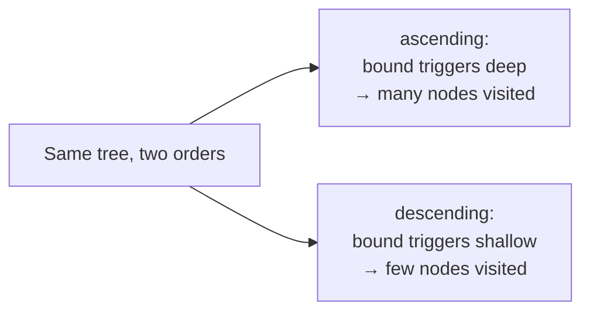

### 4d. Symmetry Breaking

If two partial candidates are equivalent (e.g. picking duplicates in a different order yields
the same multiset), explore only one representative. The standard trick: **sort, then forbid
re-picking an equal value at the same depth.**

```python
def unique_combinations_target(nums, target):
    nums.sort()
    res, path = [], []

    def dfs(start, remaining):
        if remaining == 0:
            res.append(path[:])
            return
        for i in range(start, len(nums)):
            if i > start and nums[i] == nums[i - 1]:
                continue                 # SYMMETRY BREAK: skip duplicate at same depth
            if nums[i] > remaining:
                break                    # ordering prune
            path.append(nums[i])
            dfs(i + 1, remaining - nums[i])
            path.pop()

    dfs(0, target)
    return res
```

```cpp
#include <bits/stdc++.h>
using namespace std;

vector<vector<long long>> unique_combinations_target(vector<long long> nums, long long target) {
    sort(nums.begin(), nums.end());
    vector<vector<long long>> res;
    vector<long long> path;

    function<void(int, long long)> dfs = [&](int start, long long remaining) {
        if (remaining == 0) {
            res.push_back(path);
            return;
        }
        for (int i = start; i < (int)nums.size(); ++i) {
            if (i > start && nums[i] == nums[i - 1])
                continue;                // SYMMETRY BREAK: skip duplicate at same depth
            if (nums[i] > remaining)
                break;                   // ordering prune
            path.push_back(nums[i]);
            dfs(i + 1, remaining - nums[i]);
            path.pop_back();
        }
    };
    dfs(0, target);
    return res;
}
```

### 4e. Memoization

If different branches reach the *same subproblem state*, remember the answer so you solve
each state once. This turns an exponential tree into a polynomial DAG — the bridge from brute
force to dynamic programming.

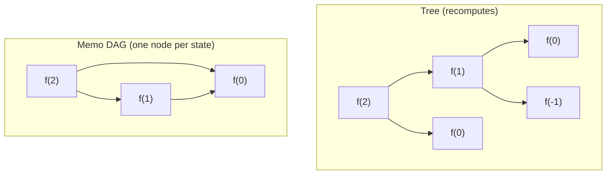

```python
def count_ways(nums, target):
    from functools import lru_cache
    @lru_cache(maxsize=None)
    def dfs(i, remaining):
        if remaining == 0:
            return 1
        if i == len(nums) or remaining < 0:
            return 0
        return dfs(i + 1, remaining - nums[i]) + dfs(i + 1, remaining)
    return dfs(0, target)
```

```cpp
#include <bits/stdc++.h>
using namespace std;

long long count_ways(const vector<long long>& nums, long long target) {
    int n = (int)nums.size();
    map<pair<int,long long>, long long> memo;     // state -> answer
    function<long long(int, long long)> dfs = [&](int i, long long remaining) -> long long {
        if (remaining == 0) return 1;
        if (i == n || remaining < 0) return 0;
        auto key = make_pair(i, remaining);
        auto it = memo.find(key);
        if (it != memo.end()) return it->second;
        long long ans = dfs(i + 1, remaining - nums[i]) + dfs(i + 1, remaining);
        memo[key] = ans;
        return ans;
    };
    return dfs(0, target);
}
```

---

## 5. Worked Example: Subset-Sum with Pruning

**Problem.** Given positive integers and a target `S`, decide whether some subset sums to
exactly `S`. Naively there are $2^n$ subsets, but with **branch-and-bound** pruning the
search usually visits a tiny fraction of them.

We combine three prunes from §4:
1. **Overshoot** — current sum already exceeds `S` (all numbers positive).
2. **Suffix bound** — current sum plus *everything remaining* still falls short of `S`.
3. **Ordering** — sort descending so both bounds fire near the root.

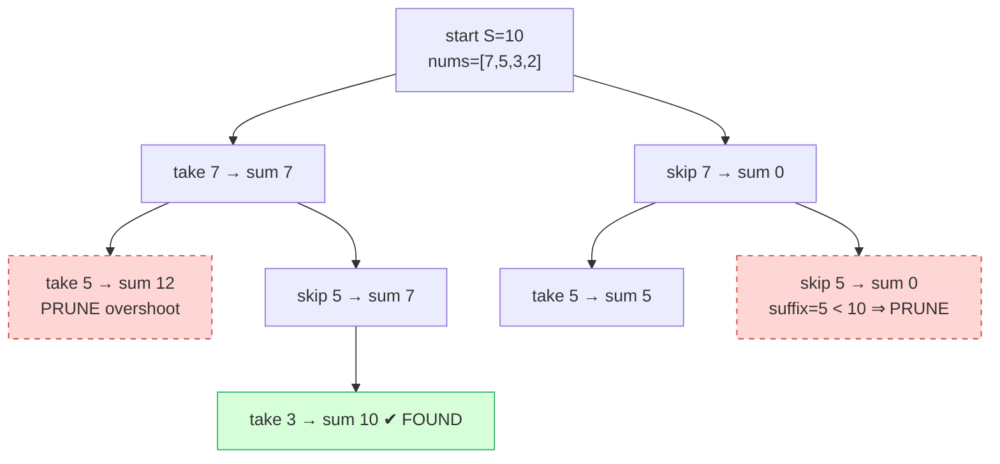

```python
def subset_sum(nums, S):
    nums.sort(reverse=True)
    n = len(nums)
    suffix = [0] * (n + 1)
    for i in range(n - 1, -1, -1):
        suffix[i] = suffix[i + 1] + nums[i]

    def dfs(i, cur):
        if cur == S:
            return True
        if cur > S:                       # prune 1: overshoot
            return False
        if i == n:
            return False
        if cur + suffix[i] < S:           # prune 2: suffix bound
            return False
        return dfs(i + 1, cur + nums[i]) or dfs(i + 1, cur)

    return dfs(0, 0)

print(subset_sum([7, 5, 3, 2], 10))      # True (7+3 or 5+3+2)
```

```cpp
#include <bits/stdc++.h>
using namespace std;

bool subset_sum(vector<long long> nums, long long S) {
    sort(nums.rbegin(), nums.rend());
    int n = (int)nums.size();
    vector<long long> suffix(n + 1, 0);
    for (int i = n - 1; i >= 0; --i)
        suffix[i] = suffix[i + 1] + nums[i];

    function<bool(int, long long)> dfs = [&](int i, long long cur) -> bool {
        if (cur == S) return true;
        if (cur > S) return false;                // prune 1: overshoot
        if (i == n) return false;
        if (cur + suffix[i] < S) return false;    // prune 2: suffix bound
        return dfs(i + 1, cur + nums[i]) || dfs(i + 1, cur);
    };
    return dfs(0, 0);
}

int main() {
    cout << boolalpha << subset_sum({7, 5, 3, 2}, 10) << "\n";  // true
    return 0;
}
```

---

## 6. Worked Example: A Casework Solution

**Problem.** Given the lengths of three sticks `a, b, c`, classify the triangle they form, or
report that they cannot form a triangle at all. This is a pure *casework* problem — we split
the universe of inputs into disjoint, exhaustive buckets.

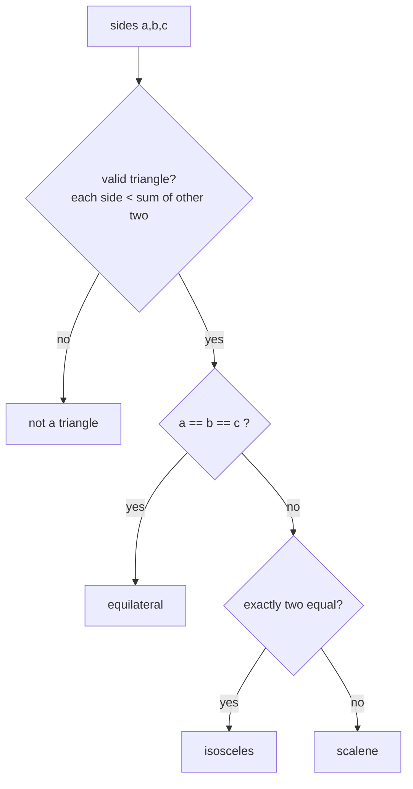

```python
def classify_triangle(a, b, c):
    sides = sorted((a, b, c))
    # CASE 0: degenerate — largest side must be < sum of the other two
    if sides[2] >= sides[0] + sides[1]:
        return "not a triangle"
    # CASE 1: all equal
    if a == b == c:
        return "equilateral"
    # CASE 2: exactly two equal (a==b, b==c, or a==c)
    if a == b or b == c or a == c:
        return "isosceles"
    # CASE 3: all different — the only remaining possibility
    return "scalene"
```

```cpp
#include <bits/stdc++.h>
using namespace std;

string classify_triangle(long long a, long long b, long long c) {
    long long s[3] = {a, b, c};
    sort(s, s + 3);
    // CASE 0: degenerate — largest side must be < sum of the other two
    if (s[2] >= s[0] + s[1])
        return "not a triangle";
    // CASE 1: all equal
    if (a == b && b == c)
        return "equilateral";
    // CASE 2: exactly two equal
    if (a == b || b == c || a == c)
        return "isosceles";
    // CASE 3: all different — only remaining possibility
    return "scalene";
}
```

Note how each case *assumes the negation of the ones above it*: by the time we test for
"isosceles" we already know it is a valid, non-equilateral triangle. That is what keeps the
cases disjoint.

---

## 7. Meet-in-the-Middle (A Pruning Idea)

When $2^n$ is too big but $2^{n/2}$ is fine, **split the set in half**. Enumerate all
$2^{n/2}$ subset-sums of each half, sort one half, and for each sum in the other half binary
search for a complement. This trades an intractable $2^{40}$ for a very tractable
$2^{20}\log(2^{20})$.

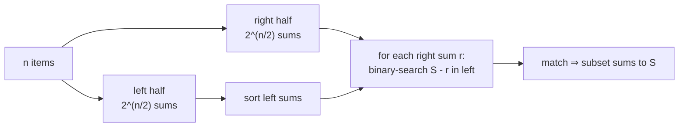

Think of it as pruning by *precomputation*: instead of exploring the full $2^n$ tree, we pay
$2^{n/2}$ to build a lookup table that answers half the search instantly. The full algorithm
appears in advanced guides; here we only flag *when* to reach for it — roughly $30 \le n \le 45$.

$$
2^n \;\longrightarrow\; O\!\left(2^{n/2} \cdot \tfrac{n}{2}\right).
$$

---

## Complexity Summary

| Technique | Time | Space | Notes |
|-----------|------|-------|-------|
| Nested loops (pairs) | $O(n^2)$ | $O(1)$ | feasible for $n \le 10^4$ |
| Bitmask over subsets | $O(2^n \cdot n)$ | $O(1)$ | feasible for $n \le 22$ |
| Recursion (no prune) | $O(2^n)$ | $O(n)$ stack | worst case full tree |
| Branch-and-bound | $O(2^n)$ worst, far less typical | $O(n)$ | pruning cuts most branches |
| Casework | $O(1)$–$O(n)$ per query | $O(1)$ | constant number of branches |
| Memoized search | $O(\text{states} \cdot \text{transitions})$ | $O(\text{states})$ | this *is* DP |
| Meet-in-the-middle | $O(2^{n/2} \cdot n)$ | $O(2^{n/2})$ | for $n \le 45$ |

---

## Common Pitfalls

- **Overlapping cases (double counting).** Two branches both match the same input, so you
  count or handle it twice. Fix: make each case assume the negation of all previous ones.
- **Missing cases (incomplete coverage).** A possibility falls through every branch and is
  silently ignored. Fix: end with a bare `else`/default and test the boundaries.
- **No pruning → TLE.** A correct brute force that explores the full $2^n$ tree times out.
  Add overshoot/bound checks and order choices so prunes fire early.
- **Pruning that changes the answer.** A prune must be *provably safe* — it may only remove
  branches that *cannot* contain a (better) solution. With negative numbers, the "overshoot"
  prune is invalid because a later negative could bring the sum back down.
- **Estimating wrong.** Forgetting the *work per candidate*. $2^{20}$ subsets is fine, but
  $2^{20}$ subsets each needing an $O(n)$ scan may not be.
- **Recursion depth / stack overflow.** Deep recursion on large $n$ can blow the stack;
  convert to an explicit stack or raise the recursion limit when needed.

---

## Patterns

- **"Constraints are tiny ($n \le 20$)" → enumerate subsets** with a bitmask or recursion.
- **"Constraints are tiny ($n \le 11$)" → enumerate permutations.**
- **"Find / count / decide over all choices, but most are hopeless" → branch-and-bound:**
  add an optimistic bound and prune.
- **"Sort first" unlocks two prunes at once:** the ordering prune (`break` when a choice
  exceeds the remaining budget) and the symmetry-breaking prune (skip equal values at the
  same depth).
- **"Classify / split into scenarios" → casework:** branch one decision at a time, finish
  with `else`, verify *cover everything, overlap nothing*.
- **"$2^n$ too big but $2^{n/2}$ fine ($30 \le n \le 45$)" → meet-in-the-middle.**
- **"Same subproblem reached many ways" → memoize**, turning the search into DP.
