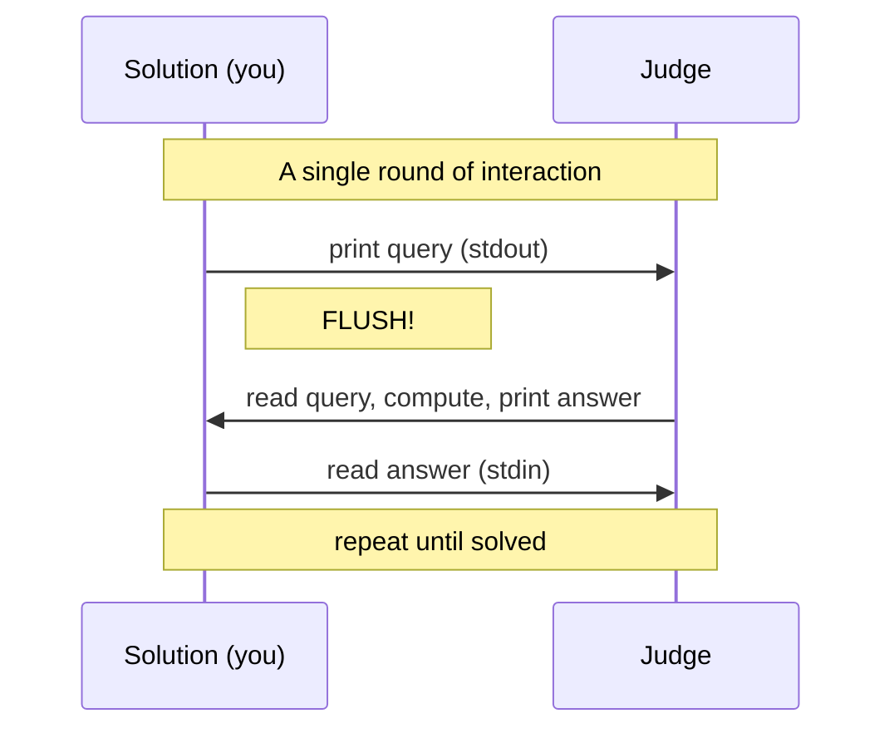
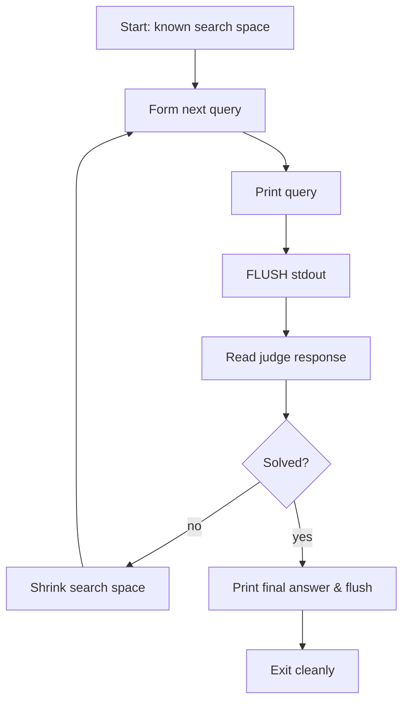
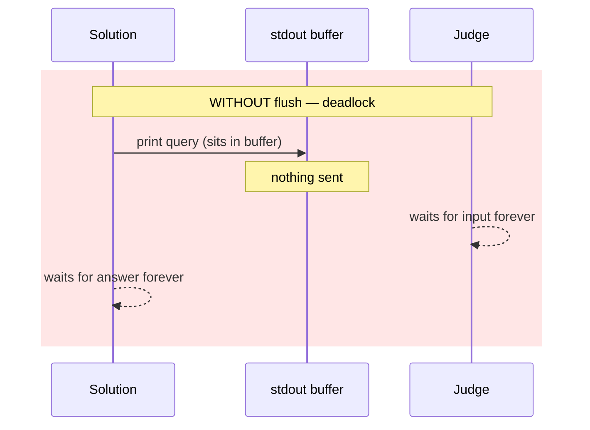
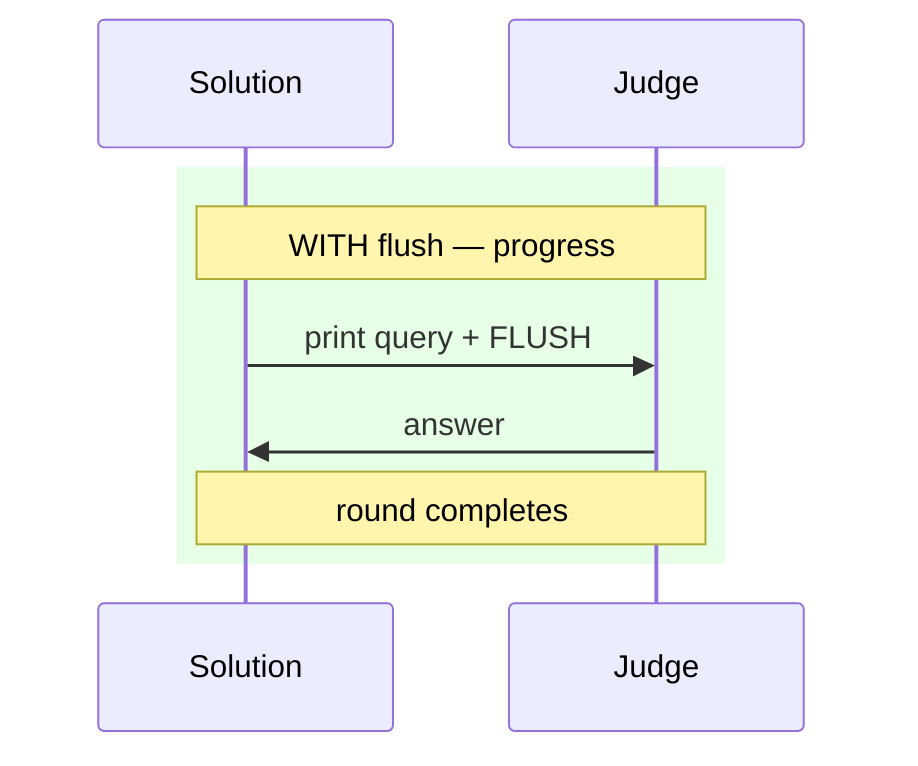
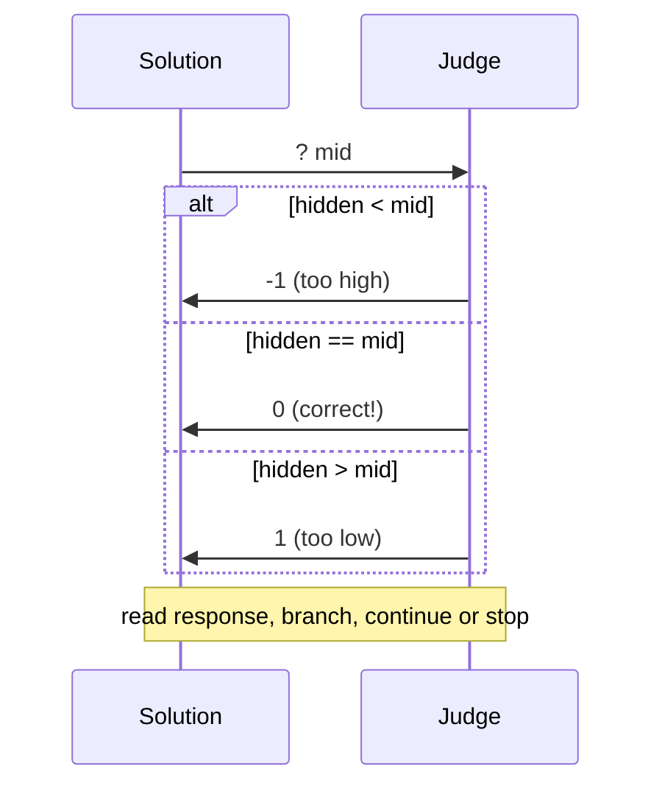
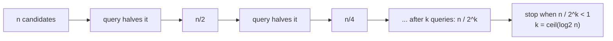
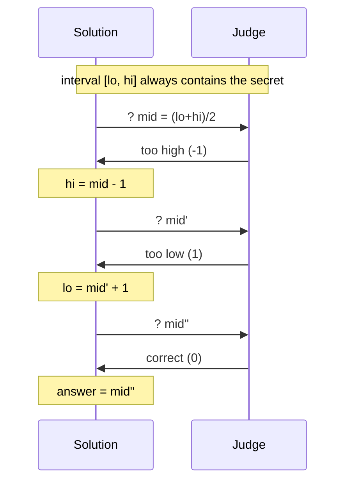
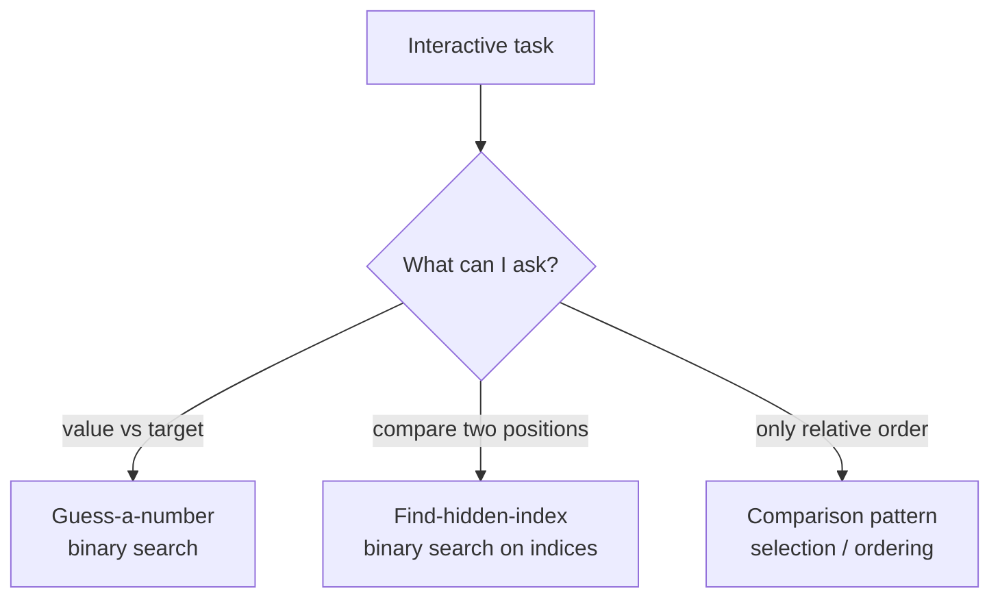
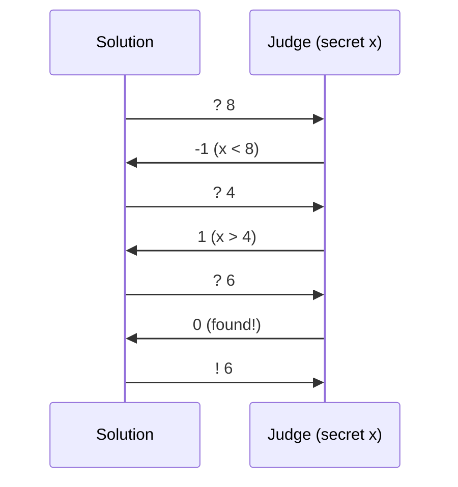
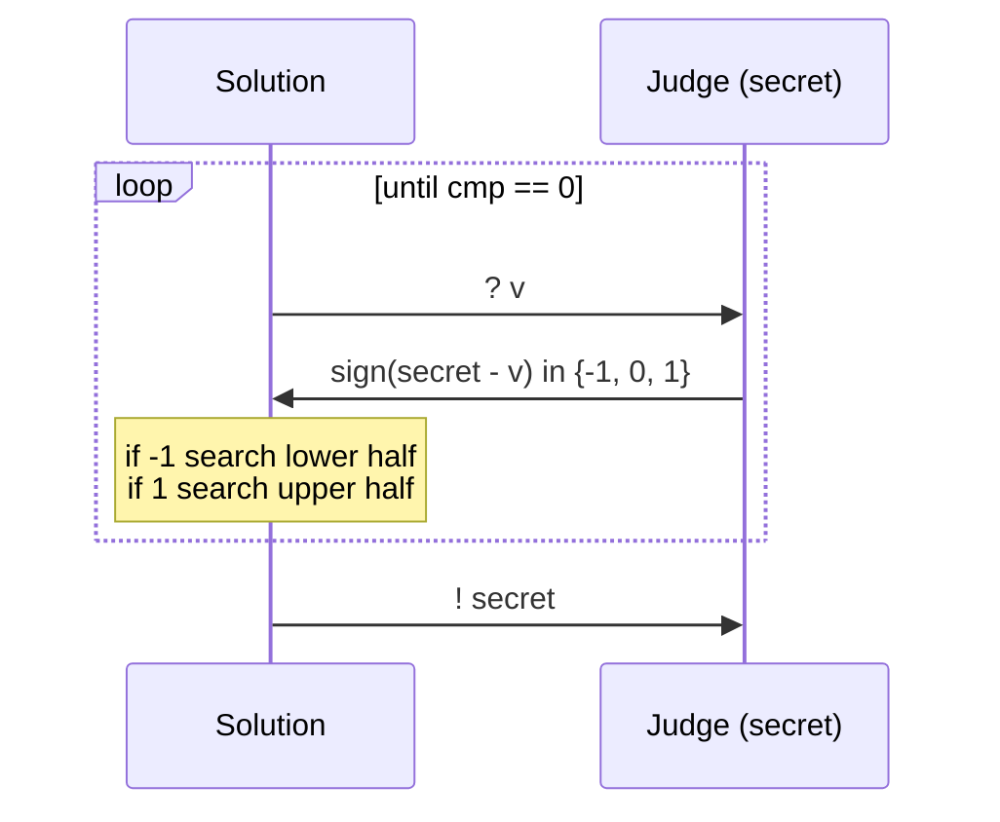

# Interactive Problems — Complete Guide (Beginner → Advanced)

> In a **normal** problem you read *all* the input, compute, and print *all* the output.
> In an **interactive** problem you have a *conversation*: you **print a query**, the
> **judge reads it and answers**, you **read the answer**, and you repeat — usually within
> a strict **query budget**. The judge is a live program on the other side of the pipe, not
> a static text file. Getting the protocol *and the flushing* right matters as much as the
> algorithm.

---

## Table of Contents
1. [The Interaction Protocol](#1-the-interaction-protocol)
2. [Why You MUST Flush After Every Output](#2-why-you-must-flush-after-every-output)
3. [Reading Responses & Detecting the End / Verdict](#3-reading-responses--detecting-the-end--verdict)
4. [Query-Budget Reasoning](#4-query-budget-reasoning)
5. [Adaptive Judges](#5-adaptive-judges)
6. [Binary Search: The Canonical Interactive Tool](#6-binary-search-the-canonical-interactive-tool)
7. [Common Patterns](#7-common-patterns)
8. [Worked Client: Guess-the-Number](#8-worked-client-guess-the-number)
9. [Worked Client: Find Hidden Value via Comparisons](#9-worked-client-find-hidden-value-via-comparisons)
10. [Complexity Summary](#complexity-summary)
11. [Common Pitfalls](#common-pitfalls)
12. [Patterns](#patterns)

---

## 1. The Interaction Protocol

Think of two programs connected by two pipes. Your **solution** writes a query to its
standard output; that output is the **judge's** standard input. The judge writes an answer
to *its* standard output; that is *your* standard input. The cycle repeats until you submit
the final answer or the judge signals completion.



The key mental shift versus a batch problem: **you cannot read everything up front**,
because the judge has not *said* everything yet. The next line of input only exists *after*
you ask for it. So the structure is always a loop of *ask → flush → read*.



---

## 2. Why You MUST Flush After Every Output

Standard output is normally **buffered**: when you `print`, the text sits in an in-memory
buffer and is only physically sent when the buffer fills, a newline triggers a line-flush
(only for terminals), or the program ends. In an interactive problem the program does **not**
end between queries — so your query may *never leave the buffer*. The judge waits forever for
input that is stuck in your buffer, while you wait forever for the judge's reply. That is a
**deadlock**, and the verdict is usually **TLE** (Time Limit Exceeded) or *Idleness Limit
Exceeded*.





The fix is one line per query. In Python use `flush=True` (or `sys.stdout.flush()`); in C++
use `endl` (which flushes) or call `cout.flush()` / `fflush(stdout)` explicitly.

```python
import sys

def ask(lo, hi):
    mid = (lo + hi) // 2
    print(f"? {mid}", flush=True)   # <-- flush every single query
    return int(sys.stdin.readline())
```

```cpp
#include <bits/stdc++.h>
using namespace std;

long long ask(long long lo, long long hi) {
    long long mid = (lo + hi) / 2;
    cout << "? " << mid << endl;     // endl flushes; or cout.flush()/fflush(stdout)
    long long resp;
    cin >> resp;
    return resp;
}
```

---

## 3. Reading Responses & Detecting the End / Verdict

The judge's reply tells you two things: the **answer to this query** and, sometimes,
**whether the interaction should stop**. Common conventions:

- A comparison oracle returns one of three states: lower / equal / higher (e.g. `-1`, `0`, `1`).
- Some judges send a sentinel such as `-1` or the string `"Wrong"` the moment you make an
  illegal move or exceed the budget. When you read that, you must **exit immediately** — any
  further query will hang or be penalized.
- Many judges expect a **final line** in a different format (e.g. `! x`) to declare the answer.



Always read the response **before** deciding the next move, and treat an error sentinel as an
unconditional `exit`:

```python
import sys

resp = int(sys.stdin.readline())
if resp == -1:          # judge signalled an error / out-of-budget
    sys.exit(0)         # stop immediately; do NOT query again
```

```cpp
#include <bits/stdc++.h>
using namespace std;

int main() {
    long long resp;
    cin >> resp;
    if (resp == -1) {       // judge signalled an error / out-of-budget
        return 0;           // stop immediately; do NOT query again
    }
    return 0;
}
```

---

## 4. Query-Budget Reasoning

Most interactive tasks cap the number of queries. The art is proving your strategy fits the
budget. The archetypal bound comes from **binary search**: to pin down one value among $n$
candidates you need

$$
\left\lceil \log_2 n \right\rceil
$$

queries, because each yes/no (or three-way) answer at best **halves** the set of remaining
possibilities. With $n = 10^9$, that is only $\lceil \log_2 10^9 \rceil = 30$ queries — a
budget that would be hopeless to brute force.

More generally, if each query has $b$ distinguishable outcomes, the information-theoretic
lower bound to separate $n$ possibilities is

$$
\left\lceil \log_b n \right\rceil .
$$



---

## 5. Adaptive Judges

A naive judge fixes the hidden answer *before* the game starts. An **adaptive** judge does
not commit: it only guarantees its replies stay **consistent** with *some* answer compatible
with everything it has said so far. This means you cannot exploit a "fixed secret" — but it
also cannot cheat, because if its replies ever became contradictory, a valid answer would
still have to exist. For a correct binary search the difference is invisible: you always
shrink to the interval the judge's answers force, and any consistent adversary must eventually
be cornered to a single value.

```mermaid
sequenceDiagram
    participant S as Solution
    participant J as Adaptive Judge
    Note over J: keeps a SET of still-possible answers
    S->>J: ? mid
    J->>J: pick reply that keeps the set non-empty<br/>and as large as allowed
    J->>S: -1 / 0 / 1
    Note over S,J: set shrinks; must reach size 1
```

---

## 6. Binary Search: The Canonical Interactive Tool

Whenever the search space is **monotone** — "everything below the answer says one thing,
everything above says another" — binary search is optimal and trivially fits the
$\lceil \log_2 n \rceil$ budget. Maintain an inclusive interval $[\,lo, hi\,]$ that always
contains the answer; each query at $mid$ discards half.



---

## 7. Common Patterns

The same three skeletons cover most beginner interactive tasks:

- **Guess a number** — hidden $x \in [1,n]$, oracle says higher/lower/equal. Pure binary search.
- **Find a hidden index** — hidden position in an array; ask comparison queries `cmp(i, j)`
  and binary-search on the structure (e.g. find a peak, or the index of a target).
- **Ask comparisons** — you can only compare two candidates, not read values; build the answer
  from the comparison outcomes (selection, min/max, ordering).



---

## 8. Worked Client: Guess-the-Number

The judge hides $x \in [1, n]$. We ask `? g`; it replies `-1` if $x < g$, `1` if $x > g$,
`0` if $x = g$. Binary search converges in $\lceil \log_2 n \rceil$ queries.



```python
import sys

def guess_number(n):
    lo, hi = 1, n
    while lo <= hi:
        mid = (lo + hi) // 2
        print(f"? {mid}", flush=True)        # FLUSH every query
        resp = int(sys.stdin.readline())
        if resp == 0:                        # correct
            print(f"! {mid}", flush=True)
            return mid
        elif resp == 1:                      # x > mid -> go right
            lo = mid + 1
        else:                                # x < mid -> go left
            hi = mid - 1
```

```cpp
#include <bits/stdc++.h>
using namespace std;

long long guess_number(long long n) {
    long long lo = 1, hi = n;
    while (lo <= hi) {
        long long mid = lo + (hi - lo) / 2;
        cout << "? " << mid << endl;         // endl FLUSHES every query
        long long resp;
        cin >> resp;
        if (resp == 0) {                     // correct
            cout << "! " << mid << endl;
            return mid;
        } else if (resp == 1) {              // x > mid -> go right
            lo = mid + 1;
        } else {                             // x < mid -> go left
            hi = mid - 1;
        }
    }
    return -1;
}
```

---

## 9. Worked Client: Find Hidden Value via Comparisons

Now suppose you cannot read the secret directly; you may only ask `? v` and learn whether the
secret is *less than*, *equal to*, or *greater than* `v`. That is still a monotone oracle, so
binary search applies unchanged — the only difference is framing the answer as a comparison
result `cmp(v) = sign(secret - v)`.



```python
import sys

def find_via_comparisons(lo, hi):
    while lo <= hi:
        mid = (lo + hi) // 2
        print(f"? {mid}", flush=True)        # ask: how does secret compare to mid?
        sign = int(sys.stdin.readline())     # -1, 0, or 1
        if sign == 0:
            print(f"! {mid}", flush=True)
            return mid
        elif sign > 0:                       # secret > mid
            lo = mid + 1
        else:                                # secret < mid
            hi = mid - 1
```

```cpp
#include <bits/stdc++.h>
using namespace std;

long long find_via_comparisons(long long lo, long long hi) {
    while (lo <= hi) {
        long long mid = lo + (hi - lo) / 2;
        cout << "? " << mid << endl;         // ask: how does secret compare to mid?
        long long sign;
        cin >> sign;                         // -1, 0, or 1
        if (sign == 0) {
            cout << "! " << mid << endl;
            return mid;
        } else if (sign > 0) {               // secret > mid
            lo = mid + 1;
        } else {                             // secret < mid
            hi = mid - 1;
        }
    }
    return -1;
}
```

---

## Complexity Summary

| Task | Queries (worst case) | Why |
|------|----------------------|-----|
| Guess number in $[1,n]$ | $\lceil \log_2 n \rceil$ | each reply halves the interval |
| Find hidden value via comparisons | $\lceil \log_2 n \rceil$ | monotone three-way oracle |
| Find hidden index among $n$ | $\lceil \log_2 n \rceil$ | binary search on positions |
| Separate $n$ outcomes, $b$-way query | $\lceil \log_b n \rceil$ | information-theoretic bound |

Each query is $O(1)$ work on your side, so total time is $O(\log n)$ plus the cost of I/O.

---

## Common Pitfalls

- **Not flushing.** The single most common cause of a "correct" interactive solution timing
  out. Flush after *every* query (`flush=True`, `endl`, `cout.flush()`, or `fflush(stdout)`).
- **Exceeding the query budget.** Always confirm your loop makes $\le \lceil \log_2 n \rceil$
  queries; an extra query per round (e.g. a redundant probe) can blow a tight budget.
- **Off-by-one in the bounds.** Decide once whether your interval is inclusive $[lo, hi]$ or
  half-open, and keep `lo = mid + 1` / `hi = mid - 1` consistent with the `lo <= hi` condition,
  or you will skip the answer or loop forever.
- **Ignoring the error sentinel.** If the judge sends `-1` (illegal move / budget exceeded),
  exit *immediately*; querying again deadlocks.
- **Reading before printing.** You must print *and flush* the query first; the response does
  not exist until the judge has seen the query.

---

## Patterns

- **Ask → flush → read → shrink** is the universal loop; never break the order.
- **Monotone oracle ⇒ binary search**, costing $\lceil \log_2 n \rceil$ queries.
- **Three-way replies** (`-1/0/1`) let you stop early on equality.
- **Treat sentinels as `exit`** to avoid post-error deadlock.
- **Prove the budget** with $\lceil \log_b n \rceil$ before coding the loop.
