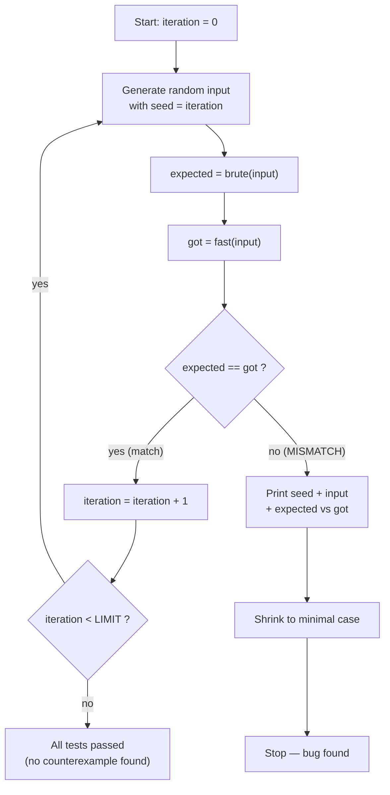
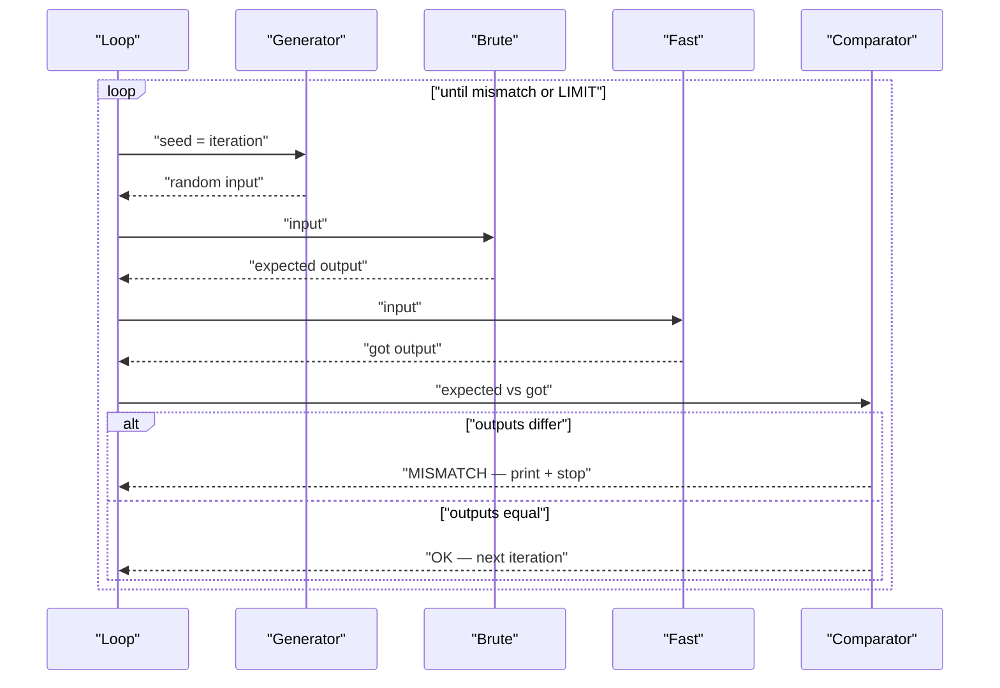
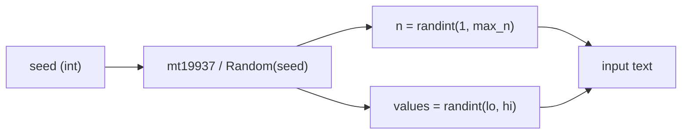
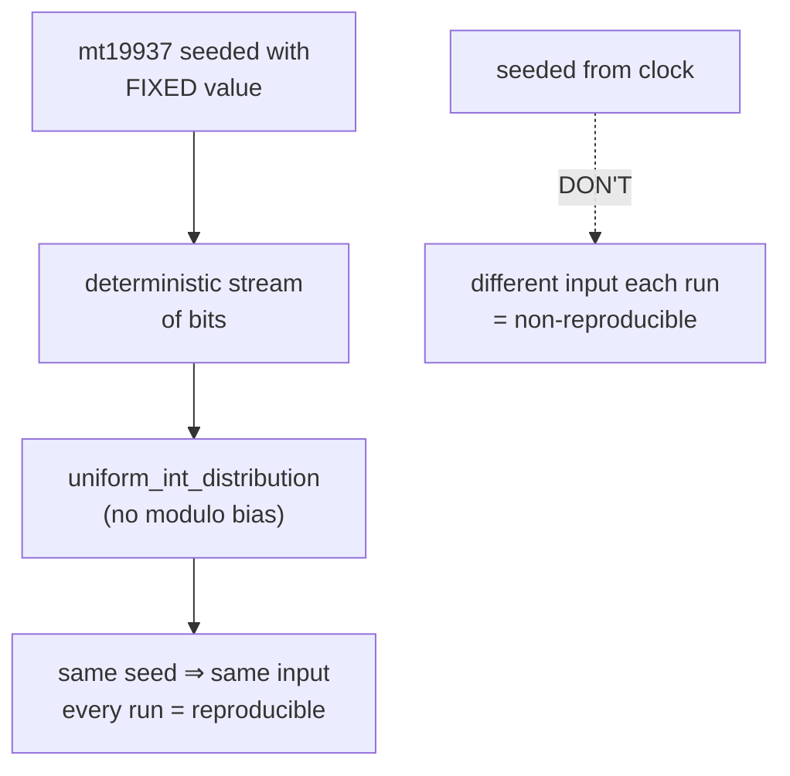
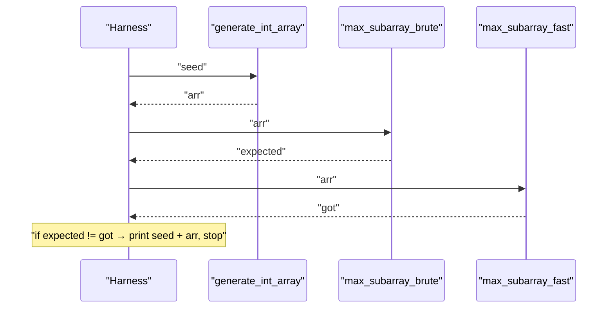
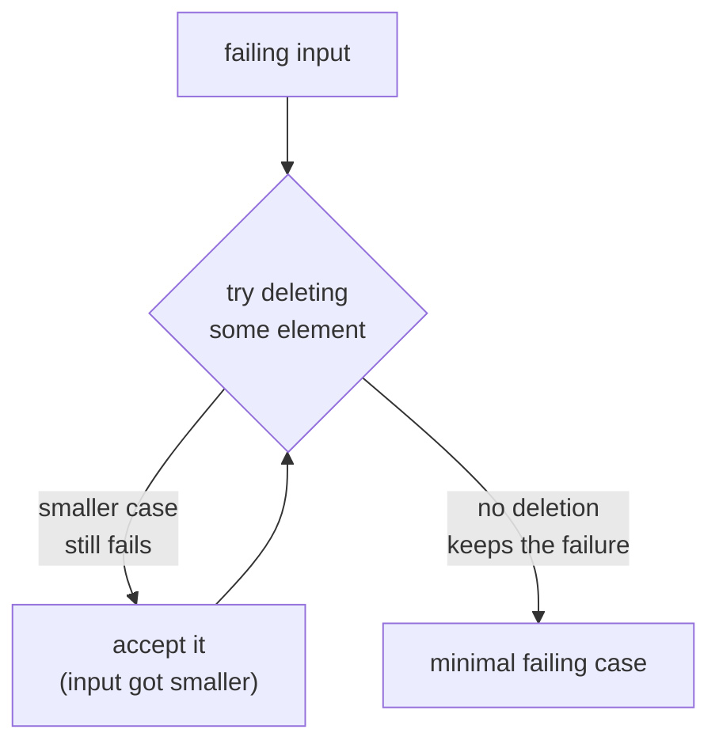
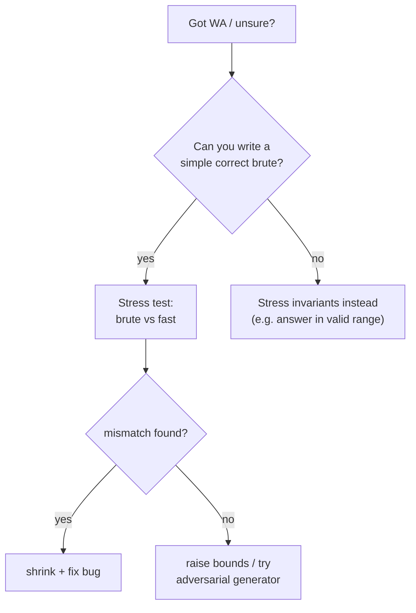
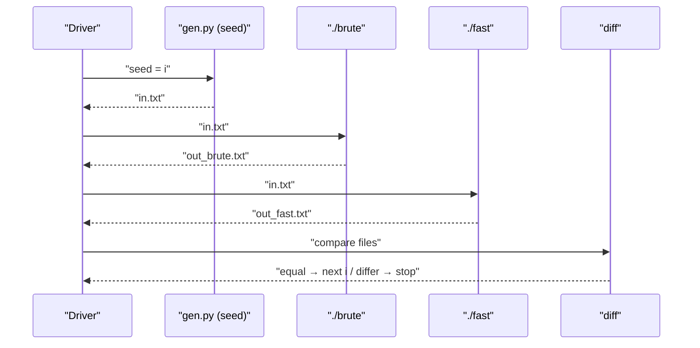
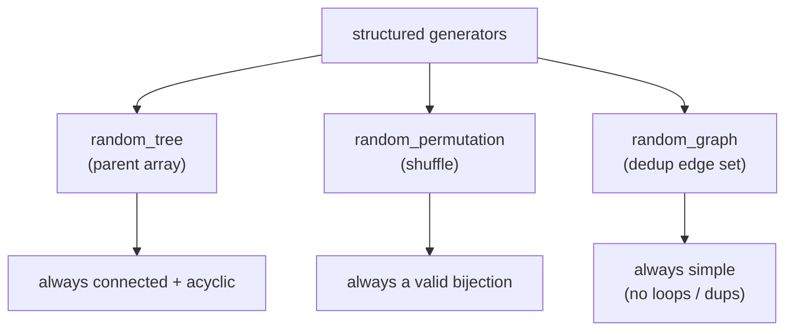

# Stress Testing & Random Test Generation — Complete Guide (Beginner → Advanced)

> **Stress testing** is the practice of comparing a **simple, obviously-correct brute force**
> against your **fast (but tricky) solution** on thousands of **randomly generated** inputs,
> automatically hunting for a single input where the two disagree. That disagreement is a
> **counterexample** — a concrete, reproducible bug. It is the single most powerful debugging
> technique in competitive programming: instead of staring at code wondering *why* you got
> Wrong Answer on test 47, you let a loop find a tiny failing case for you, then shrink it
> until the bug is obvious.

---

## Table of Contents
1. [The Stress-Testing Loop](#1-the-stress-testing-loop)
2. [Writing a Random Generator (small bounds first)](#2-writing-a-random-generator-small-bounds-first)
3. [Seeding & Reproducibility](#3-seeding--reproducibility)
4. [A Sample Problem: Brute vs Fast](#4-a-sample-problem-brute-vs-fast)
5. [The Comparison Harness](#5-the-comparison-harness)
6. [Minimizing a Failing Case](#6-minimizing-a-failing-case)
7. [When to Stress](#7-when-to-stress)
8. [A Bash / Python Driver Loop](#8-a-bash--python-driver-loop)
9. [Generating Special Structures](#9-generating-special-structures)
10. [Complexity Summary](#complexity-summary)
11. [Common Pitfalls](#common-pitfalls)
12. [Patterns](#patterns)

---

## 1. The Stress-Testing Loop

The whole idea fits in one loop. Repeat many times:

1. **Generate** a small random input with a fixed, printable seed.
2. **Run brute** — the slow but trustworthy reference solution.
3. **Run fast** — the optimized solution you actually want to submit.
4. **Compare** the two outputs.
5. If they **match**, throw the input away and continue. If they **mismatch**, **stop**, print
   the offending input, and (optionally) **shrink** it to a minimal reproducer.



The same flow, viewed as the conversation between the four actors, makes the data hand-off
explicit:



The key insight: the brute force does **not** need to be fast. On inputs of size $n \le 10$ an
$O(2^n)$ or $O(n!)$ reference is perfectly fine, because the only job of stress testing is to
expose a logical mismatch, not to measure performance.

---

## 2. Writing a Random Generator (small bounds first)

A generator turns a **seed** (an integer) into an **input**. The golden rule: **start with tiny
bounds**. A bug that needs $n = 100000$ to appear is nearly impossible to read; the *same* bug
almost always also appears at $n = 5$ with values in $[1, 5]$, where you can eyeball the whole
input. Grow the bounds only after small inputs stop finding anything.

Here is a reusable random integer-array generator. It takes a seed plus the **maximum** size and
value, and prints an input in the standard "first line = length, second line = the array" format.

```python
import sys
import random

def generate_int_array(seed, max_n=5, lo=1, hi=5):
    rng = random.Random(seed)          # local RNG seeded reproducibly
    n = rng.randint(1, max_n)          # small length first!
    arr = [rng.randint(lo, hi) for _ in range(n)]
    return n, arr

if __name__ == "__main__":
    seed = int(sys.argv[1]) if len(sys.argv) > 1 else 0
    n, arr = generate_int_array(seed)
    print(n)
    print(*arr)
```

```cpp
#include <bits/stdc++.h>
using namespace std;

pair<int, vector<long long>> generate_int_array(unsigned seed, int max_n = 5,
                                                long long lo = 1, long long hi = 5) {
    mt19937 rng(seed);                                 // local RNG seeded reproducibly
    int n = uniform_int_distribution<int>(1, max_n)(rng);   // small length first!
    vector<long long> arr(n);
    for (long long &x : arr)
        x = uniform_int_distribution<long long>(lo, hi)(rng);
    return {n, arr};
}

int main(int argc, char **argv) {
    unsigned seed = (argc > 1) ? (unsigned)stoul(argv[1]) : 0u;
    auto [n, arr] = generate_int_array(seed);
    cout << n << "\n";
    for (int i = 0; i < n; i++) cout << arr[i] << " \n"[i + 1 == n];
    return 0;
}
```

Because the RNG is seeded from the command-line argument, running the generator with the same
seed always prints the **same** input — which is what makes a failing case reproducible.



---

## 3. Seeding & Reproducibility

Reproducibility is non-negotiable: if a test fails on iteration 8127 but you cannot recreate
that exact input, the failure is useless. Two reliable strategies:

- **Seed = iteration index.** The driver loop uses the loop counter itself as the seed, so the
  printed counter *is* everything needed to replay the case.
- **Print the seed on mismatch.** Always log the seed (and ideally the full input) the instant
  the outputs diverge.

Avoid sources of non-determinism: never seed from the wall clock (`time(0)` /
`random.seed()` with no argument), because then "test 8127" is a different input every run.
`mt19937` (32-bit) and `mt19937_64` (64-bit) are the standard, portable, deterministic
generators; `uniform_int_distribution` maps their output into a range **without modulo bias**.



The number of distinct seeds you can sweep through is huge: a 32-bit seed gives
$2^{32} \approx 4.3 \times 10^{9}$ reproducible streams, far more than the thousands of
iterations a stress test typically needs.

---

## 4. A Sample Problem: Brute vs Fast

Let the sample problem be **maximum subarray sum**: given an array, find the largest sum over all
contiguous non-empty subarrays. The **brute** force tries every $\binom{n}{2}$-ish pair of
endpoints in $O(n^2)$ (or $O(n^3)$ if naive); the **fast** solution is Kadane's algorithm in
$O(n)$. They *should* always agree — and if our Kadane has a bug, stress testing will catch it.

The brute reference — deliberately simple, obviously correct:

```python
def max_subarray_brute(arr):
    n = len(arr)
    best = arr[0]
    for i in range(n):
        running = 0
        for j in range(i, n):
            running += arr[j]          # sum of arr[i..j]
            best = max(best, running)
    return best
```

```cpp
#include <bits/stdc++.h>
using namespace std;

long long max_subarray_brute(const vector<long long> &arr) {
    int n = (int)arr.size();
    long long best = arr[0];
    for (int i = 0; i < n; i++) {
        long long running = 0;
        for (int j = i; j < n; j++) {
            running += arr[j];          // sum of arr[i..j]
            best = max(best, running);
        }
    }
    return best;
}
```

The fast solution — Kadane's algorithm:

```python
def max_subarray_fast(arr):
    best = cur = arr[0]
    for x in arr[1:]:
        cur = max(x, cur + x)          # extend or restart
        best = max(best, cur)
    return best
```

```cpp
#include <bits/stdc++.h>
using namespace std;

long long max_subarray_fast(const vector<long long> &arr) {
    long long best = arr[0], cur = arr[0];
    for (size_t i = 1; i < arr.size(); i++) {
        cur = max(arr[i], cur + arr[i]);   // extend or restart
        best = max(best, cur);
    }
    return best;
}
```

---

## 5. The Comparison Harness

The harness glues generator + brute + fast + comparator into a single self-contained loop. It
needs **no files and no external process** when everything lives in one language — just call all
three functions in memory.

```python
import random

def stress(iterations=10000):
    for seed in range(iterations):
        rng = random.Random(seed)
        n = rng.randint(1, 6)
        arr = [rng.randint(-5, 5) for _ in range(n)]
        expected = max_subarray_brute(arr)
        got = max_subarray_fast(arr)
        if expected != got:
            print(f"MISMATCH at seed {seed}")
            print("input :", arr)
            print("brute :", expected)
            print("fast  :", got)
            return arr                 # hand off to the shrinker
    print(f"All {iterations} tests passed.")
    return None
```

```cpp
#include <bits/stdc++.h>
using namespace std;

vector<long long> stress(int iterations = 10000) {
    for (int seed = 0; seed < iterations; seed++) {
        mt19937 rng(seed);
        int n = uniform_int_distribution<int>(1, 6)(rng);
        vector<long long> arr(n);
        for (auto &x : arr) x = uniform_int_distribution<long long>(-5, 5)(rng);
        long long expected = max_subarray_brute(arr);
        long long got = max_subarray_fast(arr);
        if (expected != got) {
            cout << "MISMATCH at seed " << seed << "\n";
            cout << "input :"; for (auto x : arr) cout << ' ' << x; cout << "\n";
            cout << "brute : " << expected << "\n";
            cout << "fast  : " << got << "\n";
            return arr;                 // hand off to the shrinker
        }
    }
    cout << "All " << iterations << " tests passed.\n";
    return {};
}
```



---

## 6. Minimizing a Failing Case

A raw counterexample is often larger than necessary. **Shrinking** (a.k.a. delta-debugging)
repeatedly tries to make the input *smaller* while preserving the failure, so you end up with the
**minimal** input that still breaks the fast solution — usually small enough to debug by hand.

The simplest shrink: while the case still fails, try deleting each element; keep any deletion
that keeps it failing.

```python
def still_fails(arr):
    return arr and max_subarray_brute(arr) != max_subarray_fast(arr)

def shrink(arr):
    changed = True
    while changed:
        changed = False
        for i in range(len(arr)):
            candidate = arr[:i] + arr[i+1:]    # drop element i
            if still_fails(candidate):
                arr = candidate                # accept the smaller case
                changed = True
                break
    return arr
```

```cpp
#include <bits/stdc++.h>
using namespace std;

bool still_fails(const vector<long long> &arr) {
    return !arr.empty() &&
           max_subarray_brute(arr) != max_subarray_fast(arr);
}

vector<long long> shrink(vector<long long> arr) {
    bool changed = true;
    while (changed) {
        changed = false;
        for (size_t i = 0; i < arr.size(); i++) {
            vector<long long> candidate = arr;
            candidate.erase(candidate.begin() + i);   // drop element i
            if (still_fails(candidate)) {
                arr = candidate;                       // accept the smaller case
                changed = true;
                break;
            }
        }
    }
    return arr;
}
```



---

## 7. When to Stress

Reach for stress testing when:

- You have a nagging **off-by-one** suspicion (boundaries, `&lt;` vs `&lt;=`, empty input).
- You pass small samples but get **Wrong Answer on big / hidden tests** with no visible reason.
- A **greedy or DP** feels right but you cannot *prove* it — stress it against an exhaustive brute.
- You refactored a fast solution and want a **regression** safety net.



---

## 8. A Bash / Python Driver Loop

When brute and fast are **separate programs** (common when one is C++ and the other is Python),
an external driver generates an input file, feeds it to both, and `diff`s the outputs.

A Bash driver:

```python
# driver.sh  (run with: bash driver.sh)
# for i in $(seq 1 10000); do
#     python gen.py $i > in.txt          # seed = iteration
#     ./brute < in.txt > out_brute.txt
#     ./fast  < in.txt > out_fast.txt
#     if ! diff -q out_brute.txt out_fast.txt > /dev/null; then
#         echo "MISMATCH on seed $i"
#         cat in.txt
#         break
#     fi
# done
print("see the commented bash above")
```

```cpp
// driver as a C++ program using system() — same logic as the bash loop
#include <bits/stdc++.h>
using namespace std;

int main() {
    for (long long i = 1; i <= 10000; i++) {
        string seed = to_string(i);
        system(("python gen.py " + seed + " > in.txt").c_str());   // seed = iteration
        system("./brute < in.txt > out_brute.txt");
        system("./fast  < in.txt > out_fast.txt");
        if (system("diff -q out_brute.txt out_fast.txt > /dev/null") != 0) {
            cout << "MISMATCH on seed " << i << "\n";
            system("cat in.txt");
            break;
        }
    }
    return 0;
}
```



---

## 9. Generating Special Structures

Plain integer arrays only cover so much. Many problems need **structured** random inputs:
random permutations, random trees, random graphs. The trick is to generate them so they are
**always valid** (e.g. a tree is connected and acyclic *by construction*).

A **random tree** via a parent array: node $i$ (for $i \ge 2$) picks a parent uniformly among the
already-placed nodes $1 \dots i-1$. This is acyclic and connected by construction.

```python
import random

def random_tree(n, seed):
    rng = random.Random(seed)
    edges = []
    for v in range(2, n + 1):
        parent = rng.randint(1, v - 1)     # connect to an earlier node
        edges.append((parent, v))
    return edges
```

```cpp
#include <bits/stdc++.h>
using namespace std;

vector<pair<int,int>> random_tree(int n, unsigned seed) {
    mt19937 rng(seed);
    vector<pair<int,int>> edges;
    for (int v = 2; v <= n; v++) {
        int parent = uniform_int_distribution<int>(1, v - 1)(rng);  // connect to earlier node
        edges.push_back({parent, v});
    }
    return edges;
}
```

A **random permutation** of $1 \dots n$ via an in-place shuffle:

```python
import random

def random_permutation(n, seed):
    rng = random.Random(seed)
    perm = list(range(1, n + 1))
    rng.shuffle(perm)                       # Fisher–Yates under the hood
    return perm
```

```cpp
#include <bits/stdc++.h>
using namespace std;

vector<int> random_permutation(int n, unsigned seed) {
    mt19937 rng(seed);
    vector<int> perm(n);
    iota(perm.begin(), perm.end(), 1);
    shuffle(perm.begin(), perm.end(), rng);  // Fisher-Yates under the hood
    return perm;
}
```

A **random simple graph** by sampling each possible edge with probability tied to a target edge
count, deduplicating with a set:

```python
import random

def random_graph(n, m, seed):
    rng = random.Random(seed)
    seen = set()
    edges = []
    while len(edges) < m:
        u = rng.randint(1, n)
        v = rng.randint(1, n)
        if u != v and (min(u, v), max(u, v)) not in seen:
            seen.add((min(u, v), max(u, v)))   # no self-loops / no duplicates
            edges.append((u, v))
    return edges
```

```cpp
#include <bits/stdc++.h>
using namespace std;

vector<pair<int,int>> random_graph(int n, int m, unsigned seed) {
    mt19937 rng(seed);
    set<pair<int,int>> seen;
    vector<pair<int,int>> edges;
    while ((int)edges.size() < m) {
        int u = uniform_int_distribution<int>(1, n)(rng);
        int v = uniform_int_distribution<int>(1, n)(rng);
        if (u != v && !seen.count({min(u, v), max(u, v)})) {
            seen.insert({min(u, v), max(u, v)});   // no self-loops / no duplicates
            edges.push_back({u, v});
        }
    }
    return edges;
}
```



---

## Complexity Summary

Let $T$ be the number of stress iterations and $n$ the (small) input size per iteration.

| Component | Per-iteration cost | Notes |
|-----------|--------------------|-------|
| Generator (array) | $O(n)$ | tiny $n$ on purpose |
| Brute (max-subarray) | $O(n^2)$ | trusted, slowness is fine |
| Fast (Kadane) | $O(n)$ | the solution under test |
| Comparison | $O(1)$–$O(n)$ | depends on output size |
| Full stress run | $O\!\left(T \cdot n^2\right)$ | dominated by the brute |
| Shrink (one pass) | $O(n)$ deletions $\times$ check | repeated until stable |
| Random tree | $O(n)$ | one parent per node |
| Random permutation | $O(n)$ | Fisher–Yates |
| Random graph ($m$ edges) | $O(m \log m)$ avg | set dedup |

Because $n$ is intentionally small, even an $O(n^2)$ or $O(n^3)$ brute over $T = 10^4$
iterations finishes in well under a second.

---

## Common Pitfalls

- **Non-reproducible seeds.** Seeding from the clock (`random.seed()` with no argument or
  `srand(time(0))`) means the failing case vanishes on the next run. Always seed from the
  iteration counter and print it.
- **Generator that misses edge cases.** If your generator only ever emits positive values, it
  will never expose an all-negative bug. Include negatives, zeros, duplicates, $n = 1$, and the
  extreme allowed values.
- **Brute force that is too slow (or itself wrong).** If the brute is also $O(n^2)$ at
  $n = 10^5$ the stress loop crawls; keep $n$ small. And if the brute is subtly buggy you are
  comparing two wrong answers — keep the brute *boringly* obvious.
- **Bounds too large from the start.** A counterexample at $n = 5$ is readable; the same bug at
  $n = 10^5$ is not. Start tiny, grow later.
- **Output formatting mismatches.** When diffing files, trailing spaces or newline differences
  can masquerade as real mismatches — normalize whitespace or compare parsed values.
- **Forgetting to shrink.** A 200-element counterexample hides the bug; spend the extra few
  lines to minimize it.

---

## Patterns

- **brute + fast + generator + comparator** is the canonical four-part stress harness; keep all
  four trivially correct except the one under test.
- **Seed = iteration** so every failure is replayable from a single integer.
- **Small bounds first**, widen only after small inputs go quiet.
- **Shrink on mismatch** to turn a found bug into a minimal reproducer.
- **Generate-valid-by-construction** for structured inputs (trees via parent arrays, perms via
  shuffles, graphs via deduped edge sets) so the generator never emits illegal inputs.
- **In-memory harness** when one language suffices; **file + diff driver** when brute and fast
  are separate programs.

> **Takeaway:** Stress testing converts vague "it's wrong somewhere" frustration into a tiny,
> reproducible counterexample. Write a dumb-but-correct brute, a small random generator with a
> printable seed, compare the two in a loop, and shrink whatever it finds — the bug will reveal
> itself.
