# Sorting & Custom Comparators — Complete Guide (Beginner → Advanced)

> **Sorting** rearranges a sequence into a well-defined order. The interesting part is rarely
> "sort these numbers ascending" — it is *teaching the sort what "less than" means*. A **custom
> comparator** (or a **sort key**) lets you sort records by several fields, mix ascending and
> descending, or impose an exotic order such as "arrange numbers so their concatenation is the
> largest possible". Get the comparator right and a one-line `sort` does enormous work; get it
> subtly wrong (a non–strict-weak-ordering comparator) and C++ will happily corrupt memory.
> This guide builds the mental model from comparison sorts up to overflow-safe custom orders,
> with paired Python and C++ throughout.

---

## Table of Contents
1. [Comparison Sorts Overview](#1-comparison-sorts-overview)
2. [Stability — and When It Matters](#2-stability--and-when-it-matters)
3. [Sort Keys vs Comparators](#3-sort-keys-vs-comparators)
4. [Strict Weak Ordering (the contract you must honor)](#4-strict-weak-ordering-the-contract-you-must-honor)
5. [Python `key=` vs `functools.cmp_to_key`](#5-python-key-vs-functoolscmp_to_key)
6. [Multi-Key Sorting (tuples & tie-breakers)](#6-multi-key-sorting-tuples--tie-breakers)
7. [Sorting Structs / Pairs](#7-sorting-structs--pairs)
8. [Descending Order](#8-descending-order)
9. [Custom Criteria — Largest Concatenation](#9-custom-criteria--largest-concatenation)
10. [Counting Sort & Radix Sort (integer keys)](#10-counting-sort--radix-sort-integer-keys)
11. [Complexity Summary](#complexity-summary)
12. [Common Pitfalls](#common-pitfalls)
13. [Patterns](#patterns)

---

## 1. Comparison Sorts Overview

A **comparison sort** only ever asks "is $a$ before $b$?". Mergesort, heapsort, quicksort and
the library `sort` are all comparison sorts. Any comparison sort must make at least
$\lceil \log_2(n!) \rceil = \Theta(n \log n)$ comparisons in the worst case, because $n!$ orderings
need that many yes/no answers to distinguish.

$$
\log_2(n!) = \sum_{k=1}^{n} \log_2 k \;=\; \Theta(n \log n)
$$

So $O(n \log n)$ is the **floor** for general comparison sorting. The only way below it is to
stop comparing and exploit structure in the keys (counting / radix sort, §10).

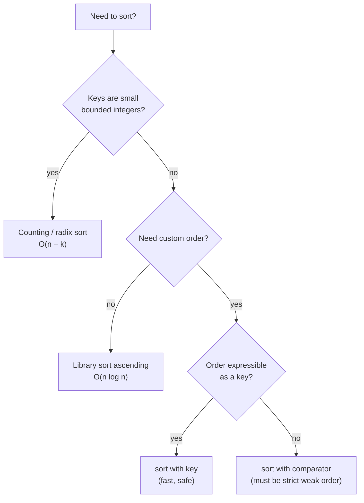

The library sort is the default tool. Everything else in this guide is about **what order**
you feed it, not which algorithm runs underneath.

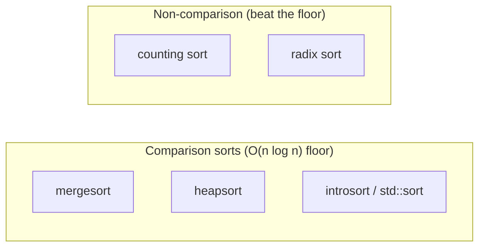

---

## 2. Stability — and When It Matters

A sort is **stable** if elements that compare *equal* keep their original relative order. This
matters the moment your comparator does **not** look at the whole record: equal-by-key items
must not be silently shuffled.

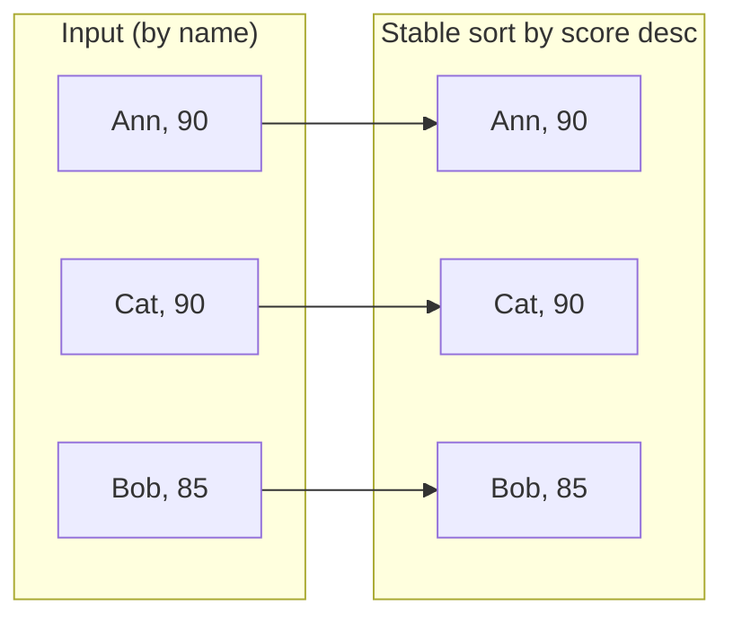

Ann appeared before Cat in the input, and a **stable** sort by score keeps Ann before Cat among
the tied `90`s. An **unstable** sort might output Cat before Ann — same scores, but the original
tie-break is lost.

| Tool | Stable? |
|------|---------|
| Python `list.sort` / `sorted` | **Yes** (always) |
| C++ `std::sort` | **No** (introsort) |
| C++ `std::stable_sort` | **Yes** ($O(n \log^2 n)$, or $O(n\log n)$ with memory) |

A simple stable example — sort `(name, score)` pairs by score, keeping name order among ties:

```python
records = [("Ann", 90), ("Bob", 85), ("Cat", 90)]
records.sort(key=lambda r: -r[1])      # stable: Ann stays before Cat
print(records)                          # [('Ann', 90), ('Cat', 90), ('Bob', 85)]
```

```cpp
#include <bits/stdc++.h>
using namespace std;

int main() {
    vector<pair<string, int>> records = {{"Ann", 90}, {"Bob", 85}, {"Cat", 90}};
    // std::sort is NOT stable, so use stable_sort to preserve name order among ties
    stable_sort(records.begin(), records.end(),
                [](const pair<string,int> &a, const pair<string,int> &b) {
                    return a.second > b.second;   // by score, descending
                });
    for (auto &r : records) cout << r.first << ' ' << r.second << '\n';
    return 0;
}
```

---

## 3. Sort Keys vs Comparators

There are two ways to specify order:

- A **key** maps each element to a value that is compared with the *natural* order. "Sort by
  this number / tuple / string." Keys are computed **once per element**, are impossible to get
  inconsistent, and are the safe default.
- A **comparator** is a function `cmp(a, b)` answering "does `a` come strictly before `b`?". It
  is more general (it can express orders no single key can), but you are now responsible for
  honoring the **strict weak ordering** contract (§4).

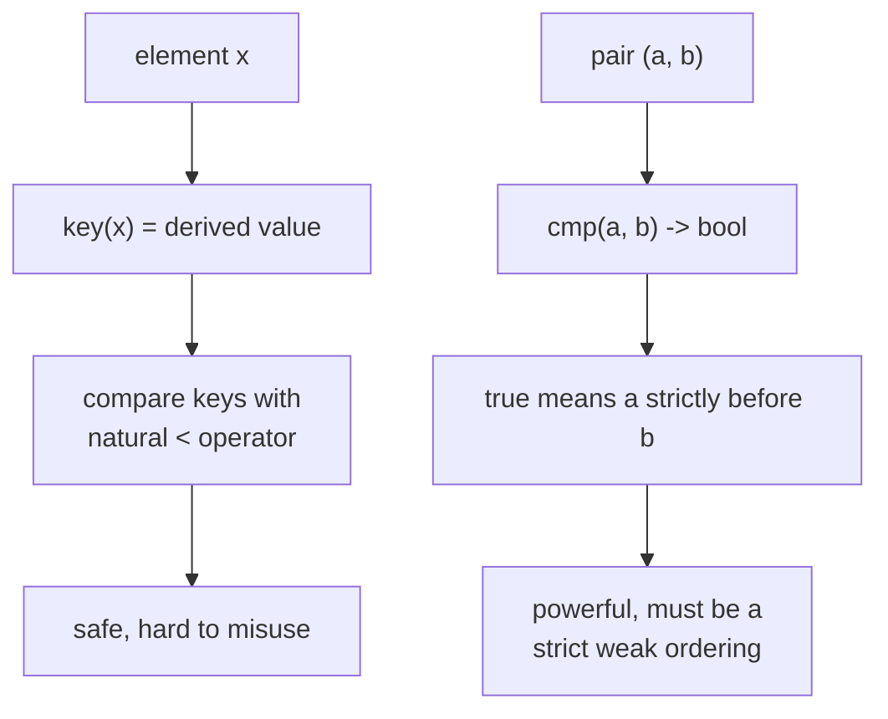

> **Rule of thumb:** reach for a **key** first. Only drop to a **comparator** when the order
> genuinely cannot be written as "compare these derived values" — the classic case being the
> largest-concatenation order in §9.

---

## 4. Strict Weak Ordering (the contract you must honor)

A C++ comparator `cmp(a, b)` must define a **strict weak ordering**. Concretely:

- **Irreflexive:** `cmp(a, a)` is always `false`. An element is never before itself.
- **Asymmetric:** if `cmp(a, b)` is true then `cmp(b, a)` is false.
- **Transitive:** if `cmp(a, b)` and `cmp(b, c)`, then `cmp(a, c)`.
- **Transitivity of incomparability:** if `a` and `b` are "equal" (`!cmp(a,b) && !cmp(b,a)`)
  and likewise `b` and `c`, then `a` and `c` must be equal too.

Violate any of these and `std::sort` has **undefined behavior** — in practice it can read out of
bounds and crash, because it trusts the comparator to bound its partitioning.

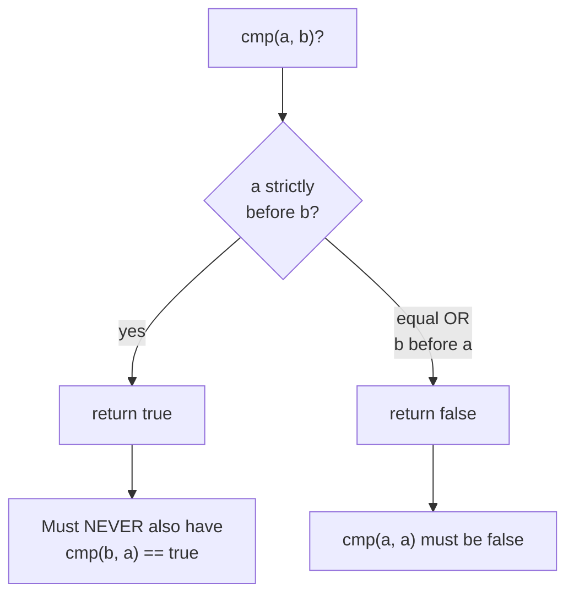

The single most common bug is writing `<=` where `<` is required. `<=` is **reflexive**
(`a <= a` is true), so it is *not* a strict weak ordering and is UB:

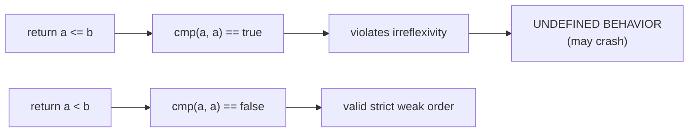

Transitivity is easy to break with hand-rolled multi-field logic. A clean way to *guarantee*
transitivity is to compare **tuples of keys** — tuple comparison is transitive by construction:

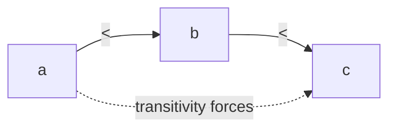

---

## 5. Python `key=` vs `functools.cmp_to_key`

Python's `sort`/`sorted` accept a `key=` function (preferred) and, when you truly need a
pairwise comparator, `functools.cmp_to_key` adapts a `cmp(a, b)` that returns a negative / zero /
positive number — the old C-style three-way result.

```python
from functools import cmp_to_key

nums = [3, 30, 34, 5, 9]

# key style: sort by string length then value (a derived tuple key)
by_key = sorted(nums, key=lambda x: (len(str(x)), x))

# comparator style: three-way cmp -> negative means a before b
def cmp(a, b):
    return (a > b) - (a < b)        # ascending three-way comparison
by_cmp = sorted(nums, key=cmp_to_key(cmp))

print(by_key, by_cmp)
```

```cpp
#include <bits/stdc++.h>
using namespace std;

int main() {
    vector<int> nums = {3, 30, 34, 5, 9};

    // key style emulated: sort by (#digits, value) via a strict-weak-ordering lambda
    vector<int> byKey = nums;
    sort(byKey.begin(), byKey.end(), [](int a, int b) {
        int da = (int)to_string(a).size(), db = (int)to_string(b).size();
        if (da != db) return da < db;
        return a < b;
    });

    // comparator style: a two-argument "a strictly before b" predicate
    vector<int> byCmp = nums;
    sort(byCmp.begin(), byCmp.end(), [](int a, int b) { return a < b; });

    for (int x : byKey) cout << x << ' '; cout << '\n';
    for (int x : byCmp) cout << x << ' '; cout << '\n';
    return 0;
}
```

> Python's `cmp_to_key` returns a value (negative / zero / positive); C++'s comparator returns a
> **bool** ("strictly before"). Returning `0`/equal in Python is fine; in C++ "equal" must be
> expressed as `cmp` returning `false` **both ways**.

---

## 6. Multi-Key Sorting (tuples & tie-breakers)

Real sorts almost always have **tie-breakers**: "by score descending, then by name ascending,
then by id ascending." The cleanest, safest encoding is a **tuple key** — fields compared
left-to-right, exactly like dictionary order.

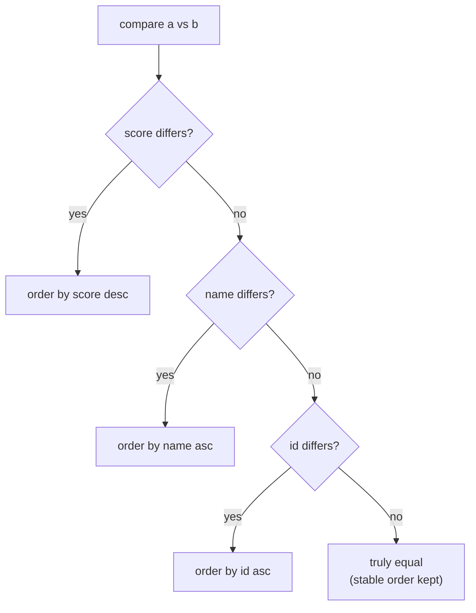

For a **descending** numeric field inside an otherwise ascending tuple, negate it (`-score`).
For a descending field that cannot be negated (a string), you must drop to a comparator.

```python
records = [
    ("Ann", 90, 3),
    ("Bob", 85, 1),
    ("Cat", 90, 2),
]
# score DESC, then name ASC, then id ASC
records.sort(key=lambda r: (-r[1], r[0], r[2]))
for name, score, rid in records:
    print(name, score, rid)
```

```cpp
#include <bits/stdc++.h>
using namespace std;

struct Rec { string name; int score; int id; };

int main() {
    vector<Rec> records = {{"Ann", 90, 3}, {"Bob", 85, 1}, {"Cat", 90, 2}};
    sort(records.begin(), records.end(), [](const Rec &a, const Rec &b) {
        // build comparable tuples; negate score for descending
        return make_tuple(-a.score, a.name, a.id)
             < make_tuple(-b.score, b.name, b.id);
    });
    for (auto &r : records) cout << r.name << ' ' << r.score << ' ' << r.id << '\n';
    return 0;
}
```

Comparing `tuple`s is transitive automatically, so this style is **bug-resistant** — you cannot
accidentally break strict weak ordering the way nested `if` chains can.

---

## 7. Sorting Structs / Pairs

C++ `pair` and `tuple` already have a lexicographic `<`, so sorting them ascending needs no
comparator at all. Python tuples behave identically.

```python
points = [(3, 1), (1, 2), (1, 1), (2, 5)]
points.sort()                          # by x then y, lexicographically
print(points)                          # [(1, 1), (1, 2), (2, 5), (3, 1)]
```

```cpp
#include <bits/stdc++.h>
using namespace std;

int main() {
    vector<pair<long long,long long>> points = {{3,1},{1,2},{1,1},{2,5}};
    sort(points.begin(), points.end());   // pair's built-in lexicographic <
    for (auto &p : points) cout << '(' << p.first << ',' << p.second << ") ";
    cout << '\n';
    return 0;
}
```

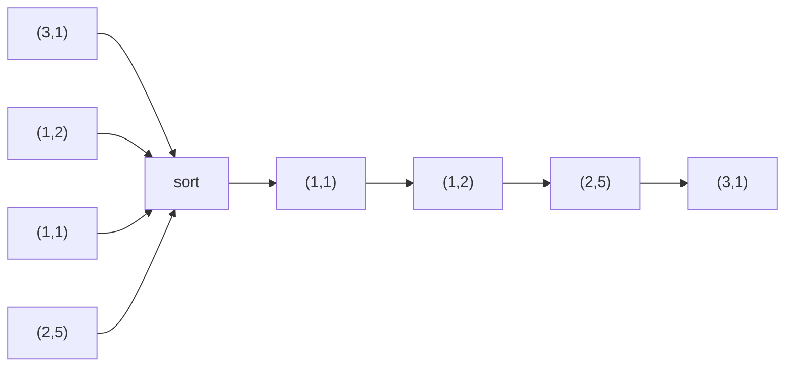

---

## 8. Descending Order

Three idiomatic ways to sort descending, in order of preference:

1. **Sort ascending then reverse** — only valid if you do not need a *stable* descending order.
2. **Negate the key** — `key=lambda x: -x` (numbers only).
3. **Flip the comparator** — `return a > b`.

```python
nums = [3, 1, 4, 1, 5, 9, 2, 6]
desc1 = sorted(nums, reverse=True)         # built-in flag (cleanest)
desc2 = sorted(nums, key=lambda x: -x)     # negate key
print(desc1, desc2)
```

```cpp
#include <bits/stdc++.h>
using namespace std;

int main() {
    vector<int> nums = {3, 1, 4, 1, 5, 9, 2, 6};
    vector<int> desc1 = nums, desc2 = nums;
    sort(desc1.rbegin(), desc1.rend());                 // reverse iterators
    sort(desc2.begin(), desc2.end(), greater<int>());   // greater comparator
    for (int x : desc1) cout << x << ' '; cout << '\n';
    for (int x : desc2) cout << x << ' '; cout << '\n';
    return 0;
}
```

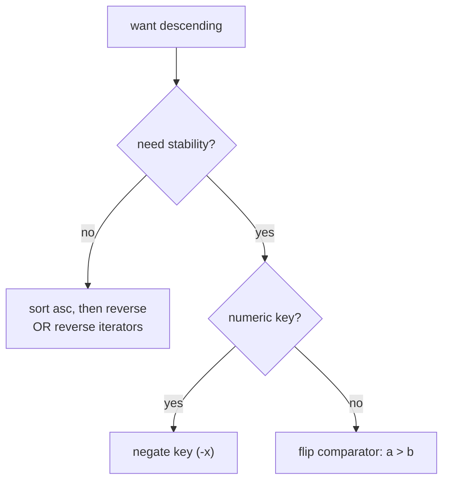

---

## 9. Custom Criteria — Largest Concatenation

The showcase for comparators: given numbers, arrange them so their **concatenation** is the
largest possible. Sorting by value fails — `[3, 30]` should become `"330"`, not `"303"`. The
right order compares `a` and `b` by which **concatenation** is bigger: `a` comes first iff
`a ++ b > b ++ a` (string concatenation).

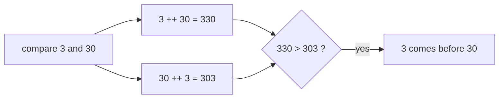

This comparator **is** a strict weak ordering: comparing the strings `a+b` vs `b+a` is just a
string comparison, which is transitive — so transitivity is inherited for free.

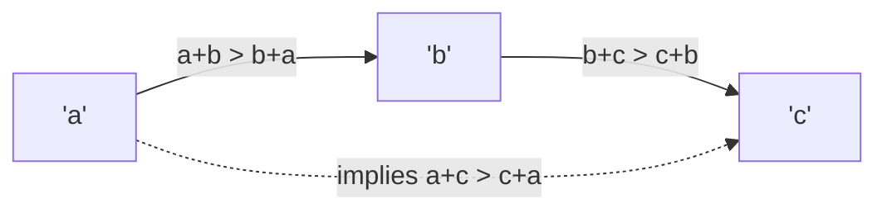

```python
from functools import cmp_to_key

def largest_number(nums):
    strs = list(map(str, nums))
    # a before b iff a+b is the larger concatenation
    strs.sort(key=cmp_to_key(lambda a, b: (a + b < b + a) - (a + b > b + a)))
    result = "".join(strs)
    return "0" if result[0] == "0" else result    # all-zero guard

print(largest_number([3, 30, 34, 5, 9]))           # "9534330"
```

```cpp
#include <bits/stdc++.h>
using namespace std;

string largestNumber(vector<int> &nums) {
    vector<string> strs;
    for (int x : nums) strs.push_back(to_string(x));
    sort(strs.begin(), strs.end(), [](const string &a, const string &b) {
        return a + b > b + a;          // strict weak order via string compare
    });
    if (strs[0] == "0") return "0";    // all-zero guard
    string result;
    for (auto &s : strs) result += s;
    return result;
}

int main() {
    vector<int> nums = {3, 30, 34, 5, 9};
    cout << largestNumber(nums) << '\n';   // 9534330
    return 0;
}
```

Note there is **no overflow** here even for huge inputs: we compare *strings*, never the giant
concatenated integer. Trying to compute `a*10^len(b) + b` as a `long long` would overflow — the
string trick sidesteps it entirely.

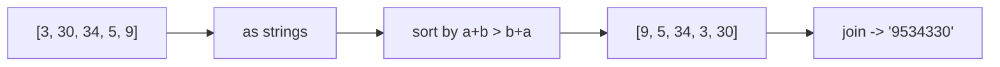

---

## 10. Counting Sort & Radix Sort (integer keys)

When keys are **integers in a small range** $[0, k)$, you can beat the $O(n \log n)$ comparison
floor. **Counting sort** tallies how many times each key appears, then writes them out in order —
$O(n + k)$ time, and **stable** if you place from the back using prefix counts.

$$
\text{counting sort:} \quad O(n + k) \quad\text{time}, \quad O(n + k)\ \text{space}
$$

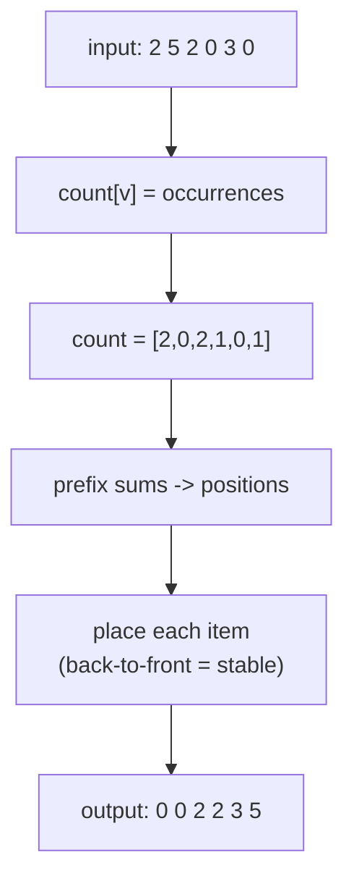

```python
def counting_sort(a, k):
    count = [0] * k
    for v in a:
        count[v] += 1                      # tally
    for v in range(1, k):
        count[v] += count[v - 1]           # prefix sums = end positions
    out = [0] * len(a)
    for v in reversed(a):                  # back-to-front keeps it stable
        count[v] -= 1
        out[count[v]] = v
    return out

print(counting_sort([2, 5, 2, 0, 3, 0], 6))   # [0, 0, 2, 2, 3, 5]
```

```cpp
#include <bits/stdc++.h>
using namespace std;

vector<int> countingSort(const vector<int> &a, int k) {
    vector<int> count(k, 0);
    for (int v : a) count[v]++;                 // tally
    for (int v = 1; v < k; v++) count[v] += count[v - 1];   // prefix sums
    vector<int> out(a.size());
    for (int i = (int)a.size() - 1; i >= 0; i--) {  // back-to-front = stable
        int v = a[i];
        out[--count[v]] = v;
    }
    return out;
}

int main() {
    vector<int> a = {2, 5, 2, 0, 3, 0};
    for (int x : countingSort(a, 6)) cout << x << ' ';   // 0 0 2 2 3 5
    cout << '\n';
    return 0;
}
```

**Radix sort** applies counting sort digit by digit (LSD → MSD), giving $O(d \cdot (n + b))$ for
$d$ digits in base $b$ — effectively linear for fixed-width integers.

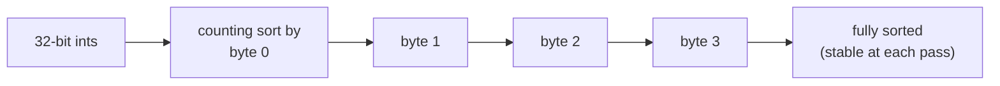

---

## Complexity Summary

| Operation | Time | Space | Stable | Notes |
|-----------|------|-------|--------|-------|
| Library sort (ascending) | $O(n \log n)$ | $O(\log n)$ | Py: yes / C++: no | comparison floor |
| Sort with key/comparator | $O(n \log n)$ | $O(\log n)$ | depends | key computed once per elem |
| `stable_sort` (C++) | $O(n \log^2 n)$ | $O(n)$ if available | yes | preserves ties |
| Multi-key (tuple) sort | $O(n \log n \cdot c)$ | $O(\log n)$ | depends | $c$ = key compare cost |
| Largest-concatenation | $O(n \log n \cdot L)$ | $O(nL)$ | n/a | $L$ = max string length |
| Counting sort | $O(n + k)$ | $O(n + k)$ | yes | keys in $[0,k)$ |
| Radix sort | $O(d (n + b))$ | $O(n + b)$ | yes | $d$ digits, base $b$ |

---

## Common Pitfalls

- **Non–strict-weak-ordering comparator.** Writing `a <= b` (reflexive) or inconsistent nested
  `if`s in C++ is **undefined behavior** — `std::sort` may crash or corrupt memory. Always make
  `cmp(a, a) == false`, and prefer comparing **tuples** to inherit transitivity.
- **Assuming `std::sort` is stable.** It is not. If you depend on ties keeping their input
  order, use `stable_sort` (or pack a tie-breaker index into the key).
- **Overflow in a numeric comparator.** Comparing `a*a` or `a*10^k + b` can overflow `int`/`long
  long`. Compare via a safe transform (strings for concatenation, or `(a > b) - (a < b)`), or use
  `long long` / `__int128` deliberately.
- **Descending a non-numeric field by negation.** You cannot negate a string. Either reverse the
  comparator for that field or sort ascending and reverse the whole result (losing stability).
- **Recomputing the key inside the comparator.** Expensive keys (parsing, `to_string`) computed
  on every comparison turn $O(n \log n)$ into something far slower; precompute keys once.
- **All-zero edge case.** In largest-concatenation, `[0, 0]` must format as `"0"`, not `"00"`.

---

## Patterns

- **Reach for a key, not a comparator.** If the order is "compare these derived values", use a
  key. Drop to a comparator only for orders no key can express (largest concatenation).
- **Encode tie-breakers as tuples.** `(-score, name, id)` is transitive by construction and reads
  like the spec.
- **Negate for descending numbers**, flip the comparator for descending non-numbers.
- **Compare transformed representations to dodge overflow** — strings for concatenation order,
  three-way `(a>b)-(a<b)` for safe numeric compares.
- **Exploit bounded integer keys** with counting/radix sort to beat the $O(n\log n)$ floor.
- **Pack an index into the key** to make any sort behave as a stable sort.
