# Binary Search on a Sorted Array — Complete Guide

Binary search is the canonical **divide-and-conquer search**: by exploiting the fact that an array is **sorted**, every comparison lets us throw away *half* of the remaining candidates. What is a linear $O(n)$ scan becomes an $O(\log n)$ probe — for $n = 10^9$ that is roughly $30$ comparisons instead of a billion.

Yet binary search is also one of the **buggiest** pieces of code people write. The loop bounds, the `mid` computation, when to write `lo = mid + 1` versus `hi = mid`, and the dreaded **off-by-one** and **infinite loop** all hide in three or four lines. The cure is to stop guessing and instead pin down a single **loop invariant** and let it dictate every line. This guide builds binary search from that invariant outward, using the **half-open interval** $[lo, hi)$ as the backbone.

---

## Table of Contents

1. [The Invariant-Based Mindset](#the-invariant-based-mindset)
2. [The Half-Open Interval $[lo, hi)$](#the-half-open-interval-lo-hi)
3. [Exact-Match Binary Search](#exact-match-binary-search)
4. [`lower_bound` — First Index With $a[i] \ge x$](#lower_bound--first-index-with-ai-ge-x)
5. [`upper_bound` — First Index With $a[i] > x$](#upper_bound--first-index-with-ai--x)
6. [Counting Occurrences](#counting-occurrences)
7. [The Classic Off-By-One Bugs](#the-classic-off-by-one-bugs)
8. [Mid Overflow and `lo + (hi - lo) / 2`](#mid-overflow-and-lo--hi---lo--2)
9. [Binary Search on a Rotated Array (Brief)](#binary-search-on-a-rotated-array-brief)
10. [STL / `bisect` Equivalents](#stl--bisect-equivalents)
11. [Complexity Summary](#complexity-summary)
12. [Common Pitfalls](#common-pitfalls)
13. [Patterns](#patterns)

---

## The Invariant-Based Mindset

A **loop invariant** is a statement that is true *before* the loop, *after every iteration*, and therefore *when the loop ends*. For binary search the invariant answers one question: **where can the answer still be?** Every iteration shrinks that region while keeping the invariant intact. When the region becomes empty or a single point, the invariant *hands you the answer*.

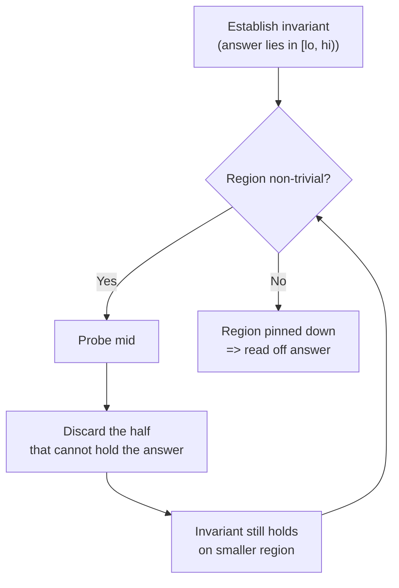

The discipline: **never** ask "does this index look right?" Instead ask "does my move preserve the invariant?" If yes, the code is correct by construction.

---

## The Half-Open Interval $[lo, hi)$

We represent the search region as the half-open interval $[lo, hi)$ — it **includes** `lo` but **excludes** `hi`. The number of elements in $[lo, hi)$ is exactly $hi - lo$, and the region is empty precisely when $lo = hi$. This single convention eliminates most off-by-one errors because the "size" arithmetic is clean.

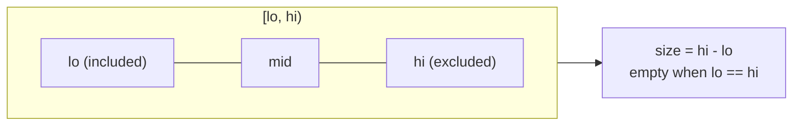

We initialize $lo = 0$ and $hi = n$ so the region covers **all** indices $0 \ldots n-1$. The half-open form means $hi = n$ is a *legal sentinel* meaning "past the end" — useful for `lower_bound`/`upper_bound`, which may legitimately return $n$.

$$\text{candidates} = [lo, hi), \qquad |[lo, hi)| = hi - lo, \qquad \text{empty} \iff lo = hi.$$

---

## Exact-Match Binary Search

Goal: return any index $i$ with $a[i] = x$, or $-1$ if absent. Invariant: *if $x$ is present, it lies in $[lo, hi)$.* We probe `mid`; if `a[mid] == x` we are done; if `a[mid] < x` the target is strictly to the right so we set `lo = mid + 1`; otherwise it is to the left so `hi = mid`.

```python
def binary_search(a, x):
    lo, hi = 0, len(a)          # half-open [lo, hi)
    while lo < hi:
        mid = lo + (hi - lo) // 2
        if a[mid] == x:
            return mid
        elif a[mid] < x:
            lo = mid + 1        # target in right half
        else:
            hi = mid            # target in left half
    return -1
```

```cpp
#include <bits/stdc++.h>
using namespace std;

int binary_search_idx(const vector<long long>& a, long long x) {
    long long lo = 0, hi = (long long)a.size();   // half-open [lo, hi)
    while (lo < hi) {
        long long mid = lo + (hi - lo) / 2;
        if (a[mid] == x) return (int)mid;
        else if (a[mid] < x) lo = mid + 1;        // target in right half
        else hi = mid;                            // target in left half
    }
    return -1;                                    // (nullptr-style "not found")
}
```

The interval-shrinking logic as a flowchart:

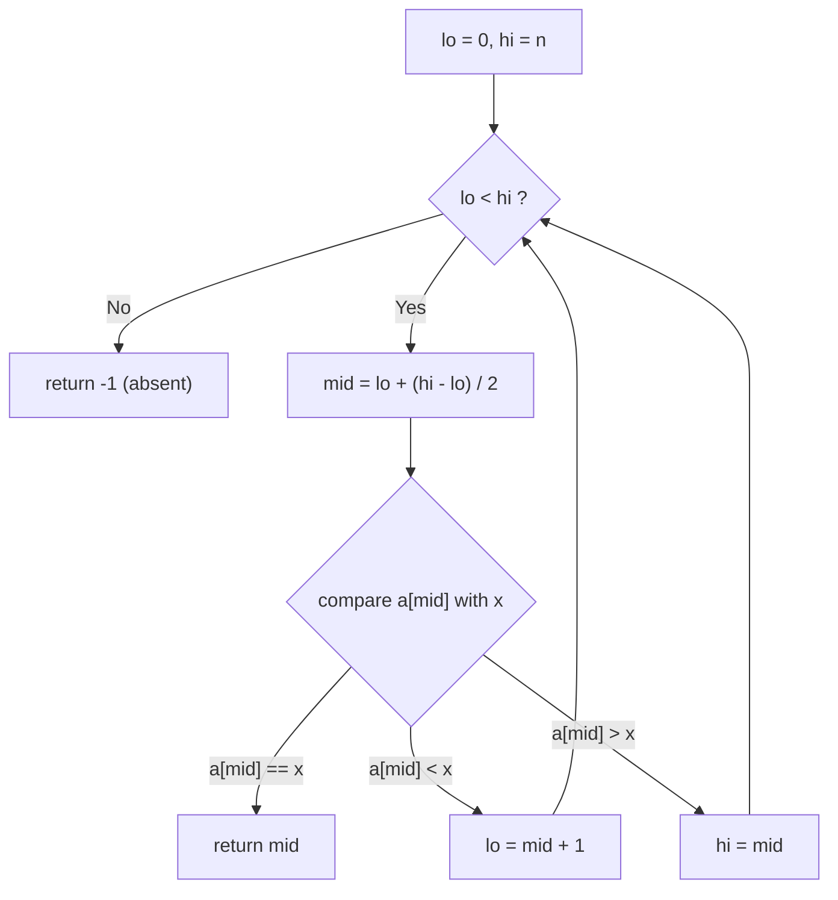

A worked example searching for $x = 7$ in `[1, 3, 5, 7, 9, 11]`, tracking `lo`/`mid`/`hi` over iterations:

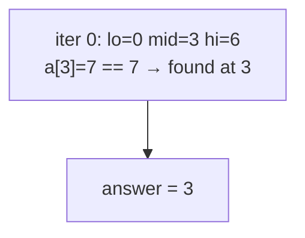

And a case that misses — searching $x = 8$ in the same array, showing the interval collapse:

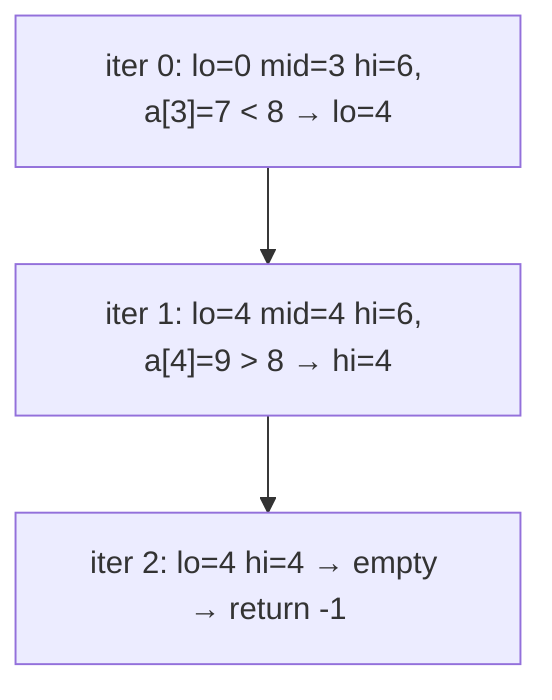

---

## `lower_bound` — First Index With $a[i] \ge x$

`lower_bound` returns the **leftmost** position where $x$ could be inserted to keep the array sorted: the first index $i$ with $a[i] \ge x$ (or $n$ if every element is smaller). This is the *workhorse* primitive — exact search, counting, and insert-position all reduce to it.

Invariant on $[lo, hi)$: *everything left of $lo$ is $< x$, and everything at or right of $hi$ is $\ge x$.* We never test for equality; we only push `lo` past elements that are too small.

```python
def lower_bound(a, x):
    lo, hi = 0, len(a)
    while lo < hi:
        mid = lo + (hi - lo) // 2
        if a[mid] < x:
            lo = mid + 1        # mid too small; answer is to the right
        else:
            hi = mid            # a[mid] >= x is a candidate; keep it
    return lo                   # first index with a[i] >= x (may be n)
```

```cpp
#include <bits/stdc++.h>
using namespace std;

long long lower_bound_idx(const vector<long long>& a, long long x) {
    long long lo = 0, hi = (long long)a.size();
    while (lo < hi) {
        long long mid = lo + (hi - lo) / 2;
        if (a[mid] < x) lo = mid + 1;   // mid too small; answer to the right
        else hi = mid;                  // a[mid] >= x is a candidate; keep it
    }
    return lo;                          // first index with a[i] >= x (may be n)
}
```

The invariant pictured — three zones as the loop runs:

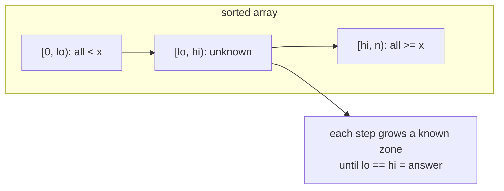

---

## `upper_bound` — First Index With $a[i] > x$

`upper_bound` is the twin of `lower_bound`: it returns the first index $i$ with $a[i] > x$ (strictly greater). The *only* code change is `<` becoming `<=` in the comparison: now elements **equal** to $x$ are also pushed past, so we land just **after** the last copy of $x$.

```python
def upper_bound(a, x):
    lo, hi = 0, len(a)
    while lo < hi:
        mid = lo + (hi - lo) // 2
        if a[mid] <= x:
            lo = mid + 1        # a[mid] <= x; answer strictly to the right
        else:
            hi = mid            # a[mid] > x is a candidate; keep it
    return lo                   # first index with a[i] > x (may be n)
```

```cpp
#include <bits/stdc++.h>
using namespace std;

long long upper_bound_idx(const vector<long long>& a, long long x) {
    long long lo = 0, hi = (long long)a.size();
    while (lo < hi) {
        long long mid = lo + (hi - lo) / 2;
        if (a[mid] <= x) lo = mid + 1;  // a[mid] <= x; answer strictly right
        else hi = mid;                  // a[mid] > x is a candidate; keep it
    }
    return lo;                          // first index with a[i] > x (may be n)
}
```

Side-by-side semantics on `[2, 4, 4, 4, 6]` searching $x = 4$:

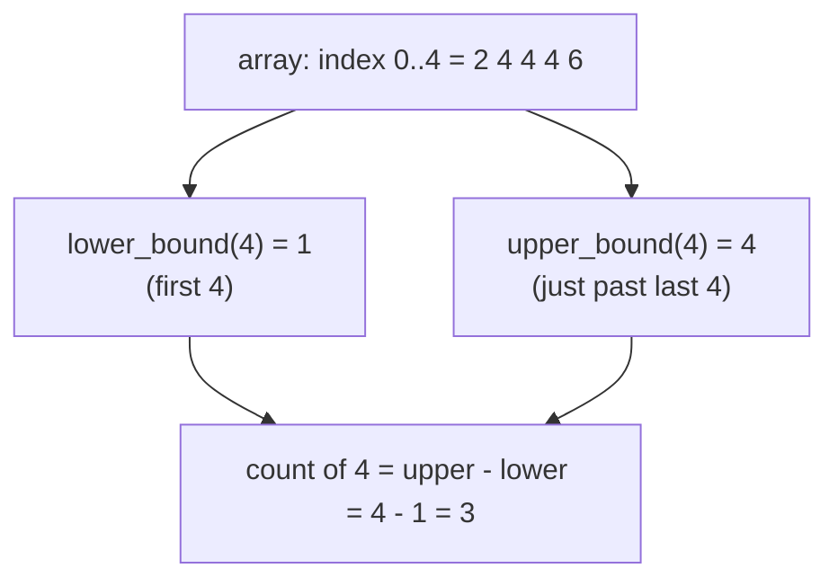

The single-character difference, as a decision tree:

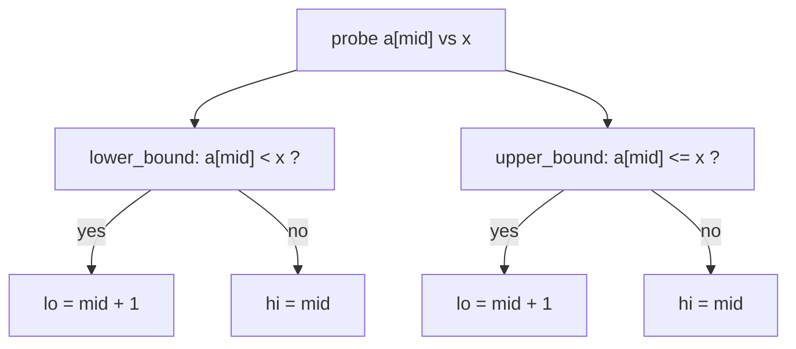

---

## Counting Occurrences

Because `lower_bound` is the first $\ge x$ and `upper_bound` is the first $> x$, the number of elements **equal** to $x$ is simply their difference:

$$\operatorname{count}(x) = \operatorname{upper\_bound}(x) - \operatorname{lower\_bound}(x).$$

If $x$ is absent both bounds coincide and the count is $0$ — no special case needed.

```python
def count_occurrences(a, x):
    return upper_bound(a, x) - lower_bound(a, x)
```

```cpp
#include <bits/stdc++.h>
using namespace std;

long long count_occurrences(const vector<long long>& a, long long x) {
    return upper_bound_idx(a, x) - lower_bound_idx(a, x);
}
```

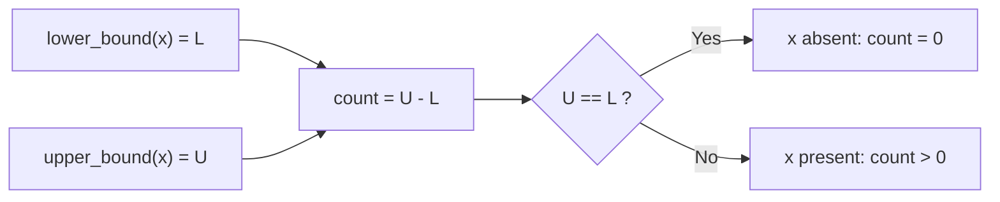

---

## The Classic Off-By-One Bugs

Almost every binary-search bug is one of: **wrong initial `hi`**, **wrong update** (`hi = mid` vs `hi = mid - 1`), or a **`<=` vs `<` loop condition** that does not match the interval convention. The half-open invariant ties these together so they cannot drift apart.

| Convention | `hi` init | Loop test | Shrink left | Shrink right |
|---|---|---|---|---|
| Half-open $[lo, hi)$ *(this guide)* | `n` | `lo < hi` | `hi = mid` | `lo = mid + 1` |
| Closed $[lo, hi]$ | `n - 1` | `lo <= hi` | `hi = mid - 1` | `lo = mid + 1` |

Mixing rows is the root of nearly all failures — e.g. using `hi = n` (half-open) but testing `lo <= hi` (closed) reads `a[n]` out of bounds.

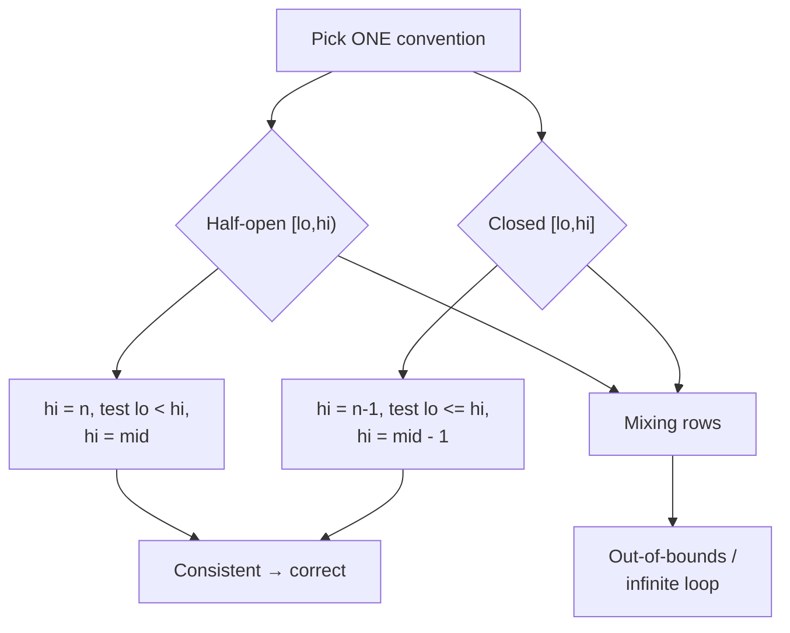

The **infinite loop** trap deserves its own note: with `hi = mid` you must use `mid = lo + (hi - lo) / 2` (rounding *down*) so that `mid` can never equal `hi`; otherwise the region never shrinks. The decision tree below shows why the half-open math is self-correcting.

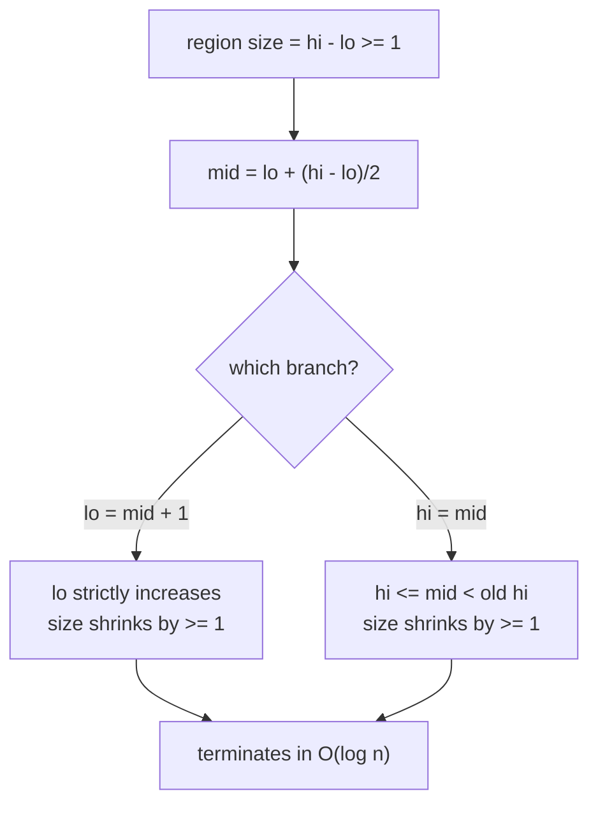

---

## Mid Overflow and `lo + (hi - lo) / 2`

The "obvious" midpoint `(lo + hi) / 2` can **overflow** when `lo + hi` exceeds the integer maximum, even though both `lo` and `hi` individually fit. The famously safe form

$$mid = lo + \left\lfloor \frac{hi - lo}{2} \right\rfloor$$

computes the same value but the intermediate `hi - lo` is always within range (it is at most the array size). In C++ prefer `long long` to be doubly safe on large bounds; in Python integers are arbitrary precision so overflow cannot happen, but we still write the same form for parity and to teach the habit.

```python
mid = lo + (hi - lo) // 2   # overflow-proof midpoint (also fine in C++)
```

```cpp
#include <bits/stdc++.h>
using namespace std;

long long safe_mid(long long lo, long long hi) {
    return lo + (hi - lo) / 2;   // never overflows; lo + hi might
}
```

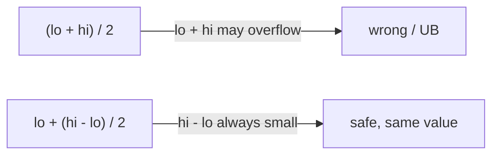

---

## Binary Search on a Rotated Array (Brief)

A **rotated sorted array** like `[6, 7, 9, 1, 3, 5]` is two sorted runs glued together. Plain binary search breaks because the global order is gone — but at any `mid` **at least one side** $[lo, mid]$ or $[mid, hi)$ is still perfectly sorted. We detect which half is sorted, check whether the target lies within that sorted half's range, and recurse into the correct side. The structure is identical; only the branch test grows.

```python
def search_rotated(a, x):
    lo, hi = 0, len(a)          # half-open [lo, hi)
    while lo < hi:
        mid = lo + (hi - lo) // 2
        if a[mid] == x:
            return mid
        if a[lo] <= a[mid]:                 # left half [lo, mid] is sorted
            if a[lo] <= x < a[mid]:
                hi = mid                    # target in sorted left half
            else:
                lo = mid + 1
        else:                               # right half is sorted
            if a[mid] < x <= a[hi - 1]:
                lo = mid + 1                # target in sorted right half
            else:
                hi = mid
    return -1
```

```cpp
#include <bits/stdc++.h>
using namespace std;

int search_rotated(const vector<long long>& a, long long x) {
    long long lo = 0, hi = (long long)a.size();   // half-open [lo, hi)
    while (lo < hi) {
        long long mid = lo + (hi - lo) / 2;
        if (a[mid] == x) return (int)mid;
        if (a[lo] <= a[mid]) {                     // left half [lo, mid] sorted
            if (a[lo] <= x && x < a[mid]) hi = mid;
            else lo = mid + 1;
        } else {                                   // right half is sorted
            if (a[mid] < x && x <= a[hi - 1]) lo = mid + 1;
            else hi = mid;
        }
    }
    return -1;
}
```

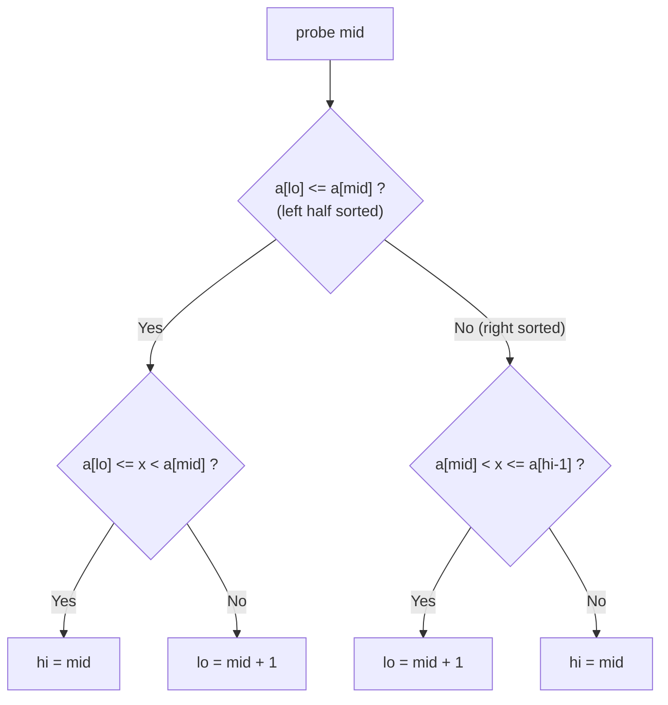

---

## STL / `bisect` Equivalents

You rarely need to hand-roll these in a contest — the standard libraries ship battle-tested versions. Know the mapping so you can reach for them instantly:

| Concept | Python (`bisect`) | C++ (`<algorithm>`) |
|---|---|---|
| First index $\ge x$ | `bisect_left(a, x)` | `lower_bound(a.begin(), a.end(), x)` |
| First index $> x$ | `bisect_right(a, x)` | `upper_bound(a.begin(), a.end(), x)` |
| Insert keeping sorted | `insort(a, x)` | manual `insert` at `lower_bound` |
| Membership | `i = bisect_left(a, x); a[i] == x` | `binary_search(a.begin(), a.end(), x)` |

The C++ `lower_bound` / `upper_bound` return **iterators**; subtract `a.begin()` to get an index. Both run in $O(\log n)$ on random-access iterators (e.g. `vector`).

```python
from bisect import bisect_left, bisect_right

def stl_style(a, x):
    L = bisect_left(a, x)       # == lower_bound
    R = bisect_right(a, x)      # == upper_bound
    present = L < len(a) and a[L] == x
    return L, R, R - L, present
```

```cpp
#include <bits/stdc++.h>
using namespace std;

tuple<long long, long long, long long, bool>
stl_style(const vector<long long>& a, long long x) {
    long long L = lower_bound(a.begin(), a.end(), x) - a.begin();
    long long R = upper_bound(a.begin(), a.end(), x) - a.begin();
    bool present = (L < (long long)a.size() && a[L] == x);
    return {L, R, R - L, present};
}
```

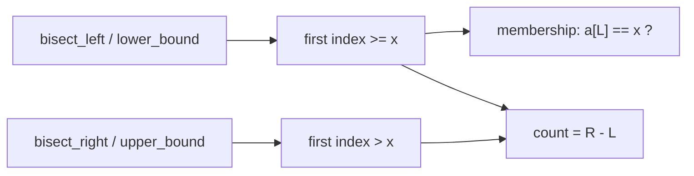

---

## Complexity Summary

Each iteration halves the candidate region, so the loop runs at most $\lceil \log_2 n \rceil$ times. Every iteration does $O(1)$ work.

| Operation | Time | Space |
|---|---|---|
| Exact search | $O(\log n)$ | $O(1)$ |
| `lower_bound` / `upper_bound` | $O(\log n)$ | $O(1)$ |
| Count occurrences | $O(\log n)$ | $O(1)$ |
| Rotated-array search | $O(\log n)$ | $O(1)$ |
| **Prerequisite: sort** (if unsorted) | $O(n \log n)$ | $O(1)$–$O(n)$ |

The recurrence is $T(n) = T(n/2) + O(1)$, which by the Master Theorem gives $T(n) = O(\log n)$:

$$T(n) = T\!\left(\frac{n}{2}\right) + O(1) \;\Longrightarrow\; T(n) = O(\log n).$$

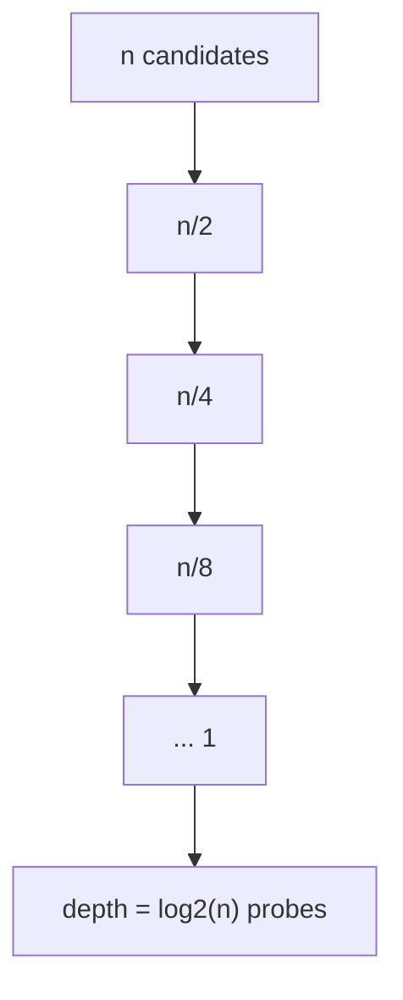

---

## Common Pitfalls

- **Off-by-one in bounds.** Mixing half-open and closed conventions (`hi = n` with `lo <= hi`) reads `a[n]`. Pick one convention and use *all* of its rows.
- **Infinite loop.** Using `hi = mid` together with a midpoint that rounds *up* lets `mid == hi`, so the region never shrinks. Always use `mid = lo + (hi - lo) / 2`.
- **Mid overflow.** `(lo + hi) / 2` overflows for large bounds; use `lo + (hi - lo) / 2` and `long long` in C++.
- **Unsorted input.** Binary search is *only* valid on data sorted by the key you compare. An unsorted array gives silently wrong answers — sort first (or confirm the invariant holds) before searching.
- **Wrong primitive.** Reaching for exact-match when you actually need an insertion point. Default to `lower_bound`; derive everything else from it.

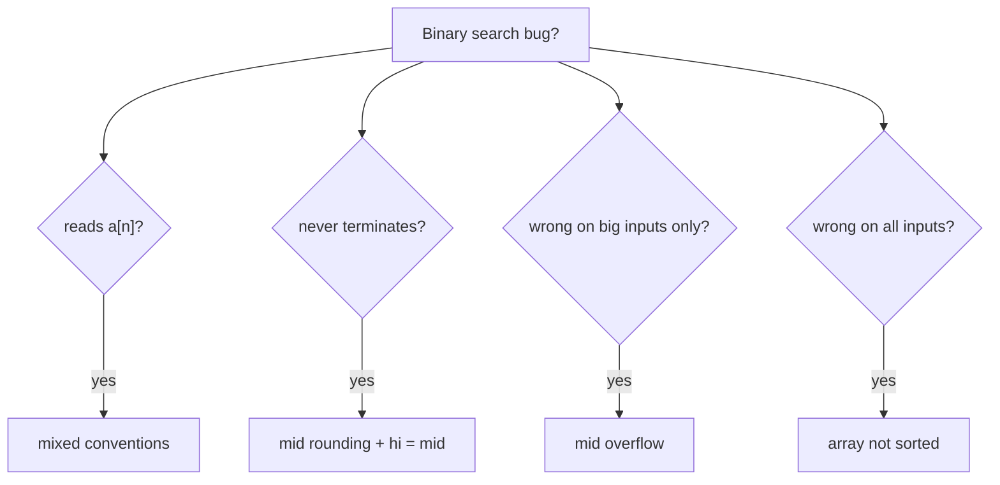

---

## Patterns

- **Pin an invariant first, write code second.** Decide what $[lo, hi)$ *means* before touching the loop body.
- **Build everything from `lower_bound`.** Exact search, `upper_bound` (flip `<` to `<=`), counting (`upper - lower`), and insert-position are all one tweak away.
- **Half-open by default.** $[lo, hi)$ makes size arithmetic ($hi - lo$) and the empty test ($lo = hi$) trivial, and lets the answer be $n$ naturally.
- **Trace with a `lo`/`mid`/`hi` table** when debugging — one line per iteration exposes a stuck region or a bad update instantly.
- **Prefer the library** (`bisect`, `lower_bound`/`upper_bound`) in contests; hand-roll only when you need a custom predicate (binary search on the *answer*).
