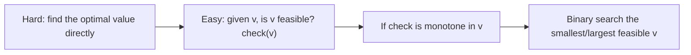
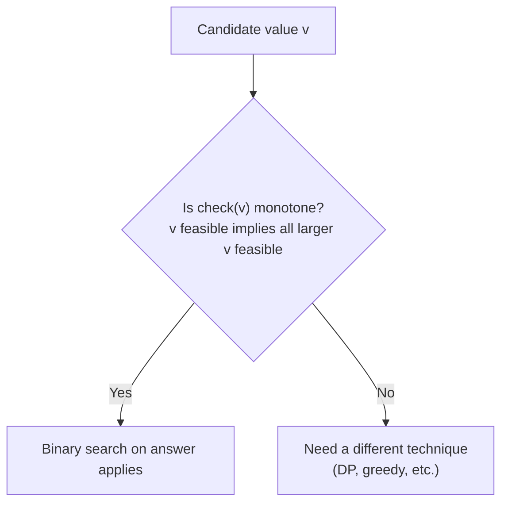
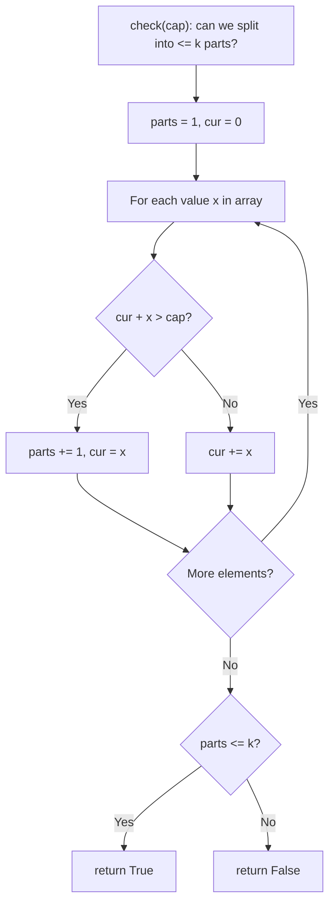
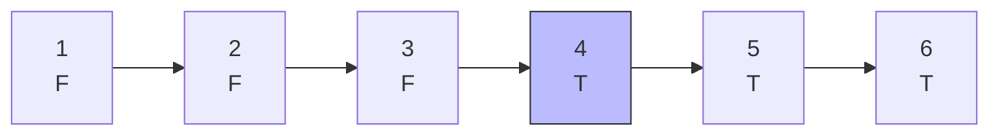
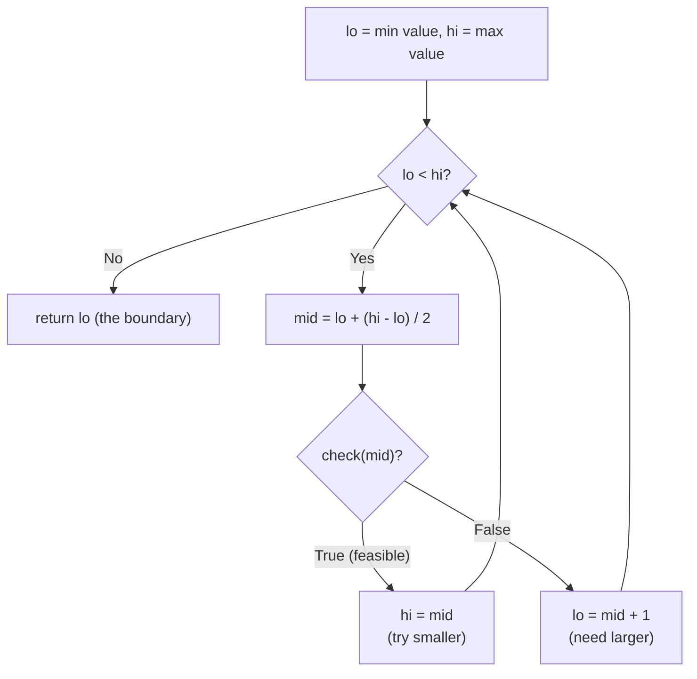
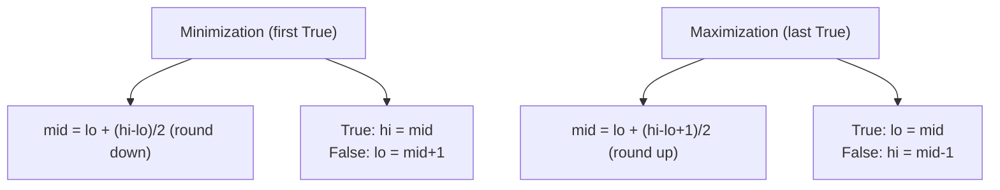
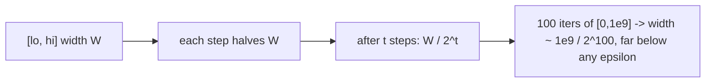
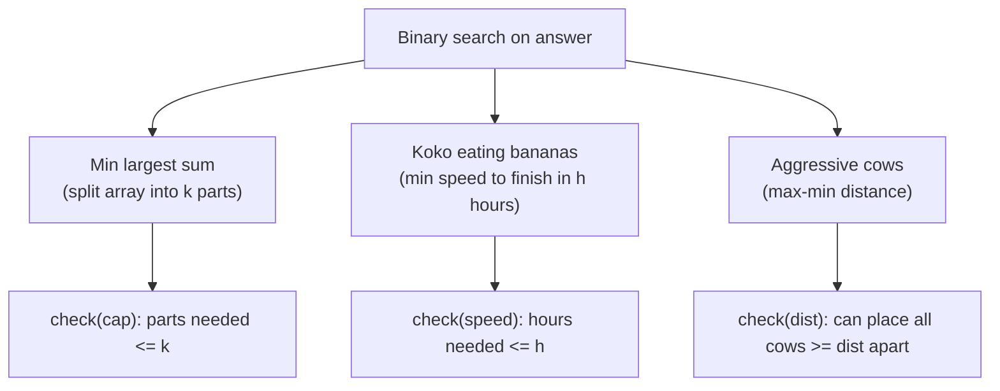

# Binary Search on the Answer — Complete Guide (Beginner → Advanced)

> Sometimes you cannot directly *compute* the answer, but you **can easily check**:
> "is a given value $v$ good enough?" When the set of good values forms a contiguous
> block — every value past some threshold is good, and everything before it is bad —
> the answer is **monotone**, and you can **binary search the answer**.
>
> The trick: replace "find the optimum" with "find the boundary of a boolean predicate
> `check(v)`". You binary search over the *value range* (not over array indices), and at
> each step you run a feasibility test — usually a small greedy or simulation.
>
> This guide teaches you to (1) **recognize monotonicity**, (2) design the boolean
> `check(mid)`, (3) picture the `FFFF...TTTT` strip and locate the boundary, (4) pick the
> right **minimization vs maximization** template, and (5) handle **real-valued** answers.

---

## Table of Contents
1. [The Core Idea](#1-the-core-idea)
2. [Recognizing Monotonicity](#2-recognizing-monotonicity)
3. [Designing the Boolean `check(mid)`](#3-designing-the-boolean-checkmid)
4. [The FFFF...TTTT Picture and the Boundary](#4-the-fffftttt-picture-and-the-boundary)
5. [Minimization vs Maximization Templates](#5-minimization-vs-maximization-templates)
6. [Binary Search Over Real Numbers](#6-binary-search-over-real-numbers)
7. [Classic Examples](#7-classic-examples)
8. [Complexity Summary](#complexity-summary)
9. [Common Pitfalls](#common-pitfalls)
10. [Patterns](#patterns)

---

## 1. The Core Idea

Standard binary search finds a target inside a **sorted array**. *Binary search on the
answer* searches a **range of candidate answers** instead, using a predicate to decide
which half to keep.



The whole method rests on **one property**: as $v$ increases, `check(v)` flips from `False`
to `True` exactly once (or `True` to `False`). If that holds, we never have to test every
$v$ — we bisect.

$$
\text{answer} = \min\{\, v : \texttt{check}(v) = \text{True} \,\}
\quad\text{(minimization form)}
$$

---

## 2. Recognizing Monotonicity

Ask: **"If $v$ works, does $v+1$ also work?"** (or "does $v-1$ also work?"). If yes, the
predicate is monotone and you can bisect.



Typical signals that the answer is monotone:

| Signal | Example |
|---|---|
| "Minimize the maximum ..." | minimize the largest subarray sum |
| "Maximize the minimum ..." | maximize the smallest gap between cows |
| "Smallest speed/rate so finish in time" | Koko eating bananas |
| "Largest $x$ such that some budget holds" | resource allocation |
| Bigger budget/capacity never hurts | packing, scheduling |

The litmus test: **more resource (speed, capacity, distance budget) can only help, never
hurt.** That guarantees a clean `FFFF...TTTT` (or `TTTT...FFFF`) strip.

---

## 3. Designing the Boolean `check(mid)`

`check(mid)` answers a *yes/no* question and is almost always simpler than the original
optimization. It is commonly a **greedy** sweep or a **simulation**.

For "minimize the largest piece when splitting an array into $k$ parts", the check is:
*"Using a cap of `mid` per part, can we fit within $k$ parts?"* Greedily extend the current
part; start a new part when it would overflow.



Here is that concrete `check` in both languages.

```python
def check(nums, k, cap):
    # Can we split nums into at most k contiguous parts,
    # each with sum <= cap?
    parts = 1
    cur = 0
    for x in nums:
        if cur + x > cap:
            parts += 1
            cur = x
        else:
            cur += x
    return parts <= k
```

```cpp
bool check(const vector<long long>& nums, long long k, long long cap) {
    // Can we split nums into at most k contiguous parts,
    // each with sum <= cap?
    long long parts = 1, cur = 0;
    for (long long x : nums) {
        if (cur + x > cap) {
            parts += 1;
            cur = x;
        } else {
            cur += x;
        }
    }
    return parts <= k;
}
```

Two correctness requirements for `check`:

1. **Monotone**: a larger `cap` must never increase the number of parts needed.
2. **Decisive**: it returns a clean boolean, no ties or "maybe".

---

## 4. The FFFF...TTTT Picture and the Boundary

Lay the candidate values on a line and mark each with the predicate result. For a
minimization problem the strip looks like this — all `F` then all `T`, and we want the
**first** `T`.



The boundary (here at value `4`) is the answer. Binary search converges on it: keep a
window $[lo, hi]$, test `mid`, and discard the half that cannot contain the boundary.



Note the asymmetric update: on `True` we keep `mid` (`hi = mid`), on `False` we exclude it
(`lo = mid + 1`). This finds the **smallest** feasible value.

---

## 5. Minimization vs Maximization Templates

### Minimization — smallest feasible value (`FFFF...TTTT`, want first `T`)

```python
def min_feasible(lo, hi, check):
    # smallest v in [lo, hi] with check(v) True
    while lo < hi:
        mid = lo + (hi - lo) // 2
        if check(mid):
            hi = mid
        else:
            lo = mid + 1
    return lo
```

```cpp
long long min_feasible(long long lo, long long hi, function<bool(long long)> check) {
    // smallest v in [lo, hi] with check(v) True
    while (lo < hi) {
        long long mid = lo + (hi - lo) / 2;
        if (check(mid)) {
            hi = mid;
        } else {
            lo = mid + 1;
        }
    }
    return lo;
}
```

### Maximization — largest feasible value (`TTTT...FFFF`, want last `T`)

```python
def max_feasible(lo, hi, check):
    # largest v in [lo, hi] with check(v) True
    while lo < hi:
        mid = lo + (hi - lo + 1) // 2  # bias mid UP to avoid infinite loop
        if check(mid):
            lo = mid
        else:
            hi = mid - 1
    return lo
```

```cpp
long long max_feasible(long long lo, long long hi, function<bool(long long)> check) {
    // largest v in [lo, hi] with check(v) True
    while (lo < hi) {
        long long mid = lo + (hi - lo + 1) / 2; // bias mid UP
        if (check(mid)) {
            lo = mid;
        } else {
            hi = mid - 1;
        }
    }
    return lo;
}
```

The two templates differ in exactly two spots: **mid rounding** and **which bound keeps
`mid`**. Memorize the pairing:



> **Why round up for maximization?** When `lo` and `hi` are adjacent and `mid` rounds down,
> `mid == lo`; a `True` result sets `lo = mid = lo` and the loop never ends. Rounding up
> breaks that tie.

---

## 6. Binary Search Over Real Numbers

When the answer is a real value (a distance, a ratio, a time), you cannot do `lo = mid + 1`.
Instead, shrink the interval either a **fixed number of iterations** or until the width is
below an epsilon $\varepsilon$.



```python
def real_search(lo, hi, check, iters=100):
    # smallest feasible real value, fixed iteration count
    for _ in range(iters):
        mid = (lo + hi) / 2.0
        if check(mid):
            hi = mid
        else:
            lo = mid
    return lo
```

```cpp
double real_search(double lo, double hi, function<bool(double)> check, int iters = 100) {
    // smallest feasible real value, fixed iteration count
    for (int i = 0; i < iters; i++) {
        double mid = (lo + hi) / 2.0;
        if (check(mid)) {
            hi = mid;
        } else {
            lo = mid;
        }
    }
    return lo;
}
```

A **fixed iteration count** (e.g. 100) is the safest choice: it avoids the rare infinite
loop that an `hi - lo > eps` condition can hit due to floating-point rounding, and 100
halvings shrink any reasonable range below machine precision.

---

## 7. Classic Examples



| Problem | Search variable | `check(v)` | Direction |
|---|---|---|---|
| Min largest sum (LC 410) | per-part cap | parts needed $\le k$ | minimize (first T) |
| Koko bananas (LC 875) | eating speed | hours needed $\le h$ | minimize (first T) |
| Aggressive cows | gap distance | can place all $c$ cows | maximize (last T) |

All three share the same skeleton: **bound the value range, run a greedy `check`, bisect.**
Only the predicate and the direction change.

---

## Complexity Summary

Let $n$ be the input size and $R$ the size of the answer range (`hi - lo`).

| Quantity | Cost |
|---|---|
| Iterations of binary search | $O(\log R)$ |
| Work per iteration (`check`) | $O(n)$ typically |
| **Total** | $O(n \log R)$ |
| Real-valued version | $O(n \cdot \text{iters})$, iters $\approx 100$ |

Because $\log R$ is tiny (e.g. $\log_2 10^{18} \approx 60$), this is essentially linear with
a small constant factor — far better than scanning every candidate value.

---

## Common Pitfalls

- **Wrong bounds.** `lo` must be feasible-or-below and `hi` must be feasible-or-above so the
  boundary lives inside `[lo, hi]`. For min-largest-sum, `lo = max(nums)` (a part can't be
  smaller than its biggest element) and `hi = sum(nums)`.
- **Predicate not monotone.** If `check` flips back and forth, binary search returns garbage.
  Always argue "more resource never hurts" before bisecting.
- **Integer vs real.** Use `lo = mid + 1` only for integers; for reals use fixed iterations.
- **Off-by-one on min/max.** Minimization rounds `mid` down and does `hi = mid`; maximization
  rounds `mid` up and does `lo = mid`. Mixing them causes infinite loops or wrong answers.
- **Overflow.** Sums and products can exceed 32-bit range; use `long long` and
  `const long long INF = 1e18` for sentinels.

---

## Patterns

- **"Minimize the maximum" / "maximize the minimum"** → almost always binary search on answer.
- **The optimum is hard but feasibility is easy** → invert the problem into a predicate.
- **Greedy as the checker** → most `check(mid)` functions are a single greedy pass.
- **Pick the template by the strip shape** → `FFFF...TTTT` (minimize, first T) vs
  `TTTT...FFFF` (maximize, last T).
- **Real answers** → fixed iteration count instead of `mid ± 1`.
