# Ternary Search on Unimodal Functions

**Ternary search** finds the extremum (maximum or minimum) of a **unimodal** function by probing
**two** interior points $m_1, m_2$ inside the current search interval and discarding the *worse*
outer third. Because we always throw away a fixed fraction of the interval, the number of probes is
**logarithmic** in the interval size (or precision). It is the natural analogue of binary search for
problems where there is no monotone *yes/no* predicate, but there *is* a single peak or valley.

The key intuition: binary search needs a monotone boolean test. Ternary search instead needs a
**single turning point** — the function goes one way, then the other. By comparing the function at
two interior probes we learn which side the turning point cannot be on, and shrink toward it.

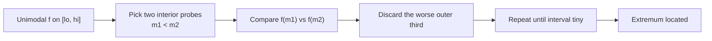

---

## Table of Contents

1. [What 'unimodal' means](#what-unimodal-means)
2. [Real-valued ternary search](#real-valued-ternary-search)
3. [Integer ternary search variant](#integer-ternary-search-variant)
4. [Discrete ternary search on arrays (bitonic)](#discrete-ternary-search-on-arrays-bitonic)
5. [Comparison vs binary search on the derivative](#comparison-vs-binary-search-on-the-derivative)
6. [Common applications](#common-applications)
7. [Complexity Summary](#complexity-summary)
8. [Common Pitfalls](#common-pitfalls)
9. [Patterns](#patterns)

---

## What 'unimodal' means

A function $f$ on an interval $[lo, hi]$ is **unimodal** if it has exactly one "turn". Two common
flavours:

- **Strictly increasing then strictly decreasing** (a single *peak* / maximum), or
- **Strictly decreasing then strictly increasing** (a single *valley* / minimum).

Every **strictly convex** function is unimodal with a minimum; every **strictly concave** function is
unimodal with a maximum. The defining property we rely on is: as you move from one end toward the
extremum the value improves monotonically, and as you continue past it the value worsens
monotonically.

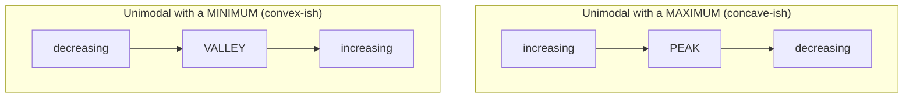

A rough ASCII picture of the maximum case (the shape ternary search exploits):

```text
value
  |          *           <- single peak
  |        *   *
  |      *       *
  |    *           *
  |  *               *
  +----------------------> x
   lo                 hi
```

The decision rule for a function with a **maximum**: pick $m_1 < m_2$. If $f(m_1) < f(m_2)$ the peak
must lie to the right of $m_1$, so we move `lo = m1`. Otherwise the peak lies to the left of $m_2$,
so we move `hi = m2`. Either way one outer third disappears.

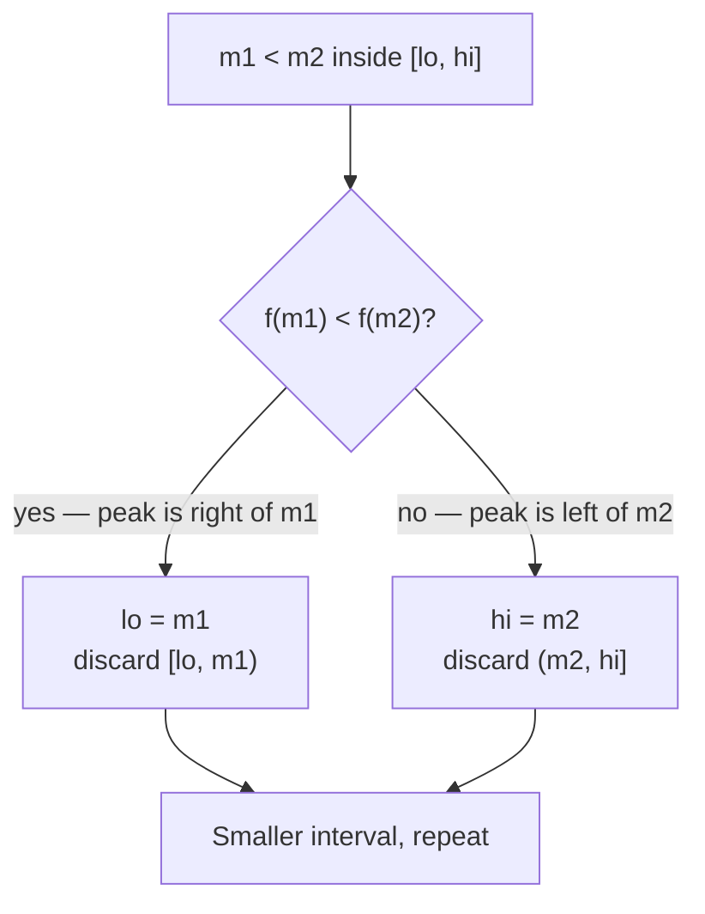

For a function with a **minimum**, flip the comparison: keep the side with the *smaller* value.

---

## Real-valued ternary search

When $x$ is a real number we cannot reach exact equality, so we either run a **fixed number of
iterations** (each iteration multiplies the interval width by $2/3$) or loop until `hi - lo` is below
an epsilon. A fixed iteration count is preferred in contests because it avoids subtle
infinite-loop / precision traps.

How many iterations? After $k$ iterations the width is $(2/3)^k (hi - lo)$. To reach precision
$\varepsilon$ we need

$$
\left(\tfrac{2}{3}\right)^k (hi - lo) \le \varepsilon
\quad\Longrightarrow\quad
k \ge \frac{\log\!\big((hi-lo)/\varepsilon\big)}{\log(3/2)}.
$$

Roughly **200 iterations** crush any reasonable interval far below `double` precision, so a fixed
`for` loop is both simple and safe.

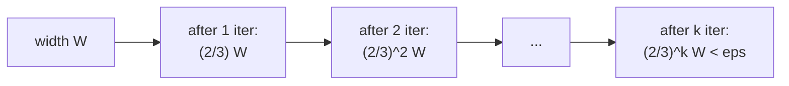

Here we minimize a unimodal (convex) function `f`. We keep the side with the smaller value.

```python
def ternary_search_min(f, lo, hi, iters=200):
    # Returns x in [lo, hi] minimizing the unimodal function f.
    for _ in range(iters):
        m1 = lo + (hi - lo) / 3.0
        m2 = hi - (hi - lo) / 3.0
        if f(m1) < f(m2):
            hi = m2          # minimum is left of m2
        else:
            lo = m1          # minimum is right of m1
    return (lo + hi) / 2.0
```

```cpp
#include <bits/stdc++.h>
using namespace std;

double ternary_search_min(function<double(double)> f, double lo, double hi, int iters = 200) {
    // Returns x in [lo, hi] minimizing the unimodal function f.
    for (int i = 0; i < iters; ++i) {
        double m1 = lo + (hi - lo) / 3.0;
        double m2 = hi - (hi - lo) / 3.0;
        if (f(m1) < f(m2))
            hi = m2;         // minimum is left of m2
        else
            lo = m1;         // minimum is right of m1
    }
    return (lo + hi) / 2.0;
}
```

To **maximize** instead, flip the comparison (`f(m1) > f(m2)` keeps `lo = m1`), or simply minimize
`-f`.

---

## Integer ternary search variant

When the domain is integral we cannot iterate forever — the probes can collide and stall. The robust
recipe: **shrink with ternary steps while the window is wide, then linearly scan the tiny leftover
window** (a handful of elements). A common cutoff is "while `hi - lo > 2`".

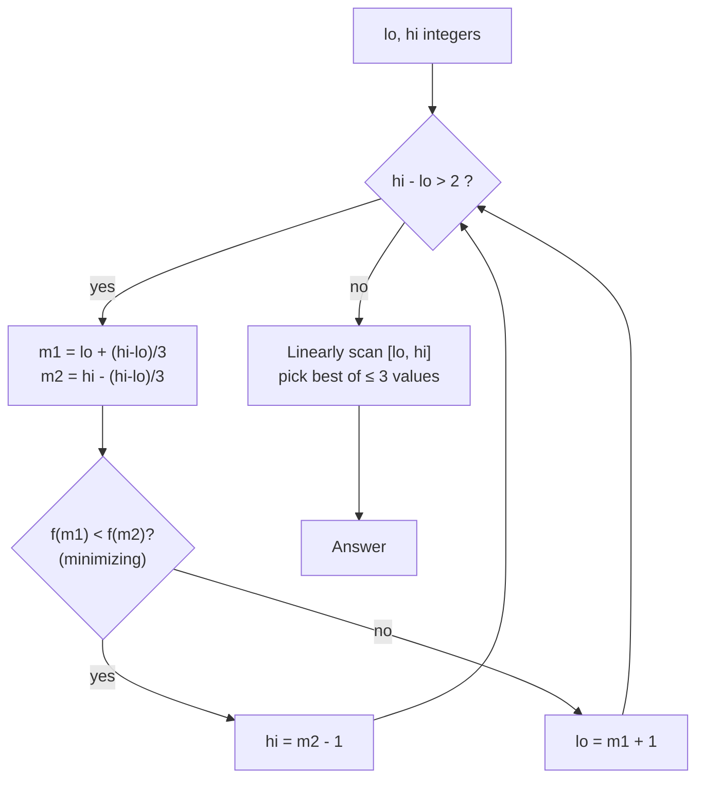

Notice the contrast with the real case: integers need a small final scan because rounding the probes
can leave the true extremum just outside the shrunk window unless we sweep the last few cells.

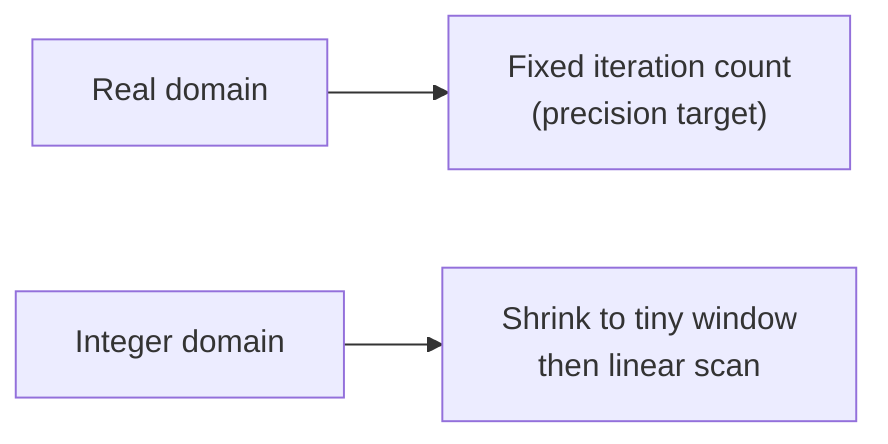

Integer ternary search minimizing an integer-valued unimodal function `f(i)` over `[lo, hi]`:

```python
def ternary_search_min_int(f, lo, hi):
    # Returns an integer x in [lo, hi] minimizing the unimodal f.
    while hi - lo > 2:
        m1 = lo + (hi - lo) // 3
        m2 = hi - (hi - lo) // 3
        if f(m1) < f(m2):
            hi = m2 - 1
        else:
            lo = m1 + 1
    best = lo
    for x in range(lo + 1, hi + 1):
        if f(x) < f(best):
            best = x
    return best
```

```cpp
#include <bits/stdc++.h>
using namespace std;

long long ternary_search_min_int(function<long long(long long)> f, long long lo, long long hi) {
    // Returns an integer x in [lo, hi] minimizing the unimodal f.
    while (hi - lo > 2) {
        long long m1 = lo + (hi - lo) / 3;
        long long m2 = hi - (hi - lo) / 3;
        if (f(m1) < f(m2))
            hi = m2 - 1;
        else
            lo = m1 + 1;
    }
    long long best = lo;
    for (long long x = lo + 1; x <= hi; ++x)
        if (f(x) < f(best))
            best = x;
    return best;
}
```

---

## Discrete ternary search on arrays (bitonic)

A **bitonic** array strictly increases to a single peak then strictly decreases (e.g.
`[1, 3, 8, 12, 4, 2]`). Finding the peak is exactly maximizing a unimodal function where the "domain"
is the set of indices and `f(i) = a[i]`.

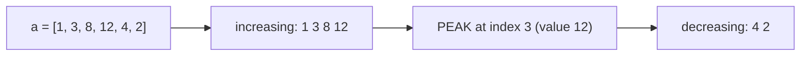

We compare neighbours `a[mid]` and `a[mid+1]` to decide direction — this is the cleanest discrete
form (a one-probe variant that still exploits unimodality):

```python
def peak_index_bitonic(a):
    # a is strictly increasing then strictly decreasing; return the peak index.
    lo, hi = 0, len(a) - 1
    while lo < hi:
        mid = (lo + hi) // 2
        if a[mid] < a[mid + 1]:
            lo = mid + 1     # still ascending; peak is to the right
        else:
            hi = mid         # descending (or at peak); peak is mid or left
    return lo
```

```cpp
#include <bits/stdc++.h>
using namespace std;

int peak_index_bitonic(const vector<int>& a) {
    // a is strictly increasing then strictly decreasing; return the peak index.
    int lo = 0, hi = (int)a.size() - 1;
    while (lo < hi) {
        int mid = (lo + hi) / 2;
        if (a[mid] < a[mid + 1])
            lo = mid + 1;    // still ascending; peak is to the right
        else
            hi = mid;        // descending (or at peak); peak is mid or left
    }
    return lo;
}
```

A true two-probe ternary form also works on the indices:

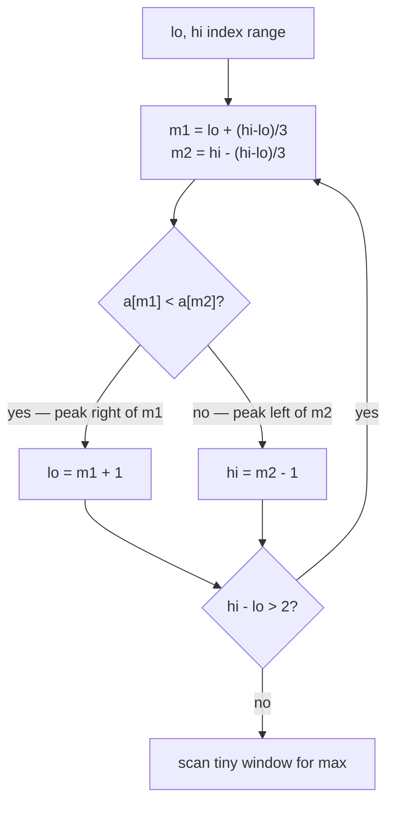

---

## Comparison vs binary search on the derivative

If a unimodal function has a (discrete) **derivative** that is monotone — positive while ascending,
negative while descending — then finding the peak is the same as binary-searching for the sign change
of the derivative. Ternary search avoids needing an explicit derivative; it works directly on the
values.

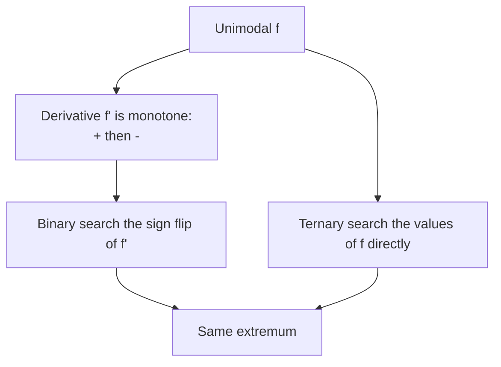

| Aspect | Binary search (on derivative / neighbour test) | Ternary search (on values) |
|--------|------------------------------------------------|----------------------------|
| Needs a monotone boolean? | Yes (sign of slope) | No |
| Probes per step | 1 | 2 |
| Shrink factor | $1/2$ | $1/3$ discarded ($\times 2/3$ kept) |
| Works on | monotone predicate | any unimodal value function |
| Typical use | "ascending vs descending" neighbour test | minimize/maximize a continuous cost |

For arrays, the neighbour-comparison binary search is usually the tidiest. For continuous costs with
no easy slope test, ternary search shines.

---

## Common applications

- **Minimize a convex cost.** A convex function of one parameter (e.g. total distance, total time,
  penalty) has a single minimum reachable by real ternary search.
- **Optimal point on a line / segment.** The distance from a moving point to a fixed target along a
  straight path is unimodal; ternary search the parameter $t$.
- **Parameter tuning.** When a single tuning knob produces a unimodal score, ternary search it
  instead of sweeping every value.
- **Peak of a bitonic / mountain array.** Classic discrete instance.

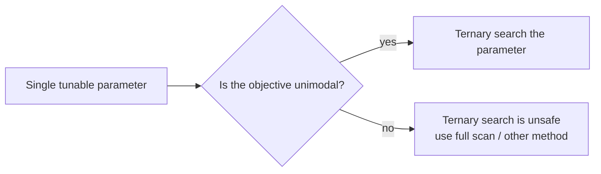

---

## Complexity Summary

| Variant | Probes / iterations | Per-probe cost | Total |
|---------|---------------------|----------------|-------|
| Real ternary search | $O\!\big(\log_{3/2}\frac{W}{\varepsilon}\big)$ (often fixed ~200) | $O(1)$ eval | $O(\log \frac{W}{\varepsilon})$ |
| Integer ternary search | $O(\log_{3/2}(hi-lo))$ + tiny scan | $O(1)$ eval | $O(\log(hi-lo))$ |
| Bitonic array peak | $O(\log n)$ | $O(1)$ | $O(\log n)$ |

Each step keeps a factor of $2/3$ of the interval, so the count is logarithmic in the
width-to-precision ratio. If each function evaluation costs $E$, multiply the totals by $E$.

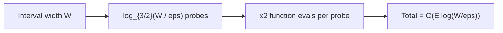

---

## Common Pitfalls

- **Function not actually unimodal.** Ternary search silently returns garbage on multi-modal or flat
  functions. Verify (or prove) unimodality before applying it. Plateaus (equal values) break strict
  decisions — perturb or use $\le$ carefully.
- **Wrong precision / iteration count.** Too few real iterations leaves you short of the optimum; an
  epsilon-based `while (hi - lo > eps)` can loop forever if `eps` is below `double` resolution. Prefer
  a fixed iteration count.
- **Integer boundary scan forgotten.** In the integer variant, stopping the shrink without the final
  linear scan over the tiny window can miss the true extremum by one cell. Always scan the leftover
  $\le 3$ values.
- **Comparing the wrong side.** Minimizing keeps the smaller value; maximizing keeps the larger. Mixing
  these flips the search away from the extremum.

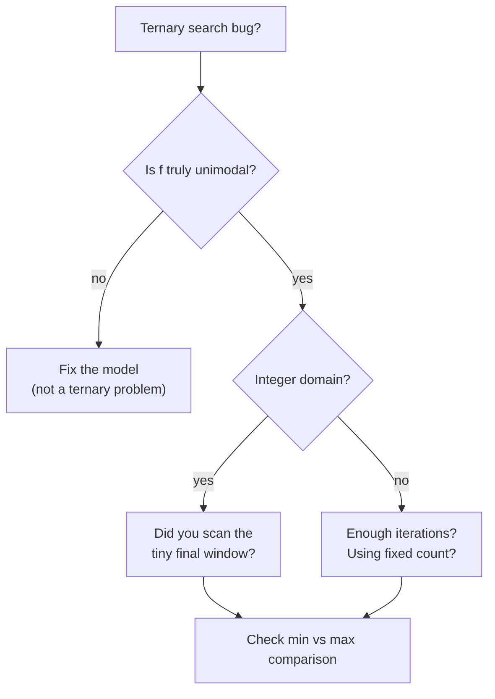

---

## Patterns

- **Two probes, discard a third:** `m1 = lo + (hi-lo)/3`, `m2 = hi - (hi-lo)/3`; keep the side
  containing the better value.
- **Fixed iterations for reals:** loop a constant number of times (≈100–200) instead of testing an
  epsilon, for predictable precision.
- **Shrink-then-scan for integers:** ternary-shrink while the window is wide, then brute-force the last
  few cells.
- **Neighbour test for arrays:** for a bitonic array, compare `a[mid]` with `a[mid+1]` to pick the
  ascending vs descending half — a one-probe specialization.
- **Maximize via negate:** to maximize `f`, ternary-minimize `-f` (or flip the comparison) so you reuse
  one implementation.

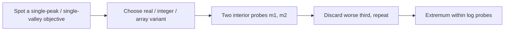
