# Two Pointers — Complete Guide (Beginner → Advanced)

> The **two pointers** technique uses two indices that walk through a sequence in a
> coordinated way, turning many naively $O(n^2)$ scans into a single $O(n)$ sweep. The
> trick works whenever the data has some **monotonic structure** (usually *sortedness*)
> that lets you decide, at each step, which pointer to move — and that decision can never
> "miss" a valid answer. This guide covers the two main flavors (pointers starting at
> **opposite ends** and converging, versus two pointers moving in the **same direction**),
> the invariant reasoning that proves correctness, the link to sliding window, and in-place
> partitioning.

---

## Table of Contents
1. [What Is a "Pointer" Here?](#1-what-is-a-pointer-here)
2. [Flavor A — Opposite Ends (Converging)](#2-flavor-a--opposite-ends-converging)
3. [Flavor B — Same Direction (Fast / Slow)](#3-flavor-b--same-direction-fast--slow)
4. [Why O(n²) Collapses to O(n)](#4-why-on2-collapses-to-on)
5. [Correctness via Invariants](#5-correctness-via-invariants)
6. [Relationship to Sliding Window](#6-relationship-to-sliding-window)
7. [In-Place Partitioning](#7-in-place-partitioning)
8. [Worked Code — Three Archetypes](#8-worked-code--three-archetypes)
9. [Complexity Summary](#complexity-summary)
10. [Common Pitfalls](#common-pitfalls)
11. [Patterns](#patterns)

---

## 1. What Is a "Pointer" Here?

A "pointer" is just an **index** into an array (or a node reference in a linked list). The
two-pointer idea is to maintain **two** of them and advance them under a rule so that, taken
together, they explore only the candidates that *could* be optimal — never the whole
$n \times n$ grid of pairs.

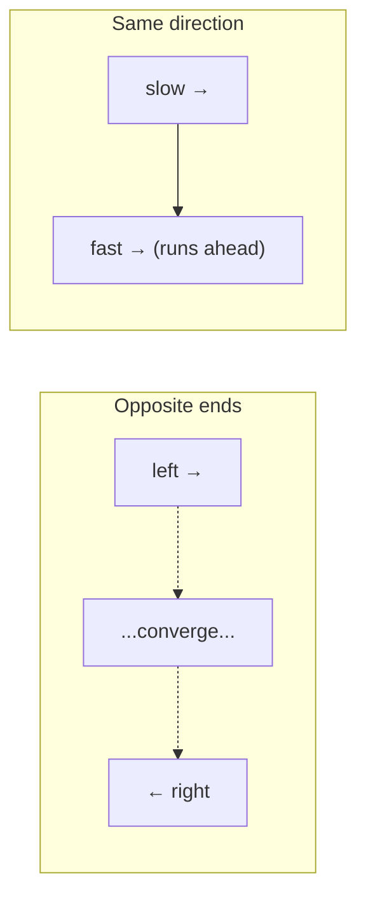

The two families differ in **where pointers start** and **how they move**:

| Flavor | Start | Movement | Typical use |
|---|---|---|---|
| Opposite ends | `left=0`, `right=n-1` | move toward each other | pair-sum (sorted), container with most water, palindrome check |
| Same direction | `slow=0`, `fast=0` | both move forward, `fast` leads | remove duplicates in place, partition, cycle detection |

---

## 2. Flavor A — Opposite Ends (Converging)

Pointers start at the two extremes and **squeeze inward** until they meet. Each step you
examine the pair `(a[left], a[right])` and move exactly **one** pointer based on a comparison.

### Example: pair-sum in a sorted array

Find whether two numbers in a **sorted** array add to a target. Compare `a[left]+a[right]`
to `target`:

- sum **too small** → we need a bigger value → move `left` right (increase the small end).
- sum **too big** → we need a smaller value → move `right` left (decrease the big end).
- sum **equal** → found it.

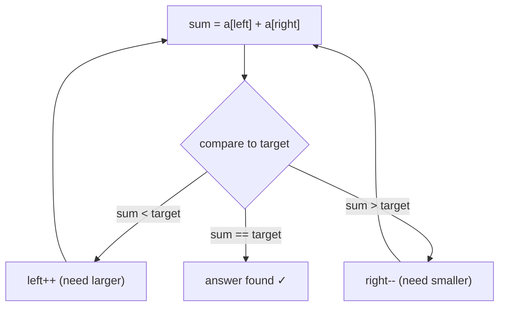

Pointer positions over time on `[1, 3, 4, 6, 8, 11]`, target `10`:

```mermaid
graph LR
    subgraph "step 0  sum=1+11=12 &gt; 10  → right--"
        a0["1"] --- b0["3"] --- c0["4"] --- d0["6"] --- e0["8"] --- f0["11"]
    end
    subgraph "step 1  sum=1+8=9 &lt; 10  → left++"
        a1["1"] --- b1["3"] --- c1["4"] --- d1["6"] --- e1["8"] --- f1["11"]
    end
    subgraph "step 2  sum=3+8=11 &gt; 10  → right--"
        a2["1"] --- b2["3"] --- c2["4"] --- d2["6"] --- e2["8"] --- f2["11"]
    end
    subgraph "step 3  sum=3+6=9 &lt; 10 → left++"
        a3["1"] --- b3["3"] --- c3["4"] --- d3["6"] --- e3["8"] --- f3["11"]
    end
    subgraph "step 4  sum=4+6=10 ✓"
        a4["1"] --- b4["3"] --- c4["4"] --- d4["6"] --- e4["8"] --- f4["11"]
    end
```

---

## 3. Flavor B — Same Direction (Fast / Slow)

Both pointers move forward, but at **different roles**: `fast` scans every element, while
`slow` marks the boundary of the "result so far". This is the engine behind **in-place**
array rewriting — compacting, deduping, partitioning — using $O(1)$ extra space.

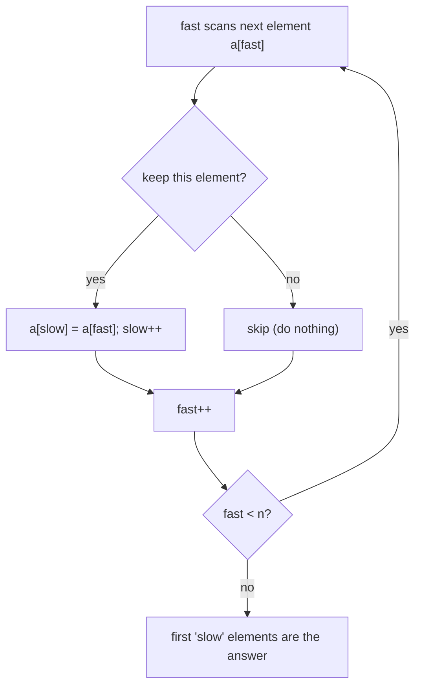

The invariant: everything left of `slow` is the finished, valid region; `fast` explores
ahead and feeds qualifying elements back to `slow`.

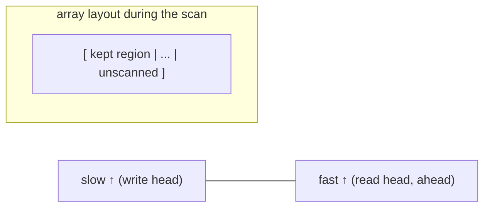

---

## 4. Why O(n²) Collapses to O(n)

The brute-force pair search tries **every** `(i, j)`:

$$
\binom{n}{2} = \frac{n(n-1)}{2} = O(n^2)
$$

Two pointers avoids this because **each step permanently advances one pointer toward the
other** (opposite ends) or **advances `fast`** (same direction). Neither pointer ever moves
backward, so the total number of moves is bounded by $n$ (converging) or $2n$ (fast/slow):

$$
\underbrace{O(n^2)}_{\text{check all pairs}} \;\longrightarrow\; \underbrace{O(n)}_{\text{monotone movement}}
$$

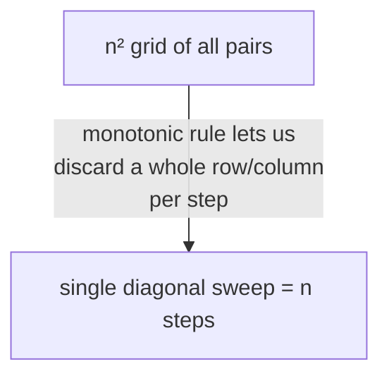

The key enabler is **monotonicity**: when the array is sorted, moving a pointer changes the
running quantity (a sum, an area) in a *predictable direction*, so we can safely throw away
candidates we'll never need.

---

## 5. Correctness via Invariants

Two-pointer proofs rest on an **invariant** plus an **exchange/elimination argument**.

For sorted pair-sum, the invariant is:

> Every pair using an index **outside** the current `[left, right]` window has already been
> correctly ruled out.

When `a[left] + a[right] < target`, *every* pair `(left, k)` for `k ≤ right` is also `<
target` (because `a[k] ≤ a[right]`), so `left` can never be part of a solution with anything
at or below `right`. Hence it's safe to discard `left` by doing `left++`. A symmetric
argument justifies `right--`. No valid pair is ever skipped.

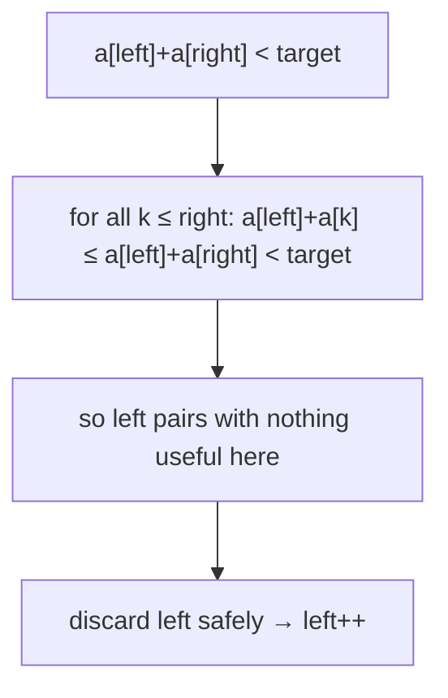

---

## 6. Relationship to Sliding Window

A **sliding window** is a *special case* of two same-direction pointers where `left` and
`right` bound a contiguous segment, and the window grows/shrinks to maintain a constraint
(e.g., "sum ≤ K", "all distinct"). The difference is the *movement rule*:

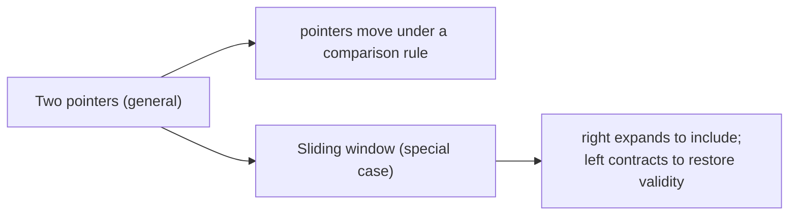

| Aspect | Converging two pointers | Sliding window |
|---|---|---|
| Pointers | start apart, meet | both start left, `right` leads |
| Region of interest | the pair `(left, right)` | the segment `[left, right]` |
| Move trigger | comparison vs target | window validity (constraint) |

So if you understand two pointers, sliding window is the same idea applied to a **contiguous
range** instead of a **pair**.

---

## 7. In-Place Partitioning

The same-direction pattern shines for **partitioning**: rearranging an array so all elements
satisfying a predicate come before those that don't — in $O(n)$ time and $O(1)$ space. This
is exactly Lomuto's partition (the heart of quicksort) and the "move zeros to end" family.

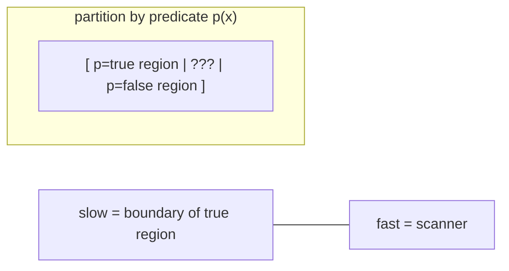

`fast` scans; whenever `p(a[fast])` holds, we swap it into the `slow` slot and advance
`slow`. After the scan, `[0, slow)` holds all true-predicate elements.

---

## 8. Worked Code — Three Archetypes

### 8.1 Two-sum in a sorted array (opposite ends)

```python
def two_sum_sorted(a, target):
    left, right = 0, len(a) - 1
    while left < right:
        s = a[left] + a[right]
        if s == target:
            return (left, right)
        elif s < target:
            left += 1          # need a larger sum
        else:
            right -= 1         # need a smaller sum
    return (-1, -1)
```

```cpp
#include <bits/stdc++.h>
using namespace std;

pair<int,int> two_sum_sorted(const vector<long long>& a, long long target) {
    int left = 0, right = (int)a.size() - 1;
    while (left < right) {
        long long s = a[left] + a[right];
        if (s == target) {
            return {left, right};
        } else if (s < target) {
            ++left;            // need a larger sum
        } else {
            --right;           // need a smaller sum
        }
    }
    return {-1, -1};
}
```

### 8.2 Remove duplicates in place (same direction)

Given a **sorted** array, keep one copy of each value, compacting toward the front.

```python
def dedupe_sorted(a):
    if not a:
        return 0
    slow = 0                      # last write position
    for fast in range(1, len(a)):
        if a[fast] != a[slow]:
            slow += 1
            a[slow] = a[fast]     # write next unique value
    return slow + 1               # new length
```

```cpp
#include <bits/stdc++.h>
using namespace std;

int dedupe_sorted(vector<long long>& a) {
    if (a.empty()) {
        return 0;
    }
    int slow = 0;                 // last write position
    for (int fast = 1; fast < (int)a.size(); ++fast) {
        if (a[fast] != a[slow]) {
            ++slow;
            a[slow] = a[fast];    // write next unique value
        }
    }
    return slow + 1;              // new length
}
```

Trace of dedupe on `[1, 1, 2, 3, 3, 3, 4]`:

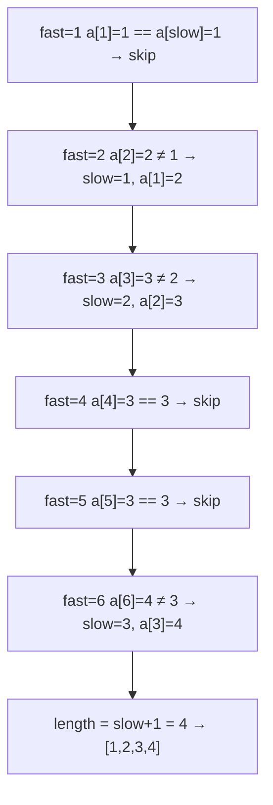

### 8.3 Container with most water (opposite ends, area)

Two vertical lines form a container; area = width × shorter height. Start wide and always
move the **shorter** wall inward — moving the taller one can never help.

```python
def max_area(height):
    left, right = 0, len(height) - 1
    best = 0
    while left < right:
        h = min(height[left], height[right])
        best = max(best, h * (right - left))
        if height[left] < height[right]:
            left += 1          # discard the shorter wall
        else:
            right -= 1
    return best
```

```cpp
#include <bits/stdc++.h>
using namespace std;

long long max_area(const vector<long long>& height) {
    int left = 0, right = (int)height.size() - 1;
    long long best = 0;
    while (left < right) {
        long long h = min(height[left], height[right]);
        best = max(best, h * (long long)(right - left));
        if (height[left] < height[right]) {
            ++left;            // discard the shorter wall
        } else {
            --right;
        }
    }
    return best;
}
```

Why moving the shorter wall is safe:

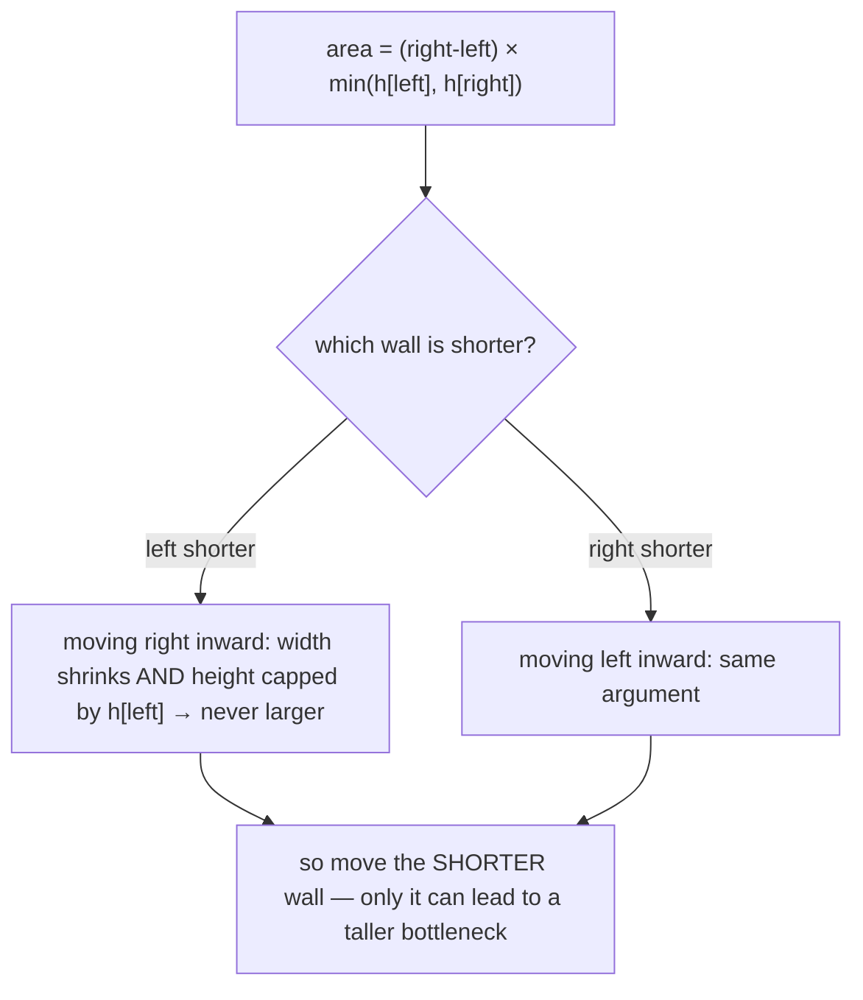

---

## Complexity Summary

| Operation | Time | Space | Note |
|---|---|---|---|
| Converging pair scan | $O(n)$ | $O(1)$ | each step moves one pointer inward |
| Fast/slow compaction | $O(n)$ | $O(1)$ | in place, single pass |
| Container with most water | $O(n)$ | $O(1)$ | one sweep, no sorting |
| 3Sum (sort + two pointers) | $O(n^2)$ | $O(1)$* | outer loop × inner two-pointer |

\* excluding the output list and sort's stack.

The dominant win: a sorted/monotone structure replaces a quadratic pair search with a linear
sweep. When sorting is required first, the cost is $O(n \log n)$ to sort plus $O(n)$ (or
$O(n^2)$ for 3Sum) for the sweep.

---

## Common Pitfalls

1. **Moving the wrong pointer.** In converging problems the move must *follow the
   comparison*. Reversing it (e.g., decreasing `right` when the sum is too small) skips valid
   pairs and gives wrong answers.
2. **Forgetting the input must be sorted.** Opposite-ends pair-sum and 3Sum rely on
   monotonicity. On unsorted data the elimination argument collapses — sort first, or use a
   hash set instead.
3. **Off-by-one on the loop bound.** Use `while left < right` (strict) for pair problems so a
   single element isn't paired with itself; use `left <= right` only when a middle element is
   meaningful (e.g., palindrome center).
4. **Not skipping duplicates** (3Sum-style problems) → duplicate triplets in the output.
5. **Integer overflow** in area/sum computations — use `long long` in C++.
6. **Mutating while iterating** in same-direction compaction without keeping `slow` as the
   write head — overwrites unread data.

---

## Patterns

- **Converging pair (sorted):** `left=0`, `right=n-1`, move based on `sum`/`area` vs goal.
- **Palindrome / mirror check:** `left`, `right` from ends, compare and step inward.
- **Fast/slow compaction:** `slow` is the write head, `fast` is the read head.
- **Partition by predicate:** swap qualifying elements to the `slow` boundary.
- **Sort + fix one + two pointers:** the 3Sum / k-Sum reduction.
- **Merge two sorted arrays:** one pointer per array, advance the smaller front.
