# Sliding Window — Complete Guide (Beginner → Advanced)

> The **sliding window** technique maintains a contiguous range `[L, R]` over an array or
> string and updates a **running aggregate** (sum, count, max, distinct-count, frequency
> map…) as the window moves, instead of recomputing it from scratch. This turns many naive
> $O(n \cdot k)$ or $O(n^2)$ scans into a single $O(n)$ sweep. There are two flavors:
> **fixed-size** windows (width is always $k$) and **variable-size** windows (the right
> edge grows greedily and the left edge shrinks while some condition is violated). This
> guide covers both, the *window invariant* that proves correctness, aggregate maintenance
> (including the **monotonic deque** for window max), the *at-most(k) − at-most(k−1)* trick
> for counting subarrays, and classic string problems.

---

## Table of Contents
1. [What Is a Window?](#1-what-is-a-window)
2. [Fixed-Size Windows](#2-fixed-size-windows)
3. [Variable-Size Windows (Grow / Shrink)](#3-variable-size-windows-grow--shrink)
4. [The Window Invariant](#4-the-window-invariant)
5. [Aggregates Over Windows](#5-aggregates-over-windows)
6. [Window Maximum via Monotonic Deque](#6-window-maximum-via-monotonic-deque)
7. [Counting Subarrays: at-most(k) − at-most(k−1)](#7-counting-subarrays-at-mostk--at-mostk1)
8. [String Windows](#8-string-windows)
9. [Worked Code — Three Archetypes](#9-worked-code--three-archetypes)
10. [Complexity Summary](#complexity-summary)
11. [Common Pitfalls](#common-pitfalls)
12. [Patterns](#patterns)

---

## 1. What Is a Window?

A **window** is a contiguous segment `arr[L..R]` (inclusive). Instead of re-reading every
element each time the segment moves, we keep an **aggregate** that we update incrementally:
when an element **enters** on the right we *add* it; when an element **leaves** on the left
we *subtract* it.

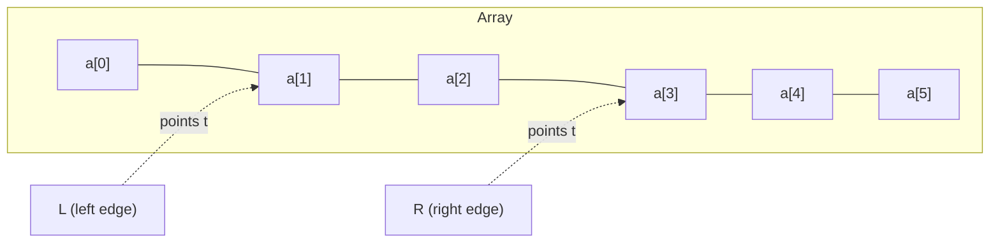

The window above is `[L=1, R=3]`, covering `a[1], a[2], a[3]`. Two fundamental operations:

| Operation | Effect on window | Effect on aggregate |
|---|---|---|
| **expand** (`R++`) | window grows on the right | `agg += a[R]` |
| **shrink** (`L++`) | window grows smaller on the left | `agg -= a[L]`, then `L++` |

The whole art is deciding *when* to expand and *when* to shrink.

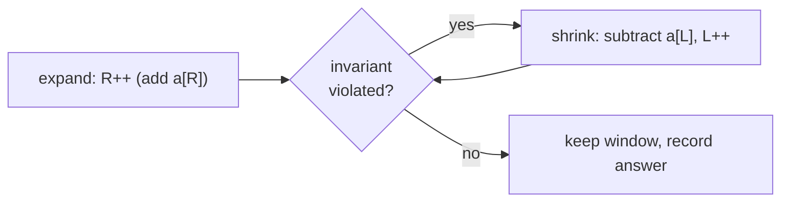

---

## 2. Fixed-Size Windows

When the window width is a constant $k$, both edges move **in lockstep**: each step you add
one new element on the right and remove one old element on the left. The aggregate is a
**running value** maintained in $O(1)$ per step.

### Example: maximum sum of any window of size $k$

For `arr = [2, 1, 5, 1, 3, 2]`, $k = 3$:

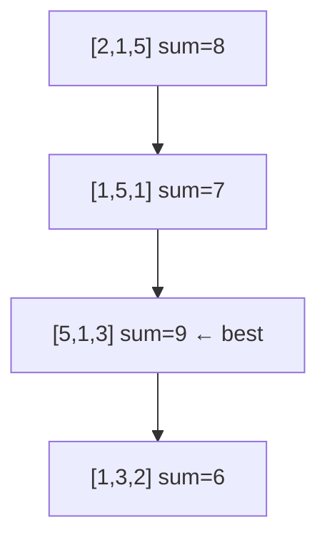

Each transition costs $O(1)$: `sum += arr[R] - arr[L]`. The window of size $k$ slides one
step at a time, and we track the best aggregate seen.

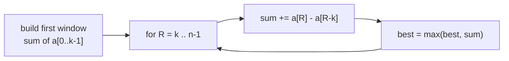

The general fixed-window recipe:

1. Compute the aggregate of the first $k$ elements.
2. For each new right edge `R` from `k` to `n−1`: add `a[R]`, drop `a[R−k]`, update answer.

---

## 3. Variable-Size Windows (Grow / Shrink)

Here the window width is **not** fixed. We let `R` march forward one element at a time
(**expand**), and *whenever the window violates a condition*, we advance `L` (**shrink**)
until the condition holds again. Because each pointer only ever moves **forward**, the total
work is $O(n)$ even though it looks like a nested loop.

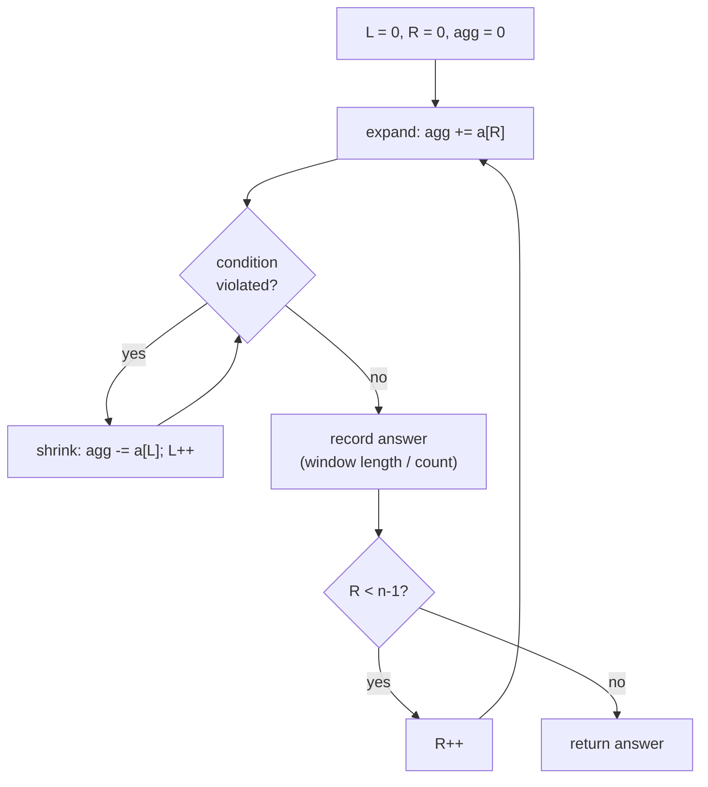

### The at-most-$k$ template

Many problems reduce to: *"longest / count of windows where some quantity is at most $k$."*
The right edge always advances; the left edge chases it whenever the quantity exceeds $k$.

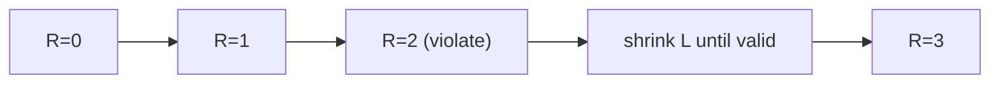

Two pointers `L` and `R` both move monotonically rightward — the hallmark of a same-direction
two-pointer / sliding-window scan.

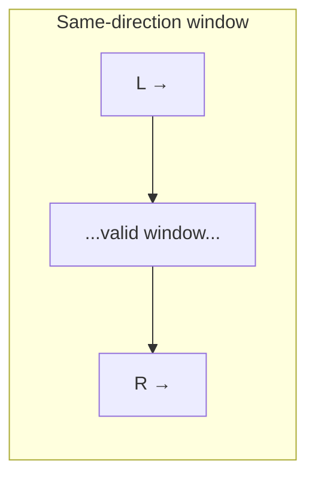

---

## 4. The Window Invariant

Correctness rests on an **invariant**: a property that holds *every time we are about to
record an answer*. For variable windows the invariant is usually:

$$
\text{after each shrink loop, the window } [L, R] \text{ is the } \textbf{smallest-}L
\text{ valid window ending at } R.
$$

Because `L` never moves backward, every valid window ending at `R` has its left edge in
`[L, R]`, so the count of valid windows ending at `R` is exactly `R − L + 1`.

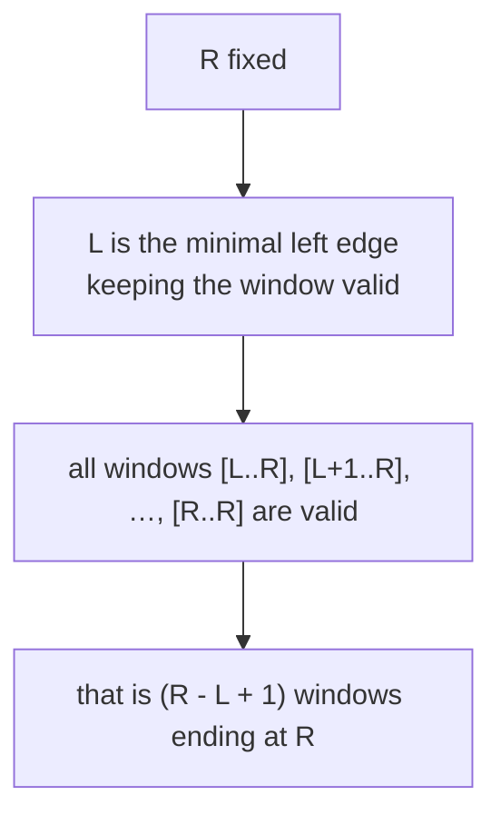

This invariant is what licenses both the *longest-window* answer (`max(R − L + 1)`) and the
*counting* answer ($\sum (R - L + 1)$).

---

## 5. Aggregates Over Windows

The aggregate must be **incrementally maintainable**: adding/removing one element on an edge
should be cheap.

| Aggregate | Add `a[R]` | Remove `a[L]` | Cost/step |
|---|---|---|---|
| **sum** | `s += a[R]` | `s -= a[L]` | $O(1)$ |
| **count of value** | `cnt[a[R]]++` | `cnt[a[L]]--` | $O(1)$ |
| **distinct count** | bump map, maybe `distinct++` | drop map, maybe `distinct--` | $O(1)$ amortized |
| **max / min** | push | pop-front-if-leaving | $O(1)$ amortized (deque) |

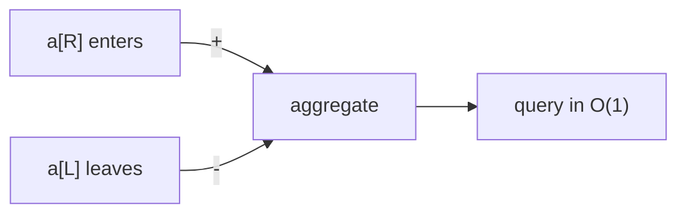

The key requirement for `sum`/`count` shrinking to be valid is **monotonicity**: adding an
element must move the aggregate in a *predictable* direction so that "violated → shrink"
always converges. Sums of **non-negative** numbers are monotone non-decreasing as the window
grows — that is why the at-most-$k$ template works for them but *not* for arrays with
negatives.

---

## 6. Window Maximum via Monotonic Deque

To get the **maximum** of every window in $O(n)$, keep a **deque of indices** whose values
are **monotonically decreasing**. The front always holds the index of the current window
maximum.

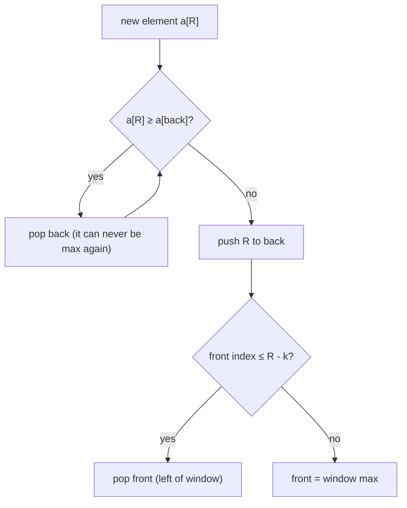

Each index is pushed and popped **at most once**, so the total cost across all windows is
$O(n)$ despite the inner `while`.

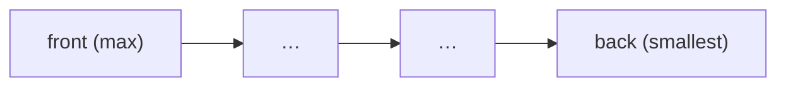

---

## 7. Counting Subarrays: at-most(k) − at-most(k−1)

A beautiful trick: to count subarrays with a property **exactly** $k$, count those with
**at most** $k$ and subtract those with **at most** $k-1$:

$$
\text{exactly}(k) = \text{atMost}(k) - \text{atMost}(k-1).
$$

`atMost(k)` is a clean variable-window scan that adds `R − L + 1` (the number of valid
windows ending at `R`) at every step.

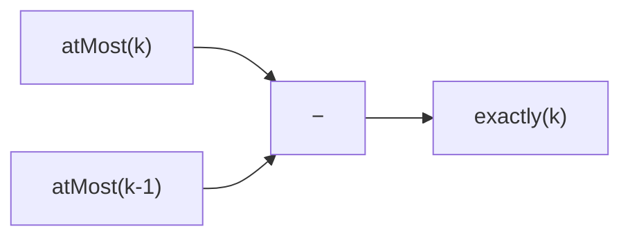

This converts a hard *"exactly"* constraint into two easy *"at most"* sweeps, each $O(n)$.

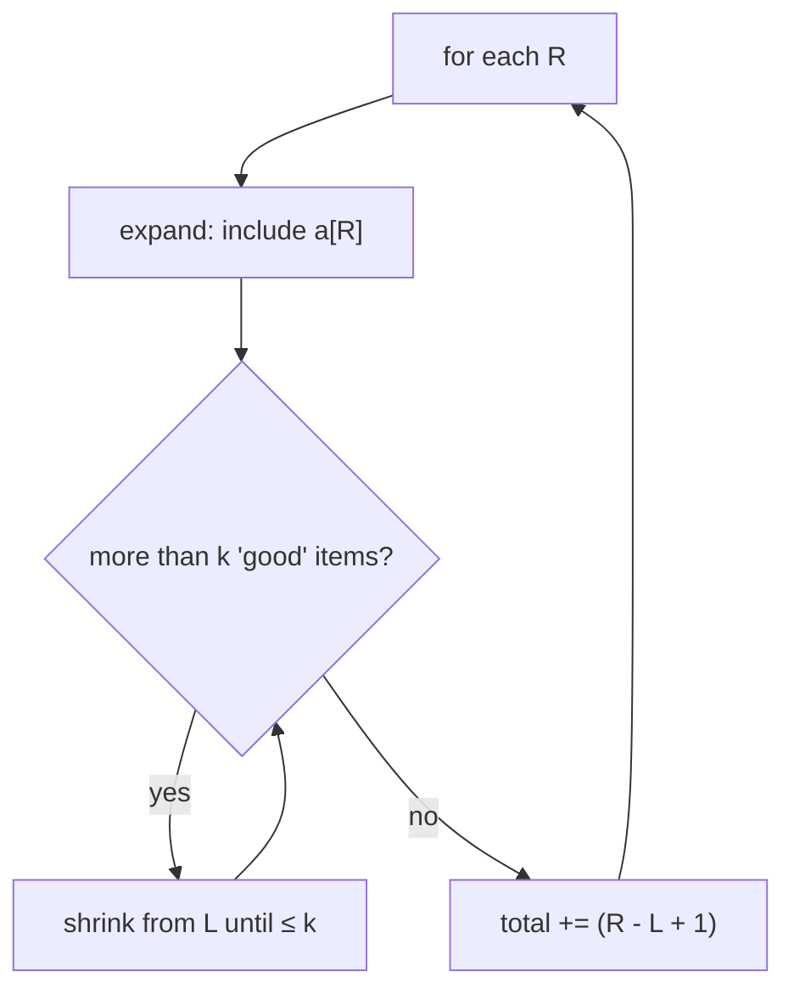

---

## 8. String Windows

Strings are just arrays of characters, so the same machinery applies — usually with a
frequency map of size 26 (lowercase) or 128 (ASCII).

### Longest substring without repeating characters (variable)

Expand `R`; if `s[R]` already sits inside the window, shrink `L` past its previous
occurrence. The invariant: the window always contains **distinct** characters.

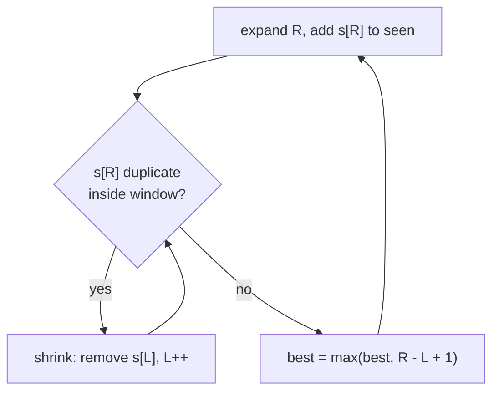

### Minimum window substring (variable)

Grow `R` until the window **covers** all required characters, then shrink `L` to make it as
small as possible while still covering — recording the minimum length each time it is valid.

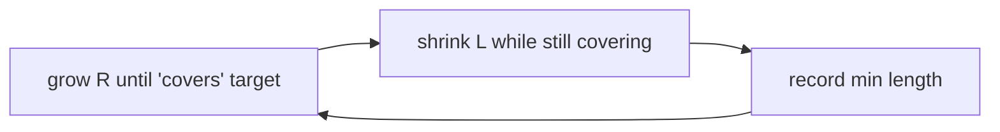

---

## 9. Worked Code — Three Archetypes

### Archetype A — Fixed window: maximum sum of size $k$

```python
def max_sum_window(arr, k):
    n = len(arr)
    if k > n:
        return None
    window = sum(arr[:k])      # first window
    best = window
    for r in range(k, n):
        window += arr[r] - arr[r - k]   # add new, drop old
        best = max(best, window)
    return best
```

```cpp
#include <bits/stdc++.h>
using namespace std;

long long maxSumWindow(const vector<long long>& arr, int k) {
    int n = (int)arr.size();
    if (k > n) return LLONG_MIN;            // signal "no window"
    long long window = 0;
    for (int i = 0; i < k; ++i) window += arr[i];   // first window
    long long best = window;
    for (int r = k; r < n; ++r) {
        window += arr[r] - arr[r - k];      // add new, drop old
        best = max(best, window);
    }
    return best;
}
```

### Archetype B — Variable window: longest substring without repeating chars

```python
def longest_unique(s):
    last = {}            # char -> last index seen
    left = 0
    best = 0
    for right, ch in enumerate(s):
        if ch in last and last[ch] >= left:
            left = last[ch] + 1   # jump L past the duplicate
        last[ch] = right
        best = max(best, right - left + 1)
    return best
```

```cpp
#include <bits/stdc++.h>
using namespace std;

int longestUnique(const string& s) {
    unordered_map<char, int> last;   // char -> last index seen
    int left = 0, best = 0;
    for (int right = 0; right < (int)s.size(); ++right) {
        char ch = s[right];
        auto it = last.find(ch);
        if (it != last.end() && it->second >= left) {
            left = it->second + 1;   // jump L past the duplicate
        }
        last[ch] = right;
        best = max(best, right - left + 1);
    }
    return best;
}
```

### Archetype C — Count subarrays with sum $<$ target (non-negative array)

```python
def count_subarrays_sum_less(arr, target):
    left = 0
    s = 0
    count = 0
    for right, x in enumerate(arr):
        s += x                       # expand
        while s >= target and left <= right:
            s -= arr[left]           # shrink while invalid
            left += 1
        count += right - left + 1    # windows ending at right
    return count
```

```cpp
#include <bits/stdc++.h>
using namespace std;

long long countSubarraysSumLess(const vector<long long>& arr, long long target) {
    int left = 0;
    long long s = 0, count = 0;
    for (int right = 0; right < (int)arr.size(); ++right) {
        s += arr[right];                 // expand
        while (s >= target && left <= right) {
            s -= arr[left];              // shrink while invalid
            ++left;
        }
        count += (long long)(right - left + 1);  // windows ending at right
    }
    return count;
}
```

---

## Complexity Summary

| Variant | Time | Space | Note |
|---|---|---|---|
| Fixed window sum/aggregate | $O(n)$ | $O(1)$ | one add + one drop per step |
| Variable window (grow/shrink) | $O(n)$ | $O(1)$–$O(\Sigma)$ | each pointer moves forward only |
| Window maximum (deque) | $O(n)$ | $O(k)$ | each index pushed/popped once |
| Count via atMost(k) − atMost(k−1) | $O(n)$ | $O(\Sigma)$ | two linear sweeps |
| String windows (freq map) | $O(n)$ | $O(\Sigma)$ | $\Sigma$ = alphabet size |

The recurring miracle: although shrink sits inside a `while` inside a `for`, **`L` never
moves backward**, so its total travel is at most $n$ — giving amortized $O(1)$ per step and
$O(n)$ overall.

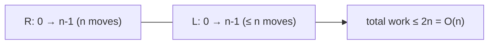

---

## Common Pitfalls

- **Shrinking when it isn't valid.** The at-most template *only* works when adding an element
  pushes the aggregate **monotonically** toward the violation (e.g. sums of *non-negative*
  numbers). With negative numbers a window can become valid *again* after growing, so the
  "shrink until valid" loop is wrong — use prefix sums + a different structure instead.
- **Forgetting to update the aggregate symmetrically.** Every `R++` that does `agg += a[R]`
  must be matched by an `L++` that does `agg -= a[L]`. Drop one and the aggregate drifts.
- **Resetting aggregates at the wrong time.** In fixed windows, build the first window once;
  do **not** recompute it inside the slide loop. In variable windows, never reset `L` or the
  map to zero mid-scan — that destroys the amortization and the invariant.
- **Off-by-one on window length.** The number of elements in `[L, R]` is `R − L + 1`, not
  `R − L`. This bites both the "longest" and the "count" answers.
- **Stale entries in the deque/map.** When `L` advances, evict indices/chars that have fallen
  out of `[L, R]`, or the front of the deque may report a maximum outside the window.

---

## Patterns

| Pattern | Trigger phrase | Template |
|---|---|---|
| Fixed window aggregate | "subarray of size k", "every window of length k" | add `a[R]`, drop `a[R−k]` |
| Longest valid window | "longest subarray/substring with …" | expand R, shrink L while invalid, track `max(R−L+1)` |
| Shortest valid window | "minimum size subarray with sum ≥ …" | expand to validity, shrink while still valid, track `min` |
| Count windows | "number of subarrays with property" | atMost(k) − atMost(k−1), or `+= R−L+1` |
| Distinct ≤ k | "at most k distinct" | freq map + distinct counter, shrink when distinct > k |
| Window max/min | "max of each window of size k" | monotonic deque of indices |
| Anagram / permutation match | "find all anagrams / permutation in string" | fixed window + 26-size freq compare |

> **Mental model:** the right edge *discovers* new elements; the left edge *forgets* old ones.
> Keep an aggregate that updates in $O(1)$ on each enter/leave, decide expand-vs-shrink from a
> single condition, and a quadratic scan collapses into one linear pass.
