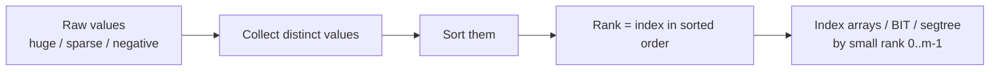
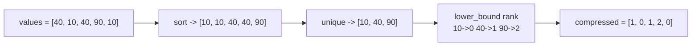
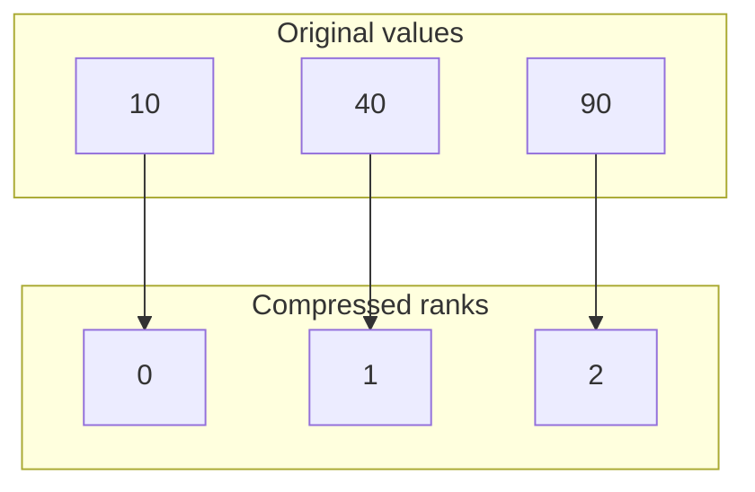
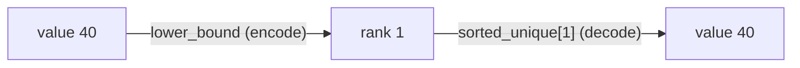
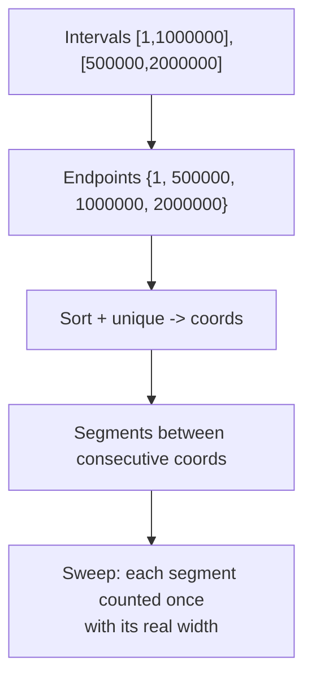
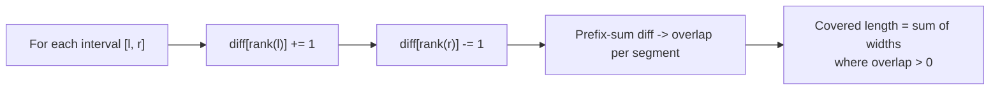
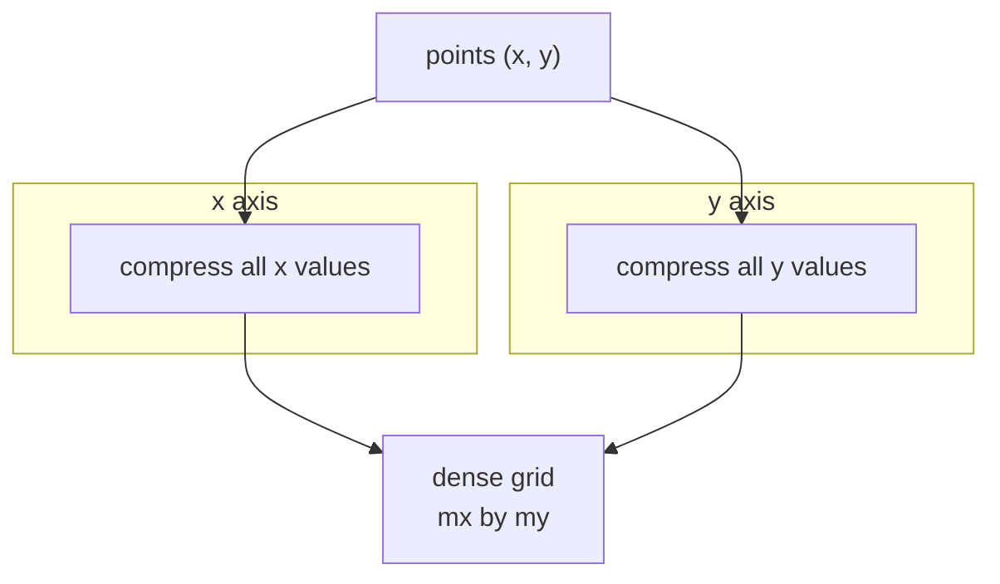
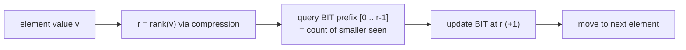
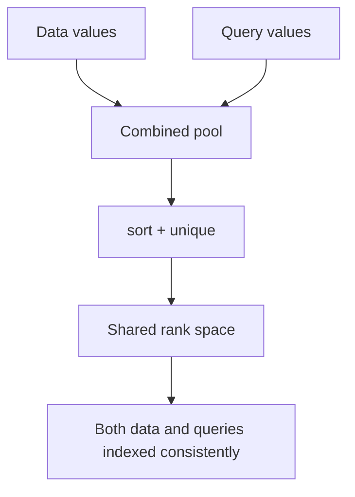
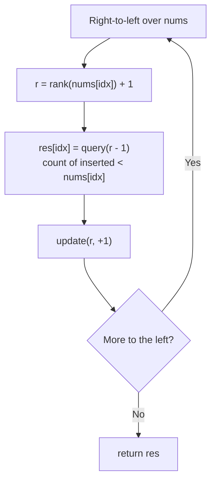

# Coordinate Compression

**Coordinate compression** is the trick of replacing a set of values whose *magnitudes* are huge
(or sparse, or even negative / fractional) with small **consecutive integers** $0, 1, \dots, m-1$
that preserve their **relative order**. When an algorithm only cares about *how values compare*
— not their literal size — we can shrink the universe of values down to its number of *distinct*
entries and then index plain arrays, a **Fenwick (BIT)** tree, or a **segment tree** by rank.

The motivating problem: you want a frequency array or a BIT indexed by value, but values go up to
$10^9$ (or are negative). Allocating $10^9$ buckets is impossible. Yet there are at most $n$
*distinct* values in your input, so only $n$ buckets are ever touched. Compression renames each
distinct value to its position in sorted order, turning a $10^9$-wide universe into an $n$-wide one.



The relation we preserve is order: if $a < b$ then $\text{rank}(a) < \text{rank}(b)$, and equal
values get the **same** rank. That is exactly what we need for counting, ordering, inversions, and
range queries.

---

## Table of Contents

1. [The sort + dedupe + rank pipeline](#the-sort--dedupe--rank-pipeline)
2. [Mapping back from rank to value](#mapping-back-from-rank-to-value)
3. [Compressing pairs and intervals (event sweep)](#compressing-pairs-and-intervals-event-sweep)
4. [1D and 2D compression](#1d-and-2d-compression)
5. [Using compression with Fenwick / segment trees](#using-compression-with-fenwick--segment-trees)
6. [Offline query compression](#offline-query-compression)
7. [Worked code: compress an array to ranks](#worked-code-compress-an-array-to-ranks)
8. [Worked code: count-smaller-after-self via compression + BIT](#worked-code-count-smaller-after-self-via-compression--bit)
9. [Complexity Summary](#complexity-summary)
10. [Common Pitfalls](#common-pitfalls)
11. [Patterns](#patterns)

---

## The sort + dedupe + rank pipeline

The canonical recipe has three steps. Take the values you need to index by, **sort** them,
**deduplicate** (so equal values share a rank), then look up each original value's position by
**binary search**. The position is its compressed coordinate.



A concrete value → rank mapping for that example:



On a number line the transformation collapses the huge gaps while keeping the left-to-right order:

```text
before:  10 ........................ 40 ............................... 90
              (gaps proportional to magnitude — wasteful to index)

after:    0 -- 1 -- 2
              (dense, gap-free — perfect array / BIT indices)
```

The three core operations map onto three library calls in both languages: **sort**, **unique**,
and **binary search for the rank** (`bisect` / `lower_bound`). Because equal values are removed by
`unique`, duplicates automatically resolve to the *same* rank — a stable, well-defined mapping.

---

## Mapping back from rank to value

Compression is reversible. The sorted-unique array **is** the decoder: rank $r$ corresponds to
`sorted_unique[r]`. Keep that array around whenever you must report an *actual* value (for example a
"k-th smallest" query answered on compressed coordinates needs the original number back).



So the pair *(encode, decode)* is:

$$
\text{rank}(x) = \big|\{\, v \in S : v < x \,\}\big|, \qquad
\text{value}(r) = \text{sortedUnique}[r],
$$

where $S$ is the set of distinct values. Encoding is a binary search; decoding is an array index.

---

## Compressing pairs and intervals (event sweep)

Intervals like $[\ell_i, r_i]$ with endpoints up to $10^9$ cannot be laid on a raw array, but only
the **endpoints** matter for coverage and overlap. Collect every endpoint, compress them, and the
real line is partitioned into at most $2n-1$ *segments* between consecutive distinct coordinates.
Each segment is uniform: it is either inside or outside any given interval, so we process *segments*
instead of *points*.



The key insight for intervals: after compression, segment $j$ spans real width
$\text{coords}[j+1] - \text{coords}[j]$, while its *index* $j$ is tiny. We accumulate coverage or
overlap per index, then multiply by the real width when reporting lengths. A **difference array**
over compressed indices gives overlap counts in one linear pass:



---

## 1D and 2D compression

**1D** compression handles a single axis of values (the array case above). **2D** compression runs
the *same* pipeline independently on each axis — compress all $x$-coordinates among themselves and
all $y$-coordinates among themselves — so a sparse set of points on a $10^9 \times 10^9$ grid maps
into a dense $m_x \times m_y$ grid you can actually allocate.



The axes are compressed **independently** — a point's new $x$ depends only on other $x$ values, and
likewise for $y$. This preserves all axis-aligned order relations, which is what 2D BITs and
2D segment trees rely on.

---

## Using compression with Fenwick / segment trees

The headline application: **count of values in a range** and **inversions**. A BIT indexed by value
answers "how many seen values are $\le x$?" in $O(\log n)$, but only if value indices are small.
Compression makes them small. Walking the array while inserting ranks into a BIT lets us ask, for
each element, how many already-inserted elements are smaller (or how many to its right are
smaller, if we walk right-to-left).



An **inversion** is a pair $i < j$ with $a_i > a_j$. Sweeping left to right and, for each new
element, counting how many already-inserted values are **greater** than it (a BIT suffix query)
sums all inversions in $O(n \log n)$ — feasible only because compression bounded the BIT size by
the number of distinct values.

---

## Offline query compression

When queries reference coordinates too (e.g. "how many points with value $\le q$"), gather the
query coordinates **together with** the data coordinates before compressing. Because we know all
queries up front (*offline*), they share one consistent rank space with the data, so a query value
that never appears in the data still lands between the correct neighbours.



---

## Worked code: compress an array to ranks

The reusable building block. Sort a copy, drop duplicates, and binary-search each element's rank.

```python
def compress(values):
    # sorted list of distinct values; its index is the rank
    sorted_unique = sorted(set(values))
    rank_of = {v: i for i, v in enumerate(sorted_unique)}
    compressed = [rank_of[v] for v in values]
    return compressed, sorted_unique

# Alternative using bisect (mirrors C++ lower_bound exactly):
import bisect
def compress_bisect(values):
    sorted_unique = sorted(set(values))
    compressed = [bisect.bisect_left(sorted_unique, v) for v in values]
    return compressed, sorted_unique
```

```cpp
#include <bits/stdc++.h>
using namespace std;

// returns compressed ranks; sortedUnique decodes rank -> value
vector<int> compress(const vector<long long>& values,
                     vector<long long>& sortedUnique) {
    sortedUnique = values;                                  // copy
    sort(sortedUnique.begin(), sortedUnique.end());         // sort
    sortedUnique.erase(unique(sortedUnique.begin(),
                              sortedUnique.end()),
                       sortedUnique.end());                 // dedupe
    vector<int> compressed(values.size());
    for (size_t i = 0; i < values.size(); ++i) {
        // rank = index via lower_bound (binary search)
        compressed[i] = int(lower_bound(sortedUnique.begin(),
                                        sortedUnique.end(),
                                        values[i]) - sortedUnique.begin());
    }
    return compressed;
}
```

For the example `[40, 10, 40, 90, 10]` both produce `compressed = [1, 0, 1, 2, 0]` with
`sortedUnique = [10, 40, 90]`. Identical values (`40`, `40` and `10`, `10`) share a rank — the
mapping is stable and order-preserving.

---

## Worked code: count-smaller-after-self via compression + BIT

Walk **right to left**. Before inserting an element's rank into the BIT, query the prefix
`[0 .. rank-1]` — that is exactly how many already-inserted (i.e. to the right) elements are
strictly smaller. Compression keeps the BIT array size at $m \le n$.

```python
def count_smaller_after_self(nums):
    sorted_unique = sorted(set(nums))
    import bisect
    m = len(sorted_unique)
    bit = [0] * (m + 1)                       # 1-indexed Fenwick

    def update(i, delta):                     # i is 1-indexed
        while i <= m:
            bit[i] += delta
            i += i & (-i)

    def query(i):                             # prefix sum of [1..i]
        s = 0
        while i > 0:
            s += bit[i]
            i -= i & (-i)
        return s

    res = [0] * len(nums)
    for idx in range(len(nums) - 1, -1, -1):
        r = bisect.bisect_left(sorted_unique, nums[idx]) + 1   # 1-indexed rank
        res[idx] = query(r - 1)               # strictly-smaller count
        update(r, 1)                          # insert this value
    return res
```

```cpp
#include <bits/stdc++.h>
using namespace std;

vector<int> countSmallerAfterSelf(const vector<long long>& nums) {
    vector<long long> sortedUnique = nums;
    sort(sortedUnique.begin(), sortedUnique.end());
    sortedUnique.erase(unique(sortedUnique.begin(), sortedUnique.end()),
                       sortedUnique.end());
    int m = (int)sortedUnique.size();
    vector<long long> bit(m + 1, 0);          // 1-indexed Fenwick

    auto update = [&](int i, long long delta) {
        for (; i <= m; i += i & (-i)) bit[i] += delta;
    };
    auto query = [&](int i) -> long long {
        long long s = 0;
        for (; i > 0; i -= i & (-i)) s += bit[i];
        return s;
    };

    vector<int> res(nums.size(), 0);
    for (int idx = (int)nums.size() - 1; idx >= 0; --idx) {
        int r = int(lower_bound(sortedUnique.begin(), sortedUnique.end(),
                                nums[idx]) - sortedUnique.begin()) + 1;
        res[idx] = (int)query(r - 1);         // strictly-smaller count
        update(r, 1);                         // insert this value
    }
    return res;
}
```



---

## Complexity Summary

| Step | Time | Space |
|---|---|---|
| Sort distinct values | $O(n \log n)$ | $O(n)$ |
| Dedupe (`unique`) | $O(n)$ | $O(1)$ extra |
| Encode each value (`lower_bound`) | $O(n \log n)$ total | $O(n)$ for output |
| BIT / segtree build + $n$ ops | $O(n \log n)$ | $O(n)$ |
| **Overall** | $O(n \log n)$ | $O(n)$ |

Compression itself is dominated by the sort, so the whole technique is $O(n \log n)$ time and
$O(n)$ space — independent of how large the *original* values were.

---

## Common Pitfalls

- **Stable mapping for duplicates.** Use `unique` / `set` so equal values map to the **same** rank.
  Forgetting to dedupe inflates the universe and can break "count strictly smaller" queries.
- **Strict vs non-strict.** "Count strictly smaller" queries the prefix `[0 .. rank-1]`; "count
  $\le$" queries `[0 .. rank]`. Mixing them is a classic off-by-one with duplicates.
- **0- vs 1-indexing.** A Fenwick tree is 1-indexed; compression naturally yields 0-indexed ranks.
  Add 1 when feeding ranks into the BIT, and subtract when decoding.
- **Mapping back.** Keep the `sortedUnique` array to convert ranks to real values; you cannot
  recover a value from its rank without it.
- **Forgetting query coordinates.** In offline problems, compress data **and** query values
  together so they share one rank space.
- **Overflow.** Sums of widths or counts can exceed 32 bits — use `long long` for accumulators.

---

## Patterns

- **"Values up to $10^9$ but $n \le 10^5$"** → compress, then index a BIT / segment tree by rank.
- **"Count of smaller / greater elements" / "inversions"** → compression + Fenwick, sweep in one
  direction.
- **"Total covered length / max overlap of intervals"** → compress endpoints, sweep segments with a
  difference array.
- **"Sparse 2D points, axis-aligned queries"** → compress each axis independently into a dense grid.
- **"Offline queries referencing arbitrary coordinates"** → pool data + query coordinates, compress
  once, share the rank space.
