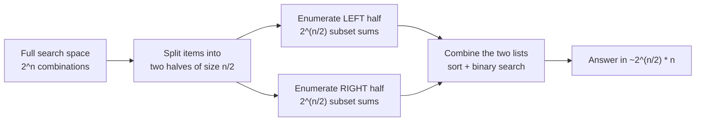
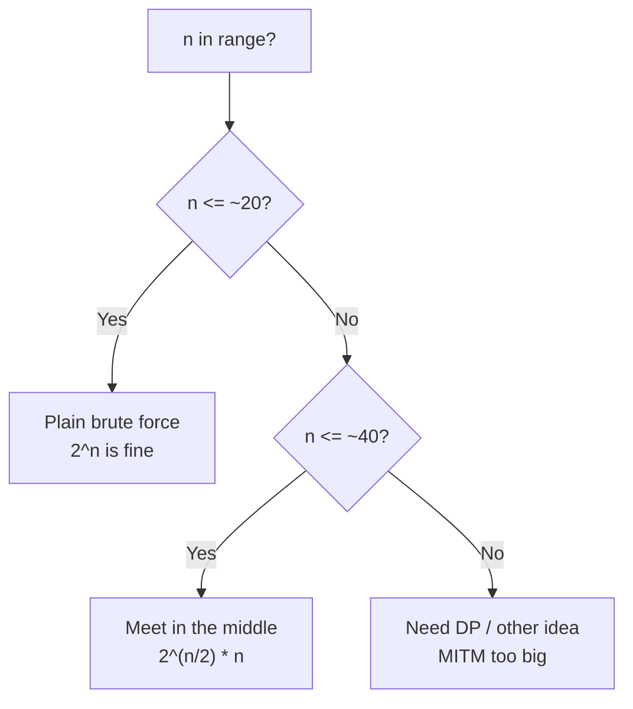
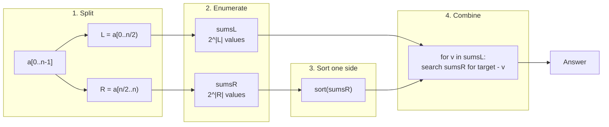
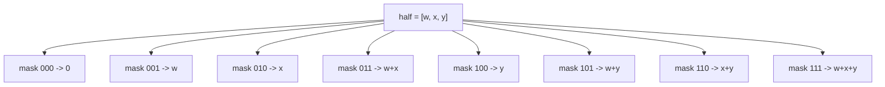
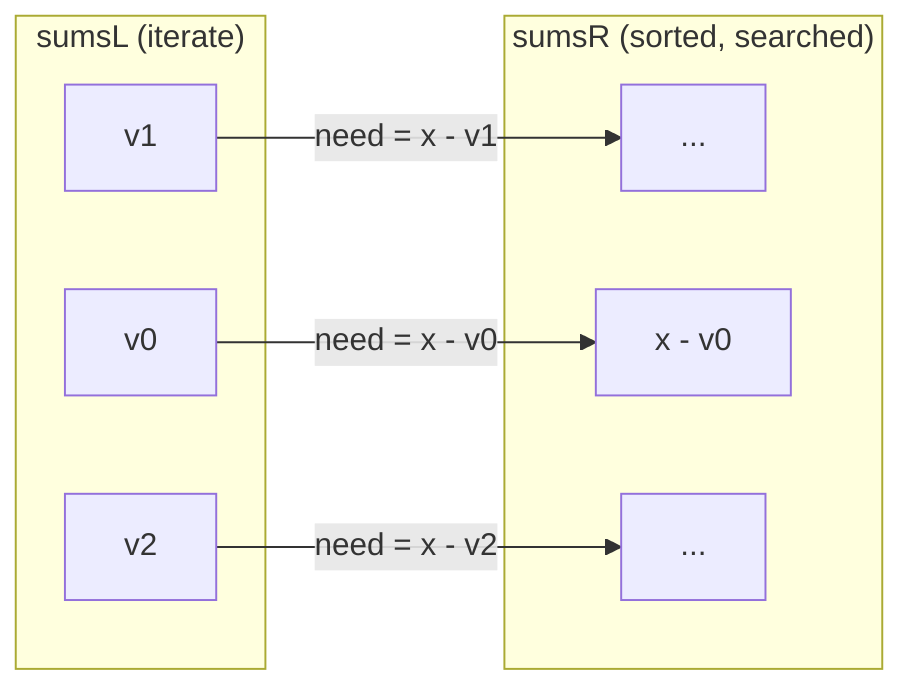
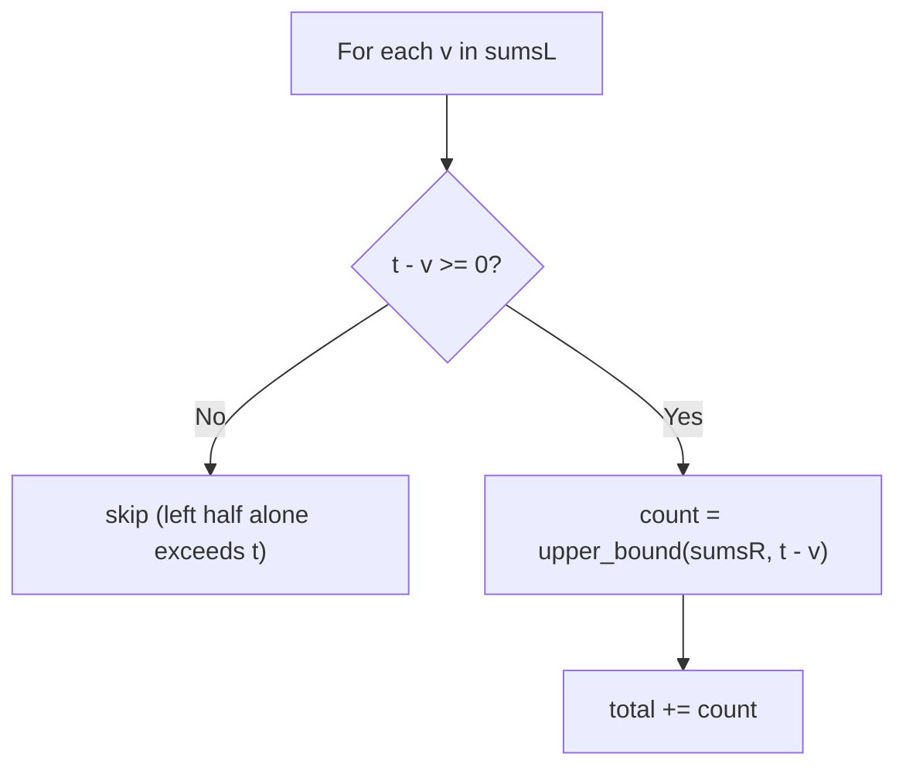
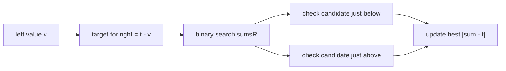
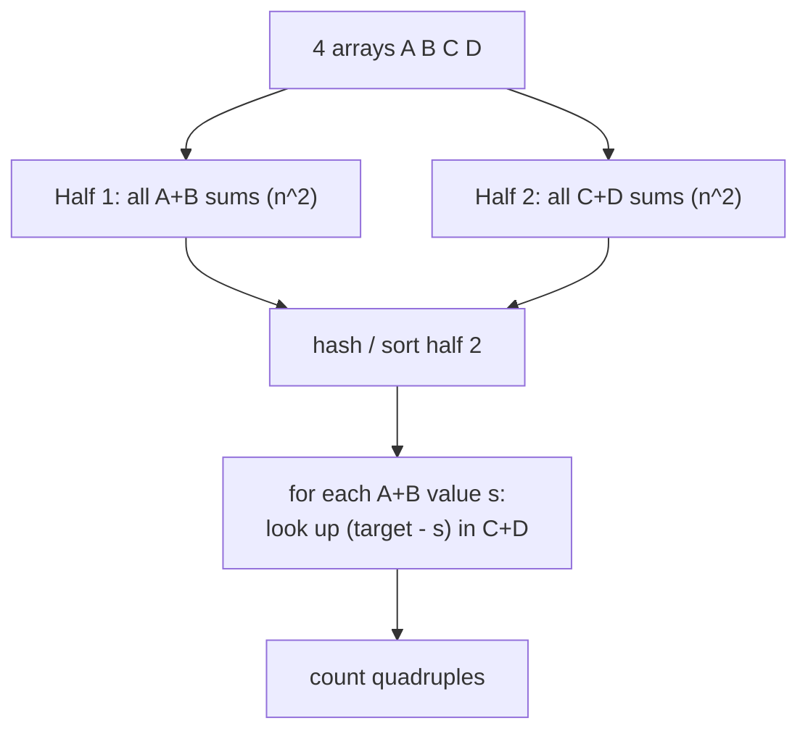
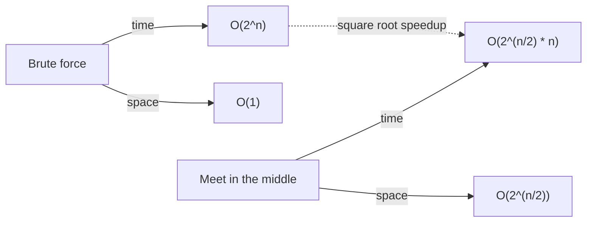

# Meet in the Middle (MITM)

**Meet in the middle** is a divide-and-combine technique that beats naive exponential search by
**splitting the search space into two halves**, enumerating each half independently in
$O(2^{n/2})$, and then **combining** the two halves cleverly — typically by sorting one half and
binary searching (or two-pointer scanning) the other. This turns a brute force that would cost
$2^n$ into roughly $2^{n/2}\cdot n$, which is the square root of the original work. For $n = 40$,
$2^{40} \approx 10^{12}$ becomes $2^{20}\cdot 20 \approx 2\times 10^7$ — the difference between
"infeasible" and "instant".

The key intuition: many exponential problems factor as *"choose something from the left part and
something from the right part so the two choices fit together"*. If we precompute every possibility
on each side separately, we never have to enumerate the full $2^n$ cross product — we let the two
precomputed lists **meet in the middle**.



---

## Table of Contents

1. [When to use it](#when-to-use-it)
2. [The generic recipe](#the-generic-recipe)
3. [Counting subsets with a given sum](#counting-subsets-with-a-given-sum)
4. [Counting subsets with sum at most a target](#counting-subsets-with-sum-at-most-a-target)
5. [Closest subset sum to a target](#closest-subset-sum-to-a-target)
6. [The 4-sum / k-sum split](#the-4-sum--k-sum-split)
7. [Tradeoffs and relation to brute force](#tradeoffs-and-relation-to-brute-force)
8. [Complexity Summary](#complexity-summary)
9. [Common Pitfalls](#common-pitfalls)
10. [Patterns](#patterns)

---

## When to use it

Reach for MITM when **all** of these hold:

- The problem is **exponential in $n$** (subsets, $\pm$ sign assignments, pick-or-skip choices).
- $n$ is **too big for $2^n$** but **small enough for $2^{n/2}$** — typically $n$ up to about
  $40$ (sometimes $42$–$44$ with tight constants).
- The two halves can be **combined by a simple key** — usually a *sum*, so that "left choice +
  right choice = target" becomes "for each left value, look up `target - left` on the right".



The classic giveaway: **subset-sum-style** problems where values are large (so sum-indexed DP is
impossible) but the *count* of items is small.

---

## The generic recipe

Let the array be $a_0, a_1, \dots, a_{n-1}$. The recipe has four steps:

1. **Split** the items into a left half $L$ (first $\lceil n/2 \rceil$ items) and a right half $R$
   (the rest).
2. **Enumerate** every subset of $L$ and record its sum, giving a list `sumsL` of size $2^{|L|}$.
   Do the same for $R$, giving `sumsR`.
3. **Sort** one of the lists (say `sumsR`).
4. **Combine**: for each value $v$ in `sumsL`, binary search `sumsR` for whatever value makes the
   pair valid (e.g. `target - v` for an exact match, or `upper_bound(target - v)` for an
   at-most constraint).



Enumerating all subset sums of a half is itself a tiny power-set walk:



---

## Counting subsets with a given sum

Problem: count subsets of $a$ whose elements sum to exactly $x$ (CSES *Meet in the Middle*).

Enumerate both halves, sort `sumsR`, and for each left value $v$ count how many right values equal
$x - v$. Because `sumsR` is sorted, the count of a given value is
`upper_bound(...) - lower_bound(...)`.

```python
from bisect import bisect_left, bisect_right

def count_subsets_with_sum(a, x):
    n = len(a)
    mid = n // 2
    left, right = a[:mid], a[mid:]

    def subset_sums(arr):
        sums = []
        for mask in range(1 << len(arr)):
            s = 0
            for i in range(len(arr)):
                if mask & (1 << i):
                    s += arr[i]
            sums.append(s)
        return sums

    sums_l = subset_sums(left)
    sums_r = sorted(subset_sums(right))

    total = 0
    for v in sums_l:
        need = x - v
        lo = bisect_left(sums_r, need)
        hi = bisect_right(sums_r, need)
        total += hi - lo
    return total
```

```cpp
#include <bits/stdc++.h>
using namespace std;

long long countSubsetsWithSum(const vector<long long>& a, long long x) {
    int n = (int)a.size();
    int mid = n / 2;
    vector<long long> left(a.begin(), a.begin() + mid);
    vector<long long> right(a.begin() + mid, a.end());

    auto subsetSums = [](const vector<long long>& arr) {
        vector<long long> sums;
        int m = (int)arr.size();
        for (int mask = 0; mask < (1 << m); ++mask) {
            long long s = 0;
            for (int i = 0; i < m; ++i)
                if (mask & (1 << i)) s += arr[i];
            sums.push_back(s);
        }
        return sums;
    };

    vector<long long> sumsL = subsetSums(left);
    vector<long long> sumsR = subsetSums(right);
    sort(sumsR.begin(), sumsR.end());

    long long total = 0;
    for (long long v : sumsL) {
        long long need = x - v;
        auto lo = lower_bound(sumsR.begin(), sumsR.end(), need);
        auto hi = upper_bound(sumsR.begin(), sumsR.end(), need);
        total += (long long)(hi - lo);
    }
    return total;
}
```

The combine step pictured as a meeting of the two lists:



---

## Counting subsets with sum at most a target

If instead we want subsets with sum $\le t$, the combine changes from an *exact* lookup to a
*prefix-count* lookup. Sort `sumsR`; for each left value $v$ the number of valid right partners is
the count of right values $\le t - v$, i.e. `upper_bound(sumsR, t - v)`.

Because both lists are sorted we can also use a **two-pointer** sweep: as $v$ increases (sort
`sumsL` descending), the allowed right prefix only grows, so a single linear pass over `sumsR`
suffices.

```python
from bisect import bisect_right

def count_subsets_at_most(a, t):
    n = len(a)
    mid = n // 2

    def subset_sums(arr):
        sums = [0]
        for v in arr:
            sums += [s + v for s in sums]
        return sums

    sums_l = subset_sums(a[:mid])
    sums_r = sorted(subset_sums(a[mid:]))

    total = 0
    for v in sums_l:
        if t - v >= 0:
            total += bisect_right(sums_r, t - v)
    return total
```

```cpp
#include <bits/stdc++.h>
using namespace std;

long long countSubsetsAtMost(const vector<long long>& a, long long t) {
    int n = (int)a.size();
    int mid = n / 2;

    auto subsetSums = [](vector<long long>::const_iterator b,
                         vector<long long>::const_iterator e) {
        vector<long long> sums = {0};
        for (auto it = b; it != e; ++it) {
            int sz = (int)sums.size();
            for (int i = 0; i < sz; ++i) sums.push_back(sums[i] + *it);
        }
        return sums;
    };

    vector<long long> sumsL = subsetSums(a.begin(), a.begin() + mid);
    vector<long long> sumsR = subsetSums(a.begin() + mid, a.end());
    sort(sumsR.begin(), sumsR.end());

    long long total = 0;
    for (long long v : sumsL) {
        if (t - v >= 0) {
            auto hi = upper_bound(sumsR.begin(), sumsR.end(), t - v);
            total += (long long)(hi - sumsR.begin());
        }
    }
    return total;
}
```



---

## Closest subset sum to a target

A frequent variant: find the subset sum **closest to** a target $t$ (often *without exceeding* it).
Enumerate both halves; sort `sumsR`. For each left value $v$, the best right partner is found by
binary searching `sumsR` for $t - v$ and checking the neighbour(s) around the insertion point.

```python
from bisect import bisect_right

def closest_subset_sum(a, t):
    n = len(a)
    mid = n // 2

    def subset_sums(arr):
        sums = [0]
        for v in arr:
            sums += [s + v for s in sums]
        return sums

    sums_l = subset_sums(a[:mid])
    sums_r = sorted(subset_sums(a[mid:]))

    best = float("inf")          # best |sum - t|
    best_sum = 0
    for v in sums_l:
        # largest right value with v + r <= t  (closest from below)
        idx = bisect_right(sums_r, t - v) - 1
        for j in (idx, idx + 1):
            if 0 <= j < len(sums_r):
                cur = v + sums_r[j]
                if abs(cur - t) < best:
                    best, best_sum = abs(cur - t), cur
    return best_sum
```

```cpp
#include <bits/stdc++.h>
using namespace std;

const long long INF = 1e18;

long long closestSubsetSum(const vector<long long>& a, long long t) {
    int n = (int)a.size();
    int mid = n / 2;

    auto subsetSums = [](vector<long long>::const_iterator b,
                         vector<long long>::const_iterator e) {
        vector<long long> sums = {0};
        for (auto it = b; it != e; ++it) {
            int sz = (int)sums.size();
            for (int i = 0; i < sz; ++i) sums.push_back(sums[i] + *it);
        }
        return sums;
    };

    vector<long long> sumsL = subsetSums(a.begin(), a.begin() + mid);
    vector<long long> sumsR = subsetSums(a.begin() + mid, a.end());
    sort(sumsR.begin(), sumsR.end());

    long long best = INF;        // best |sum - t|
    long long bestSum = 0;
    for (long long v : sumsL) {
        int idx = (int)(upper_bound(sumsR.begin(), sumsR.end(), t - v) - sumsR.begin()) - 1;
        for (int j = idx; j <= idx + 1; ++j) {
            if (j >= 0 && j < (int)sumsR.size()) {
                long long cur = v + sumsR[j];
                if (llabs(cur - t) < best) {
                    best = llabs(cur - t);
                    bestSum = cur;
                }
            }
        }
    }
    return bestSum;
}
```



---

## The 4-sum / k-sum split

MITM generalises the two-sum trick to **$k$-sum**. For 4-sum over four arrays $A, B, C, D$, build
all pairwise sums of $A\times B$ (one half) and of $C\times D$ (the other half), then for each
$A\times B$ value look up its complement among the sorted $C\times D$ sums. This converts an
$O(n^4)$ quadruple loop into $O(n^2 \log n)$.



The same *split into two groups, precompute, then match* skeleton powers subset-sum MITM and
$k$-sum MITM alike — only the "key" being matched changes.

---

## Tradeoffs and relation to brute force

MITM trades **memory for time**. Brute force is $O(2^n)$ time and $O(1)$ extra space; MITM is
$O(2^{n/2}\cdot n)$ time but stores $O(2^{n/2})$ subset sums. For $n = 40$ that is about a million
values per half — a few megabytes, fine. Push $n$ much past $\sim 44$ and the lists no longer fit
in memory, which is the technique's hard ceiling.



Think of MITM as "brute force, but on each half separately, glued with a sorted lookup". You still
enumerate exponentially — just over $n/2$ items, whose cost is the *square root* of the full
enumeration.

---

## Complexity Summary

| Step | Time | Space |
|---|---|---|
| Enumerate each half | $O(2^{n/2})$ | $O(2^{n/2})$ |
| Sort one half | $O(2^{n/2} \cdot \tfrac{n}{2})$ | — |
| Combine (binary search per left value) | $O(2^{n/2} \cdot \log 2^{n/2}) = O(2^{n/2} \cdot n)$ | $O(1)$ extra |
| **Total** | $O(2^{n/2} \cdot n)$ | $O(2^{n/2})$ |

The dominant cost is the sort-and-search combine: $2^{n/2}$ left values each doing an
$O(\log 2^{n/2}) = O(n/2)$ binary search.

---

## Common Pitfalls

- **Memory blowup.** Each half holds $2^{n/2}$ longs. For $n$ near $44$ this is $\sim 4\times 10^6$
  values per half; beyond that you run out of RAM. MITM is *not* a fix for $n = 60$.
- **Duplicate handling.** When counting exact matches, use `upper_bound - lower_bound` (a *range*),
  not a single `binary_search`, or you will undercount repeated sums.
- **Overflow.** Subset sums can reach $n \cdot \max(a_i)$. Use `long long` in C++ and
  `const long long INF = 1e18` for sentinels; Python ints are arbitrary precision and safe.
- **Uneven split.** Split as evenly as possible (`mid = n / 2`); a lopsided split makes the larger
  half dominate and erodes the $2^{n/2}$ benefit.
- **Forgetting the empty subset.** The mask `0` (sum $0$) is a valid subset — include it unless the
  problem explicitly forbids the empty set.

---

## Patterns

- **Split-enumerate-sort-search.** The canonical MITM skeleton: halve the items, list all subset
  sums of each half, sort one list, binary search it for each value of the other.
- **Exact match → range count.** Counting subsets with sum $= x$ becomes `lower_bound`/`upper_bound`
  range counting on the sorted half.
- **At-most match → prefix count / two-pointer.** Sum $\le t$ becomes `upper_bound` (a prefix
  length) or a monotone two-pointer sweep.
- **Closest match → neighbour check.** "Closest to $t$" inspects the insertion point and its
  immediate neighbours in the sorted half.
- **k-sum split.** Group the inputs into two collections, precompute all combined keys of each, and
  match complements — the same idea behind 4-sum in $O(n^2 \log n)$.
