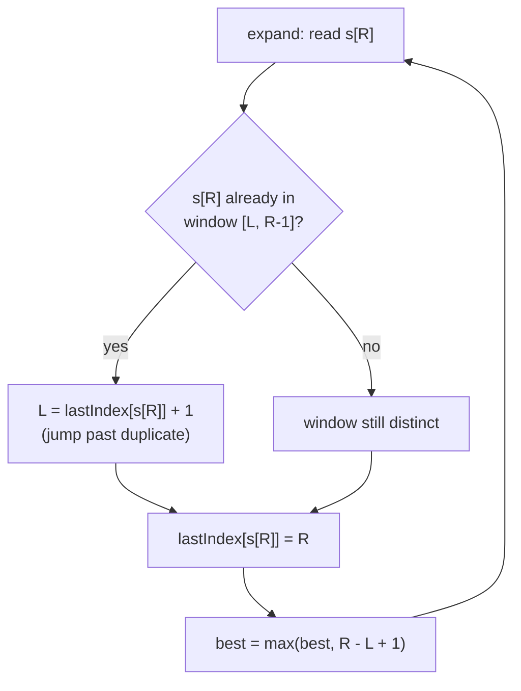
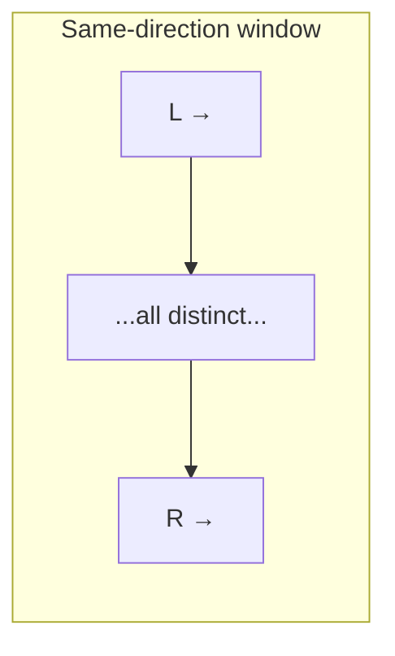
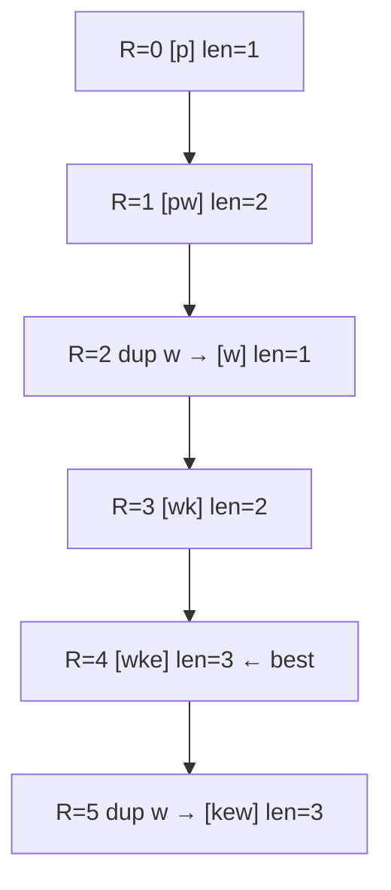
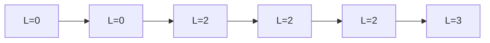

# Longest Substring Without Repeating Characters (LeetCode 3)

| Field | Value |
|---|---|
| Source | [LeetCode 3](https://leetcode.com/problems/longest-substring-without-repeating-characters/) |
| Difficulty | Medium |
| Primary topic | **Sliding window — variable size** |
| Secondary topic | Hash map of last-seen index, two pointers (same direction) |
| Key constraint | $0 \le n \le 5 \times 10^4$, characters are ASCII |

---

## Statement

Given a string `s`, find the length of the **longest substring** that contains **no repeating
characters**. A substring is a *contiguous* slice of `s`.

### Example

```text
Input:  s = "abcabcbb"
Output: 3
# "abc" has length 3 and all characters are distinct.
# "abca" would repeat 'a', so it is not allowed.

Input:  s = "bbbbb"
Output: 1   # best is "b"

Input:  s = "pwwkew"
Output: 3   # "wke" (note "pwke" is a subsequence, not a substring)
```

---

## WHY: Grow Right, Jump Left Past Duplicates

Maintain a window `[L, R]` that always contains **distinct** characters. Push the right edge
`R` forward to discover new characters. The moment `s[R]` is already inside the window, the
window is invalid — so move the left edge `L` to **just past** the previous occurrence of
`s[R]`, which is the smallest jump that restores distinctness.



Because `L` only ever moves **forward**, each character is visited a constant number of times
— the whole scan is $O(n)$.



---

## Code

```python
def length_of_longest_substring(s):
    last = {}          # char -> last index it appeared at
    left = 0
    best = 0
    for right, ch in enumerate(s):
        if ch in last and last[ch] >= left:
            left = last[ch] + 1     # jump past the duplicate
        last[ch] = right
        best = max(best, right - left + 1)
    return best
```

```cpp
#include <bits/stdc++.h>
using namespace std;

int lengthOfLongestSubstring(const string& s) {
    unordered_map<char, int> last;     // char -> last index it appeared at
    int left = 0, best = 0;
    for (int right = 0; right < (int)s.size(); ++right) {
        char ch = s[right];
        auto it = last.find(ch);
        if (it != last.end() && it->second >= left) {
            left = it->second + 1;     // jump past the duplicate
        }
        last[ch] = right;
        best = max(best, right - left + 1);
    }
    return best;
}
```

A fixed-size array of 128 counters is even faster than a hash map for ASCII:

```python
def length_of_longest_substring_array(s):
    last = [-1] * 128          # char code -> last index, -1 if unseen
    left = 0
    best = 0
    for right, ch in enumerate(s):
        c = ord(ch)
        if last[c] >= left:
            left = last[c] + 1
        last[c] = right
        best = max(best, right - left + 1)
    return best
```

```cpp
#include <bits/stdc++.h>
using namespace std;

int lengthOfLongestSubstringArray(const string& s) {
    vector<int> last(128, -1);         // char code -> last index, -1 if unseen
    int left = 0, best = 0;
    for (int right = 0; right < (int)s.size(); ++right) {
        int c = (int)(unsigned char)s[right];
        if (last[c] >= left) {
            left = last[c] + 1;
        }
        last[c] = right;
        best = max(best, right - left + 1);
    }
    return best;
}
```

---

## Trace

Walking `s = "pwwkew"` (indices 0–5). `len = R − L + 1`:

| R | s[R] | duplicate in window? | L | window | len | best |
|---|------|----------------------|---|--------|-----|------|
| 0 | p | no | 0 | `p` | 1 | 1 |
| 1 | w | no | 0 | `pw` | 2 | 2 |
| 2 | w | yes (at 1) → L=2 | 2 | `w` | 1 | 2 |
| 3 | k | no | 2 | `wk` | 2 | 2 |
| 4 | e | no | 2 | `wke` | 3 | 3 |
| 5 | w | yes (at 2) → L=3 | 3 | `kew` | 3 | 3 |

Answer: **3**.



The left edge over time (note it is non-decreasing):



---

## Math & Complexity

Let $n = |s|$ and $\Sigma$ the alphabet size.

- **Time:** $O(n)$. Both `L` and `R` advance from $0$ to $n$ and never retreat, so total
  pointer movement is at most $2n$.
- **Space:** $O(\min(n, \Sigma))$ for the last-seen table.

The answer is

$$
\max_{0 \le R < n} \big(R - L(R) + 1\big),
$$

where $L(R)$ is the smallest left edge keeping `[L, R]` free of repeats. Since $L(R)$ is
non-decreasing in $R$, a single sweep suffices.

---

## Takeaway

> Keep a window of **distinct** characters; when a repeat arrives, *jump* the left edge to one
> past its previous index rather than sliding it one step at a time. Last-seen indices plus a
> monotone left pointer give a clean $O(n)$ longest-window scan.
