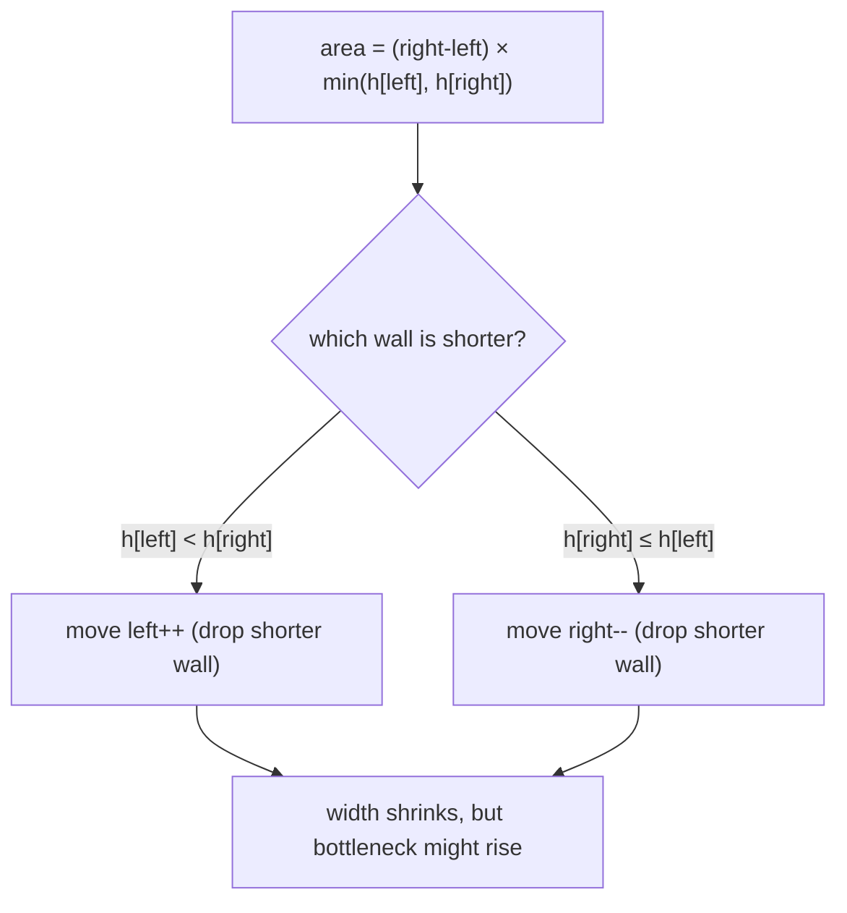
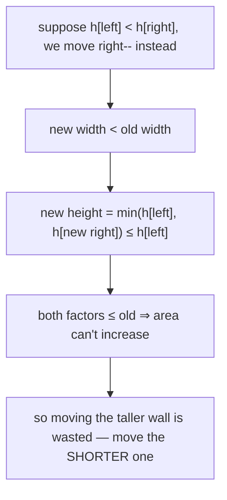
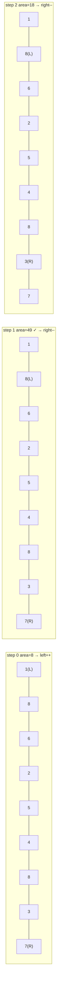
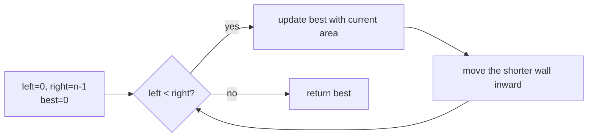
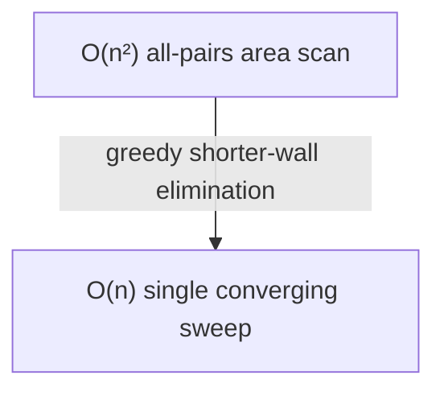

# Container With Most Water (LeetCode 11)

| Field | Value |
|---|---|
| Source | [LeetCode 11](https://leetcode.com/problems/container-with-most-water/) |
| Difficulty | Medium |
| Primary topic | **Two pointers — opposite ends, greedy elimination** |
| Secondary topic | Area maximization, monotone bottleneck argument |
| Key constraint | $2 \le n \le 10^5$, $0 \le \text{height}[i] \le 10^4$ |

---

## Statement

You are given an integer array `height` of length $n$. Each `height[i]` is a vertical line
at x-coordinate `i`. Pick **two** lines that, together with the x-axis, form a container.
Return the **maximum** amount of water it can store.

The water held by lines at indices `i < j` is:

$$
\text{area}(i, j) = (j - i) \times \min\big(\text{height}[i], \text{height}[j]\big)
$$

### Example

```text
Input:  height = [1, 8, 6, 2, 5, 4, 8, 3, 7]
Output: 49
# lines at index 1 (h=8) and index 8 (h=7):
# width = 8-1 = 7, height = min(8,7) = 7, area = 7*7 = 49
```

---

## WHY: Move the Shorter Wall

Start as **wide** as possible: `left = 0`, `right = n-1`. Width is maximal, so the only way
a *different* pair can beat the current area is by having a taller bottleneck. The bottleneck
is the **shorter** of the two walls — so moving the **taller** wall inward only shrinks width
without raising the cap. We therefore always discard the shorter wall.



Moving the taller wall is provably useless:



---

## Code

```python
def max_area(height):
    left, right = 0, len(height) - 1
    best = 0
    while left < right:
        h = min(height[left], height[right])
        best = max(best, h * (right - left))
        if height[left] < height[right]:
            left += 1          # discard shorter wall
        else:
            right -= 1         # discard shorter (or equal) wall
    return best
```

```cpp
#include <bits/stdc++.h>
using namespace std;

long long maxArea(const vector<int>& height) {
    int left = 0, right = (int)height.size() - 1;
    long long best = 0;
    while (left < right) {
        long long h = min(height[left], height[right]);
        best = max(best, h * (long long)(right - left));
        if (height[left] < height[right]) {
            ++left;            // discard shorter wall
        } else {
            --right;           // discard shorter (or equal) wall
        }
    }
    return best;
}
```

---

## Trace

On `height = [1, 8, 6, 2, 5, 4, 8, 3, 7]`:

| Step | left | right | h[left] | h[right] | width | area | best | Move |
|---|---|---|---|---|---|---|---|---|
| 0 | 0 | 8 | 1 | 7 | 8 | 8 | 8 | left++ (1<7) |
| 1 | 1 | 8 | 8 | 7 | 7 | 49 | 49 | right-- (7≤8) |
| 2 | 1 | 7 | 8 | 3 | 6 | 18 | 49 | right-- |
| 3 | 1 | 6 | 8 | 8 | 5 | 40 | 49 | right-- (tie) |
| 4 | 1 | 5 | 8 | 4 | 4 | 16 | 49 | right-- |
| 5 | 1 | 4 | 8 | 5 | 3 | 15 | 49 | right-- |
| 6 | 1 | 3 | 8 | 2 | 2 | 4 | 49 | right-- |
| 7 | 1 | 2 | 8 | 6 | 1 | 6 | 49 | right-- |
| 8 | 1 | 1 | — | — | — | — | 49 | stop (left==right) |

Pointer movement across the first three steps:



The convergence as a flow:



---

## Math & Complexity

Each iteration advances exactly one pointer inward; they begin $n-1$ apart and stop when they
meet, so:

$$
T(n) = O(n), \qquad S(n) = O(1)
$$

The greedy is correct because at every step we hold the **widest remaining** container for
the current bottleneck, and we only ever sacrifice width in exchange for a *chance* at a taller
bottleneck. Brute force over all pairs is $\binom{n}{2} = O(n^2)$ — infeasible at $n = 10^5$.



---

## Takeaway

When maximizing something governed by a **min/bottleneck** between two ends, converging two
pointers plus a greedy "drop the limiting side" rule gives $O(n)$. The proof pattern — *moving
the non-bottleneck side can never improve the result* — recurs throughout two-pointer optimization
problems.
