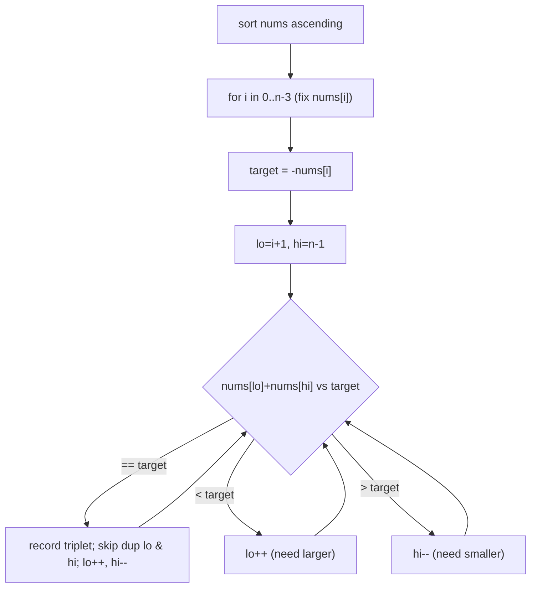
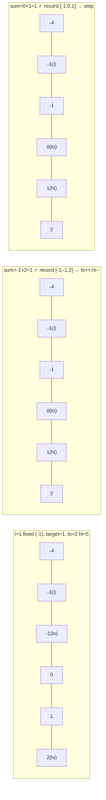
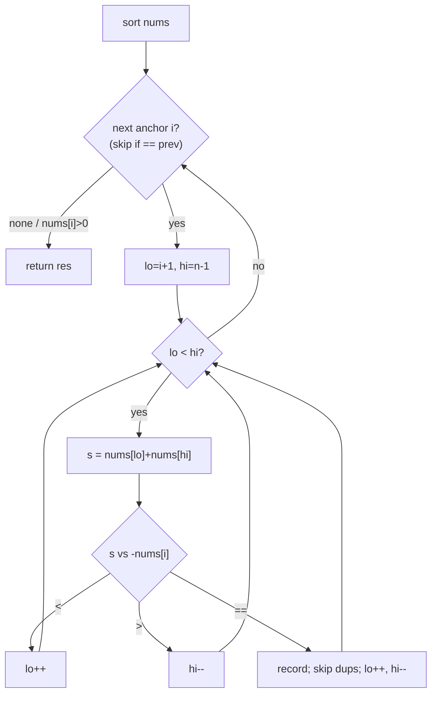
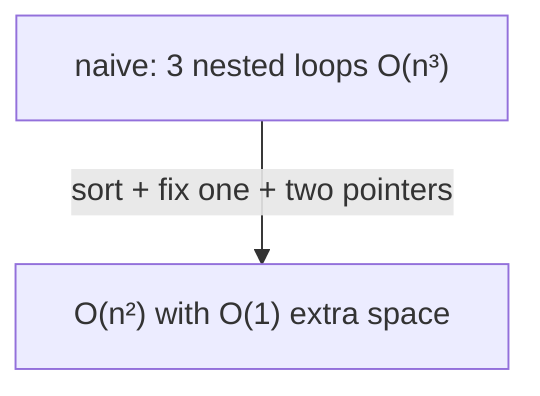

# 3Sum (LeetCode 15)

| Field | Value |
|---|---|
| Source | [LeetCode 15](https://leetcode.com/problems/3sum/) |
| Difficulty | Medium |
| Primary topic | **Sort + two pointers (k-Sum reduction)** |
| Secondary topic | Duplicate skipping, converging sweep |
| Key constraint | $3 \le n \le 3000$, $-10^5 \le \text{nums}[i] \le 10^5$ |

---

## Statement

Given an integer array `nums`, return **all unique triplets** `[nums[i], nums[j], nums[k]]`
with `i`, `j`, `k` distinct and `nums[i] + nums[j] + nums[k] == 0`. The solution set must not
contain duplicate triplets.

### Example

```text
Input:  nums = [-1, 0, 1, 2, -1, -4]
Output: [[-1, -1, 2], [-1, 0, 1]]

# sorted: [-4, -1, -1, 0, 1, 2]
#   fix -4 → no pair sums to 4
#   fix -1 → (-1, 2) and (0, 1) both sum to 1  → triplets [-1,-1,2], [-1,0,1]
#   ...duplicates skipped
```

---

## WHY: Reduce 3Sum to Many 2Sums

Sorting first unlocks two superpowers: (1) the converging two-pointer pair search from Two
Sum II, and (2) easy **duplicate skipping** since equal values sit adjacent. The plan:

1. **Sort** `nums` → $O(n \log n)$.
2. **Fix** the first element at index `i` (the outer loop).
3. On the suffix to the right of `i`, run a **converging two-pointer** sweep to find pairs
   summing to `-nums[i]`.



This turns an $O(n^3)$ triple loop into $O(n^2)$: one outer pass times one linear sweep.

---

## Code

```python
def three_sum(nums):
    nums.sort()
    n = len(nums)
    res = []
    for i in range(n - 2):
        if i > 0 and nums[i] == nums[i - 1]:
            continue                       # skip duplicate anchor
        if nums[i] > 0:
            break                          # smallest is positive ⇒ no zero sum
        lo, hi = i + 1, n - 1
        target = -nums[i]
        while lo < hi:
            s = nums[lo] + nums[hi]
            if s == target:
                res.append([nums[i], nums[lo], nums[hi]])
                lo += 1
                hi -= 1
                while lo < hi and nums[lo] == nums[lo - 1]:
                    lo += 1                # skip duplicate lo
                while lo < hi and nums[hi] == nums[hi + 1]:
                    hi -= 1                # skip duplicate hi
            elif s < target:
                lo += 1
            else:
                hi -= 1
    return res
```

```cpp
#include <bits/stdc++.h>
using namespace std;

vector<vector<int>> threeSum(vector<int>& nums) {
    sort(nums.begin(), nums.end());
    int n = (int)nums.size();
    vector<vector<int>> res;
    for (int i = 0; i < n - 2; ++i) {
        if (i > 0 && nums[i] == nums[i - 1]) {
            continue;                      // skip duplicate anchor
        }
        if (nums[i] > 0) {
            break;                         // smallest is positive ⇒ no zero sum
        }
        int lo = i + 1, hi = n - 1;
        long long target = -(long long)nums[i];
        while (lo < hi) {
            long long s = (long long)nums[lo] + nums[hi];
            if (s == target) {
                res.push_back({nums[i], nums[lo], nums[hi]});
                ++lo;
                --hi;
                while (lo < hi && nums[lo] == nums[lo - 1]) {
                    ++lo;                  // skip duplicate lo
                }
                while (lo < hi && nums[hi] == nums[hi + 1]) {
                    --hi;                  // skip duplicate hi
                }
            } else if (s < target) {
                ++lo;
            } else {
                --hi;
            }
        }
    }
    return res;
}
```

---

## Trace

Sorted input `[-4, -1, -1, 0, 1, 2]` (indices `0..5`). Anchor `i`, target `= -nums[i]`:

| i | nums[i] | target | lo | hi | nums[lo]+nums[hi] | vs target | Action |
|---|---|---|---|---|---|---|---|
| 0 | -4 | 4 | 1 | 5 | -1+2 = 1 | `<` | lo++ |
| 0 | -4 | 4 | 2 | 5 | -1+2 = 1 | `<` | lo++ |
| 0 | -4 | 4 | 3 | 5 | 0+2 = 2 | `<` | lo++ |
| 0 | -4 | 4 | 4 | 5 | 1+2 = 3 | `<` | lo++ → lo==hi stop |
| 1 | -1 | 1 | 2 | 5 | -1+2 = 1 | `==` | record `[-1,-1,2]`; lo++, hi-- |
| 1 | -1 | 1 | 3 | 4 | 0+1 = 1 | `==` | record `[-1,0,1]`; lo++, hi-- → stop |
| 2 | -1 | — | — | — | — | — | skip (dup of i=1) |
| 3 | 0 | — | — | — | — | — | nums[i]=0, continue then exhausted |

Anchor + converging sweep visualized for `i = 1` (`nums[i] = -1`, target `1`):



The overall control flow with duplicate handling:



---

## Math & Complexity

Sorting costs $O(n \log n)$. The outer loop runs $O(n)$ times; for each anchor the converging
sweep is $O(n)$. Total:

$$
T(n) = O(n \log n) + O(n)\cdot O(n) = O(n^2)
$$

$$
S(n) = O(1) \text{ auxiliary (ignoring the output and sort's stack)}
$$

This dominates the naive triple loop:

$$
\binom{n}{3} = \frac{n(n-1)(n-2)}{6} = O(n^3) \;\longrightarrow\; O(n^2)
$$



---

## Takeaway

3Sum is the canonical **k-Sum reduction**: sort, **fix** one element, and solve the remaining
2Sum with a converging two-pointer sweep. Sorting also makes duplicate elimination trivial
(skip equal neighbors). The same recipe generalizes — kSum is $O(n^{k-1})$ by peeling off one
fixed index at a time down to a two-pointer base case.
