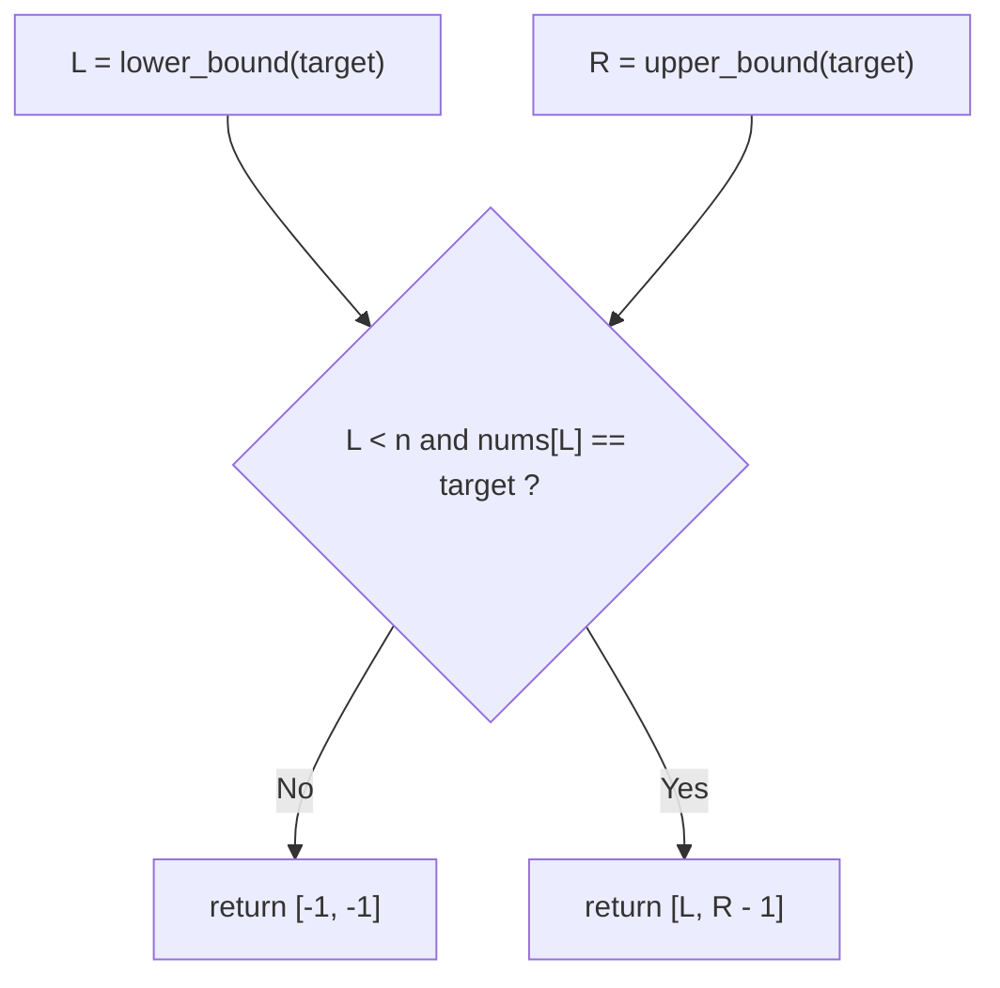
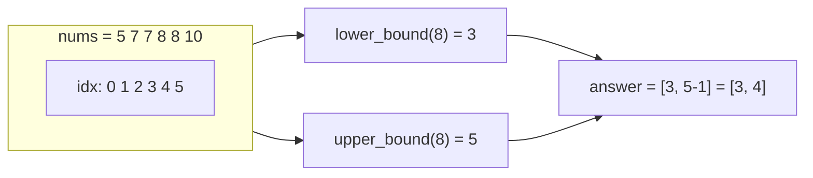
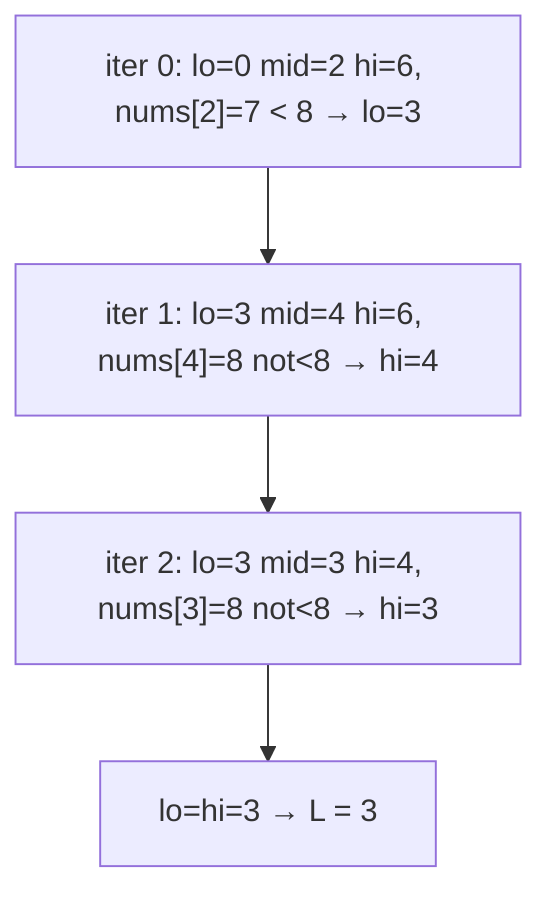
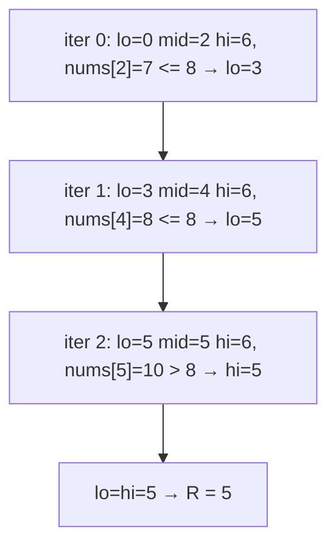
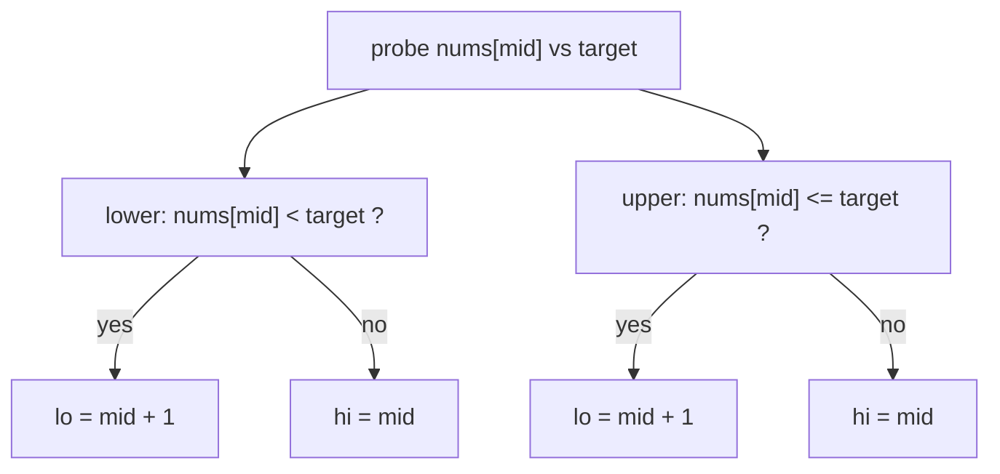
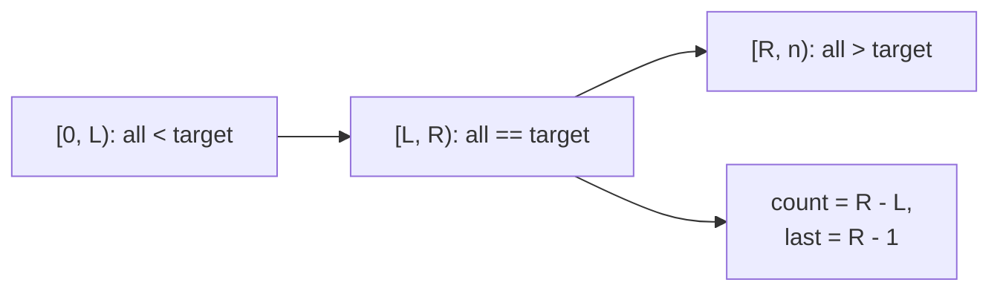

# LeetCode 34 — Find First and Last Position of Element in Sorted Array

| Field | Value |
|---|---|
| Source | [LeetCode 34](https://leetcode.com/problems/find-first-and-last-position-of-element-in-sorted-array/) |
| Difficulty | Medium |
| Primary topic | **Binary search on a sorted array** |
| Secondary topic | `lower_bound` (first $\ge x$), `upper_bound` (first $> x$) |
| Key constraint | $0 \le n \le 10^5$, sorted ascending, **duplicates allowed**, must run in $O(\log n)$ |

This problem is the purest motivation for `lower_bound` and `upper_bound`: with duplicates, a plain "find any match" is useless — we need the **boundaries** of the run of equal values. Two bound queries solve it.

---

## Statement

Given a sorted array `nums` (ascending, may contain duplicates) and a `target`, return `[first, last]` — the starting and ending indices of `target`. If `target` is not present, return `[-1, -1]`. Required time: $O(\log n)$.

### Example

```text
Input:  nums = [5, 7, 7, 8, 8, 10], target = 8
Output: [3, 4]

Input:  nums = [5, 7, 7, 8, 8, 10], target = 6
Output: [-1, -1]

Input:  nums = [], target = 0
Output: [-1, -1]
```

---

## WHY: Boundaries, Not Just Membership

A single exact-match search could land **anywhere** inside the block of `8`s — index 3 or 4 — and you cannot cheaply walk outward without risking $O(n)$ when the whole array equals `target`. Instead we compute two boundaries directly:

- $L = \texttt{lower\_bound}(target)$ — the **first** index with $nums[i] \ge target$.
- $R = \texttt{upper\_bound}(target)$ — the **first** index with $nums[i] > target$.

If `target` is present, it occupies exactly $[L, R)$, so the answer is `[L, R - 1]`. If $L = R$ (or $L = n$, or $nums[L] \ne target$), it is absent.





---

## Solution (Paired Python + C++)

```python
class Solution:
    def lower_bound(self, nums, x):
        lo, hi = 0, len(nums)
        while lo < hi:
            mid = lo + (hi - lo) // 2
            if nums[mid] < x:
                lo = mid + 1        # too small; go right
            else:
                hi = mid            # candidate (>= x); keep
        return lo

    def upper_bound(self, nums, x):
        lo, hi = 0, len(nums)
        while lo < hi:
            mid = lo + (hi - lo) // 2
            if nums[mid] <= x:
                lo = mid + 1        # <= x; go strictly right
            else:
                hi = mid            # candidate (> x); keep
        return lo

    def searchRange(self, nums, target):
        L = self.lower_bound(nums, target)
        if L == len(nums) or nums[L] != target:
            return [-1, -1]
        R = self.upper_bound(nums, target)
        return [L, R - 1]
```

```cpp
#include <bits/stdc++.h>
using namespace std;

class Solution {
    long long lowerBound(const vector<int>& nums, int x) {
        long long lo = 0, hi = (long long)nums.size();
        while (lo < hi) {
            long long mid = lo + (hi - lo) / 2;
            if (nums[mid] < x) lo = mid + 1;   // too small; go right
            else hi = mid;                     // candidate (>= x); keep
        }
        return lo;
    }
    long long upperBound(const vector<int>& nums, int x) {
        long long lo = 0, hi = (long long)nums.size();
        while (lo < hi) {
            long long mid = lo + (hi - lo) / 2;
            if (nums[mid] <= x) lo = mid + 1;  // <= x; go strictly right
            else hi = mid;                     // candidate (> x); keep
        }
        return lo;
    }
public:
    vector<int> searchRange(vector<int>& nums, int target) {
        long long L = lowerBound(nums, target);
        if (L == (long long)nums.size() || nums[L] != target)
            return {-1, -1};
        long long R = upperBound(nums, target);
        return {(int)L, (int)(R - 1)};
        // STL equivalent:
        //   auto lo = lower_bound(nums.begin(), nums.end(), target);
        //   auto up = upper_bound(nums.begin(), nums.end(), target);
        //   if (lo == up) return {-1, -1};
        //   return {(int)(lo - nums.begin()), (int)(up - nums.begin() - 1)};
    }
};
```

---

## Trace

`lower_bound(8)` on `[5, 7, 7, 8, 8, 10]`:

| iter | lo | mid | hi | nums[mid] | test `< 8` | action |
|---|---|---|---|---|---|---|
| 0 | 0 | 2 | 6 | 7 | true | `lo = 3` |
| 1 | 3 | 4 | 6 | 8 | false | `hi = 4` |
| 2 | 3 | 3 | 4 | 8 | false | `hi = 3` |
| 3 | 3 | — | 3 | — | — | `lo = hi` → **L = 3** |

`upper_bound(8)` on the same array:

| iter | lo | mid | hi | nums[mid] | test `<= 8` | action |
|---|---|---|---|---|---|---|
| 0 | 0 | 2 | 6 | 7 | true | `lo = 3` |
| 1 | 3 | 4 | 6 | 8 | true | `lo = 5` |
| 2 | 5 | 5 | 6 | 10 | false | `hi = 5` |
| 3 | 5 | — | 5 | — | — | `lo = hi` → **R = 5** |

Answer: `[L, R - 1] = [3, 4]`. ✔

---

## Visualizing the Two Bounds

`lower_bound` interval shrinking as a step graph:



`upper_bound` interval shrinking as a step graph:



The single `<` vs `<=` difference that separates the two routines:



How the two boundaries bracket the run of equal values:



---

## Math & Complexity

Two independent binary searches, each $O(\log n)$, plus $O(1)$ glue:

$$T(n) = 2 \cdot O(\log n) + O(1) = O(\log n), \qquad \text{space } O(1).$$

The count of `target` falls out for free as $R - L$, satisfying the strict $O(\log n)$ requirement even when the entire array equals `target`.

---

## Takeaway

When duplicates are in play, stop searching for "a match" and start computing **boundaries**. `lower_bound` (first $\ge x$) and `upper_bound` (first $> x$) differ by exactly one character (`<` vs `<=`), and together they give first index, last index, and count in $O(\log n)$ — the bread and butter of sorted-array queries.
