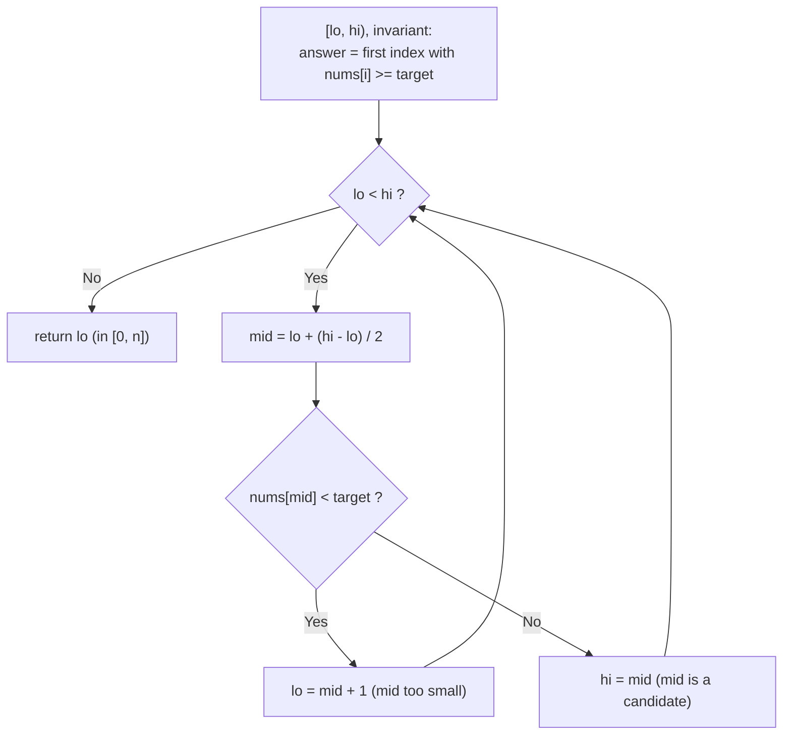
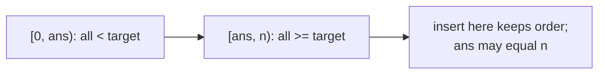
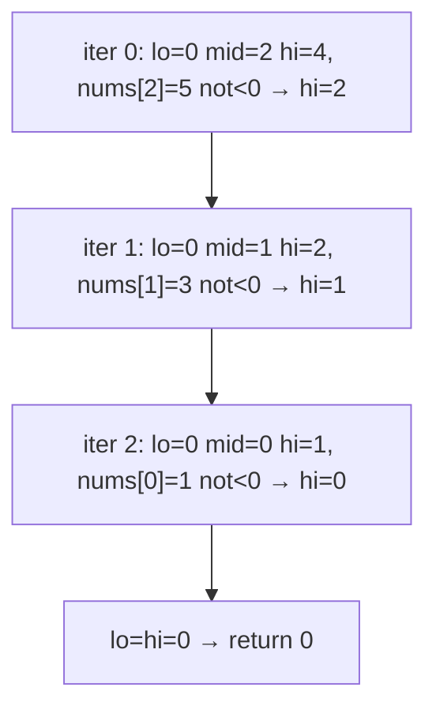
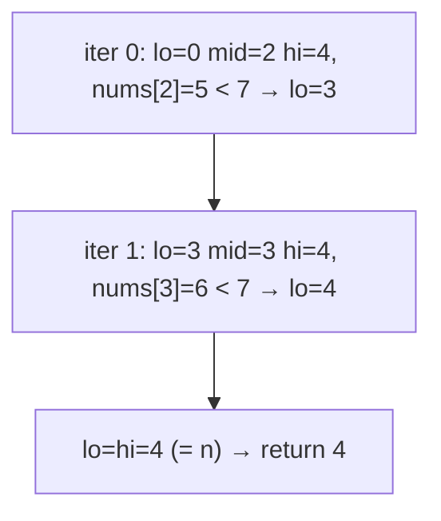
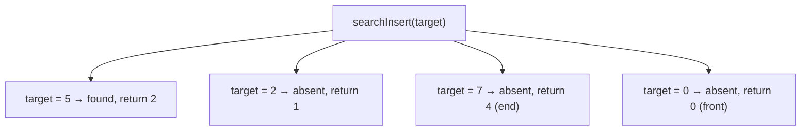
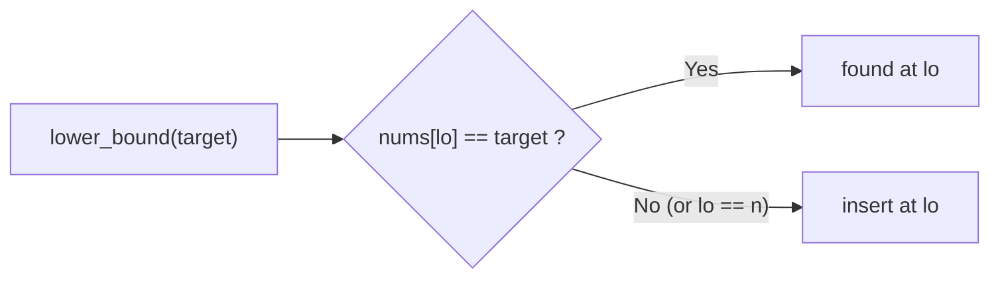

# LeetCode 35 — Search Insert Position

| Field | Value |
|---|---|
| Source | [LeetCode 35](https://leetcode.com/problems/search-insert-position/) |
| Difficulty | Easy |
| Primary topic | **Binary search on a sorted array** |
| Secondary topic | `lower_bound`, insertion point, half-open invariant |
| Key constraint | $1 \le n \le 10^4$, sorted ascending, **distinct** values, $-10^4 \le a_i, target \le 10^4$, $O(\log n)$ |

This is `lower_bound` wearing a different hat. The "insert position" that keeps the array sorted is *exactly* the first index whose value is $\ge target$ — so the same primitive that finds elements also tells us where missing ones belong.

---

## Statement

Given a sorted array of **distinct** integers `nums` and a `target`, return the index where `target` is found. If it is absent, return the index where it would be **inserted** to keep the array sorted. Required time: $O(\log n)$.

### Example

```text
Input:  nums = [1, 3, 5, 6], target = 5   ->  Output: 2   (found at index 2)
Input:  nums = [1, 3, 5, 6], target = 2   ->  Output: 1   (insert between 1 and 3)
Input:  nums = [1, 3, 5, 6], target = 7   ->  Output: 4   (insert at end)
Input:  nums = [1, 3, 5, 6], target = 0   ->  Output: 0   (insert at front)
```

---

## WHY: Insertion Point = First Index $\ge$ Target

To keep the array sorted after inserting `target`, it must go **before** every element that is $\ge target$ and **after** every element $< target$. That position is precisely the first index $i$ with $nums[i] \ge target$ — the definition of `lower_bound`. If `target` is present (distinct array), that same index *is* its location, so one routine handles both cases with no branching.

The half-open interval $[lo, hi)$ with $hi$ initialized to $n$ is essential here: the answer can legitimately be $n$ (insert at the end), and only the half-open form lets `lo` reach $n$ naturally.





---

## Solution (Paired Python + C++)

```python
class Solution:
    def searchInsert(self, nums, target):
        lo, hi = 0, len(nums)           # half-open [lo, hi); hi = n allows end
        while lo < hi:
            mid = lo + (hi - lo) // 2
            if nums[mid] < target:
                lo = mid + 1            # mid too small; insert further right
            else:
                hi = mid                # nums[mid] >= target; candidate
        return lo                       # first index with nums[i] >= target
```

```cpp
#include <bits/stdc++.h>
using namespace std;

class Solution {
public:
    int searchInsert(vector<int>& nums, int target) {
        long long lo = 0, hi = (long long)nums.size();  // half-open; hi = n
        while (lo < hi) {
            long long mid = lo + (hi - lo) / 2;
            if (nums[mid] < target) lo = mid + 1;       // too small; go right
            else hi = mid;                              // candidate (>= target)
        }
        return (int)lo;                                 // first index >= target
        // STL one-liner:
        //   return lower_bound(nums.begin(), nums.end(), target) - nums.begin();
    }
};
```

---

## Trace

`target = 2` in `[1, 3, 5, 6]` (absent → insert at 1):

| iter | lo | mid | hi | nums[mid] | test `< 2` | action |
|---|---|---|---|---|---|---|
| 0 | 0 | 2 | 4 | 5 | false | `hi = 2` |
| 1 | 0 | 1 | 2 | 3 | false | `hi = 1` |
| 2 | 0 | 0 | 1 | 1 | true | `lo = 1` |
| 3 | 1 | — | 1 | — | — | `lo = hi` → **return 1** |

`target = 7` (insert at end):

| iter | lo | mid | hi | nums[mid] | test `< 7` | action |
|---|---|---|---|---|---|---|
| 0 | 0 | 2 | 4 | 5 | true | `lo = 3` |
| 1 | 3 | 3 | 4 | 6 | true | `lo = 4` |
| 2 | 4 | — | 4 | — | — | `lo = hi` → **return 4** ($= n$) |

---

## Visualizing the Insert Position

The "insert at front" case `target = 0` as a step graph:



The "insert at end" case `target = 7`, where `lo` climbs to $n$:



Decision tree mapping each `target` to its outcome on `[1, 3, 5, 6]`:



Why exact-search and insert-search share one routine:



---

## Math & Complexity

A single `lower_bound` over $[0, n)$, halving each step:

$$T(n) = T\!\left(\frac{n}{2}\right) + O(1) = O(\log n), \qquad \text{space } O(1).$$

The loop runs at most $\lceil \log_2 n \rceil$ times; for $n = 10^4$ that is $\le 14$ comparisons. No special-casing of "found vs not found" is needed — `lower_bound` returns the right index either way.

---

## Takeaway

"Search insert position" is just `lower_bound` with a friendlier name: the first index $\ge target$ is simultaneously where `target` lives (if present) and where it should go (if not). The half-open $[lo, hi)$ with `hi = n` is what lets the answer be `n` for an end-insertion — a case that trips up closed-interval implementations.
