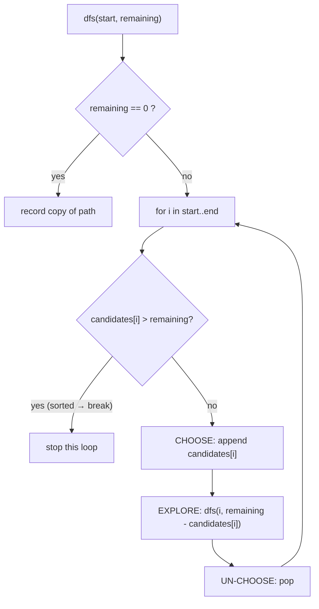
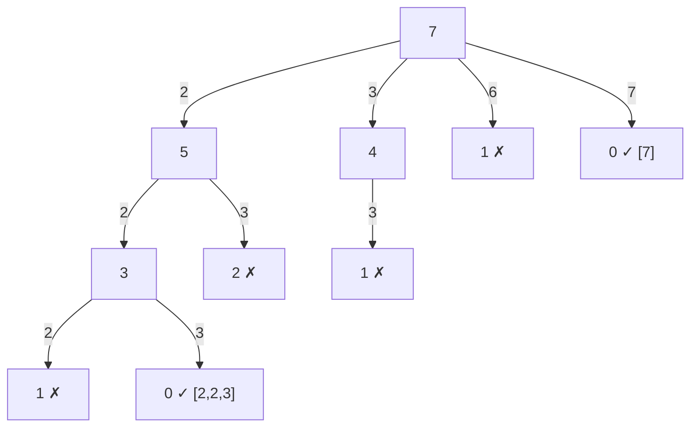
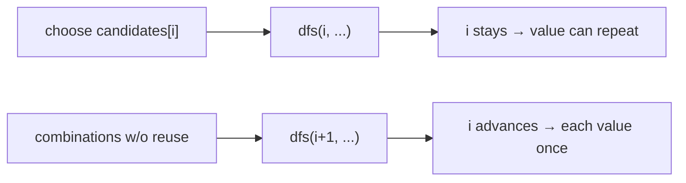
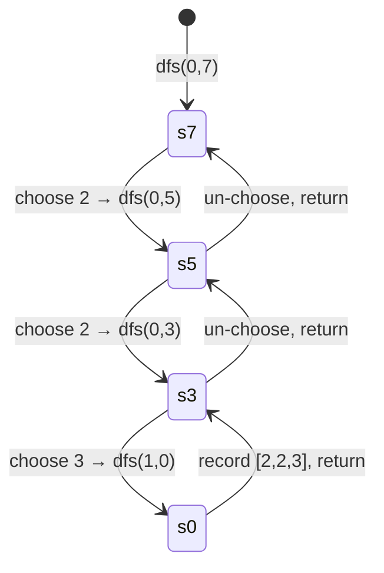
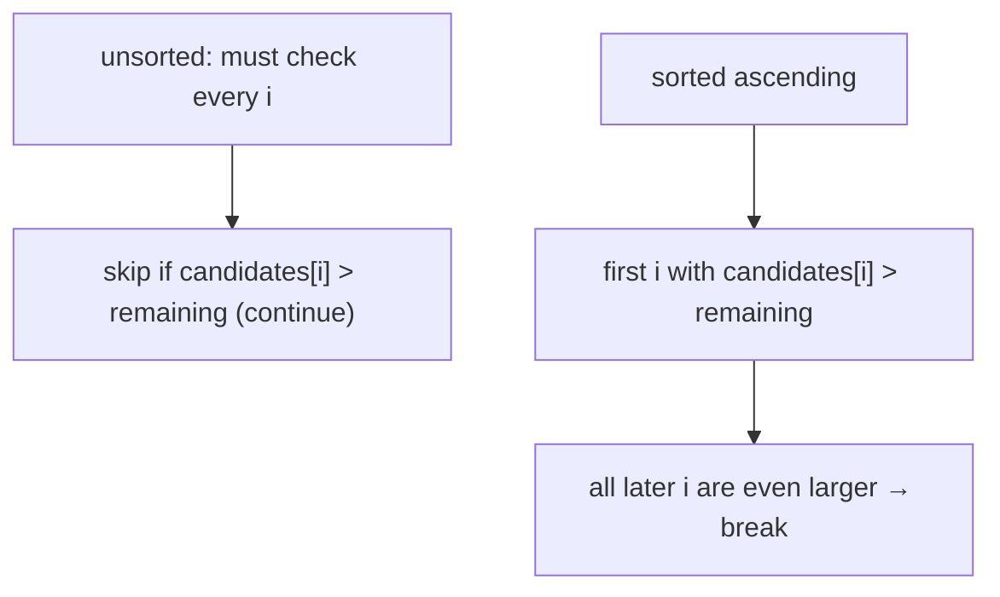

# Combination Sum

| Meta | Value |
|------|-------|
| Source | LeetCode #39 |
| Difficulty | Medium |
| Topics | Array, Backtracking, Recursion |
| Link | https://leetcode.com/problems/combination-sum/ |

---

## Problem Statement
Given an array of **distinct** positive integers `candidates` and a target integer `target`,
return **all unique combinations** of `candidates` where the chosen numbers sum to `target`.
The **same number may be used an unlimited number of times**. Two combinations are different
only if the multiset of chosen numbers differs (order does not matter).

**Example**
```text
Input:  candidates = [2, 3, 6, 7], target = 7
Output: [[2,2,3],[7]]
        // 2+2+3 = 7 and 7 = 7

Input:  candidates = [2, 3, 5], target = 8
Output: [[2,2,2,2],[2,3,3],[3,5]]
```

---

## WHY This Is a Backtracking Problem

We grow a partial combination by repeatedly choosing a candidate and subtracting it from the
remaining target. Because order does not matter, we avoid duplicates by only ever choosing
candidates from the **current index onward** (`start`). Because reuse is allowed, after
choosing index `i` we recurse with the *same* index `i` (not `i + 1`). When `remaining` hits
`0` we found a combination; if it goes negative we prune.



---

## Solution — Backtracking with `start` Index and Pruning

Sorting `candidates` first lets us **break** out of the loop as soon as a candidate exceeds the
remaining target (every later candidate is even larger).

```python
def combination_sum(candidates, target):
    candidates.sort()                    # enables the break-based prune
    result = []
    path = []

    def dfs(start, remaining):
        if remaining == 0:               # base case: exact target hit
            result.append(path[:])       # record a COPY
            return
        for i in range(start, len(candidates)):
            if candidates[i] > remaining:
                break                    # PRUNE: sorted, rest are larger too
            path.append(candidates[i])   # CHOOSE
            dfs(i, remaining - candidates[i])  # EXPLORE (reuse: same i)
            path.pop()                   # UN-CHOOSE

    dfs(0, target)
    return result
```

```cpp
#include <bits/stdc++.h>
using namespace std;

void dfs(vector<int>& candidates, int start, int remaining,
         vector<int>& path, vector<vector<int>>& result) {
    if (remaining == 0) {                // base case: exact target hit
        result.push_back(path);          // record a COPY
        return;
    }
    for (int i = start; i < (int)candidates.size(); i++) {
        if (candidates[i] > remaining)
            break;                       // PRUNE: sorted, rest are larger too
        path.push_back(candidates[i]);   // CHOOSE
        dfs(candidates, i, remaining - candidates[i], path, result);  // EXPLORE (reuse: same i)
        path.pop_back();                 // UN-CHOOSE
    }
}

vector<vector<int>> combination_sum(vector<int>& candidates, int target) {
    sort(candidates.begin(), candidates.end());  // enables the break-based prune
    vector<vector<int>> result;
    vector<int> path;
    dfs(candidates, 0, target, path, result);
    return result;
}
```

---

## Trace — `candidates = [2, 3, 6, 7]`, `target = 7`

```text
dfs(0, 7)
 choose 2 -> dfs(0, 5)
   choose 2 -> dfs(0, 3)
     choose 2 -> dfs(0, 1)
       2 > 1 -> break (no record)
     choose 3 -> dfs(1, 0)  ✓ record [2,2,3]
   choose 3 -> dfs(1, 2)
     3 > 2 -> break
 choose 3 -> dfs(1, 4)
   choose 3 -> dfs(1, 1)
     3 > 1 -> break
 choose 6 -> dfs(2, 1) -> break
 choose 7 -> dfs(3, 0)  ✓ record [7]
Result: [[2,2,3],[7]]
```

The recursion **tree** (node label = `remaining`; edge label = chosen value; ✓ = solution,
✗ = pruned because the candidate exceeds `remaining`):



Why we recurse with the **same index** `i` (allows reuse) versus `i + 1` (no reuse):



The call stack along the `[2, 2, 3]` path:



How sorting turns a `continue` into an early `break`:



---

## Math & Complexity

Let $T$ be the target and $m$ the smallest candidate. The deepest any path can go is when we
repeatedly choose the smallest value:

$$
d_{\max} = \left\lfloor \frac{T}{m} \right\rfloor
$$

With up to $n = |\text{candidates}|$ choices at each of those levels, the search tree size is
bounded by:

$$
T(\text{time}) = O\!\left(n^{\,T/m}\right)
$$

which is exponential in the worst case, but pruning (the sorted `break` and the
`remaining < 0` cut-off) removes huge portions of the tree in practice. Space is
$O(T / m)$ for the recursion depth plus the output size.

---

## Takeaway
Combination Sum shows two backtracking refinements at once: a **`start` index** to dodge
duplicate combinations (order-insensitive), and **reuse** by recursing on the *same* index.
Sort the candidates so an out-of-range value lets you `break` instead of `continue`, pruning
all larger candidates in one stroke. As always: CHOOSE → EXPLORE → UN-CHOOSE, and record a
**copy** at the base case.
