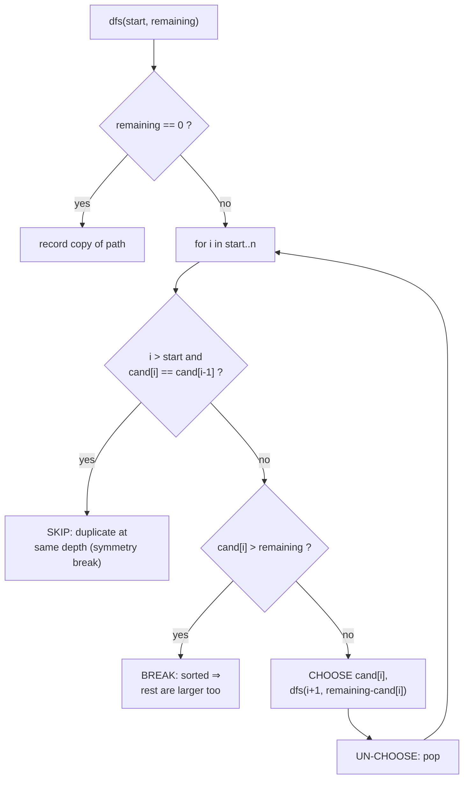
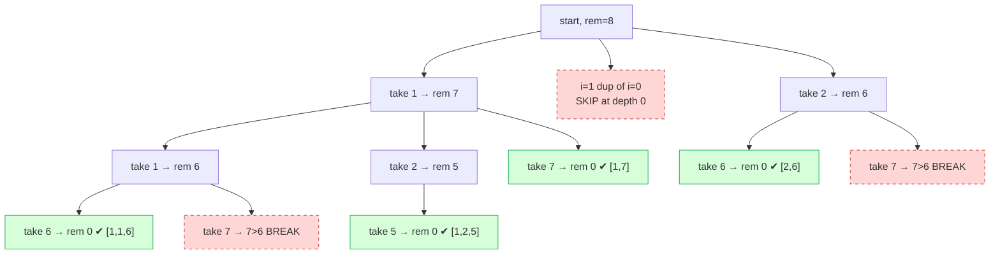

# Combination Sum II

| Meta | Value |
|------|-------|
| Source | LeetCode #40 |
| Difficulty | Medium |
| Topics | Array, Backtracking, Casework, Pruning |
| Link | https://leetcode.com/problems/combination-sum-ii/ |

---

## Problem Statement
Given a collection of candidate numbers `candidates` (which **may contain duplicates**) and a
target integer `target`, find **all unique combinations** of `candidates` where the chosen
numbers sum to `target`. **Each number may be used at most once** in a combination. The
solution set must **not contain duplicate combinations**.

**Example**
```text
Input:  candidates = [10,1,2,7,6,1,5], target = 8
Output: [[1,1,6],[1,2,5],[1,7],[2,6]]
        // 1+1+6 = 8, 1+2+5 = 8, 1+7 = 8, 2+6 = 8

Input:  candidates = [2,5,2,1,2], target = 5
Output: [[1,2,2],[5]]
```

---

## WHY This Is a Brute-Force-with-Pruning Problem

The raw search space is *every subset* of `candidates` — up to $2^n$ of them — and we keep the
ones summing to `target`. That is brute force. Two things make it tractable and *correct*:

1. **Symmetry breaking (no duplicate combinations).** Because the input has duplicate values,
   the naive subset enumeration produces the same multiset many times. We **sort** first, then
   at any given recursion depth we **skip a value equal to the one we just rejected** at that
   depth. This visits each distinct multiset exactly once — classic casework: *cover every
   multiset, overlap none.*
2. **Ordering prune (cutoff).** After sorting, if `candidates[i] > remaining` we `break`: every
   later candidate is at least as large, so none can fit. Whole subtrees vanish.



---

## Solution — Sort + Backtrack + Prune Duplicates + Cutoff

The key recurrence: at index `i` we either **take** `candidates[i]` (then move to `i+1`, since
each number is used at most once) or **skip** it. We skip *all* further equal copies at the
same depth so we never form the same multiset twice.

```python
def combination_sum2(candidates, target):
    candidates.sort()                        # enables both prunes
    result, path = [], []

    def dfs(start, remaining):
        if remaining == 0:                   # base case: exact target
            result.append(path[:])           # record a COPY
            return
        for i in range(start, len(candidates)):
            if i > start and candidates[i] == candidates[i - 1]:
                continue                     # SYMMETRY BREAK: skip duplicate at this depth
            if candidates[i] > remaining:
                break                        # CUTOFF: sorted, all later are larger
            path.append(candidates[i])
            dfs(i + 1, remaining - candidates[i])   # i+1: use each number at most once
            path.pop()

    dfs(0, target)
    return result
```

```cpp
#include <bits/stdc++.h>
using namespace std;

vector<vector<long long>> combination_sum2(vector<long long> candidates, long long target) {
    sort(candidates.begin(), candidates.end());   // enables both prunes
    vector<vector<long long>> result;
    vector<long long> path;

    function<void(int, long long)> dfs = [&](int start, long long remaining) {
        if (remaining == 0) {                      // base case: exact target
            result.push_back(path);                // record a COPY
            return;
        }
        for (int i = start; i < (int)candidates.size(); ++i) {
            if (i > start && candidates[i] == candidates[i - 1])
                continue;                          // SYMMETRY BREAK: skip duplicate
            if (candidates[i] > remaining)
                break;                             // CUTOFF: sorted, later are larger
            path.push_back(candidates[i]);
            dfs(i + 1, remaining - candidates[i]); // i+1: each number used at most once
            path.pop_back();
        }
    };
    dfs(0, target);
    return result;
}
```

---

## Trace — `candidates = [1,1,2,5,6,7,10]` (sorted), `target = 8`

| Step | `start` | `remaining` | `path` | Action |
|------|---------|-------------|--------|--------|
| 1 | 0 | 8 | `[]` | take `cand[0]=1` |
| 2 | 1 | 7 | `[1]` | take `cand[1]=1` |
| 3 | 2 | 6 | `[1,1]` | skip 2,5; take `cand[4]=6` |
| 4 | 5 | 0 | `[1,1,6]` | **record** `[1,1,6]` |
| 5 | 1 | 7 | `[1]` | (back) take `cand[2]=2` |
| 6 | 3 | 5 | `[1,2]` | take `cand[3]=5` → `[1,2,5]` ✔ |
| 7 | 0 | 8 | `[1]` | take `cand[5]=7` → `[1,7]` ✔ |
| 8 | 0 | 8 | `[]` | at depth 0, `i=1` is dup of `i=0` → **skip** |
| 9 | 0 | 8 | `[]` | take `cand[2]=2`, then `6` → `[2,6]` ✔ |

The skip at step 8 is what prevents a second, identical `[1,...]` branch — the duplicate `1`
at depth 0 is suppressed.



The dashed branches are the ones **pruning removes**: duplicate skips and the sorted-cutoff
`break`. Without them we would re-discover `[1,7]`, `[1,2,5]`, etc. multiple times and waste
work scanning candidates that cannot fit.

---

## Math / Complexity

Let $n$ be the number of candidates. The search tree has at most $2^n$ leaves (each element
taken or not), and copying a found combination costs $O(n)$.

$$
T(n) = O(2^n \cdot n), \qquad S(n) = O(n)\ \text{recursion depth (excluding output)}.
$$

In practice the two prunes drop the explored node count dramatically: the sorted **cutoff**
removes every branch that overshoots, and **duplicate-skipping** removes every redundant
multiset. The sort itself is $O(n \log n)$, dominated by the search.

---

## Takeaway

> **Combination Sum II = subset brute force + two safe prunes.** Sort once; then *skip equal
> values at the same depth* to break the symmetry that causes duplicate combinations, and
> *break on overshoot* to cut hopeless branches. The pattern — sort, recurse on `i+1`, skip
> `nums[i]==nums[i-1]` when `i>start` — reappears in nearly every "unique combinations with
> duplicates" problem.
