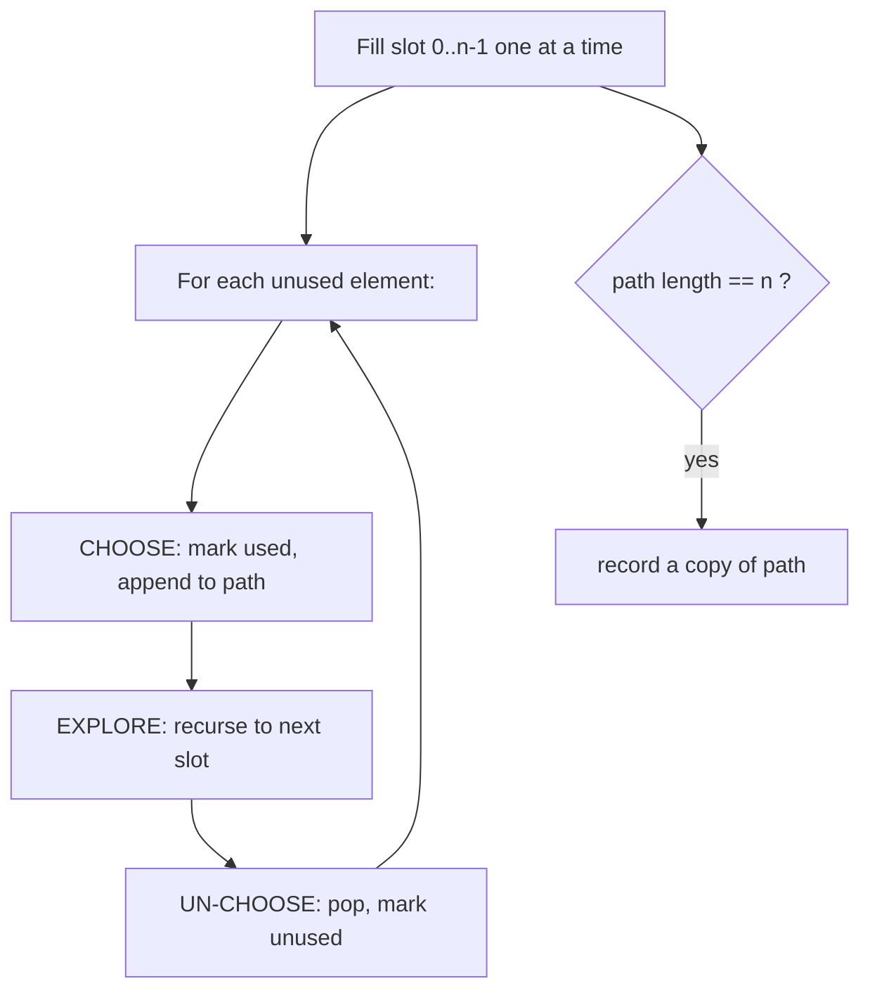
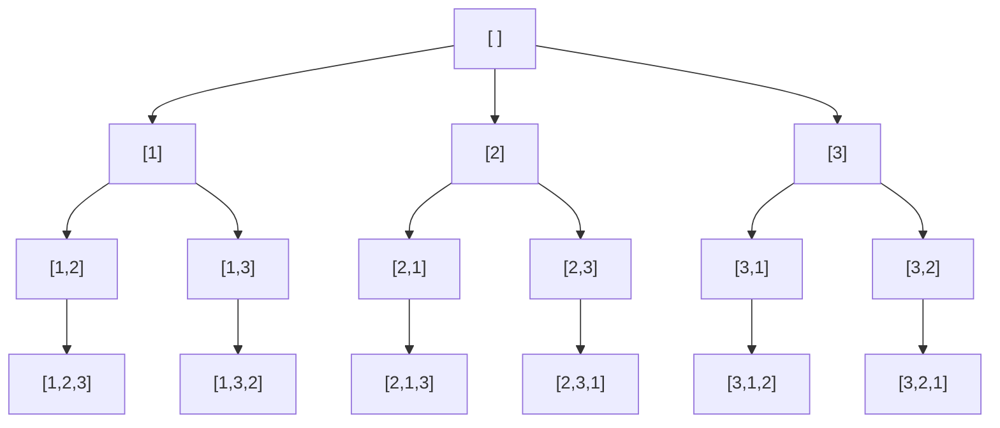
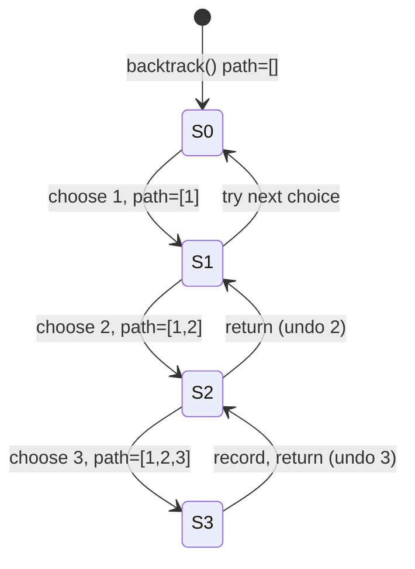
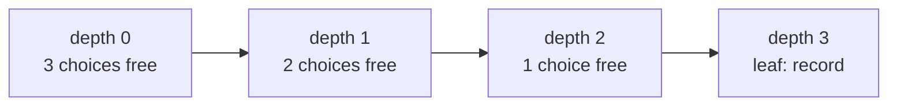

# Permutations

| Meta | Value |
|------|-------|
| Source | LeetCode #46 |
| Difficulty | Medium |
| Topics | Array, Backtracking, Recursion |
| Link | https://leetcode.com/problems/permutations/ |

---

## Problem Statement
Given an array `nums` of **distinct** integers, return **all the possible permutations**. You
may return the answer in any order.

A *permutation* is an arrangement that uses every element exactly once; order matters, so
`[1, 2, 3]` and `[1, 3, 2]` are different answers.

**Example**
```text
Input:  nums = [1, 2, 3]
Output: [[1,2,3],[1,3,2],[2,1,3],[2,3,1],[3,1,2],[3,2,1]]

Input:  nums = [0, 1]
Output: [[0,1],[1,0]]
```

---

## WHY This Is a Backtracking Problem

Building one permutation is a sequence of choices: *"which unused element goes in the next
slot?"* Each choice branches into the remaining options, and after exploring a branch we must
**undo** the choice to try the next one. That is exactly the choose → explore → un-choose
loop. The set of all root-to-leaf paths in the decision tree is the set of all permutations.



---

## Solution — Backtracking with a `used` Array

We keep a boolean `used` array so we never pick the same index twice within one permutation.
When `path` reaches length `n`, we have a complete permutation and record a **copy**.

```python
def permute(nums):
    result = []
    used = [False] * len(nums)
    path = []

    def backtrack():
        if len(path) == len(nums):       # base case: a full permutation
            result.append(path[:])       # record a COPY, not the live list
            return
        for i in range(len(nums)):
            if used[i]:
                continue                 # skip elements already in path
            used[i] = True               # CHOOSE
            path.append(nums[i])
            backtrack()                  # EXPLORE
            path.pop()                   # UN-CHOOSE
            used[i] = False

    backtrack()
    return result
```

```cpp
#include <bits/stdc++.h>
using namespace std;

void backtrack(vector<int>& nums, vector<bool>& used,
               vector<int>& path, vector<vector<int>>& result) {
    if (path.size() == nums.size()) {    // base case: a full permutation
        result.push_back(path);          // record a COPY (push by value)
        return;
    }
    for (int i = 0; i < (int)nums.size(); i++) {
        if (used[i])
            continue;                    // skip elements already in path
        used[i] = true;                  // CHOOSE
        path.push_back(nums[i]);
        backtrack(nums, used, path, result);  // EXPLORE
        path.pop_back();                 // UN-CHOOSE
        used[i] = false;
    }
}

vector<vector<int>> permute(vector<int>& nums) {
    vector<vector<int>> result;
    vector<bool> used(nums.size(), false);
    vector<int> path;
    backtrack(nums, used, path, result);
    return result;
}
```

---

## Trace — `nums = [1, 2, 3]`

```text
path=[]           choose 1 -> path=[1]
  path=[1]        choose 2 -> path=[1,2]
    path=[1,2]    choose 3 -> path=[1,2,3]   ✓ record [1,2,3]
    undo 3        path=[1,2]   (no more choices) undo 2
  path=[1]        choose 3 -> path=[1,3]
    path=[1,3]    choose 2 -> path=[1,3,2]   ✓ record [1,3,2]
  ... undo back to [] , choose 2, then choose 3 ...
Final: [1,2,3],[1,3,2],[2,1,3],[2,3,1],[3,1,2],[3,2,1]
```

The recursion / decision **tree** — every leaf is one permutation:



The call stack growing and unwinding for the first branch:



How the `used` array gates the branching factor at each depth:



---

## Math & Complexity

The number of permutations of $n$ distinct elements is:

$$
n! = n \times (n-1) \times \dots \times 2 \times 1
$$

There are $n!$ leaves, and copying each completed permutation costs $O(n)$, so:

$$
T(n) = O(n \cdot n!) \qquad \text{Space} = O(n) \text{ recursion depth} + O(n) \text{ for } used
$$

The branching factor starts at $n$ and shrinks by one each level (because one more element is
`used`), giving the product $n \cdot (n-1) \cdots 1 = n!$ root-to-leaf paths.

---

## Takeaway
Permutations are the canonical **choose → explore → un-choose** drill: loop over every unused
element, mark it used, recurse, then unmark. Always record a **copy** of the path, and let the
`used` array shrink the branching factor so the tree has exactly $n!$ leaves.
