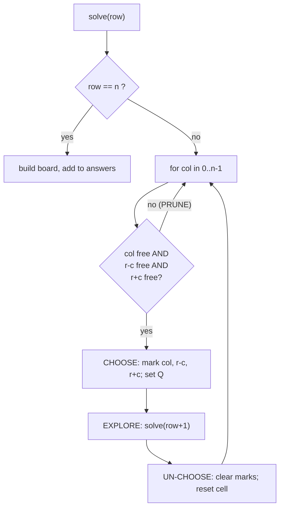
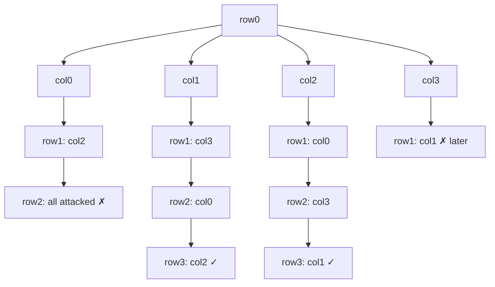
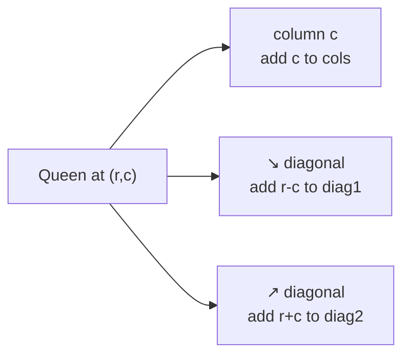
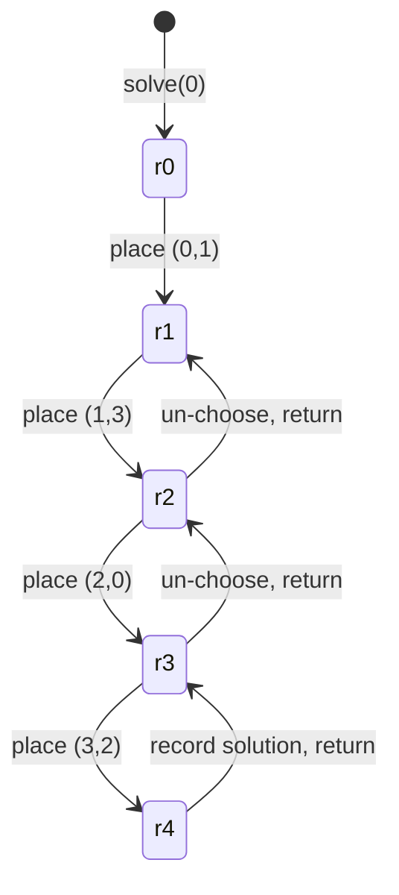

# N-Queens

| Meta | Value |
|------|-------|
| Source | LeetCode #51 |
| Difficulty | Hard |
| Topics | Backtracking, Recursion, Constraint Satisfaction |
| Link | https://leetcode.com/problems/n-queens/ |

---

## Problem Statement
The **N-Queens** puzzle asks you to place `n` queens on an `n × n` chessboard so that **no two
queens attack each other**. Two queens attack each other if they share a row, a column, or a
diagonal. Return **all distinct solutions**, where each solution is a board drawn with `'Q'`
for a queen and `'.'` for an empty square.

**Example**
```text
Input:  n = 4
Output:
[
 [".Q..",     // queen at (0,1)
  "...Q",     // queen at (1,3)
  "Q...",     // queen at (2,0)
  "..Q."],    // queen at (3,2)

 ["..Q.",
  "Q...",
  "...Q",
  ".Q.."]
]
There are exactly 2 solutions for n = 4.
```

---

## WHY This Is a Backtracking Problem

We place **one queen per row** (this automatically prevents two queens in the same row). For
each row we try every column; a column is legal only if its column index and both diagonals
are still free. If legal, we place the queen (CHOOSE), recurse to the next row (EXPLORE), then
remove it (UN-CHOOSE). The moment a row has no legal column, that branch dies — strong pruning.

A queen at row $r$, column $c$ blocks:
- column $c$,
- the **↘ diagonal** keyed by $r - c$ (constant along a top-left → bottom-right line),
- the **↗ diagonal** keyed by $r + c$ (constant along a top-right → bottom-left line).



---

## Solution — Backtracking with Diagonal Sets

We track three sets (or boolean arrays) for occupied columns and the two diagonal families,
giving $O(1)$ safety checks.

```python
def solve_n_queens(n):
    result = []
    board = [["."] * n for _ in range(n)]
    cols = set()
    diag1 = set()                        # r - c (↘)
    diag2 = set()                        # r + c (↗)

    def solve(row):
        if row == n:                     # base case: every row has a queen
            result.append(["".join(r) for r in board])
            return
        for col in range(n):
            if col in cols or (row - col) in diag1 or (row + col) in diag2:
                continue                 # PRUNE: square is attacked
            cols.add(col)                # CHOOSE
            diag1.add(row - col)
            diag2.add(row + col)
            board[row][col] = "Q"
            solve(row + 1)               # EXPLORE
            board[row][col] = "."        # UN-CHOOSE
            cols.remove(col)
            diag1.remove(row - col)
            diag2.remove(row + col)

    solve(0)
    return result
```

```cpp
#include <bits/stdc++.h>
using namespace std;

void solve(int row, int n, vector<string>& board,
           set<int>& cols, set<int>& diag1, set<int>& diag2,
           vector<vector<string>>& result) {
    if (row == n) {                      // base case: every row has a queen
        result.push_back(board);
        return;
    }
    for (int col = 0; col < n; col++) {
        if (cols.count(col) || diag1.count(row - col) || diag2.count(row + col))
            continue;                    // PRUNE: square is attacked
        cols.insert(col);                // CHOOSE
        diag1.insert(row - col);
        diag2.insert(row + col);
        board[row][col] = 'Q';
        solve(row + 1, n, board, cols, diag1, diag2, result);  // EXPLORE
        board[row][col] = '.';           // UN-CHOOSE
        cols.erase(col);
        diag1.erase(row - col);
        diag2.erase(row + col);
    }
}

vector<vector<string>> solve_n_queens(int n) {
    vector<vector<string>> result;
    vector<string> board(n, string(n, '.'));
    set<int> cols, diag1, diag2;
    solve(0, n, board, cols, diag1, diag2, result);
    return result;
}
```

### Counting solutions only

If you only need the **count** of solutions, drop the board and just increment a counter at
the base case — faster and lighter.

```python
def total_n_queens(n):
    cols, diag1, diag2 = set(), set(), set()
    count = 0

    def solve(row):
        nonlocal count
        if row == n:                     # base case
            count += 1
            return
        for col in range(n):
            if col in cols or (row - col) in diag1 or (row + col) in diag2:
                continue                 # PRUNE
            cols.add(col); diag1.add(row - col); diag2.add(row + col)  # CHOOSE
            solve(row + 1)               # EXPLORE
            cols.remove(col); diag1.remove(row - col); diag2.remove(row + col)  # UN-CHOOSE

    solve(0)
    return count
```

```cpp
#include <bits/stdc++.h>
using namespace std;

void solve(int row, int n, set<int>& cols, set<int>& diag1,
           set<int>& diag2, long long& count) {
    if (row == n) {                      // base case
        count++;
        return;
    }
    for (int col = 0; col < n; col++) {
        if (cols.count(col) || diag1.count(row - col) || diag2.count(row + col))
            continue;                    // PRUNE
        cols.insert(col); diag1.insert(row - col); diag2.insert(row + col);  // CHOOSE
        solve(row + 1, n, cols, diag1, diag2, count);  // EXPLORE
        cols.erase(col); diag1.erase(row - col); diag2.erase(row + col);     // UN-CHOOSE
    }
}

long long total_n_queens(int n) {
    set<int> cols, diag1, diag2;
    long long count = 0;
    solve(0, n, cols, diag1, diag2, count);
    return count;
}
```

---

## Trace — `n = 4`

```text
row0: try col0 -> place (0,0)
  row1: col0 blocked(col), col1 blocked(diag r-c & r+c), col2 ok -> place (1,2)
    row2: every col attacked -> DEAD END, backtrack
  row1: col3 ok -> place (1,3)
    row2: col0 ok -> place (2,0)
      row3: only col2... attacked? yes -> DEAD END
    ... backtrack ...
row0: try col1 -> place (0,1)
  row1: col3 -> row2: col0 -> row3: col2  ✓ SOLUTION
  .Q.. / ...Q / Q... / ..Q.
```

The pruned search **tree** for `n = 4` (queen column shown per row; ✗ = pruned dead end):



How a single placement marks three constraint families at once:



State of the recursion stack along the winning path:



---

## Math & Complexity

Without pruning there are $n^n$ ways to drop one queen per row; the one-queen-per-row rule
alone cuts this to $n!$ candidate arrangements:

$$
\text{candidates} \le n! 
$$

Diagonal and column pruning removes the vast majority of those before they are fully built, so
in practice the explored tree is far smaller than $n!$. The worst-case bound is:

$$
T(n) = O(n!) \qquad \text{Space} = O(n) \text{ for the three sets} + O(n) \text{ recursion depth}
$$

The number of *valid* solutions grows irregularly: $1, 0, 0, 2, 10, 4, 40, 92, \dots$ for
$n = 1, 2, 3, 4, 5, 6, 7, 8$.

---

## Takeaway
N-Queens is the archetypal **constraint-satisfaction** backtracking problem: place one item
per row, encode each constraint (column, $r-c$, $r+c$) as an $O(1)$-checkable set, and prune
the instant a constraint is violated. The CHOOSE/UN-CHOOSE pair must mark and unmark **all
three** sets together, or the search will silently lose solutions.
