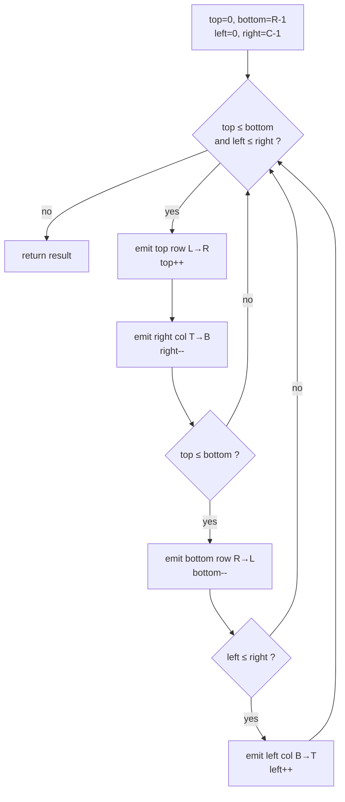
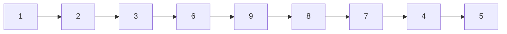
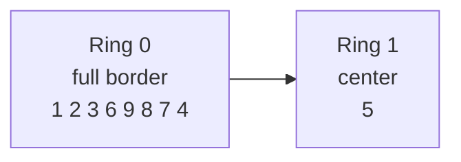
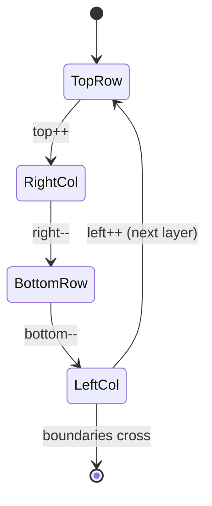
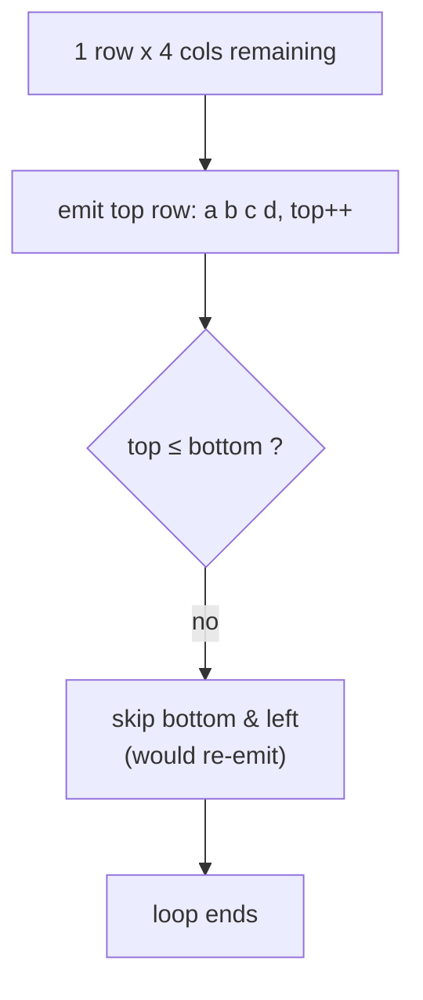

# Spiral Matrix

| Meta | Value |
|------|-------|
| **Problem** | Spiral Matrix |
| **Source** | LeetCode 54 |
| **Link** | https://leetcode.com/problems/spiral-matrix/ |
| **Difficulty** | Medium |
| **Topics** | Implementation, Matrix, Simulation |
| **Time** | $O(R \cdot C)$ |
| **Space** | $O(1)$ extra (excluding output) |

---

## Problem Statement

Given an $R \times C$ matrix, return **all elements of the matrix in spiral order**: start at the top-left, walk the top row left-to-right, then the right column top-to-bottom, then the bottom row right-to-left, then the left column bottom-to-top, then shrink inward and repeat until every element is visited.

```text
Input:
 1  2  3
 4  5  6
 7  8  9

Output: [1, 2, 3, 6, 9, 8, 7, 4, 5]
```

```text
Input:
 1  2  3  4
 5  6  7  8
 9 10 11 12

Output: [1, 2, 3, 4, 8, 12, 11, 10, 9, 5, 6, 7]
```

---

## Approach (WHY)

The spiral is just a **controlled walk** that peels one rectangular layer at a time. Rather than tracking a position and a turning direction (which needs a `visited` array to know when to turn), we track **four boundaries** — `top`, `bottom`, `left`, `right` — and process one side per step, contracting that boundary immediately afterward.

The *why* behind contracting after each side: once we have emitted the top row, that row no longer exists for the rest of the spiral, so `top++` permanently removes it from consideration. Doing this for all four sides guarantees each cell is emitted exactly once and the loop terminates when the boundaries cross.

The two `if` guards (`if top <= bottom` before the bottom row, `if left <= right` before the left column) are essential for **non-square** matrices. After processing the top row and right column of a single remaining row, `top` may exceed `bottom`; without the guard we would re-emit cells or read out of range.



---

## Solution

```python
from typing import List

def spiralOrder(matrix: List[List[int]]) -> List[int]:
    if not matrix or not matrix[0]:
        return []
    R, C = len(matrix), len(matrix[0])
    top, bottom, left, right = 0, R - 1, 0, C - 1
    res = []
    while top <= bottom and left <= right:
        for c in range(left, right + 1):           # top row L->R
            res.append(matrix[top][c])
        top += 1
        for r in range(top, bottom + 1):           # right col T->B
            res.append(matrix[r][right])
        right -= 1
        if top <= bottom:                          # bottom row R->L
            for c in range(right, left - 1, -1):
                res.append(matrix[bottom][c])
            bottom -= 1
        if left <= right:                          # left col B->T
            for r in range(bottom, top - 1, -1):
                res.append(matrix[r][left])
            left += 1
    return res

print(spiralOrder([[1,2,3],[4,5,6],[7,8,9]]))  # [1,2,3,6,9,8,7,4,5]
```

```cpp
#include <bits/stdc++.h>
using namespace std;

vector<int> spiralOrder(const vector<vector<int>> &matrix) {
    if (matrix.empty() || matrix[0].empty()) return {};
    int R = (int)matrix.size(), C = (int)matrix[0].size();
    int top = 0, bottom = R - 1, left = 0, right = C - 1;
    vector<int> res;
    while (top <= bottom && left <= right) {
        for (int c = left; c <= right; c++)        // top row L->R
            res.push_back(matrix[top][c]);
        top++;
        for (int r = top; r <= bottom; r++)        // right col T->B
            res.push_back(matrix[r][right]);
        right--;
        if (top <= bottom) {                       // bottom row R->L
            for (int c = right; c >= left; c--)
                res.push_back(matrix[bottom][c]);
            bottom--;
        }
        if (left <= right) {                       // left col B->T
            for (int r = bottom; r >= top; r--)
                res.push_back(matrix[r][left]);
            left++;
        }
    }
    return res;
}

int main() {
    vector<vector<int>> m = {{1,2,3},{4,5,6},{7,8,9}};
    for (int x : spiralOrder(m)) cout << x << ' ';
    cout << "\n"; // 1 2 3 6 9 8 7 4 5
    return 0;
}
```

---

## Trace

Tracing the $3 \times 3$ example. Boundaries start at `top=0, bottom=2, left=0, right=2`.

| Step | Side emitted | Cells added | Boundary update |
|------|--------------|-------------|-----------------|
| 1 | top row | 1, 2, 3 | `top → 1` |
| 2 | right col | 6, 9 | `right → 1` |
| 3 | bottom row | 8, 7 | `bottom → 1` |
| 4 | left col | 4 | `left → 1` |
| 5 | top row | 5 | `top → 2` |
| — | loop ends | — | `top(2) > bottom(1)` |

Result: `[1, 2, 3, 6, 9, 8, 7, 4, 5]`.



---

## Diagrams

The four boundaries form a shrinking rectangle. Each loop iteration peels the outer ring and the rectangle contracts.



State view of a single layer's four phases:



Non-square handling — a single leftover row needs the `if top <= bottom` guard so the bottom-row pass does not double-emit:



---

## Math / Complexity

Every cell is appended to the output exactly once and never revisited, so the total work is proportional to the number of cells:

$$T(R, C) = O(R \cdot C).$$

Extra space beyond the output list is constant — only the four integer boundaries and a couple of loop counters:

$$S = O(1).$$

The output itself holds all $R \cdot C$ values, which is unavoidable.

---

## Takeaway

Track **four shrinking boundaries** instead of a moving cursor with a turn direction — it eliminates the `visited` array and makes termination obvious. The two parity guards (`top <= bottom`, `left <= right`) are what make the same code correct for rectangular matrices, not just squares.
