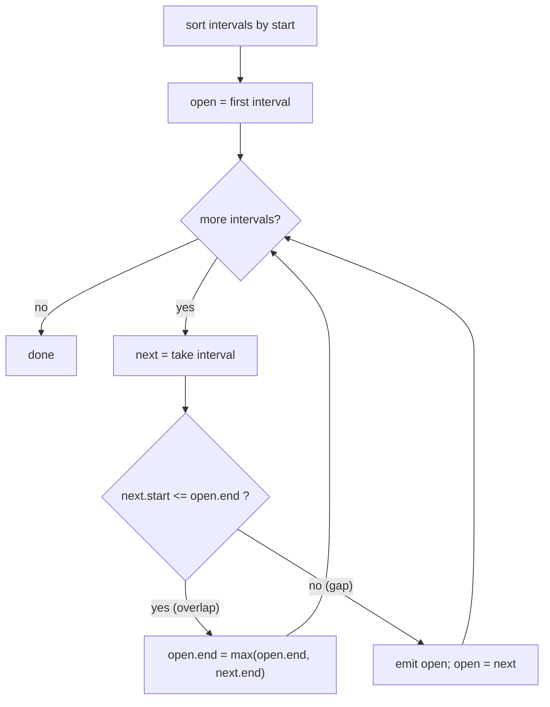
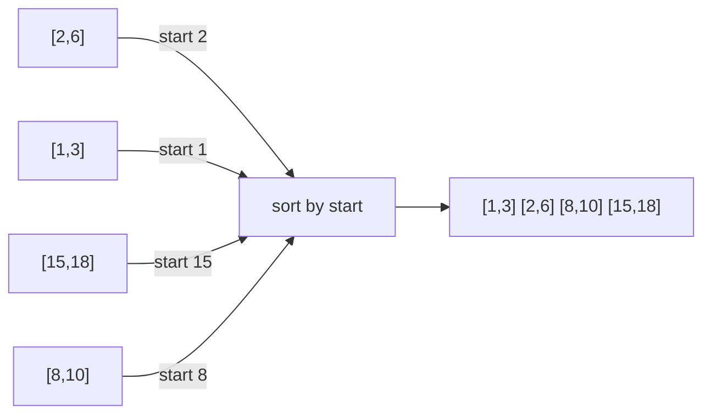
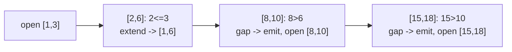
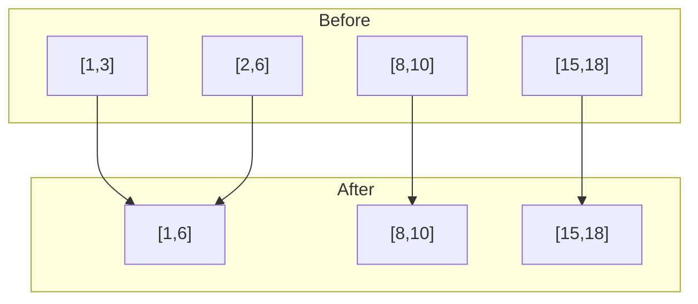
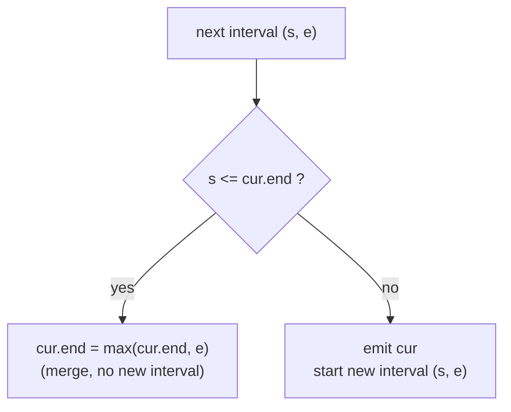

# Merge Intervals

| Meta | Value |
|------|-------|
| **Problem** | Merge Intervals |
| **Source** | LeetCode 56 |
| **Link** | https://leetcode.com/problems/merge-intervals/ |
| **Difficulty** | Medium |
| **Topics** | Sorting, Custom Comparator, Greedy, Intervals |
| **Time** | $O(n \log n)$ |
| **Space** | $O(n)$ (output) |

---

## Problem Statement

Given an array of `intervals` where `intervals[i] = [start_i, end_i]`, **merge all overlapping
intervals** and return the non-overlapping intervals that cover all the input.

Two intervals overlap when one starts **before or exactly when** the other ends.

```text
Input:  intervals = [[1,3], [2,6], [8,10], [15,18]]
Output: [[1,6], [8,10], [15,18]]

Why:
  [1,3] and [2,6] overlap (2 <= 3)   -> merged into [1,6]
  [8,10]  disjoint from [1,6]         -> kept
  [15,18] disjoint from [8,10]        -> kept

Input:  intervals = [[1,4], [4,5]]
Output: [[1,5]]                       (touching counts as overlap)
```

---

## Approach (WHY)

If we **sort by start**, every interval that can merge with the current "open" interval appears
**contiguously and immediately after it**. So one left-to-right sweep suffices: keep the last
merged interval; if the next one starts at or before the current end, extend the end; otherwise
push a new interval.



The comparator is simply "by start ascending" — a one-key sort. Sorting first is what makes the
greedy sweep correct: without it, a mergeable interval could appear arbitrarily far away.



---

## Solution

```python
from typing import List

def merge(intervals: List[List[int]]) -> List[List[int]]:
    intervals.sort(key=lambda iv: iv[0])      # sort by start ascending
    merged = []
    for start, end in intervals:
        if merged and start <= merged[-1][1]:  # overlaps the last merged
            merged[-1][1] = max(merged[-1][1], end)
        else:
            merged.append([start, end])
    return merged

print(merge([[1, 3], [2, 6], [8, 10], [15, 18]]))   # [[1,6],[8,10],[15,18]]
print(merge([[1, 4], [4, 5]]))                        # [[1,5]]
```

```cpp
#include <bits/stdc++.h>
using namespace std;

vector<vector<long long>> merge(vector<vector<long long>> intervals) {
    sort(intervals.begin(), intervals.end(),
         [](const vector<long long> &a, const vector<long long> &b) {
             return a[0] < b[0];                 // sort by start ascending
         });
    vector<vector<long long>> merged;
    for (auto &iv : intervals) {
        long long start = iv[0], end = iv[1];
        if (!merged.empty() && start <= merged.back()[1]) {   // overlap
            merged.back()[1] = max(merged.back()[1], end);
        } else {
            merged.push_back({start, end});
        }
    }
    return merged;
}

int main() {
    auto r = merge({{1,3},{2,6},{8,10},{15,18}});
    for (auto &iv : r) cout << '[' << iv[0] << ',' << iv[1] << "] ";
    cout << '\n';
    return 0;
}
```

---

## Trace

Input `[[1,3],[2,6],[8,10],[15,18]]` is already start-sorted. Sweep:

| Step | Interval | `merged` before | Overlap? | `merged` after |
|------|----------|-----------------|----------|----------------|
| 1 | [1,3] | `[]` | — (empty) | `[[1,3]]` |
| 2 | [2,6] | `[[1,3]]` | `2 <= 3` yes | `[[1,6]]` |
| 3 | [8,10] | `[[1,6]]` | `8 <= 6` no | `[[1,6],[8,10]]` |
| 4 | [15,18] | `[[1,6],[8,10]]` | `15 <= 10` no | `[[1,6],[8,10],[15,18]]` |



---

## Diagrams

The intervals on a number line, before and after merging:



The overlap test as a decision, where `cur.end` tracks the running right edge:



---

## Math & Complexity

Sorting dominates: $O(n \log n)$. The sweep is a single pass, $O(n)$, and each interval is pushed
or merged exactly once. Total time:

$$
O(n \log n) + O(n) = O(n \log n)
$$

Output space is $O(n)$ in the worst case (no overlaps at all). The correctness rests on the
**sorted invariant**: after sorting by start, any interval overlapping the current open one must
be the *next* one, because all later starts are $\ge$ this start.

$$
s_i \le s_{i+1} \implies \text{if } s_{i+1} > \text{end}, \text{ all later starts also} > \text{end}
$$

---

## Takeaway

A **single-key sort** (by start) transforms a tangled overlap problem into a trivial greedy
sweep. The lesson generalizes: when relationships depend on order, sort to make the relevant
items adjacent, then process in one pass.
