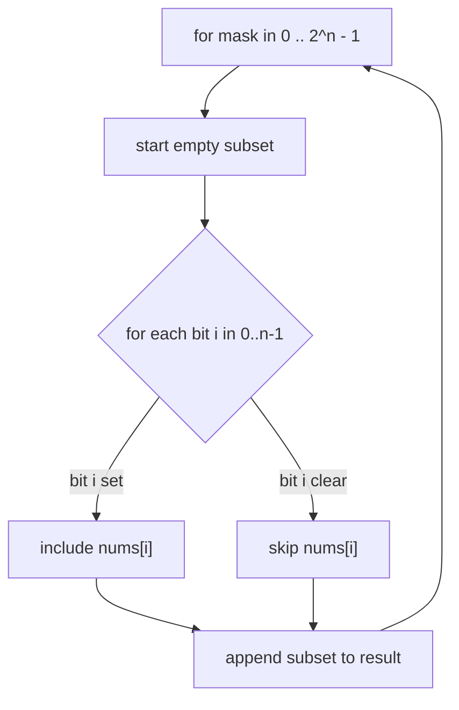
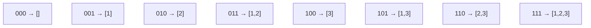
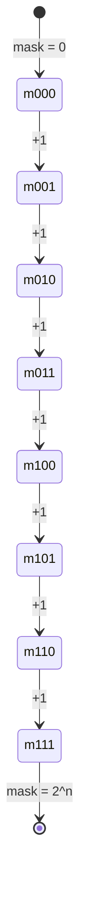

# LeetCode 78 — Subsets

| Field | Value |
|-------|-------|
| Source | LeetCode |
| Number | 78 |
| Difficulty | Medium |
| Topics | Bit manipulation, bitmask enumeration, backtracking |
| Link | https://leetcode.com/problems/subsets/ |

---

## Problem Statement

Given an integer array `nums` of **unique** elements, return *all possible subsets* (the **power
set**). The solution set must not contain duplicate subsets; the order of subsets does not matter.

For an array of length $n$ there are exactly $2^n$ subsets.

```text
Input:  nums = [1, 2, 3]
Output: [[], [1], [2], [1,2], [3], [1,3], [2,3], [1,2,3]]

Input:  nums = [0]
Output: [[], [0]]
```

Constraints: $1 \le n \le 10$, all elements distinct — so $2^n \le 1024$, tiny enough to enumerate
every subset explicitly.

---

## Approach (WHY)

Each element is independently **in** or **out** of a subset — that's a yes/no choice per element, which
is exactly one **bit**. So a length-$n$ bitmask `mask` in the range $0 \dots 2^n - 1$ encodes one
subset: if bit $i$ of `mask` is set, include `nums[i]`. Looping `mask` over all $2^n$ values and
decoding each one produces every subset exactly once, with no recursion and no duplicate bookkeeping.



This **bitmask enumeration** maps the abstract power set onto integer iteration: the integer *is* the
subset.



---

## Solution

```python
class Solution:
    def subsets(self, nums: list[int]) -> list[list[int]]:
        n = len(nums)
        result = []
        for mask in range(1 << n):              # 0 .. 2^n - 1
            subset = []
            for i in range(n):
                if (mask >> i) & 1:             # is element i chosen?
                    subset.append(nums[i])
            result.append(subset)
        return result
```

```cpp
#include <bits/stdc++.h>
using namespace std;

class Solution {
public:
    vector<vector<int>> subsets(vector<int>& nums) {
        int n = (int)nums.size();
        vector<vector<int>> result;
        for (int mask = 0; mask < (1 << n); mask++) {   // 0 .. 2^n - 1
            vector<int> subset;
            for (int i = 0; i < n; i++) {
                if ((mask >> i) & 1)                    // is element i chosen?
                    subset.push_back(nums[i]);
            }
            result.push_back(subset);
        }
        return result;
    }
};
```

We can also build each subset by walking only the **set bits** of the mask via `mask & -mask`, which is
faster when subsets are sparse:

```python
def subsets_lowbit(nums: list[int]) -> list[list[int]]:
    n = len(nums)
    result = []
    for mask in range(1 << n):
        subset, m = [], mask
        while m:
            low = m & (-m)              # lowest set bit
            i = low.bit_length() - 1    # its index
            subset.append(nums[i])
            m ^= low                    # clear it
        result.append(subset)
    return result
```

```cpp
#include <bits/stdc++.h>
using namespace std;

vector<vector<int>> subsets_lowbit(vector<int>& nums) {
    int n = (int)nums.size();
    vector<vector<int>> result;
    for (int mask = 0; mask < (1 << n); mask++) {
        vector<int> subset;
        int m = mask;
        while (m) {
            int i = __builtin_ctzll((long long)m);  // index of lowest set bit
            subset.push_back(nums[i]);
            m &= m - 1;                              // clear lowest set bit
        }
        result.push_back(subset);
    }
    return result;
}
```

---

## Trace

For `nums = [1, 2, 3]` (so $n = 3$, bit $i$ ↔ `nums[i]`):

| mask (bin) | set bits → indices | subset |
|------------|--------------------|--------|
| `000` | — | `[]` |
| `001` | bit0 → 0 | `[1]` |
| `010` | bit1 → 1 | `[2]` |
| `011` | bit0,1 → 0,1 | `[1,2]` |
| `100` | bit2 → 2 | `[3]` |
| `101` | bit0,2 → 0,2 | `[1,3]` |
| `110` | bit1,2 → 1,2 | `[2,3]` |
| `111` | bit0,1,2 → 0,1,2 | `[1,2,3]` |

All $2^3 = 8$ masks produce the 8 distinct subsets.



---

## Complexity

There are $2^n$ masks and decoding each costs $O(n)$, so:

$$
\text{Time} = O(n \cdot 2^n), \qquad \text{Output size} = \sum_{k=0}^{n} k \binom{n}{k} = n \cdot 2^{n-1}.
$$

Extra space beyond the output is $O(1)$ (the lowbit variant avoids scanning empty positions but the
asymptotics are unchanged). For $n \le 10$ this is at most $\approx 10 \cdot 1024$ operations.

---

## Takeaway

When every element is an independent **in/out** choice, the power set is just integer counting in
binary: iterate a mask `0 .. 2^n - 1` and read its bits. Bitmask enumeration replaces recursion with a
single loop and guarantees each subset appears exactly once.
