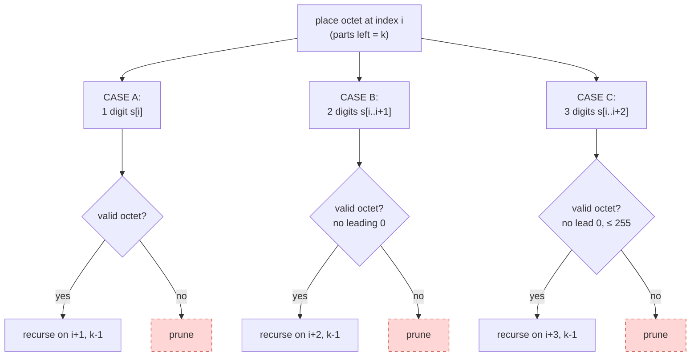
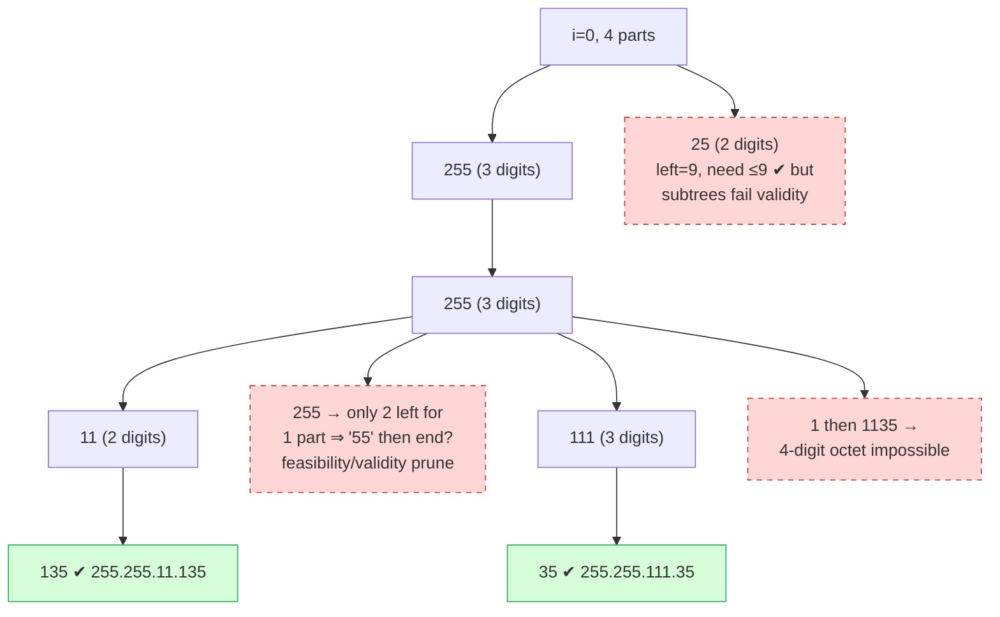

# Restore IP Addresses

| Meta | Value |
|------|-------|
| Source | LeetCode #93 |
| Difficulty | Medium |
| Topics | String, Backtracking, Casework, Pruning |
| Link | https://leetcode.com/problems/restore-ip-addresses/ |

---

## Problem Statement
A valid IPv4 address consists of **exactly four** integers separated by dots, where each
integer (an *octet*) is between `0` and `255` (inclusive) and **cannot have leading zeros**
(so `"0"` is valid, but `"01"` and `"00"` are not). Given a string `s` containing only digits,
return **all possible valid IP addresses** that can be formed by inserting dots into `s`. You
**cannot** reorder or remove digits.

**Example**
```text
Input:  s = "25525511135"
Output: ["255.255.11.135","255.255.111.35"]

Input:  s = "0000"
Output: ["0.0.0.0"]

Input:  s = "101023"
Output: ["1.0.10.23","1.0.102.3","10.1.0.23","10.10.2.3","101.0.2.3"]
```

---

## WHY This Is a Casework-with-Pruning Problem

We must cut `s` into 4 pieces. For each cut we face **three disjoint, exhaustive cases**: the
next octet uses **1, 2, or 3 digits**. That is textbook casework — *cover every length,
overlap none*. Brute force would try all $3^4 = 81$ length patterns, but most are doomed, so
we prune aggressively:

- **Validity prune.** A length-2 or length-3 slice with a leading `0`, or a 3-digit slice
  $> 255$, is rejected immediately — its whole subtree dies.
- **Length feasibility prune.** With `parts` octets still to place and `len` characters left,
  the remaining length must satisfy $\text{parts} \le \text{len} \le 3 \cdot \text{parts}$.
  If not, this branch can never finish — cut it before recursing.



---

## Solution — Recurse Over the Three Length-Cases, Prune Invalid Octets

```python
def restore_ip_addresses(s):
    n = len(s)
    result, parts = [], []

    def is_valid(seg):
        if len(seg) > 1 and seg[0] == '0':   # leading zero (and not just "0")
            return False
        return int(seg) <= 255

    def dfs(start, remaining_parts):
        left = n - start
        # LENGTH FEASIBILITY PRUNE: need parts <= left <= 3*parts
        if left < remaining_parts or left > 3 * remaining_parts:
            return
        if remaining_parts == 0:             # base case
            if start == n:
                result.append('.'.join(parts))
            return
        for length in (1, 2, 3):             # the three disjoint cases
            if start + length > n:
                break
            seg = s[start:start + length]
            if is_valid(seg):                # VALIDITY PRUNE
                parts.append(seg)
                dfs(start + length, remaining_parts - 1)
                parts.pop()

    dfs(0, 4)
    return result
```

```cpp
#include <bits/stdc++.h>
using namespace std;

bool is_valid(const string& seg) {
    if (seg.size() > 1 && seg[0] == '0') return false;   // leading zero
    return stoll(seg) <= 255;
}

vector<string> restore_ip_addresses(const string& s) {
    int n = (int)s.size();
    vector<string> result;
    vector<string> parts;

    function<void(int, int)> dfs = [&](int start, int remaining_parts) {
        int left = n - start;
        // LENGTH FEASIBILITY PRUNE: need parts <= left <= 3*parts
        if (left < remaining_parts || left > 3 * remaining_parts) return;
        if (remaining_parts == 0) {                       // base case
            if (start == n) {
                string ip = parts[0];
                for (int k = 1; k < 4; ++k) ip += "." + parts[k];
                result.push_back(ip);
            }
            return;
        }
        for (int length = 1; length <= 3; ++length) {     // three disjoint cases
            if (start + length > n) break;
            string seg = s.substr(start, length);
            if (is_valid(seg)) {                          // VALIDITY PRUNE
                parts.push_back(seg);
                dfs(start + length, remaining_parts - 1);
                parts.pop_back();
            }
        }
    };
    dfs(0, 4);
    return result;
}
```

---

## Trace — `s = "25525511135"` (length 11)

We need 4 octets totaling 11 digits, so average ~2.75 digits each — the feasibility prune
keeps branches honest.

| Step | `start` | parts left | slice tried | result |
|------|---------|-----------|-------------|--------|
| 1 | 0 | 4 | `"2"` ok → recurse | left=10 > 3·3 ⇒ later prune |
| 2 | 1 | 3 | … many die to feasibility | — |
| 3 | 0 | 4 | `"255"` ok | left=8, 3≤8≤9 ✔ |
| 4 | 3 | 3 | `"255"` ok | left=5, 2≤5≤6 ✔ |
| 5 | 6 | 2 | `"11"` ok | left=3, 1≤3≤3 ✔ |
| 6 | 8 | 1 | `"135"` ok, `start==n` | **`255.255.11.135`** ✔ |
| 7 | 6 | 2 | `"111"` ok | then `"35"` → **`255.255.111.35`** ✔ |
| 8 | 0 | 4 | `"2552"` | length 4 not allowed (loop stops at 3) |



The dashed nodes are branches killed by the **validity prune** (octet `> 255` or leading zero)
or the **length-feasibility prune** (too few/too many digits left for the remaining octets).

---

## Math / Complexity

There are only $\binom{n-1}{3}$ ways to place 3 dots, and the octet/feasibility checks make
each branch $O(1)$. Since each of the 4 octets has **at most 3 length choices**, the search
tree has at most $3^4 = 81$ root-to-leaf paths regardless of `n`:

$$
T(n) = O(3^4) = O(1)\ \text{branches},\qquad
\text{work per leaf} = O(1),\qquad S(n) = O(1).
$$

The output itself is bounded by a constant number of valid addresses, so the whole algorithm
is effectively **constant time** in the input length (for the fixed IPv4 structure), with a
small linear factor for slicing.

---

## Takeaway

> **Restore IP Addresses = casework over octet length (1/2/3) + two prunes.** The three length
> cases are disjoint and exhaustive, so no address is missed or duplicated. The
> *validity prune* (no leading zero, octet $\le 255$) and the *length-feasibility prune*
> ($\text{parts} \le \text{chars left} \le 3\cdot\text{parts}$) collapse an 81-leaf tree into a
> handful of live branches. When a problem says "split a sequence into a fixed number of
> bounded pieces," reach for length-casework plus feasibility pruning.
