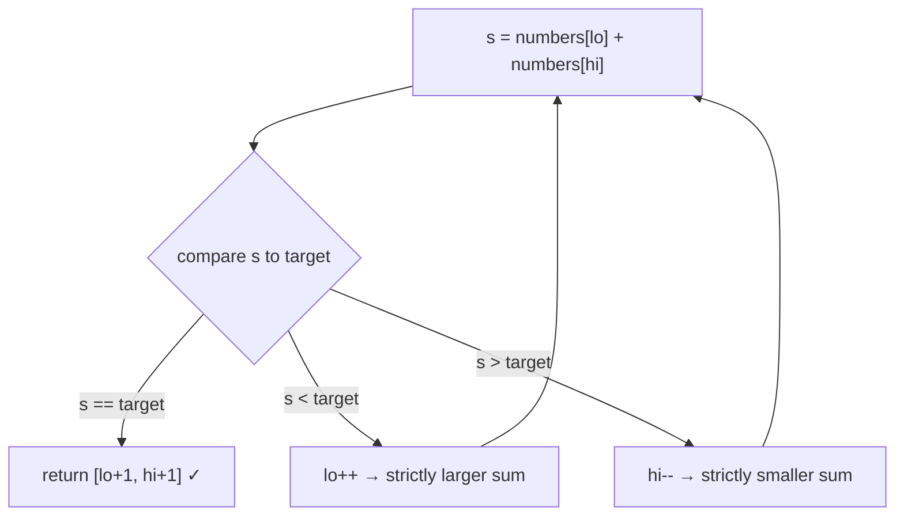
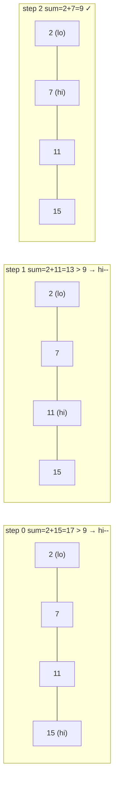
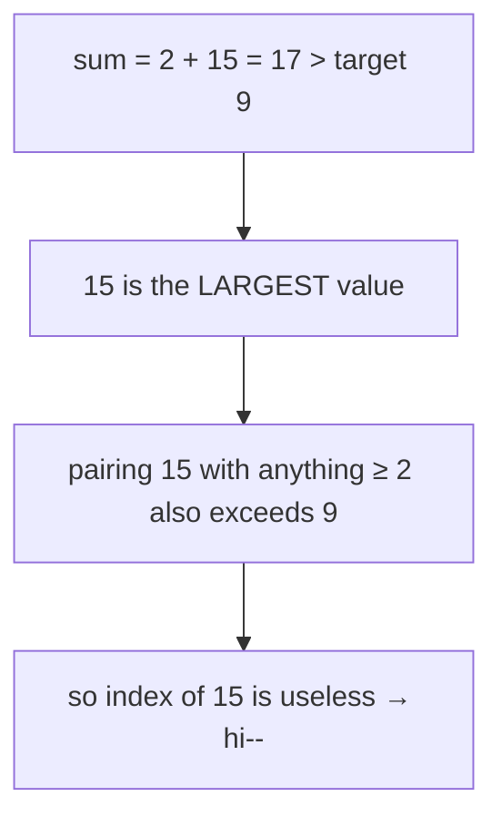
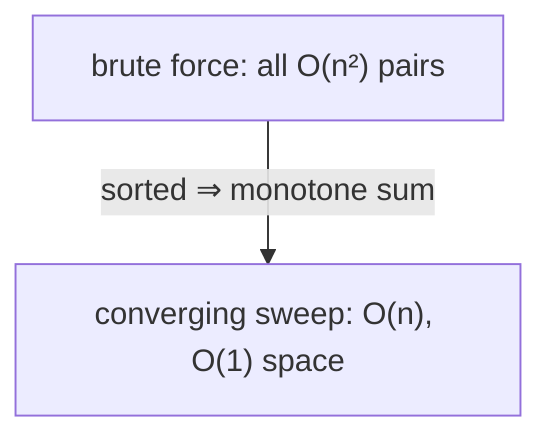

# Two Sum II — Input Array Is Sorted (LeetCode 167)

| Field | Value |
|---|---|
| Source | [LeetCode 167](https://leetcode.com/problems/two-sum-ii-input-array-is-sorted/) |
| Difficulty | Medium |
| Primary topic | **Two pointers — opposite ends (converging)** |
| Secondary topic | Sorted-array monotonicity, invariants |
| Key constraint | $2 \le n \le 3\times10^4$, array sorted ascending, exactly one solution, $1$-indexed answer |

---

## Statement

Given a **1-indexed** array `numbers` sorted in **non-decreasing** order, find two numbers
that add up to `target`. Return their 1-based indices `[i, j]` with `i < j`. There is exactly
one solution, and you may **not** use the same element twice. The intended solution uses
**$O(1)$ extra space**.

### Example

```text
Input:  numbers = [2, 7, 11, 15], target = 9
Output: [1, 2]            # numbers[1]+numbers[2] = 2+7 = 9

Input:  numbers = [2, 3, 4], target = 6
Output: [1, 3]            # 2 + 4 = 6

Input:  numbers = [-1, 0], target = -1
Output: [1, 2]
```

---

## WHY: Sortedness Removes the Hash Map

The classic Two Sum (LeetCode 1) uses a hash map for $O(n)$ time **and** $O(n)$ space. Here
the array is already **sorted**, which gives us a stronger tool: a converging two-pointer
sweep in $O(n)$ time and only $O(1)$ space.

The intuition: place pointers at the smallest and largest values. Their sum is the *extreme*
of what's reachable. Adjusting one pointer changes the sum **monotonically**:



Because moving `lo` right can only **increase** the sum and moving `hi` left can only
**decrease** it, we always step in the direction that closes the gap to `target` — and we
never revisit a discarded index.

---

## Code

```python
def two_sum(numbers, target):
    lo, hi = 0, len(numbers) - 1
    while lo < hi:
        s = numbers[lo] + numbers[hi]
        if s == target:
            return [lo + 1, hi + 1]   # 1-indexed
        elif s < target:
            lo += 1                   # need a larger sum
        else:
            hi -= 1                   # need a smaller sum
    return [-1, -1]                   # unreachable (guaranteed solution)
```

```cpp
#include <bits/stdc++.h>
using namespace std;

vector<int> twoSum(const vector<int>& numbers, int target) {
    int lo = 0, hi = (int)numbers.size() - 1;
    while (lo < hi) {
        long long s = (long long)numbers[lo] + numbers[hi];
        if (s == target) {
            return {lo + 1, hi + 1};  // 1-indexed
        } else if (s < target) {
            ++lo;                     // need a larger sum
        } else {
            --hi;                     // need a smaller sum
        }
    }
    return {-1, -1};                  // unreachable (guaranteed solution)
}
```

---

## Trace

On `numbers = [2, 7, 11, 15]`, `target = 9`:

| Step | lo | hi | numbers[lo] | numbers[hi] | sum | vs target | Action |
|---|---|---|---|---|---|---|---|
| 0 | 0 | 3 | 2 | 15 | 17 | `>` 9 | hi-- |
| 1 | 0 | 2 | 2 | 11 | 13 | `>` 9 | hi-- |
| 2 | 0 | 1 | 2 | 7 | 9 | `==` 9 | return [1, 2] ✓ |

Pointer positions over the steps:



Why the discarded indices are truly safe to drop:



---

## Math & Complexity

Each iteration moves `lo` up or `hi` down by one, and the two pointers start $n-1$ apart, so
the loop runs at most $n-1$ times:

$$
T(n) = O(n), \qquad S(n) = O(1)
$$

Compare to brute force over all pairs, $\binom{n}{2} = \tfrac{n(n-1)}{2} = O(n^2)$. The
converging sweep is a strict improvement made possible **only** by the sorted input.



---

## Takeaway

When an array is **sorted** and you need a pair meeting a sum condition, reach for converging
two pointers: start at both ends, and let the comparison against `target` dictate which
pointer to move. It beats the hash-map approach on space ($O(1)$ vs $O(n)$) and is the
gateway pattern to 3Sum and k-Sum.
