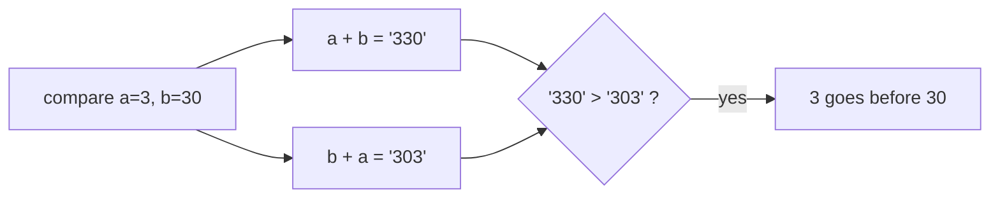
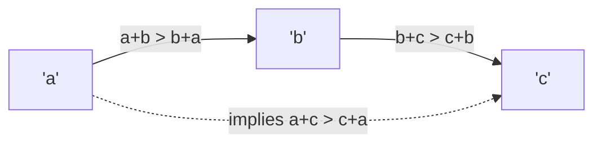
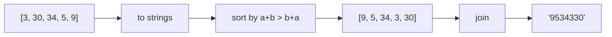
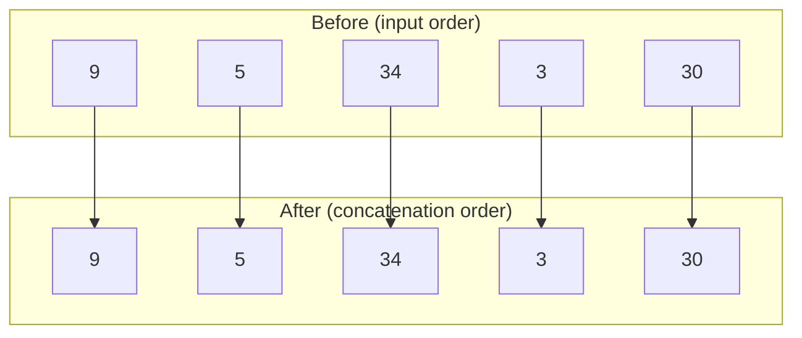
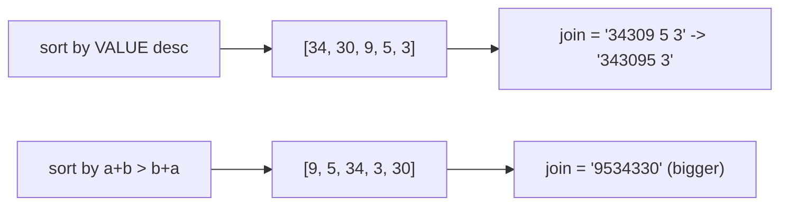

# Largest Number

| Meta | Value |
|------|-------|
| **Problem** | Largest Number |
| **Source** | LeetCode 179 |
| **Link** | https://leetcode.com/problems/largest-number/ |
| **Difficulty** | Medium |
| **Topics** | Sorting, Custom Comparator, Greedy, Strings |
| **Time** | $O(n \log n \cdot L)$ |
| **Space** | $O(nL)$ |

---

## Problem Statement

Given a list of non-negative integers `nums`, arrange them so that they form the **largest
possible number**, and return it as a **string** (the result can be huge, so it must not be
returned as an integer).

```text
Input:  nums = [3, 30, 34, 5, 9]
Output: "9534330"

Input:  nums = [10, 2]
Output: "210"

Input:  nums = [0, 0]
Output: "0"          (not "00")
```

---

## Approach (WHY)

The trap is to sort by numeric value or by string value — both are wrong. `[3, 30]` sorted
descending by value gives `30, 3` → `"303"`, but `3, 30` → `"330"` is larger. The correct order
asks, for each pair, **which arrangement of just those two digits-strings is bigger**: place `a`
before `b` iff the concatenation `a + b` is greater than `b + a` (as strings).



Why is this a **valid** ordering (and not UB in C++)? Because it reduces to comparing two strings
`a+b` and `b+a` with the natural string `<`, which is a strict weak ordering — irreflexive,
asymmetric, and transitive. Transitivity in particular is inherited from string comparison.



After sorting, join everything. One edge case remains: if the largest number starts with `'0'`,
every number is `0`, so the answer is `"0"` rather than a string of zeros.

---

## Solution

```python
from functools import cmp_to_key
from typing import List

def largestNumber(nums: List[int]) -> str:
    strs = list(map(str, nums))
    # a before b iff a+b is the bigger concatenation; return three-way result
    strs.sort(key=cmp_to_key(lambda a, b: (a + b < b + a) - (a + b > b + a)))
    result = "".join(strs)
    return "0" if result[0] == "0" else result   # all-zero guard

print(largestNumber([3, 30, 34, 5, 9]))           # "9534330"
print(largestNumber([10, 2]))                      # "210"
print(largestNumber([0, 0]))                       # "0"
```

```cpp
#include <bits/stdc++.h>
using namespace std;

string largestNumber(vector<int> &nums) {
    vector<string> strs;
    for (int x : nums) strs.push_back(to_string(x));
    sort(strs.begin(), strs.end(), [](const string &a, const string &b) {
        return a + b > b + a;          // strict weak order via string compare
    });
    if (strs[0] == "0") return "0";    // all-zero guard
    string result;
    for (auto &s : strs) result += s;
    return result;
}

int main() {
    vector<int> a = {3, 30, 34, 5, 9};
    cout << largestNumber(a) << '\n';   // 9534330
    vector<int> b = {10, 2};
    cout << largestNumber(b) << '\n';   // 210
    vector<int> c = {0, 0};
    cout << largestNumber(c) << '\n';   // 0
    return 0;
}
```

---

## Trace

Take `nums = [3, 30, 34, 5, 9]`. The comparator induces this order by repeatedly asking
`a + b > b + a`:

| a | b | a+b | b+a | a before b? |
|---|---|-----|-----|-------------|
| 3 | 30 | `330` | `303` | yes |
| 34 | 3 | `343` | `334` | yes |
| 9 | 5 | `95` | `59` | yes |
| 34 | 30 | `3430` | `3034` | yes |

Sorting with this rule yields `[9, 5, 34, 3, 30]`, whose join is `"9534330"`.



---

## Diagrams

The before/after ordering, highlighting that `34` beats `3` even though `34 &gt; 3` numerically —
because `343 &gt; 334`:



Why comparing values directly fails, in one picture:



---

## Math & Complexity

Each comparison concatenates two strings of length up to $L$, costing $O(L)$. A comparison sort
makes $O(n \log n)$ comparisons, so total time is

$$
O(n \log n \cdot L)
$$

where $L$ is the maximum number of digits. Space is $O(nL)$ for the string copies and the result.
The concatenation trick is also what keeps this **overflow-free**: we never build the giant
number as an integer, only compare fixed-size string pieces.

$$
\underbrace{a + b > b + a}_{\text{string compare, safe}} \quad\text{vs}\quad \underbrace{a \cdot 10^{|b|} + b}_{\text{integer, overflows}}
$$

---

## Takeaway

When the desired order is "which arrangement of two elements is better", express it as a
**pairwise comparator on a transformed representation** (here, string concatenation). Comparing
the transformed values inherits strict-weak-ordering and dodges overflow — a pattern that recurs
far beyond this one problem.
