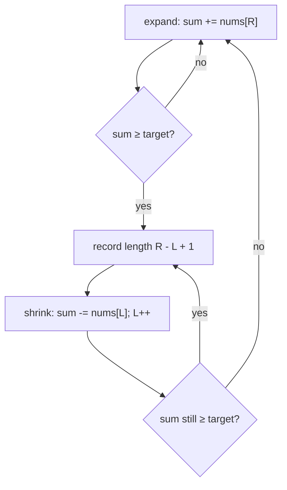
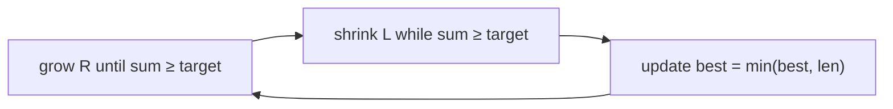
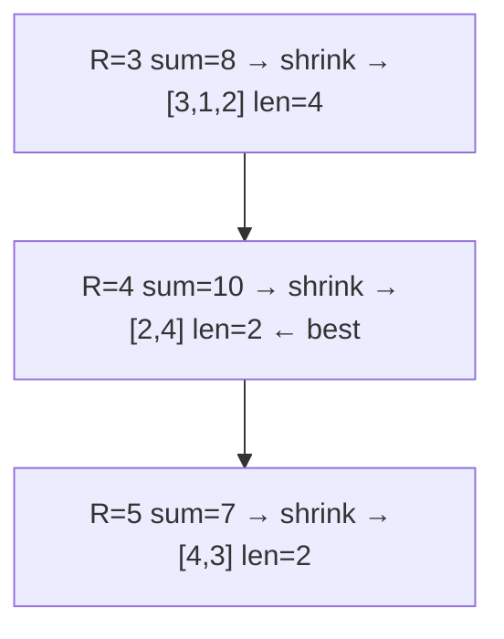
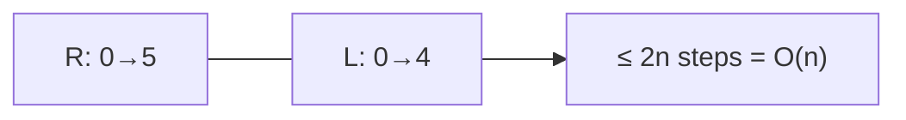

# Minimum Size Subarray Sum (LeetCode 209)

| Field | Value |
|---|---|
| Source | [LeetCode 209](https://leetcode.com/problems/minimum-size-subarray-sum/) |
| Difficulty | Medium |
| Primary topic | **Sliding window — variable size (shortest valid)** |
| Secondary topic | Monotone prefix sums, two pointers (same direction) |
| Key constraint | $1 \le n \le 10^5$, $1 \le \text{nums}[i] \le 10^4$, $1 \le \text{target} \le 10^9$ |

---

## Statement

Given an array of **positive** integers `nums` and a positive integer `target`, return the
**minimal length** of a contiguous subarray whose sum is $\ge$ `target`. If no such subarray
exists, return `0`.

### Example

```text
Input:  target = 7, nums = [2, 3, 1, 2, 4, 3]
Output: 2
# the subarray [4, 3] has sum 7 ≥ 7 and length 2 — the shortest possible.

Input:  target = 4, nums = [1, 4, 4]
Output: 1   # [4]

Input:  target = 11, nums = [1, 1, 1, 1, 1, 1, 1, 1]
Output: 0   # total sum is only 8 < 11
```

---

## WHY: Grow to Validity, Then Shrink Greedily

All numbers are **positive**, so the window sum is **monotone**: expanding the right edge can
only *increase* it, and shrinking the left edge can only *decrease* it. That monotonicity is
exactly what makes "grow until valid, then shrink while still valid" correct.



Each time the window becomes valid we record its length, then peel elements off the left to
see how *short* it can get while staying valid — capturing the minimum.



---

## Code

```python
def min_subarray_len(target, nums):
    left = 0
    s = 0
    best = float("inf")
    for right, x in enumerate(nums):
        s += x                          # expand
        while s >= target:              # shrink while still valid
            best = min(best, right - left + 1)
            s -= nums[left]
            left += 1
    return 0 if best == float("inf") else best
```

```cpp
#include <bits/stdc++.h>
using namespace std;

int minSubArrayLen(int target, const vector<int>& nums) {
    int left = 0, best = INT_MAX;
    long long s = 0;
    for (int right = 0; right < (int)nums.size(); ++right) {
        s += nums[right];               // expand
        while (s >= target) {           // shrink while still valid
            best = min(best, right - left + 1);
            s -= nums[left];
            ++left;
        }
    }
    return best == INT_MAX ? 0 : best;
}
```

An alternative variant records the answer **after** the shrink loop, when the window has just
become *too short* — equivalent, but the in-loop version above is the most common.

```python
def min_subarray_len_alt(target, nums):
    left = 0
    s = 0
    best = len(nums) + 1
    for right in range(len(nums)):
        s += nums[right]
        while s - nums[left] >= target:   # shrink while it would stay valid
            s -= nums[left]
            left += 1
        if s >= target:
            best = min(best, right - left + 1)
    return 0 if best == len(nums) + 1 else best
```

```cpp
#include <bits/stdc++.h>
using namespace std;

int minSubArrayLenAlt(int target, const vector<int>& nums) {
    int n = (int)nums.size();
    int left = 0, best = n + 1;
    long long s = 0;
    for (int right = 0; right < n; ++right) {
        s += nums[right];
        while (left < right && s - nums[left] >= target) {  // keep it valid
            s -= nums[left];
            ++left;
        }
        if (s >= target) best = min(best, right - left + 1);
    }
    return best == n + 1 ? 0 : best;
}
```

---

## Trace

Running `target = 7`, `nums = [2, 3, 1, 2, 4, 3]`. `sum` is the window sum *after* expanding,
shrink steps shown:

| R | nums[R] | sum after add | shrink? | L | window | len | best |
|---|---------|---------------|---------|---|--------|-----|------|
| 0 | 2 | 2 | no | 0 | `[2]` | – | ∞ |
| 1 | 3 | 5 | no | 0 | `[2,3]` | – | ∞ |
| 2 | 1 | 6 | no | 0 | `[2,3,1]` | – | ∞ |
| 3 | 2 | 8 → 6 | yes, L→1 | 1 | `[3,1,2]` | 4 | 4 |
| 4 | 4 | 10 → 7 → 3 | yes, L→3 | 3 | `[2,4]` | 2 | 2 |
| 5 | 3 | 7 → 4 | yes, L→4 | 4 | `[4,3]` | 2 | 2 |

Answer: **2**.



Both pointers only move right — total travel bounded by $2n$:



---

## Math & Complexity

Let $n = |\text{nums}|$.

- **Time:** $O(n)$. The inner `while` advances `left`, which is bounded by $n$ across the
  whole run; amortized $O(1)$ per outer step.
- **Space:** $O(1)$.

The window sum function

$$
\text{sum}(L, R) = \sum_{i=L}^{R} \text{nums}[i]
$$

is strictly increasing in $R$ and strictly decreasing in $L$ (all terms positive). Therefore
for each `R` there is a unique smallest window `[L, R]` with `sum ≥ target`, and the answer is

$$
\min_{R} \big(R - L(R) + 1\big) \quad \text{over valid } R.
$$

> **Why positivity matters:** if `nums` contained negatives, shrinking could *increase* the
> sum, breaking the "shrink while valid" monotonicity. That variant needs prefix sums plus a
> monotonic deque or binary search instead.

---

## Takeaway

> For a **shortest** window with a $\ge$ threshold on a **positive** array: expand until the
> window is valid, then shrink from the left as long as it stays valid, recording the length
> each time. Monotone sums make this single $O(n)$ pass exact.
