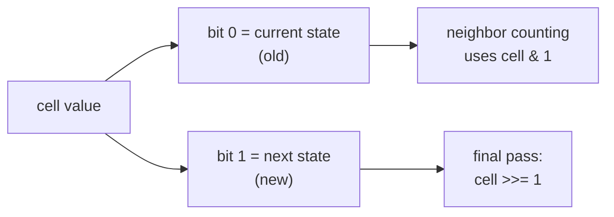
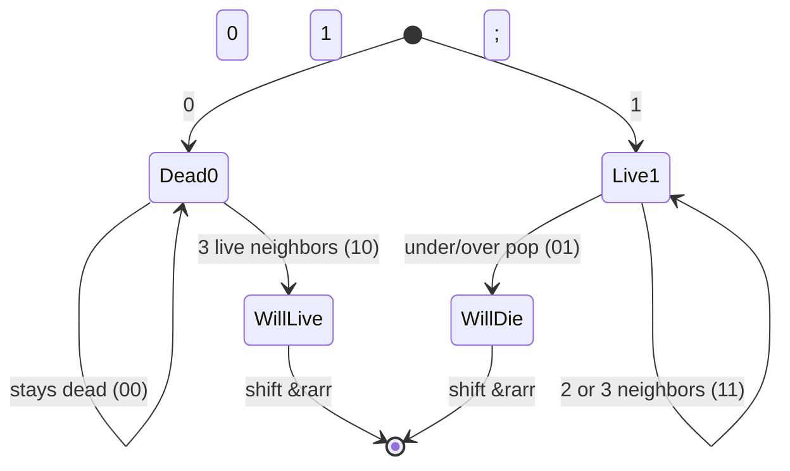
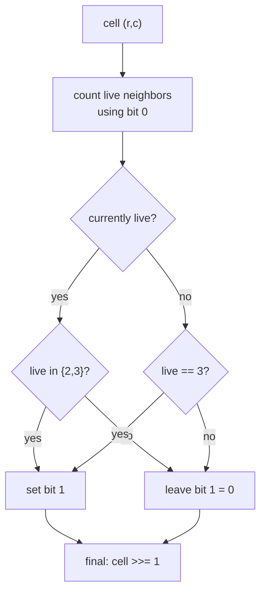
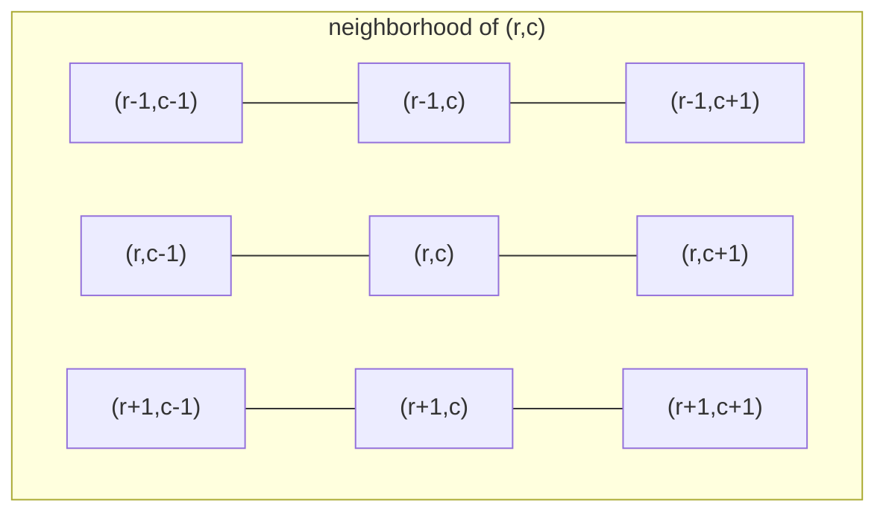
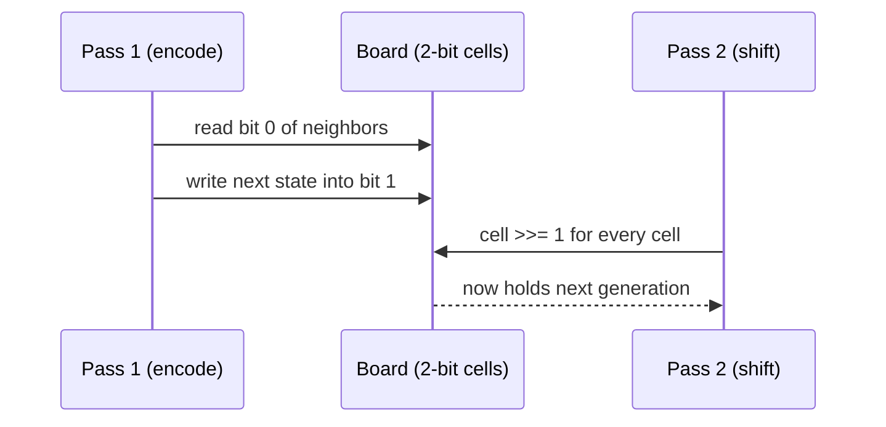
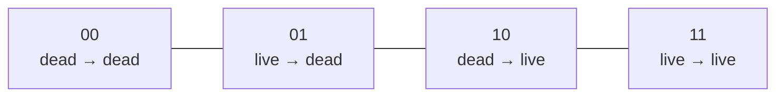

# Game of Life

| Meta | Value |
|------|-------|
| **Problem** | Game of Life |
| **Source** | LeetCode 289 |
| **Link** | https://leetcode.com/problems/game-of-life/ |
| **Difficulty** | Medium |
| **Topics** | Implementation, Matrix, Simulation, In-place |
| **Time** | $O(R \cdot C)$ |
| **Space** | $O(1)$ extra (in-place) |

---

## Problem Statement

The board is an $R \times C$ grid of cells, each **live** (`1`) or **dead** (`0`). Every cell interacts with its **eight** neighbors. The next state is computed for all cells **simultaneously** from the current state, using four rules:

1. A live cell with **fewer than two** live neighbors dies (underpopulation).
2. A live cell with **two or three** live neighbors lives on.
3. A live cell with **more than three** live neighbors dies (overpopulation).
4. A dead cell with **exactly three** live neighbors becomes live (reproduction).

Update the board **in place** to the next generation. The challenge: you must not let an already-updated cell corrupt the neighbor count of a cell you process later.

```text
Input board:        Next generation:
 0 1 0               0 0 0
 0 0 1               1 0 1
 1 1 1               0 1 1
 0 0 0               0 1 1
```

---

## Approach (WHY)

The naive fix for the simultaneity rule is to copy the whole board ($O(R \cdot C)$ extra space). We can do better with an **encoding trick** that keeps both the old and new state in a single integer per cell, achieving $O(1)$ extra space.

We use two bits: the **low bit** holds the current state, the **high bit (value 2)** holds the next state. Because every cell's current value is `0` or `1`, reading `cell & 1` always recovers the original state even after we have written the next state into bit 2. After the full sweep, we shift every cell right by one (`cell >>= 1`) to drop the old state and reveal the new one.



This works because counting neighbors and writing the future state are kept **independent**: counting only ever looks at bit 0 (the untouched present), while the future is parked in bit 1 until the very end.



---

## Solution

```python
from typing import List

def gameOfLife(board: List[List[int]]) -> None:
    R, C = len(board), len(board[0])
    DIRS = [(-1,-1),(-1,0),(-1,1),(0,-1),(0,1),(1,-1),(1,0),(1,1)]

    for r in range(R):
        for c in range(C):
            live = 0
            for dr, dc in DIRS:
                nr, nc = r + dr, c + dc
                if 0 <= nr < R and 0 <= nc < C:
                    live += board[nr][nc] & 1   # read OLD bit only
            # decide next state, store it in bit 1
            if board[r][c] & 1:
                if live == 2 or live == 3:
                    board[r][c] |= 2            # stays live -> 11
            else:
                if live == 3:
                    board[r][c] |= 2            # becomes live -> 10

    for r in range(R):
        for c in range(C):
            board[r][c] >>= 1                   # reveal new state
```

```cpp
#include <bits/stdc++.h>
using namespace std;

void gameOfLife(vector<vector<int>> &board) {
    int R = (int)board.size(), C = (int)board[0].size();
    const int DIRS[8][2] = {{-1,-1},{-1,0},{-1,1},{0,-1},
                            {0,1},{1,-1},{1,0},{1,1}};

    for (int r = 0; r < R; r++) {
        for (int c = 0; c < C; c++) {
            int live = 0;
            for (auto &d : DIRS) {
                int nr = r + d[0], nc = c + d[1];
                if (0 <= nr && nr < R && 0 <= nc && nc < C)
                    live += board[nr][nc] & 1;   // read OLD bit only
            }
            if (board[r][c] & 1) {
                if (live == 2 || live == 3)
                    board[r][c] |= 2;            // stays live -> 11
            } else {
                if (live == 3)
                    board[r][c] |= 2;            // becomes live -> 10
            }
        }
    }

    for (int r = 0; r < R; r++)
        for (int c = 0; c < C; c++)
            board[r][c] >>= 1;                   // reveal new state
}

int main() {
    vector<vector<int>> b = {{0,1,0},{0,0,1},{1,1,1},{0,0,0}};
    gameOfLife(b);
    for (auto &row : b) {
        for (int x : row) cout << x << ' ';
        cout << "\n";
    }
    return 0;
}
```

---

## Trace

Take the cell at `(1, 1)` (value `0`) in the example. Its eight neighbors in the **old** board are `(0,0)=0, (0,1)=1, (0,2)=0, (1,0)=0, (1,2)=1, (2,0)=1, (2,1)=1, (2,2)=1`, summing to `live = 5`. A dead cell needs exactly `3` to revive, and `5 ≠ 3`, so it stays dead — bit 1 is never set, and after the shift it remains `0`.

Now the cell at `(2, 0)` (value `1`): neighbors are `(1,0)=0, (1,1)=0, (2,1)=1, (3,0)=0, (3,1)=0` (edge cell, only five neighbors), so `live = 1`. A live cell with fewer than two live neighbors dies, so we leave bit 1 unset; after the shift it becomes `0`.



---

## Diagrams

The 8-neighbor stencil around the center cell:



Two-pass pipeline — encode the future during the sweep, then reveal it:



Bit layout legend:



---

## Math / Complexity

Each cell inspects at most eight neighbors (a constant), and there are two linear passes over the grid:

$$T(R, C) = O(8 \cdot R \cdot C) = O(R \cdot C).$$

The encoding stores the future state inside the existing cell, so no auxiliary board is allocated:

$$S = O(1).$$

The number of cells that flip in one generation is bounded by $R \cdot C$, but that does not change the asymptotic cost.

---

## Takeaway

When a simulation requires **simultaneous** updates, never mutate state you still need to read. Either snapshot it or, as here, **encode old and new in disjoint bits** (`bit 0` = present, `bit 1` = future) and reveal the future with a final `>> 1` sweep — turning an $O(R \cdot C)$-space copy into an $O(1)$-space trick.
