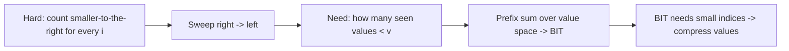
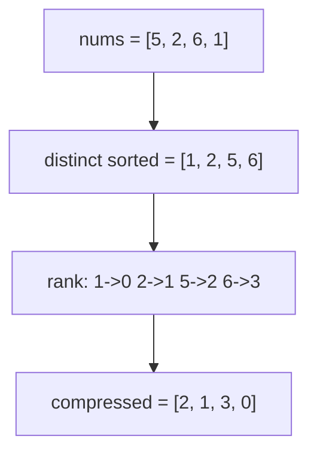
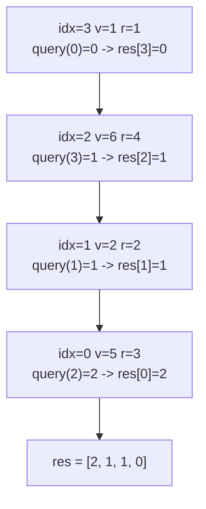
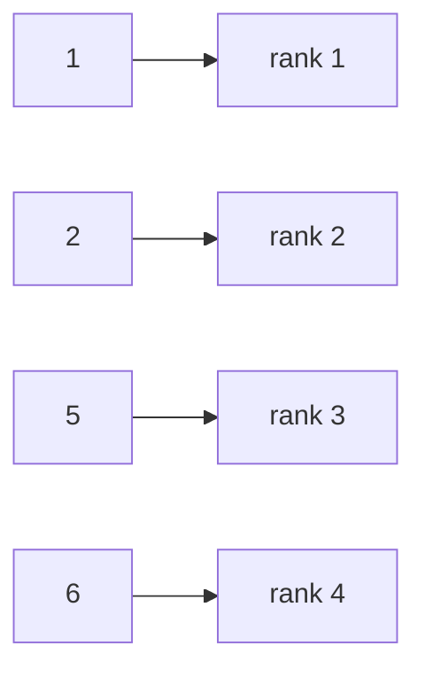
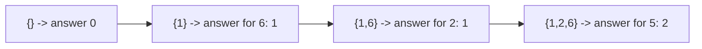

# Count of Smaller Numbers After Self — Compression + BIT

| Field | Value |
|---|---|
| Source | [LeetCode 315](https://leetcode.com/problems/count-of-smaller-numbers-after-self/) |
| Difficulty | Hard |
| Primary topic | **Coordinate compression** |
| Secondary topic | Fenwick tree (BIT), suffix counting |
| Key constraint | $1 \le n \le 10^5$, $-10^4 \le \text{nums}[i] \le 10^4$ |

For every index $i$ we want how many elements to its **right** are strictly smaller. A BIT
indexed by *value* answers that in $O(\log n)$ per element — but only after we **compress** the
values (which include negatives) into small ranks.

---

## Statement

Given an integer array `nums`, return an array `counts` where `counts[i]` is the number of
indices $j > i$ with $\text{nums}[j] < \text{nums}[i]$.

### Example

```text
Input:  nums = [5, 2, 6, 1]
Output: [2, 1, 1, 0]

5 -> to its right {2, 6, 1}: smaller are {2, 1}        -> 2
2 -> to its right {6, 1}:    smaller are {1}           -> 1
6 -> to its right {1}:       smaller are {1}           -> 1
1 -> to its right {}:        none                      -> 0
```

---

## WHY: Index a BIT by Value, but Values Are Sparse

If we sweep **right to left** and keep a frequency structure of values already seen (i.e. values to
the right), then for the current value $v$ the answer is "how many seen values are $< v$" — a
**prefix sum** over value-space. A Fenwick tree gives that in $O(\log n)$, but it must be indexed by
small consecutive integers. The values here span $-10^4 \dots 10^4$ and could be sparse, so we
first **compress** them to ranks $0 \dots m-1$.



Compression turns the value universe into exactly the set of distinct numbers present, so the BIT
has size $m \le n$ regardless of the raw magnitudes or negativity.



---

## Solution

Compress once, then sweep right to left: query the prefix strictly below the current rank, then
insert the current rank.

```python
import bisect

class Solution:
    def countSmaller(self, nums):
        sorted_unique = sorted(set(nums))
        m = len(sorted_unique)
        bit = [0] * (m + 1)                  # 1-indexed Fenwick

        def update(i, delta):
            while i <= m:
                bit[i] += delta
                i += i & (-i)

        def query(i):                        # prefix sum [1..i]
            s = 0
            while i > 0:
                s += bit[i]
                i -= i & (-i)
            return s

        res = [0] * len(nums)
        for idx in range(len(nums) - 1, -1, -1):
            r = bisect.bisect_left(sorted_unique, nums[idx]) + 1   # 1-indexed rank
            res[idx] = query(r - 1)          # count of strictly smaller seen
            update(r, 1)                     # insert current value
        return res
```

```cpp
#include <bits/stdc++.h>
using namespace std;

class Solution {
public:
    vector<int> countSmaller(vector<int>& nums) {
        vector<long long> sortedUnique(nums.begin(), nums.end());
        sort(sortedUnique.begin(), sortedUnique.end());
        sortedUnique.erase(unique(sortedUnique.begin(), sortedUnique.end()),
                           sortedUnique.end());
        int m = (int)sortedUnique.size();
        vector<long long> bit(m + 1, 0);     // 1-indexed Fenwick

        auto update = [&](int i, long long delta) {
            for (; i <= m; i += i & (-i)) bit[i] += delta;
        };
        auto query = [&](int i) -> long long {
            long long s = 0;
            for (; i > 0; i -= i & (-i)) s += bit[i];
            return s;
        };

        vector<int> res(nums.size(), 0);
        for (int idx = (int)nums.size() - 1; idx >= 0; --idx) {
            int r = int(lower_bound(sortedUnique.begin(), sortedUnique.end(),
                                    (long long)nums[idx]) - sortedUnique.begin()) + 1;
            res[idx] = (int)query(r - 1);    // count of strictly smaller seen
            update(r, 1);                    // insert current value
        }
        return res;
    }
};
```

---

## Trace — `nums = [5, 2, 6, 1]`

Compressed ranks (1-indexed for the BIT): `5->3, 2->2, 6->4, 1->1`. Sweep right to left.

| idx | nums[idx] | rank r | query(r-1) = answer | then update(r) |
|---|---|---|---|---|
| 3 | 1 | 1 | query(0) = 0 | insert rank 1 |
| 2 | 6 | 4 | query(3) = 1 | insert rank 4 |
| 1 | 2 | 2 | query(1) = 1 | insert rank 2 |
| 0 | 5 | 3 | query(2) = 2 | insert rank 3 |

Result `[2, 1, 1, 0]`.



The compression mapping used throughout:



BIT state after each insertion (which value-ranks are present to the right):



---

## Math & Complexity

The answer for index $i$ is the count
$\big|\{\, j > i : \text{nums}[j] < \text{nums}[i] \,\}\big|$, evaluated as a Fenwick prefix sum
over compressed ranks:

$$
\text{counts}[i] = \sum_{r < \text{rank}(\text{nums}[i])} \text{freq}_{>i}[r].
$$

| Quantity | Value |
|---|---|
| Compression (sort + dedupe + encode) | $O(n \log n)$ |
| $n$ BIT updates + queries | $O(n \log n)$ |
| **Total time** | $O(n \log n)$ |
| Space (BIT + sortedUnique) | $O(n)$ |

---

## Takeaway

"Count smaller / greater to one side" is a Fenwick-over-values problem. When the values are large,
negative, or sparse, **compress them to ranks first** so the BIT stays size $O(n)$, then sweep in
the direction that makes "already inserted" mean "the side you care about".
