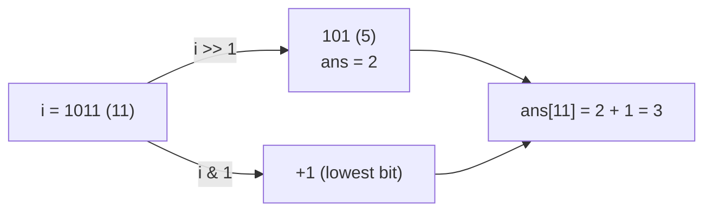
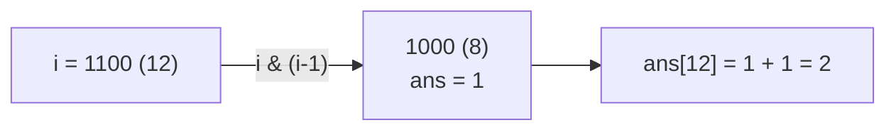
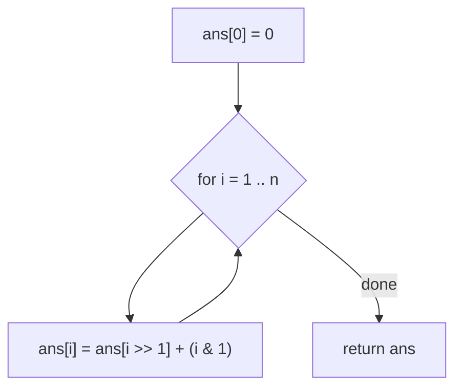
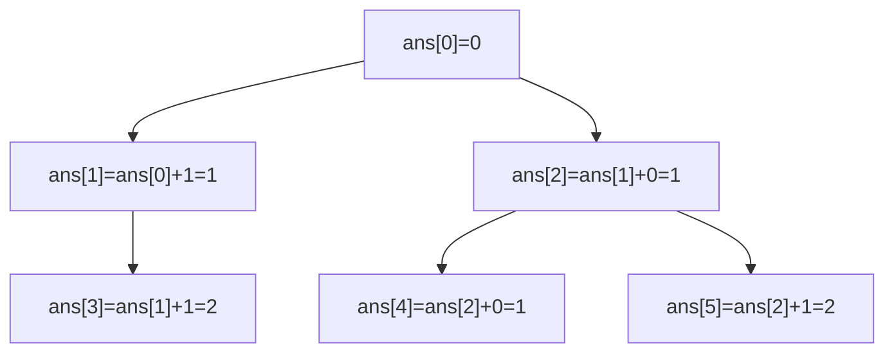

# LeetCode 338 — Counting Bits

| Field | Value |
|-------|-------|
| Source | LeetCode |
| Number | 338 |
| Difficulty | Easy |
| Topics | Bit manipulation, dynamic programming, popcount |
| Link | https://leetcode.com/problems/counting-bits/ |

---

## Problem Statement

Given an integer `n`, return an array `ans` of length `n + 1` such that for each `i`
($0 \le i \le n$), `ans[i]` is the number of `1`-bits in the binary representation of `i` (its
**popcount**).

```text
Input:  n = 2
Output: [0, 1, 1]
Explanation: 0 → 00 (0 ones), 1 → 01 (1 one), 2 → 10 (1 one)

Input:  n = 5
Output: [0, 1, 1, 2, 1, 2]
Explanation:
0 → 000  (0)
1 → 001  (1)
2 → 010  (1)
3 → 011  (2)
4 → 100  (1)
5 → 101  (2)
```

Constraints: $0 \le n \le 10^5$. The follow-up asks for $O(n)$ time **without** calling a built-in
popcount per number.

---

## Approach (WHY)

Calling popcount on every value is $O(n \log n)$. We can do $O(n)$ with **dynamic programming** by
relating each number to a smaller one whose answer is already known. Two clean recurrences:

**1. Right-shift / last-bit (`i >> 1`).** Dropping the lowest bit of `i` gives `i >> 1`, which has the
same set bits *except* possibly the one we dropped. So:

$$
\text{ans}[i] = \text{ans}[i \gg 1] + (i \mathbin{\&} 1).
$$



**2. Clear-lowest-bit (`i & (i-1)`).** Removing the lowest set bit yields a strictly smaller number
with exactly one fewer set bit:

$$
\text{ans}[i] = \text{ans}[i \mathbin{\&} (i-1)] + 1.
$$



Both fill the table in one forward pass because the value they reference (`i >> 1` or `i & (i-1)`) is
always `< i`, hence already computed.



---

## Solution

```python
class Solution:
    def countBits(self, n: int) -> list[int]:
        ans = [0] * (n + 1)
        for i in range(1, n + 1):
            ans[i] = ans[i >> 1] + (i & 1)      # last-bit DP
        return ans
```

```cpp
#include <bits/stdc++.h>
using namespace std;

class Solution {
public:
    vector<int> countBits(int n) {
        vector<int> ans(n + 1, 0);
        for (int i = 1; i <= n; i++) {
            ans[i] = ans[i >> 1] + (i & 1);     // last-bit DP
        }
        return ans;
    }
};
```

The clear-lowest-bit variant is equally valid:

```python
class SolutionLowbit:
    def countBits(self, n: int) -> list[int]:
        ans = [0] * (n + 1)
        for i in range(1, n + 1):
            ans[i] = ans[i & (i - 1)] + 1       # drop lowest set bit
        return ans
```

```cpp
#include <bits/stdc++.h>
using namespace std;

class SolutionLowbit {
public:
    vector<int> countBits(int n) {
        vector<int> ans(n + 1, 0);
        for (int i = 1; i <= n; i++) {
            ans[i] = ans[i & (i - 1)] + 1;      // drop lowest set bit
        }
        return ans;
    }
};
```

For comparison, the direct intrinsic version (simpler but $O(n \log n)$ conceptually / hardware-fast):

```python
class SolutionBuiltin:
    def countBits(self, n: int) -> list[int]:
        return [i.bit_count() for i in range(n + 1)]
```

```cpp
#include <bits/stdc++.h>
using namespace std;

class SolutionBuiltin {
public:
    vector<int> countBits(int n) {
        vector<int> ans(n + 1, 0);
        for (int i = 0; i <= n; i++)
            ans[i] = __builtin_popcountll((long long)i);
        return ans;
    }
};
```

---

## Trace

Last-bit DP for `n = 5`:

| i | binary | `i >> 1` | `ans[i>>1]` | `i & 1` | `ans[i]` |
|---|--------|----------|-------------|---------|----------|
| 0 | `000` | — | — | — | `0` |
| 1 | `001` | `0` | `0` | `1` | `1` |
| 2 | `010` | `1` | `1` | `0` | `1` |
| 3 | `011` | `1` | `1` | `1` | `2` |
| 4 | `100` | `2` | `1` | `0` | `1` |
| 5 | `101` | `2` | `1` | `1` | `2` |

Result: `[0, 1, 1, 2, 1, 2]`. Each row only reads an earlier row, confirming the single-pass validity.



---

## Complexity

Each of the $n$ entries is computed from one already-known entry in $O(1)$:

$$
\text{Time} = O(n), \qquad \text{Space} = O(n) \text{ for the output array (}O(1)\text{ extra).}
$$

This meets the follow-up's linear-time, no-builtin requirement.

---

## Takeaway

Popcount has a beautiful recursive structure: removing **one** bit (the last bit via `i >> 1`, or the
lowest set bit via `i & (i-1)`) always lands on a smaller, already-solved number. That turns a table of
popcounts into an $O(n)$ DP instead of recomputing each value from scratch.
