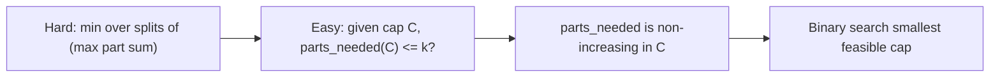
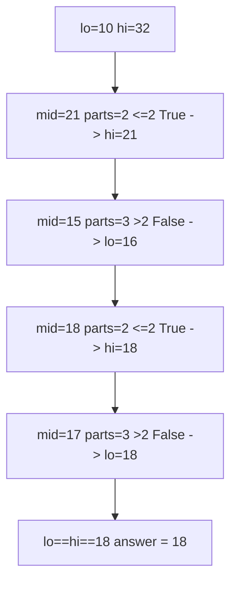
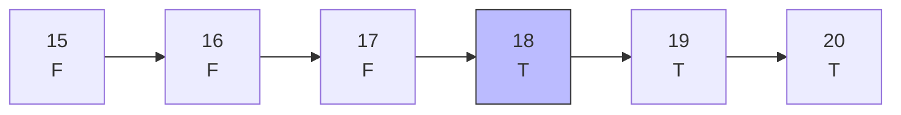
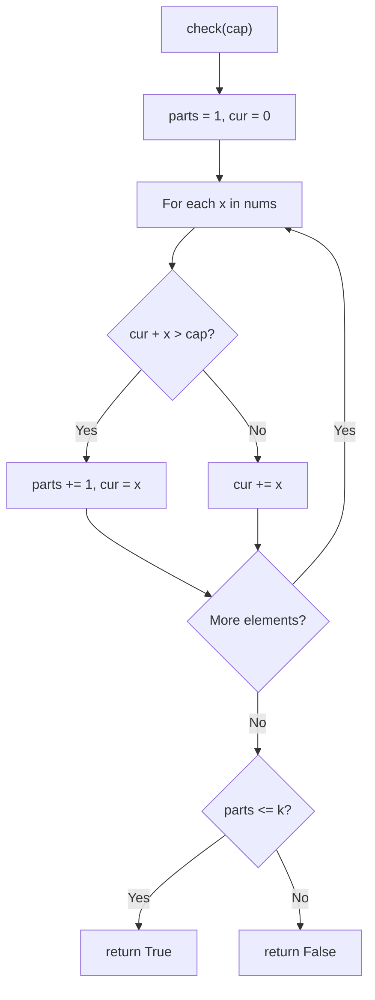

# Split Array Largest Sum — Minimize the Maximum Part

| Field | Value |
|---|---|
| Source | [LeetCode 410](https://leetcode.com/problems/split-array-largest-sum/) |
| Difficulty | Hard |
| Primary topic | **Binary search on the answer** |
| Secondary topic | Greedy feasibility check, "minimize the maximum" |
| Key constraint | $1 \le n \le 1000$, $0 \le \text{nums}[i] \le 10^6$, $1 \le k \le \min(n, 50)$ |

The phrase **"minimize the largest sum"** is the classic tell for binary search on the
answer: guess a cap for the largest part, greedily test whether $k$ parts suffice, and bisect
the cap.

---

## Statement

Given an integer array `nums` and an integer $k$, split `nums` into $k$ **non-empty,
contiguous** subarrays. The *cost* of a split is the **largest** subarray sum among the $k$
parts. Return the **minimum possible** largest sum over all valid splits.

### Example

```text
Input:  nums = [7, 2, 5, 10, 8], k = 2
Output: 18

Best split: [7, 2, 5] | [10, 8]
Part sums:  14         | 18
Largest = 18, and no 2-way split does better.
```

---

## WHY: Guess the Cap, Check with Greedy

Suppose we *fix* a cap $C$ on each part's sum. Then there is a simple greedy: walk left to
right, keep adding to the current part; the moment adding the next element would exceed $C$,
start a new part. The number of parts this uses is the **minimum** number needed for cap $C$.

`check(C) = (parts_needed(C) <= k)` is monotone: raising $C$ can only let parts hold more,
so the parts needed never increases. That gives the `FFFF...TTTT` strip — small caps are
infeasible, large caps are feasible — and we want the **smallest** feasible cap.



Bounds on the cap:

- **Lower bound** `lo = max(nums)`: some part must contain the largest element, so no cap
  below that can ever work.
- **Upper bound** `hi = sum(nums)`: the whole array as one part. Always feasible.

The answer lives in $[\max(\text{nums}), \text{sum}(\text{nums})]$.

---

## Solution

```python
class Solution:
    def splitArray(self, nums, k):
        def parts_needed(cap):
            parts, cur = 1, 0
            for x in nums:
                if cur + x > cap:
                    parts += 1
                    cur = x
                else:
                    cur += x
            return parts

        def check(cap):
            return parts_needed(cap) <= k

        lo, hi = max(nums), sum(nums)
        while lo < hi:
            mid = lo + (hi - lo) // 2
            if check(mid):
                hi = mid          # cap works, try smaller
            else:
                lo = mid + 1      # cap too small, raise it
        return lo
```

```cpp
#include <bits/stdc++.h>
using namespace std;

class Solution {
public:
    int splitArray(vector<int>& nums, int k) {
        auto parts_needed = [&](long long cap) -> long long {
            long long parts = 1, cur = 0;
            for (long long x : nums) {
                if (cur + x > cap) {
                    parts += 1;
                    cur = x;
                } else {
                    cur += x;
                }
            }
            return parts;
        };
        auto check = [&](long long cap) -> bool {
            return parts_needed(cap) <= (long long)k;
        };

        long long lo = *max_element(nums.begin(), nums.end());
        long long hi = accumulate(nums.begin(), nums.end(), 0LL);
        while (lo < hi) {
            long long mid = lo + (hi - lo) / 2;
            if (check(mid)) {
                hi = mid;          // cap works, try smaller
            } else {
                lo = mid + 1;      // cap too small, raise it
            }
        }
        return (int)lo;
    }
};
```

---

## Trace — `nums = [7,2,5,10,8]`, `k = 2`

Range starts at $[\max=10,\ \text{sum}=32]$.

| lo | hi | mid | parts_needed(mid) | check (<=2) | action |
|---|---|---|---|---|---|
| 10 | 32 | 21 | [7,2,5]=14, [10,8]=18 → 2 | True | hi = 21 |
| 10 | 21 | 15 | [7,2,5]=14, [10]=10, [8] → 3 | False | lo = 16 |
| 16 | 21 | 18 | [7,2,5]=14, [10,8]=18 → 2 | True | hi = 18 |
| 16 | 18 | 17 | [7,2,5]=14, [10]=10, [8] → 3 | False | lo = 18 |
| 18 | 18 | — | — | — | stop → **18** |



Monotone strip over caps (boundary at `18`):



The greedy `check(cap)` flowchart:



---

## Math & Complexity

The search range has width $\text{sum} - \max \le n \cdot \max(\text{nums})$, so:

| Quantity | Value |
|---|---|
| Binary search iterations | $O(\log(\sum \text{nums}))$ |
| Work per iteration (greedy) | $O(n)$ |
| **Total time** | $O(n \log(\sum \text{nums}))$ |
| Space | $O(1)$ |

Compare to the DP solution $O(k \cdot n^2)$: binary search on the answer is both simpler and
faster here.

---

## Takeaway

"Minimize the maximum part" ⇒ binary search the cap. The greedy "extend until overflow, then
split" returns the *minimum* parts for that cap, which is exactly the monotone predicate you
bisect on. The lower bound is `max(nums)` and the upper bound is `sum(nums)`.
