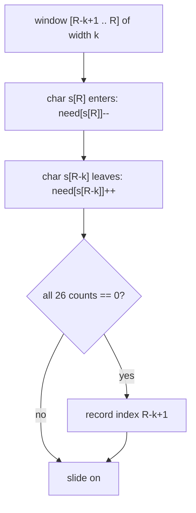
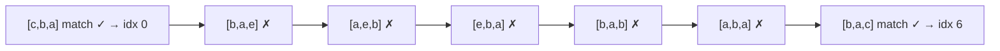
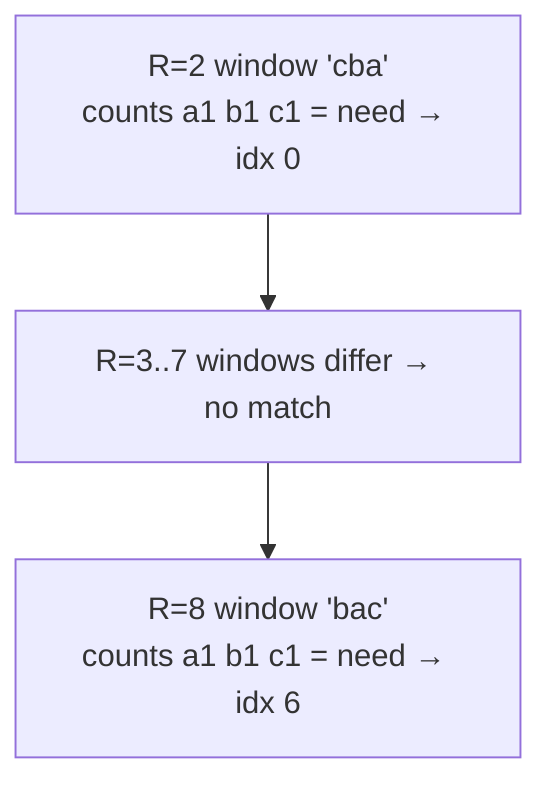
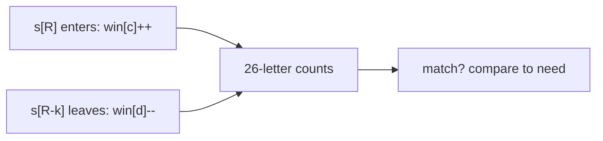

# Find All Anagrams in a String (LeetCode 438)

| Field | Value |
|---|---|
| Source | [LeetCode 438](https://leetcode.com/problems/find-all-anagrams-in-a-string/) |
| Difficulty | Medium |
| Primary topic | **Sliding window — fixed size** |
| Secondary topic | Frequency counts, match-counter optimization |
| Key constraint | $1 \le |s|, |p| \le 3 \times 10^4$, lowercase English letters |

---

## Statement

Given two strings `s` and `p`, return **all start indices** of `p`'s anagrams in `s`. An
**anagram** is a rearrangement using *exactly* the same letters with the same multiplicities,
so every match is a substring of `s` of length `|p|` whose letter frequencies equal `p`'s.

### Example

```text
Input:  s = "cbaebabacd", p = "abc"
Output: [0, 6]
# s[0:3] = "cba" is an anagram of "abc"
# s[6:9] = "bac" is an anagram of "abc"

Input:  s = "abab", p = "ab"
Output: [0, 1, 2]
# "ab", "ba", "ab" are all anagrams of "ab"
```

---

## WHY: A Fixed Window of Width `|p|` Comparing Frequency Tables

An anagram of `p` must have **exactly** `|p|` characters, so the window width is **fixed** at
`k = |p|`. Slide a window of that width across `s`; at each position compare the window's
26-letter frequency table to `p`'s. To keep each step $O(1)$, update the table incrementally
(add the entering char, remove the leaving char) and track how many of the 26 letters
currently **match**.



The window of width `k = |p|` slides one step at a time; only **two** counters change per
step, so a full scan is $O(n)$.



---

## Code

```python
def find_anagrams(s, p):
    if len(p) > len(s):
        return []
    need = [0] * 26
    win = [0] * 26
    for ch in p:
        need[ord(ch) - 97] += 1
    k = len(p)
    res = []
    for i, ch in enumerate(s):
        win[ord(ch) - 97] += 1          # add entering char
        if i >= k:
            win[ord(s[i - k]) - 97] -= 1  # remove leaving char
        if i >= k - 1 and win == need:
            res.append(i - k + 1)
    return res
```

```cpp
#include <bits/stdc++.h>
using namespace std;

vector<int> findAnagrams(const string& s, const string& p) {
    if (p.size() > s.size()) return {};
    array<int, 26> need{}, win{};
    for (char ch : p) need[ch - 'a']++;
    int k = (int)p.size();
    vector<int> res;
    for (int i = 0; i < (int)s.size(); ++i) {
        win[s[i] - 'a']++;              // add entering char
        if (i >= k) win[s[i - k] - 'a']--;  // remove leaving char
        if (i >= k - 1 && win == need) res.push_back(i - k + 1);
    }
    return res;
}
```

Comparing two 26-arrays each step is $O(26)$. We can drop that to $O(1)$ per step by keeping a
**match counter** of how many letters have the exact required count:

```python
def find_anagrams_fast(s, p):
    if len(p) > len(s):
        return []
    need = [0] * 26
    win = [0] * 26
    for ch in p:
        need[ord(ch) - 97] += 1
    matches = sum(1 for c in range(26) if need[c] == win[c])  # = 26 initially
    k = len(p)
    res = []
    for i, ch in enumerate(s):
        c = ord(ch) - 97
        if win[c] == need[c]:
            matches -= 1
        win[c] += 1
        if win[c] == need[c]:
            matches += 1
        if i >= k:
            d = ord(s[i - k]) - 97
            if win[d] == need[d]:
                matches -= 1
            win[d] -= 1
            if win[d] == need[d]:
                matches += 1
        if matches == 26:
            res.append(i - k + 1)
    return res
```

```cpp
#include <bits/stdc++.h>
using namespace std;

vector<int> findAnagramsFast(const string& s, const string& p) {
    if (p.size() > s.size()) return {};
    array<int, 26> need{}, win{};
    for (char ch : p) need[ch - 'a']++;
    int matches = 0;
    for (int c = 0; c < 26; ++c) if (need[c] == win[c]) matches++;  // = 26 initially
    int k = (int)p.size();
    vector<int> res;
    for (int i = 0; i < (int)s.size(); ++i) {
        int c = s[i] - 'a';
        if (win[c] == need[c]) matches--;
        win[c]++;
        if (win[c] == need[c]) matches++;
        if (i >= k) {
            int d = s[i - k] - 'a';
            if (win[d] == need[d]) matches--;
            win[d]--;
            if (win[d] == need[d]) matches++;
        }
        if (matches == 26) res.push_back(i - k + 1);
    }
    return res;
}
```

---

## Trace

Running `s = "cbaebabacd"`, `p = "abc"` (so `k = 3`, `need = {a:1, b:1, c:1}`). The window is
`s[L..R]` with `L = R − k + 1` once `R ≥ k − 1`:

| R | s[R] enters | s[R-k] leaves | L | window | win == need? | record |
|---|-------------|---------------|---|--------|--------------|--------|
| 0 | c | – | – | `c` | (too short) | – |
| 1 | b | – | – | `cb` | (too short) | – |
| 2 | a | – | 0 | `cba` | yes | **0** |
| 3 | e | c | 1 | `bae` | no | – |
| 4 | b | b | 2 | `aeb` | no | – |
| 5 | a | a | 3 | `eba` | no | – |
| 6 | b | e | 4 | `bab` | no | – |
| 7 | a | b | 5 | `aba` | no | – |
| 8 | c | a | 6 | `bac` | yes | **6** |
| 9 | d | b | 7 | `acd` | no | – |

Answer: **[0, 6]**.



Only two counters change as the fixed window advances by one:



---

## Math & Complexity

Let $n = |s|$, $m = |p|$, $\Sigma = 26$.

- **Time (basic):** $O(n \cdot \Sigma)$ from comparing arrays each step; with the match
  counter it drops to $O(n + \Sigma)$.
- **Space:** $O(\Sigma) = O(1)$ for the two frequency tables.

A window starting at `i` is a match iff its letter-frequency vector equals `p`'s:

$$
\forall\, c \in \{a,\dots,z\}: \; \text{count}_{s[i..i+m-1]}(c) = \text{count}_p(c).
$$

The match counter maintains $\big|\{c : \text{win}[c] = \text{need}[c]\}\big|$ incrementally;
a position is reported exactly when this equals $\Sigma = 26$.

---

## Takeaway

> Anagram search is a **fixed-size** window of width `|p|`: slide it across `s` and compare
> 26-letter frequency tables. Update only the entering and leaving characters per step, and a
> **match counter** turns the comparison into $O(1)$ — giving an overall $O(n)$ scan.
