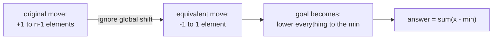
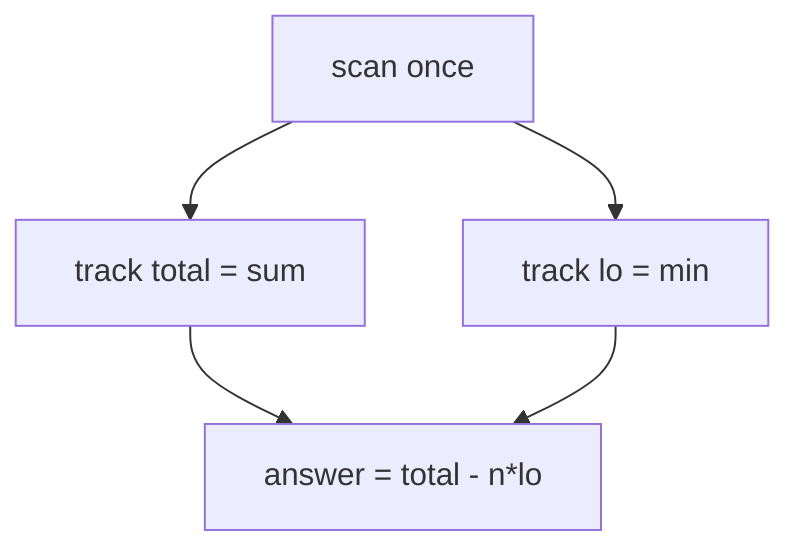
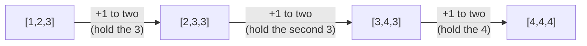
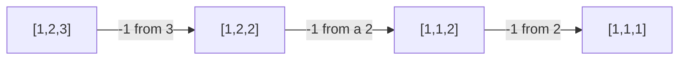
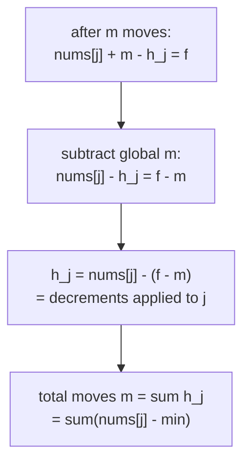

# LeetCode 453 — Minimum Moves to Equal Array Elements

| Field | Value |
|-------|-------|
| Source | LeetCode |
| Number | 453 |
| Difficulty | Medium |
| Topics | Ad-hoc, observation, math, reframing |
| Link | https://leetcode.com/problems/minimum-moves-to-equal-array-elements/ |

---

## Problem Statement

Given an integer array `nums` of size `n`, return the **minimum number of moves** required to
make all array elements equal. In **one move**, you increment `n - 1` elements by `1` (i.e.
every element *except one* goes up by 1).

```text
Input:  nums = [1, 2, 3]
Output: 3
Explanation:
  [1,2,3] -> [2,3,3] -> [3,4,3] -> [4,4,4]   (3 moves)

Input:  nums = [1, 1, 1]
Output: 0
```

Constraints: $1 \le n \le 10^5$, $-10^9 \le \text{nums}[i] \le 10^9$, and the answer fits in a
32-bit integer. Use 64-bit accumulation to be safe.

---

## Approach — the key OBSERVATION (reframing)

A direct simulation explores an unbounded space: which element do we *hold still* each move?
The breakthrough is a **change of viewpoint**.

> **Adding 1 to $n-1$ elements is the same as subtracting 1 from the remaining 1 element** —
> as far as the *differences between elements* are concerned.

Only the **relative gaps** matter, and an overall shift up or down doesn't change "are they
all equal?". So we replace the operation with its mirror image: *subtract 1 from one element*.
Now the goal "make everything equal" becomes "bring every element down to the **minimum**",
and each element $x$ needs exactly $x - \min$ single-decrements.



Hence the formula:

$$
\text{moves} = \sum_{i} \bigl(\text{nums}[i] - \min(\text{nums})\bigr) = \Bigl(\sum_i \text{nums}[i]\Bigr) - n\cdot\min(\text{nums}).
$$



This is a single $O(n)$ pass — no simulation, no search.

---

## Solution

```python
class Solution:
    def minMoves(self, nums: list[int]) -> int:
        lo = min(nums)
        return sum(x - lo for x in nums)   # +1 to n-1  ==  -1 to one  =>  lower all to min
```

```cpp
#include <bits/stdc++.h>
using namespace std;

class Solution {
public:
    long long minMoves(vector<int>& nums) {
        long long lo = *min_element(nums.begin(), nums.end());
        long long moves = 0;
        for (long long x : nums) moves += x - lo;   // bring every element down to the min
        return moves;
    }
};
```

---

## Trace

`nums = [1, 2, 3]`, so `min = 1`.

| Element `x` | `x - min` | running total |
|-------------|-----------|---------------|
| 1 | 0 | 0 |
| 2 | 1 | 1 |
| 3 | 2 | 3 |

Answer `= 3`, matching the forward simulation `[1,2,3] → [2,3,3] → [3,4,3] → [4,4,4]`.



The mirror view of the *same* run — repeatedly subtract 1 from the largest until all reach the
min — also takes 3 steps:



---

## Why the Reframing Is Valid

Let the final equal value be $f$ and suppose move $k$ holds element $i_k$ still. After $m$
moves, every element has been raised $m$ times except on the moves where it was held. Element
$j$ ends at $\text{nums}[j] + (m - h_j) = f$, where $h_j$ is how often $j$ was held. Subtracting
the global term $m$ from both sides shows only $\text{nums}[j] - h_j$ matters — the *relative*
structure — which is precisely the "subtract from one" model.



---

## Math & Complexity

$$
\boxed{\;\text{moves} = \sum_i \text{nums}[i] \;-\; n\cdot\min(\text{nums})\;}
$$

| Aspect | Value |
|--------|-------|
| Time | $O(n)$ — one pass for sum and min |
| Space | $O(1)$ |
| Overflow risk | sum of up to $10^5$ values near $10^9$ ⇒ use 64-bit |

---

## Takeaway

When an operation acts on "all but one" element, **reframe it as acting on the one** — the
global component cancels and only relative gaps remain. That single observation converts an
unbounded simulation into the closed form $\text{sum} - n\cdot\min$. The general lesson:
*if only differences matter, normalize against an extreme (the min or max) and sum.*
