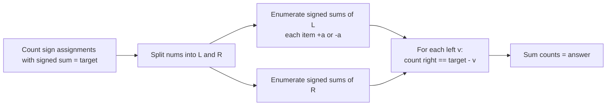
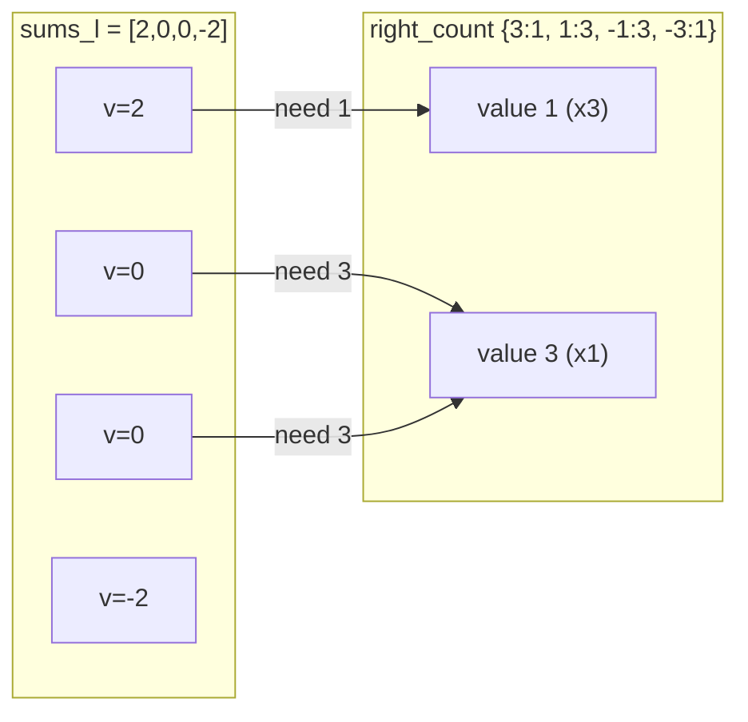
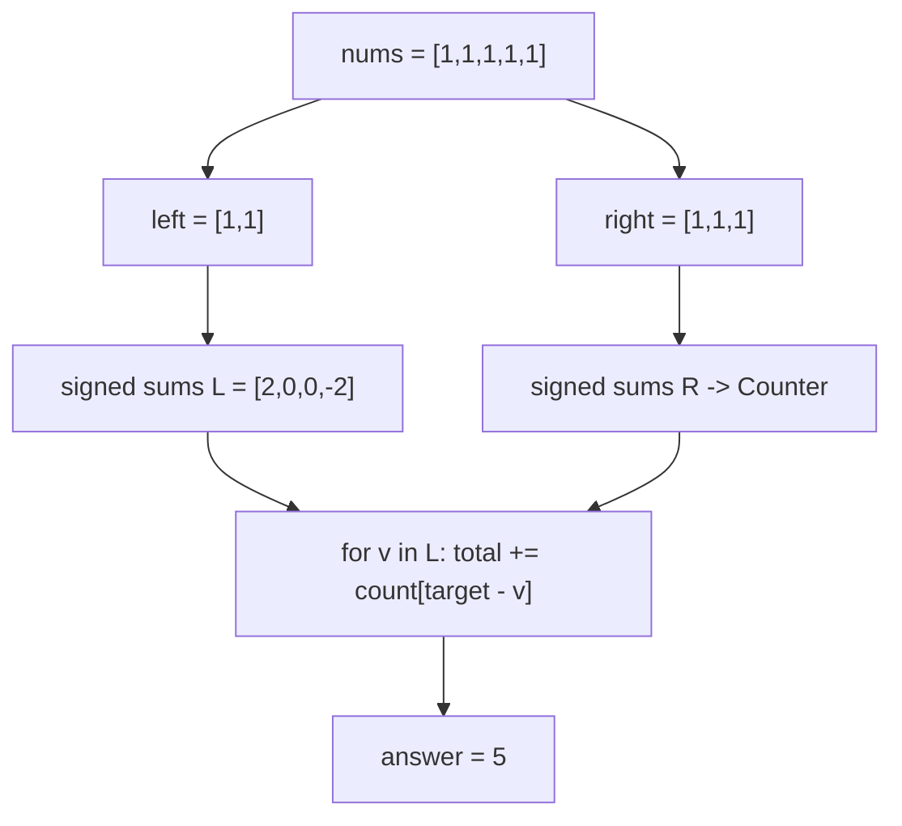
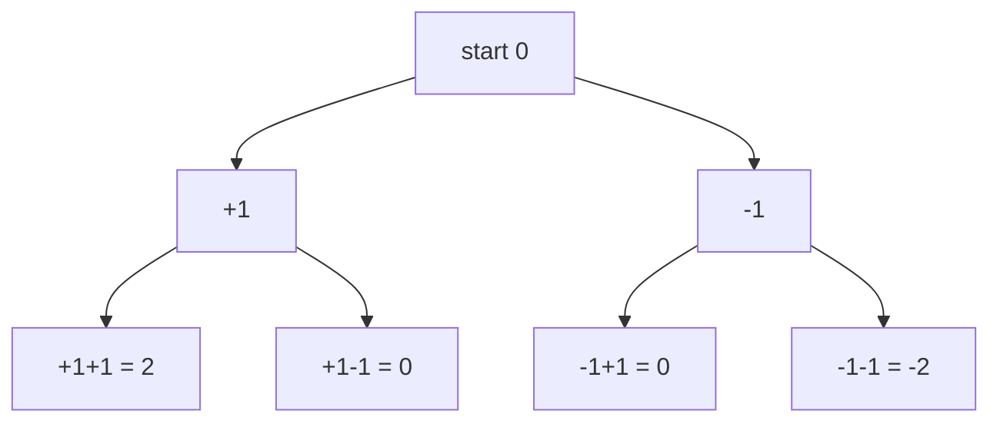

# LeetCode 494 — Target Sum (via Meet in the Middle)

| Field | Value |
|---|---|
| Source | [LeetCode 494](https://leetcode.com/problems/target-sum/) |
| Difficulty | Medium |
| Primary topic | **Meet in the middle** |
| Secondary topic | Sign assignment, subset sums, hashing |
| Key constraint | $1 \le n \le 20$, $0 \le \text{nums}[i] \le 1000$, $-1000 \le \text{target} \le 1000$ |

The standard editorial solves this with subset-sum DP. Here we deliberately frame it through
**meet in the middle** to show how a $\pm$ sign-assignment problem splits into two independent
halves that meet on a shared key.

---

## Statement

You are given an integer array `nums` and an integer `target`. For each number you must place either
a `+` or a `-` in front of it, then concatenate to form an expression. Count the number of sign
assignments whose result equals `target`.

### Example

```text
Input:  nums = [1, 1, 1, 1, 1], target = 3
Output: 5

Each of the five numbers gets a + or - sign. We need the signed sum to equal 3:
  -1 +1 +1 +1 +1 = 3
  +1 -1 +1 +1 +1 = 3
  +1 +1 -1 +1 +1 = 3
  +1 +1 +1 -1 +1 = 3
  +1 +1 +1 +1 -1 = 3
Exactly 5 assignments work.
```

---

## WHY: Sign Assignment Is a $2^n$ Search That Splits

Every number contributes either $+\text{nums}[i]$ or $-\text{nums}[i]$, so there are $2^n$
assignments. For $n \le 20$ plain brute force ($2^{20} \approx 10^6$) is already fine — but the
**meet-in-the-middle** view scales to $n$ up to $\sim 40$ if the constraints were larger, and it
illustrates the split beautifully.

The signed total splits across the two halves: if the left half's signed sum is $v$, the right
half must contribute $\text{target} - v$. So we enumerate every **signed** sum of the left half and
every signed sum of the right half, then for each left value $v$ count right values equal to
$\text{target} - v$.



Unlike subset sums (include / exclude), here **every** item is always present — the choice is its
*sign*. The MITM skeleton is identical; only the per-item branch changes from `{0, +a}` to
`{-a, +a}`.

---

## Solution

```python
from collections import Counter

class Solution:
    def findTargetSumWays(self, nums, target):
        n = len(nums)
        mid = n // 2
        left, right = nums[:mid], nums[mid:]

        def signed_sums(arr):
            sums = [0]
            for v in arr:
                sums = [s + v for s in sums] + [s - v for s in sums]
            return sums

        sums_l = signed_sums(left)
        right_count = Counter(signed_sums(right))

        total = 0
        for v in sums_l:
            total += right_count[target - v]
        return total
```

```cpp
#include <bits/stdc++.h>
using namespace std;

class Solution {
public:
    int findTargetSumWays(vector<int>& nums, int target) {
        int n = (int)nums.size();
        int mid = n / 2;
        vector<long long> left(nums.begin(), nums.begin() + mid);
        vector<long long> right(nums.begin() + mid, nums.end());

        auto signedSums = [](const vector<long long>& arr) {
            vector<long long> sums = {0};
            for (long long v : arr) {
                vector<long long> next;
                next.reserve(sums.size() * 2);
                for (long long s : sums) { next.push_back(s + v); next.push_back(s - v); }
                sums = move(next);
            }
            return sums;
        };

        vector<long long> sumsL = signedSums(left);
        unordered_map<long long, long long> rightCount;
        for (long long s : signedSums(right)) rightCount[s]++;

        long long total = 0;
        for (long long v : sumsL) {
            auto it = rightCount.find((long long)target - v);
            if (it != rightCount.end()) total += it->second;
        }
        return (int)total;
    }
};
```

---

## Trace — `nums = [1,1,1,1,1]`, `target = 3`

Split: `left = [1,1]`, `right = [1,1,1]`.

Signed sums of `left = [1,1]` — each item is $\pm 1$:

| signs | value |
|---|---|
| +1 +1 | 2 |
| +1 -1 | 0 |
| -1 +1 | 0 |
| -1 -1 | -2 |

So `sums_l = [2, 0, 0, -2]`.

Signed sums of `right = [1,1,1]` give values in $\{-3,-1,1,3\}$ with a binomial count
(`Counter`):

| value | how many sign patterns |
|---|---|
| 3 | 1 |
| 1 | 3 |
| -1 | 3 |
| -3 | 1 |

Now combine: for each `v` in `sums_l`, add `right_count[3 - v]`.

| v | need = 3 - v | right_count[need] | running total |
|---|---|---|---|
| 2 | 1 | 3 | 3 |
| 0 | 3 | 1 | 4 |
| 0 | 3 | 1 | 5 |
| -2 | 5 | 0 | 5 |

Total = **5**, matching the expected answer.



The two-half pipeline for this problem:



Per-item branching is a sign tree, not an include/exclude tree:



---

## Math & Complexity

Each half has $\le 2^{n/2}$ signed sums. Using a hash map for the right half makes each combine
lookup $O(1)$ average.

| Quantity | Value |
|---|---|
| Enumerate both halves | $O(2^{n/2})$ |
| Build hash of right sums | $O(2^{n/2})$ |
| Combine (one lookup per left value) | $O(2^{n/2})$ |
| **Total time** | $O(2^{n/2})$ average (hash) |
| Space | $O(2^{n/2})$ |

For the LeetCode bound $n \le 20$ this is at most $\sim 10^6$ work. Signed sums lie in
$[-\sum|nums|, +\sum|nums|]$; with values up to $1000$ and $n \le 20$ they fit comfortably in
`long long`.

---

## Takeaway

Target Sum is a **sign-assignment** problem — a $2^n$ search where each item is always used but may
be $+$ or $-$. Splitting the items in half and matching "left signed sum $v$" against "right signed
sum $\text{target} - v$" is meet in the middle. Whether the per-item choice is *include/exclude* or
*plus/minus*, the same split-enumerate-combine machinery applies.
