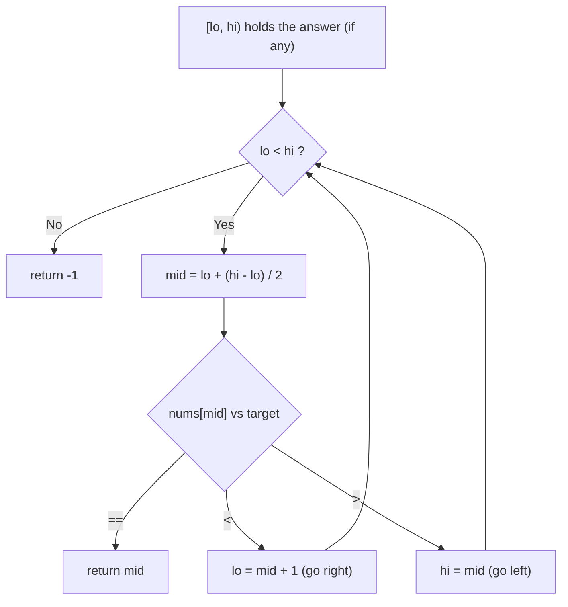
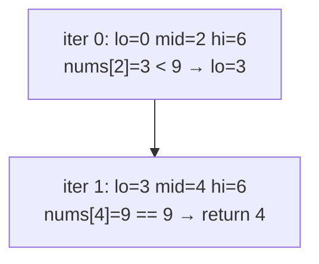
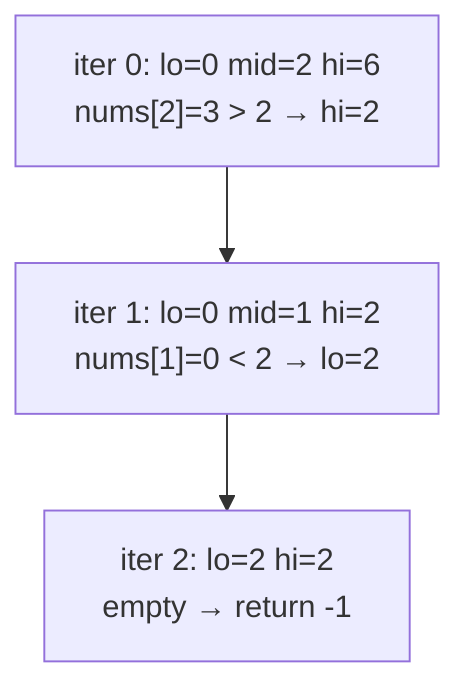
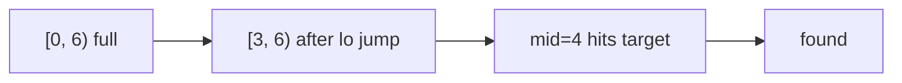

# LeetCode 704 — Binary Search

| Field | Value |
|---|---|
| Source | [LeetCode 704](https://leetcode.com/problems/binary-search/) |
| Difficulty | Easy |
| Primary topic | **Binary search on a sorted array** |
| Secondary topic | Half-open invariant, exact-match search |
| Key constraint | $1 \le n \le 10^4$, sorted ascending, all values **distinct**, $-10^4 \le a_i, target \le 10^4$ |

The "hello world" of binary search: find a target in a sorted, distinct array in $O(\log n)$. It is the cleanest place to lock in the half-open $[lo, hi)$ invariant before tackling harder variants.

---

## Statement

Given a sorted array of **distinct** integers `nums` (ascending) and an integer `target`, return the **index** of `target` if it exists, otherwise return `-1`. You must run in $O(\log n)$ time.

### Example

```text
Input:  nums = [-1, 0, 3, 5, 9, 12], target = 9
Output: 4
Explanation: nums[4] == 9.

Input:  nums = [-1, 0, 3, 5, 9, 12], target = 2
Output: -1
Explanation: 2 is not in nums.
```

---

## WHY: Halving Beats Scanning

A linear scan checks each element — $O(n)$. But the array is **sorted**, so a single comparison at the middle tells us which *half* the target must be in, letting us discard the other half outright. Each step removes half the candidates, so the number of probes is $\lceil \log_2 n \rceil$.

We track the candidate region as the half-open interval $[lo, hi)$ with invariant: *if `target` exists, its index is in $[lo, hi)$.* Probe `mid`; equal means found; smaller means go right (`lo = mid + 1`); larger means go left (`hi = mid`).



---

## Solution (Paired Python + C++)

```python
class Solution:
    def search(self, nums, target):
        lo, hi = 0, len(nums)           # half-open [lo, hi)
        while lo < hi:
            mid = lo + (hi - lo) // 2   # overflow-proof midpoint
            if nums[mid] == target:
                return mid
            elif nums[mid] < target:
                lo = mid + 1            # target in right half
            else:
                hi = mid                # target in left half
        return -1
```

```cpp
#include <bits/stdc++.h>
using namespace std;

class Solution {
public:
    int search(vector<int>& nums, int target) {
        long long lo = 0, hi = (long long)nums.size();   // half-open [lo, hi)
        while (lo < hi) {
            long long mid = lo + (hi - lo) / 2;          // overflow-proof
            if (nums[mid] == target) return (int)mid;
            else if (nums[mid] < target) lo = mid + 1;   // target right half
            else hi = mid;                               // target left half
        }
        return -1;
        // STL one-liner alternative:
        //   auto it = lower_bound(nums.begin(), nums.end(), target);
        //   return (it != nums.end() && *it == target) ? it - nums.begin() : -1;
    }
};
```

---

## Trace

Searching `target = 9` in `[-1, 0, 3, 5, 9, 12]` (indices $0\ldots5$):

| iter | lo | mid | hi | nums[mid] | action |
|---|---|---|---|---|---|
| 0 | 0 | 2 | 6 | 3 | $3 < 9 \Rightarrow$ `lo = 3` |
| 1 | 3 | 4 | 6 | 9 | $9 = 9 \Rightarrow$ **return 4** |

Searching `target = 2` (absent):

| iter | lo | mid | hi | nums[mid] | action |
|---|---|---|---|---|---|
| 0 | 0 | 2 | 6 | 3 | $3 > 2 \Rightarrow$ `hi = 2` |
| 1 | 0 | 1 | 2 | 0 | $0 < 2 \Rightarrow$ `lo = 2` |
| 2 | 2 | — | 2 | — | $lo = hi \Rightarrow$ **return -1** |

---

## Visualizing the Search

The successful run as a step graph of `lo`/`mid`/`hi`:



The failing run, showing the interval collapse to empty:



The shrinking interval as a region diagram:



---

## Math & Complexity

Each iteration replaces the region of size $s$ with one of size at most $\lfloor s/2 \rfloor$, so after $k$ iterations the size is $\le n / 2^k$. The loop ends when size $< 1$, i.e. when $2^k \ge n$, giving $k = \lceil \log_2 n \rceil$ probes.

$$T(n) = T\!\left(\frac{n}{2}\right) + O(1) = O(\log n), \qquad \text{space } O(1).$$

For $n = 10^4$ that is at most $14$ comparisons.

---

## Takeaway

Memorize this four-line skeleton — `hi = n`, test `lo < hi`, `lo = mid + 1` / `hi = mid` — as your default. Every other binary-search variant in this module is a small mutation of it. Pin the invariant ("answer in $[lo, hi)$") and the off-by-ones take care of themselves.
