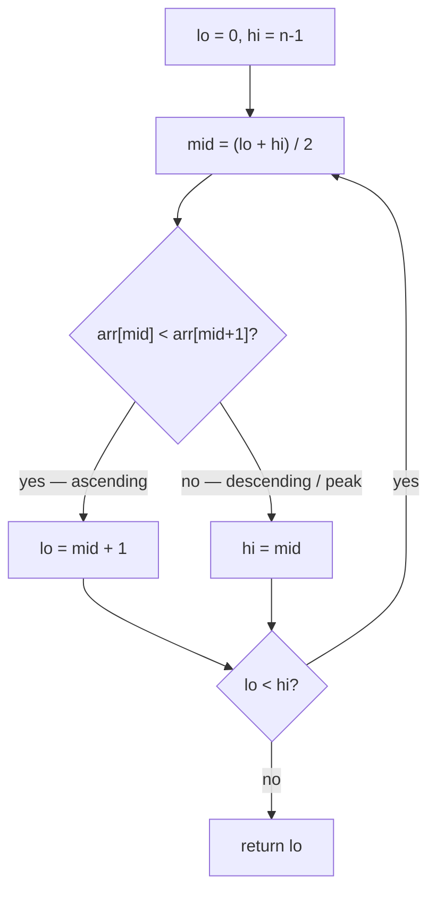
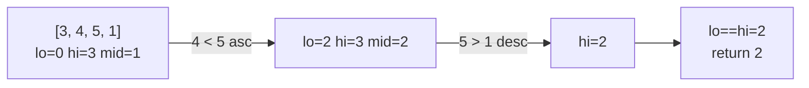
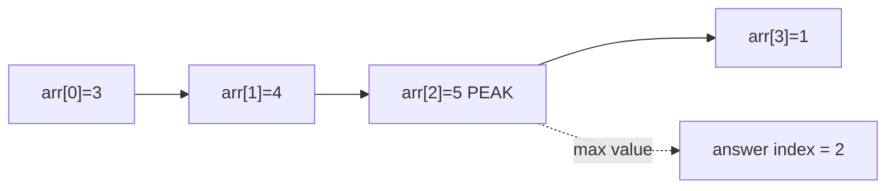
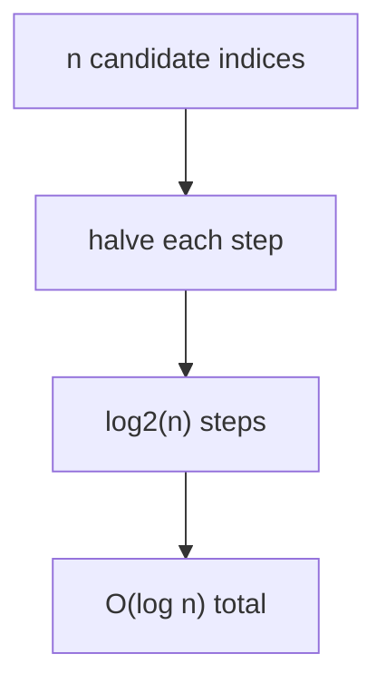

# LeetCode 852 — Peak Index in a Mountain Array

| Field | Value |
|-------|-------|
| Source | LeetCode |
| Number | 852 |
| Difficulty | Medium |
| Topics | Binary search, ternary search, unimodal / bitonic arrays |
| Link | https://leetcode.com/problems/peak-index-in-a-mountain-array/ |

---

## Problem Statement

An array `arr` is a **mountain** if there exists an index `i` with `0 < i < len(arr) - 1` such that

$$
arr[0] < arr[1] < \dots < arr[i] > arr[i+1] > \dots > arr[n-1].
$$

That is, the values strictly increase up to a single **peak** and then strictly decrease. Return the
peak index `i`. You must do it in $O(\log n)$ time.

```text
Input:  arr = [0, 1, 0]
Output: 1            (arr[1] = 1 is the peak)

Input:  arr = [0, 2, 1, 0]
Output: 1            (arr[1] = 2 is the peak)

Input:  arr = [0, 10, 5, 2]
Output: 1

Input:  arr = [3, 4, 5, 1]
Output: 2            (arr[2] = 5 is the peak)
```

Constraints: $3 \le \text{len}(arr) \le 10^5$, values fit in a 32-bit integer, and `arr` is guaranteed
to be a mountain.

---

## Approach (WHY)

A mountain array is the canonical **unimodal** sequence: increasing then decreasing. Because the index
of the peak is the unique maximizer of `f(i) = arr[i]`, we can locate it without scanning all $n$
elements.

The cleanest discrete decision uses a **neighbour comparison**. At index `mid`, look at `arr[mid]` vs
`arr[mid+1]`:

- If `arr[mid] < arr[mid+1]`, we are still on the **ascending** slope, so the peak is strictly to the
  right: `lo = mid + 1`.
- Otherwise we are on the **descending** slope (or exactly at the peak), so the peak is `mid` or to the
  left: `hi = mid`.

Each step halves the candidate range — a one-probe specialization of ternary search that exploits the
same unimodal structure.



---

## Code

Neighbour-comparison binary search (the idiomatic $O(\log n)$ solution):

```python
class Solution:
    def peakIndexInMountainArray(self, arr):
        lo, hi = 0, len(arr) - 1
        while lo < hi:
            mid = (lo + hi) // 2
            if arr[mid] < arr[mid + 1]:
                lo = mid + 1      # ascending slope, peak is to the right
            else:
                hi = mid          # descending slope or peak, keep left half
        return lo
```

```cpp
#include <bits/stdc++.h>
using namespace std;

class Solution {
public:
    int peakIndexInMountainArray(vector<int>& arr) {
        int lo = 0, hi = (int)arr.size() - 1;
        while (lo < hi) {
            int mid = (lo + hi) / 2;
            if (arr[mid] < arr[mid + 1])
                lo = mid + 1;     // ascending slope, peak is to the right
            else
                hi = mid;         // descending slope or peak, keep left half
        }
        return lo;
    }
};
```

A true **two-probe ternary search** also works, maximizing `arr[i]` directly:

```python
class SolutionTernary:
    def peakIndexInMountainArray(self, arr):
        lo, hi = 0, len(arr) - 1
        while hi - lo > 2:
            m1 = lo + (hi - lo) // 3
            m2 = hi - (hi - lo) // 3
            if arr[m1] < arr[m2]:
                lo = m1 + 1       # peak to the right of m1
            else:
                hi = m2 - 1       # peak to the left of m2
        best = lo
        for i in range(lo + 1, hi + 1):
            if arr[i] > arr[best]:
                best = i
        return best
```

```cpp
#include <bits/stdc++.h>
using namespace std;

class SolutionTernary {
public:
    int peakIndexInMountainArray(vector<int>& arr) {
        long long lo = 0, hi = (long long)arr.size() - 1;
        while (hi - lo > 2) {
            long long m1 = lo + (hi - lo) / 3;
            long long m2 = hi - (hi - lo) / 3;
            if (arr[m1] < arr[m2])
                lo = m1 + 1;      // peak to the right of m1
            else
                hi = m2 - 1;      // peak to the left of m2
        }
        long long best = lo;
        for (long long i = lo + 1; i <= hi; ++i)
            if (arr[i] > arr[best])
                best = i;
        return (int)best;
    }
};
```

---

## Trace

Take `arr = [3, 4, 5, 1]` with the neighbour-comparison method.

| Step | lo | hi | mid | arr[mid] | arr[mid+1] | Decision |
|------|----|----|-----|----------|------------|----------|
| 1 | 0 | 3 | 1 | 4 | 5 | `4 < 5` → ascending → `lo = 2` |
| 2 | 2 | 3 | 2 | 5 | 1 | `5 < 1`? no → descending → `hi = 2` |
| 3 | 2 | 2 | — | — | — | `lo == hi`, stop → return **2** |

The peak is index `2` (value `5`). ✓



The shape we are exploiting:



---

## Math & Complexity

Let $n = \text{len}(arr)$.

- **Time:** each iteration discards at least half (neighbour method) or a third (ternary method) of the
  interval, so the number of probes is $O(\log n)$. The ternary variant's final scan touches at most
  $3$ cells, $O(1)$.
- **Space:** $O(1)$ — only a few index variables.

$$
T(n) = T(n/2) + O(1) = O(\log n).
$$



---

## Takeaway

A mountain array is a **unimodal** sequence; its peak is the unique maximizer. Compare a midpoint with
its neighbour (or run a two-probe ternary search on the values) to converge to the peak in $O(\log n)$
instead of scanning all $n$ elements.
