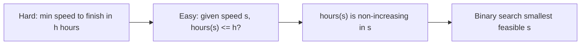
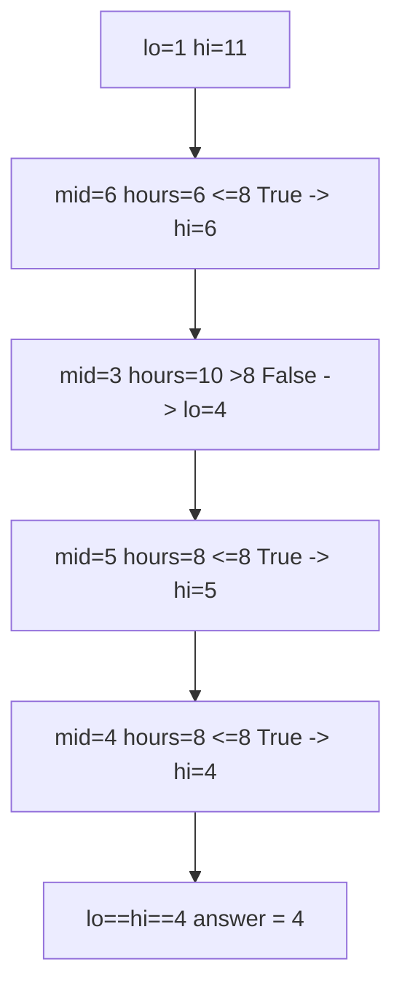
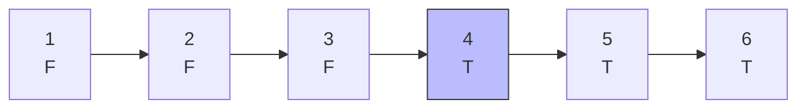
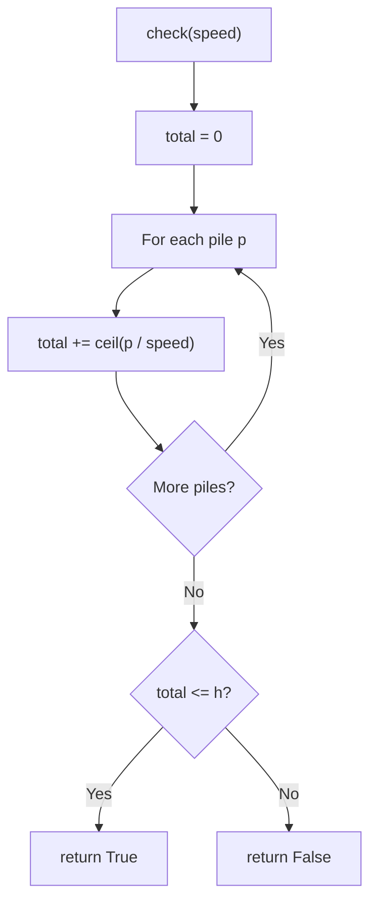

# Koko Eating Bananas — Minimum Eating Speed

| Field | Value |
|---|---|
| Source | [LeetCode 875](https://leetcode.com/problems/koko-eating-bananas/) |
| Difficulty | Medium |
| Primary topic | **Binary search on the answer** |
| Secondary topic | Feasibility predicate, greedy simulation |
| Key constraint | $1 \le n \le 10^4$ piles, $1 \le \text{piles}[i] \le 10^9$, $n \le h \le 10^9$ |

We cannot compute the minimum speed directly, but for a *given* speed we can easily check
"does Koko finish in time?". The check is monotone in speed, so we **binary search the
answer**.

---

## Statement

Koko has $n$ piles of bananas; pile $i$ has `piles[i]` bananas. The guards return in $h$
hours. Each hour Koko picks one pile and eats up to $s$ bananas from it (speed $s$); if the
pile has fewer than $s$ left, she eats it all and waits out the hour. Find the **minimum
integer speed** $s$ so she finishes all piles within $h$ hours.

### Example

```text
Input:  piles = [3, 6, 7, 11], h = 8
Output: 4

Speed 4: ceil(3/4)+ceil(6/4)+ceil(7/4)+ceil(11/4)
       = 1 + 2 + 2 + 3 = 8 hours  -> fits in h=8
Speed 3: 1 + 2 + 3 + 4 = 10 hours -> too slow
So the minimum feasible speed is 4.
```

---

## WHY: Feasibility Is Easy, Optimum Is Not

Directly solving "what is the slowest speed that fits?" is awkward. But for a fixed speed
$s$, the hours needed are just a sum of ceilings:

$$
\text{hours}(s) = \sum_{i=1}^{n} \left\lceil \frac{\text{piles}[i]}{s} \right\rceil .
$$

As $s$ grows, every term can only shrink, so `hours(s)` is **non-increasing**. That makes
`check(s) = (hours(s) <= h)` a clean `FFFF...TTTT` strip: too-slow speeds fail, fast-enough
speeds pass, and we want the **first** speed that passes.



Bounds: the slowest sensible speed is `1`; the fastest we ever need is `max(piles)` (one
pile per hour). So the answer lies in $[1, \max(\text{piles})]$.

---

## Solution

```python
import math

class Solution:
    def minEatingSpeed(self, piles, h):
        def hours(speed):
            return sum((p + speed - 1) // speed for p in piles)

        def check(speed):
            return hours(speed) <= h

        lo, hi = 1, max(piles)
        while lo < hi:
            mid = lo + (hi - lo) // 2
            if check(mid):
                hi = mid          # mid works, try slower
            else:
                lo = mid + 1      # too slow, speed up
        return lo
```

```cpp
#include <bits/stdc++.h>
using namespace std;

class Solution {
public:
    int minEatingSpeed(vector<int>& piles, int h) {
        auto hours = [&](long long speed) -> long long {
            long long total = 0;
            for (long long p : piles) total += (p + speed - 1) / speed;
            return total;
        };
        auto check = [&](long long speed) -> bool {
            return hours(speed) <= (long long)h;
        };

        long long lo = 1, hi = *max_element(piles.begin(), piles.end());
        while (lo < hi) {
            long long mid = lo + (hi - lo) / 2;
            if (check(mid)) {
                hi = mid;          // mid works, try slower
            } else {
                lo = mid + 1;      // too slow, speed up
            }
        }
        return (int)lo;
    }
};
```

---

## Trace — `piles = [3,6,7,11]`, `h = 8`

Range starts at $[1, 11]$. We bisect, computing `hours(mid)` each step.

| lo | hi | mid | hours(mid) | check (<=8) | action |
|---|---|---|---|---|---|
| 1 | 11 | 6 | 1+1+2+2 = 6 | True | hi = 6 |
| 1 | 6 | 3 | 1+2+3+4 = 10 | False | lo = 4 |
| 4 | 6 | 5 | 1+2+2+3 = 8 | True | hi = 5 |
| 4 | 5 | 4 | 1+2+2+3 = 8 | True | hi = 4 |
| 4 | 4 | — | — | — | stop → **4** |



The monotone strip over speeds, showing the boundary at `4`:



The `check(speed)` predicate as a flowchart:



---

## Math & Complexity

The number of hours for speed $s$ is $\sum_i \lceil \text{piles}[i]/s \rceil$, computed with
the integer-safe ceiling $\lceil a/b \rceil = (a + b - 1) / b$.

| Quantity | Value |
|---|---|
| Binary search iterations | $O(\log(\max \text{piles}))$ |
| Work per iteration | $O(n)$ |
| **Total time** | $O(n \log(\max \text{piles}))$ |
| Space | $O(1)$ |

With $\max\text{piles} \le 10^9$, that is at most $\approx 30$ iterations × $n$ — trivially
fast.

---

## Takeaway

When a problem says *"minimum rate/speed/capacity so that something finishes in time"*, the
finishing condition is usually a monotone predicate. Bound the rate, write a one-pass
`check`, and binary search for the **first** value that passes.
