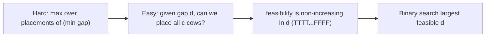
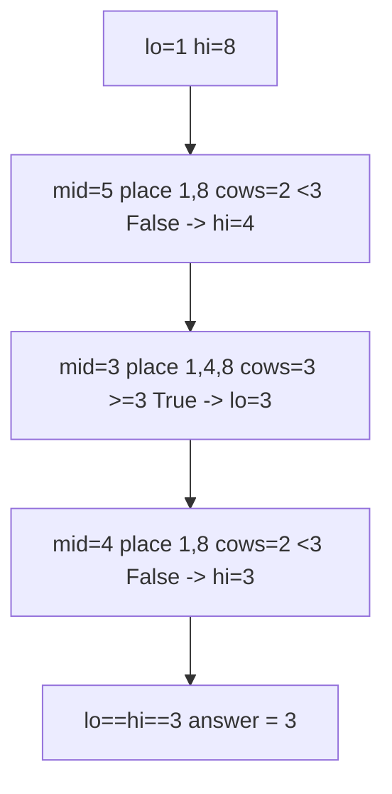
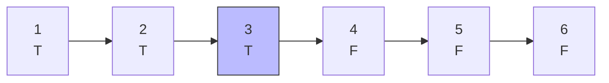
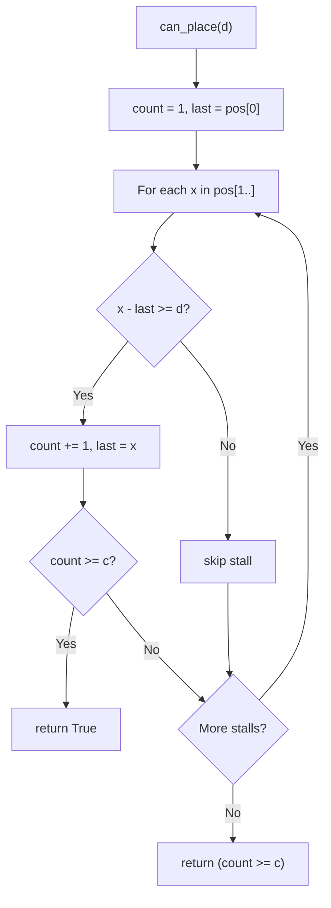
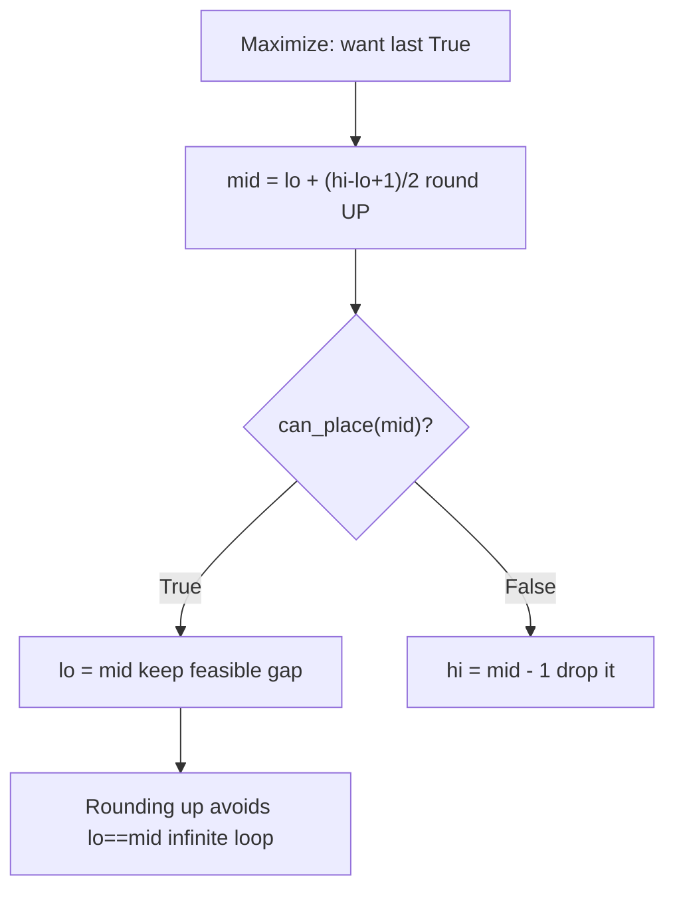

# Aggressive Cows — Maximize the Minimum Distance

| Field | Value |
|---|---|
| Source | Self-contained (ref [SPOJ AGGRCOW](https://www.spoj.com/problems/AGGRCOW/)) |
| Difficulty | Medium |
| Primary topic | **Binary search on the answer** |
| Secondary topic | Greedy feasibility, "maximize the minimum" |
| Key constraint | $2 \le c \le n \le 10^5$ stalls, stall positions up to $10^9$ |

This is the canonical **"maximize the minimum"** problem. We guess a minimum gap, greedily
place cows that far apart, and binary search the **largest** gap that still fits all cows.

---

## Statement

There are $n$ stalls on a line at integer positions $x_1, x_2, \dots, x_n$, and $c$
aggressive cows. Place the cows in stalls so that the **minimum distance between any two
cows is as large as possible**. Output that largest achievable minimum distance.

### Example

```text
Input:  positions = [1, 2, 8, 4, 9], c = 3
Output: 3

Sort -> [1, 2, 4, 8, 9].
Place cows at 1, 4, 8: gaps are 3 and 4, minimum gap = 3.
No placement of 3 cows achieves a minimum gap larger than 3.
```

---

## WHY: Guess the Gap, Greedily Place Cows

Fix a candidate minimum distance $d$. Sort the stalls, place the first cow at the leftmost
stall, then walk right placing a cow at the first stall that is at least $d$ away from the
previous one. If we manage to place all $c$ cows, then $d$ is **feasible**.

`check(d) = (cows_placed(d) >= c)` is monotone the other way: a *larger* required gap $d$ can
only make placement *harder*, so feasibility goes `TTTT...FFFF`. We want the **last** `True`
— the largest feasible $d$. That calls for the **maximization** template (round `mid` up).



Bounds on the gap:

- **Lower bound** `lo = 1`: distinct stalls are at least 1 apart (a gap of 0 is trivially
  feasible but uninteresting).
- **Upper bound** `hi = max(pos) - min(pos)`: the widest possible spread.

---

## Solution

```python
def aggressive_cows(positions, c):
    pos = sorted(positions)

    def can_place(d):
        count = 1                 # place first cow at pos[0]
        last = pos[0]
        for x in pos[1:]:
            if x - last >= d:
                count += 1
                last = x
                if count >= c:
                    return True
        return count >= c

    lo, hi = 1, pos[-1] - pos[0]
    while lo < hi:
        mid = lo + (hi - lo + 1) // 2   # bias UP for maximization
        if can_place(mid):
            lo = mid              # feasible, try larger gap
        else:
            hi = mid - 1          # infeasible, shrink gap
    return lo
```

```cpp
#include <bits/stdc++.h>
using namespace std;

long long aggressive_cows(vector<long long> positions, long long c) {
    sort(positions.begin(), positions.end());

    auto can_place = [&](long long d) -> bool {
        long long count = 1;          // place first cow at positions[0]
        long long last = positions[0];
        for (size_t i = 1; i < positions.size(); i++) {
            if (positions[i] - last >= d) {
                count += 1;
                last = positions[i];
                if (count >= c) return true;
            }
        }
        return count >= c;
    };

    long long lo = 1, hi = positions.back() - positions.front();
    while (lo < hi) {
        long long mid = lo + (hi - lo + 1) / 2;  // bias UP for maximization
        if (can_place(mid)) {
            lo = mid;             // feasible, try larger gap
        } else {
            hi = mid - 1;         // infeasible, shrink gap
        }
    }
    return lo;
}
```

---

## Trace — `positions = [1,2,8,4,9]`, `c = 3`

Sorted: `[1, 2, 4, 8, 9]`. Range starts at $[1,\ 9-1=8]$. Note `mid` rounds **up**.

| lo | hi | mid | placement at gap mid | cows | can_place (>=3) | action |
|---|---|---|---|---|---|---|
| 1 | 8 | 5 | 1, 8 → next 9 too close | 2 | False | hi = 4 |
| 1 | 4 | 3 | 1, 4, 8 | 3 | True | lo = 3 |
| 3 | 4 | 4 | 1, 8 → only 2 | 2 | False | hi = 3 |
| 3 | 3 | — | — | — | — | stop → **3** |



Monotone strip over gaps — `TTTT...FFFF`, we want the **last** `T` (boundary at `3`):



The greedy `can_place(d)` flowchart:



Why the maximization template (round `mid` up) matters:



---

## Math & Complexity

Let $D = \max(\text{pos}) - \min(\text{pos})$ be the position span.

| Quantity | Value |
|---|---|
| Sorting | $O(n \log n)$ |
| Binary search iterations | $O(\log D)$ |
| Work per iteration (greedy) | $O(n)$ |
| **Total time** | $O(n \log n + n \log D)$ |
| Space | $O(1)$ extra |

---

## Takeaway

"Maximize the minimum" ⇒ binary search the gap with the **maximization** template: round
`mid` **up**, set `lo = mid` on success, `hi = mid - 1` on failure. The greedy "place a cow
at the first stall that is far enough" is the monotone feasibility check. The mirror image of
"minimize the maximum" — same skeleton, opposite direction.
