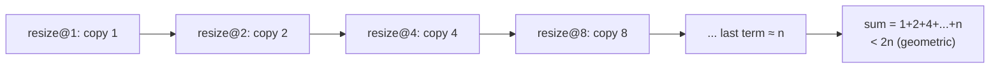
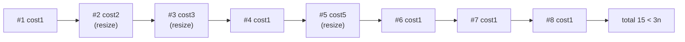
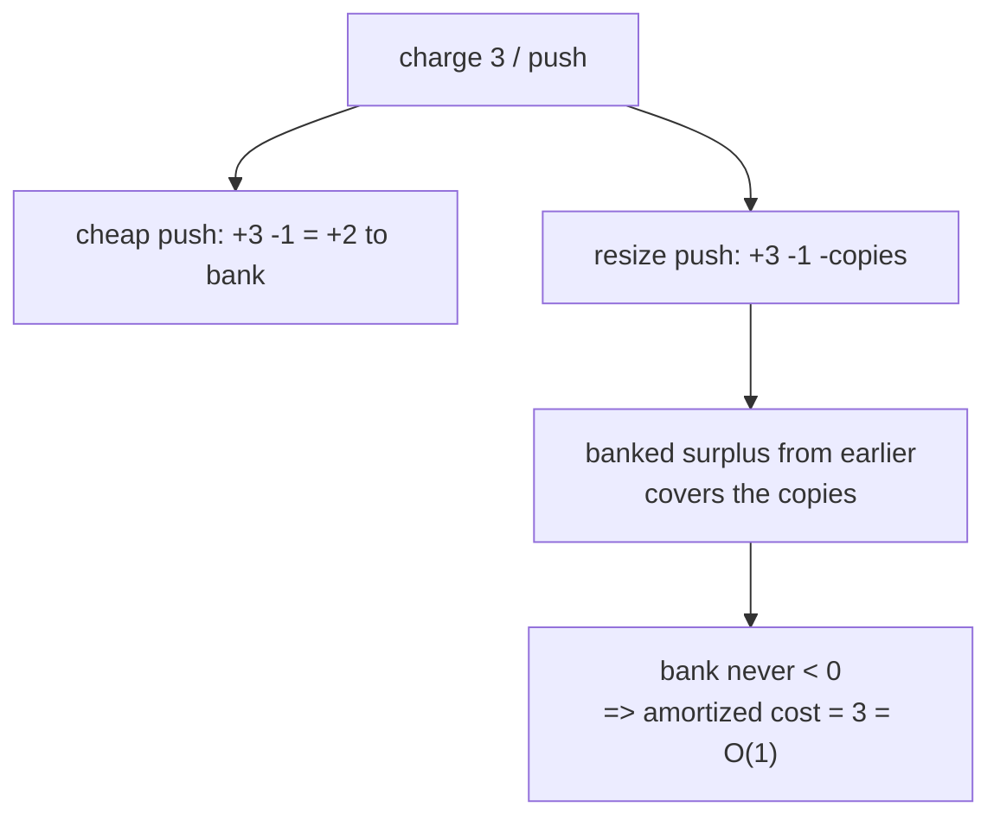
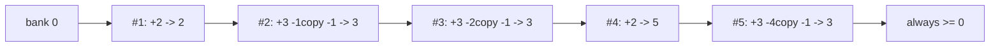
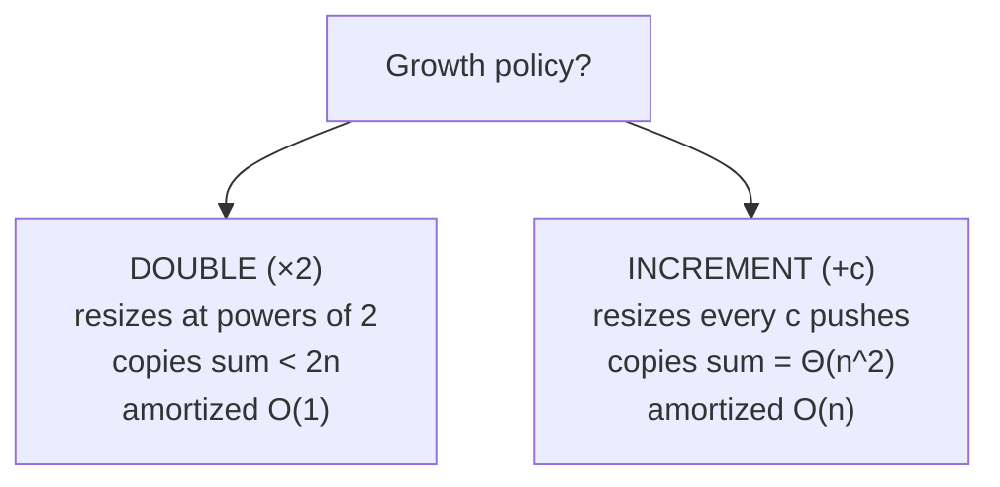

# Amortized Dynamic Array Analysis

| Field | Value |
|---|---|
| **Module** | basics |
| **Topic** | Amortized analysis — aggregate & accounting methods |
| **Difficulty** | Medium |
| **Core idea** | A doubling array's `push_back` is $O(n)$ in the worst case but **amortized $O(1)$** |
| **Time** | $\Theta(1)$ amortized per push, $\Theta(n)$ total for $n$ pushes |
| **Space** | $O(n)$ |
| **Prereqs** | Geometric series, Big-O, dynamic arrays |

---

## Problem Statement

A **dynamic array** (Python `list`, C++ `vector`, Java `ArrayList`) supports `push_back(x)` in *amortized* $O(1)$ time even though a single push can trigger a full $O(n)$ reallocation. Prove this rigorously using **two methods**:

1. **Aggregate method** — bound the *total* cost of $n$ pushes and divide by $n$.
2. **Accounting method** — charge each push a fixed amortized cost and show the stored "credit" never goes negative.

The growth policy: when the array is full, allocate a buffer of **double** the capacity and copy everything over.

### Example

```text
Start: capacity 1, size 0.

push 1 -> size 1, cap 1   (no resize)               actual cost 1
push 2 -> FULL: grow cap 1->2, copy 1; insert        actual cost 1 + 1 = 2
push 3 -> FULL: grow cap 2->4, copy 2; insert        actual cost 1 + 2 = 3
push 4 -> size 4, cap 4   (no resize)               actual cost 1
push 5 -> FULL: grow cap 4->8, copy 4; insert        actual cost 1 + 4 = 5
...

Total copies after n pushes < 2n  =>  amortized O(1) per push.
```

---

## Why This Works

Resizes happen at sizes $1, 2, 4, 8, \dots$ — i.e. only at **powers of two**. The copy cost of the resize at size $2^k$ is $2^k$. Summing all resize costs while inserting $n$ elements:
$$\sum_{k=0}^{\lfloor \log_2 n\rfloor} 2^k = 2^{\lfloor\log_2 n\rfloor+1} - 1 < 2n.$$

That is a **geometric series** dominated by its last term. The total work is "$n$ cheap inserts" + "less than $2n$ copies" $= O(n)$, so per operation it is $O(1)$ on average. The doubling is essential: a *fixed-increment* growth (e.g. +1 each time) would make the copies sum to $\Theta(n^2)$.



---

## Approach (paired implementations)

An instrumented dynamic array that counts **actual** work (inserts + copies), so we can measure amortized cost empirically.

```python
class DynArray:
    def __init__(self):
        self.cap = 1
        self.size = 0
        self.data = [None] * self.cap
        self.total_cost = 0      # inserts + element copies

    def push_back(self, x):
        if self.size == self.cap:        # full -> double and copy
            self.cap *= 2
            new_data = [None] * self.cap
            for i in range(self.size):
                new_data[i] = self.data[i]
                self.total_cost += 1     # one copy
            self.data = new_data
        self.data[self.size] = x
        self.size += 1
        self.total_cost += 1             # one insert

a = DynArray()
for v in range(16):
    a.push_back(v)
print(a.size, a.cap, a.total_cost)       # 16 16 31  -> 31/16 ~ 1.94 (O(1))
```

```cpp
#include <bits/stdc++.h>
using namespace std;

struct DynArray {
    long long cap = 1;
    long long size = 0;
    long long total_cost = 0;        // inserts + element copies
    vector<long long> data;

    DynArray() {
        data.assign(cap, 0);
    }

    void push_back(long long x) {
        if (size == cap) {           // full -> double and copy
            cap *= 2;
            vector<long long> new_data(cap, 0);
            for (long long i = 0; i < size; i++) {
                new_data[i] = data[i];
                total_cost++;        // one copy
            }
            data = move(new_data);
        }
        data[size] = x;
        size++;
        total_cost++;                // one insert
    }
};

int main() {
    DynArray a;
    for (long long v = 0; v < 16; v++) {
        a.push_back(v);
    }
    cout << a.size << " " << a.cap << " " << a.total_cost << "\n"; // 16 16 31
    return 0;
}
```

The **accounting** view in code: charge a fixed 3 credits per push, track the running bank, and assert it stays non-negative.

```python
def accounting_simulation(n, charge=3):
    cap, size, bank = 1, 0, 0
    min_bank = 0
    for _ in range(n):
        bank += charge               # collect amortized charge
        if size == cap:              # resize pays 1 credit per copied element
            bank -= size             # spend banked credit on copies
            cap *= 2
        bank -= 1                    # pay 1 credit for the actual insert
        size += 1
        min_bank = min(min_bank, bank)
    return bank, min_bank            # min_bank >= 0 proves the invariant

print(accounting_simulation(16))     # (bank>=0, min_bank=0) -> charge 3 suffices
```

```cpp
#include <bits/stdc++.h>
using namespace std;

pair<long long,long long> accounting_simulation(long long n, long long charge = 3) {
    long long cap = 1, size = 0, bank = 0, min_bank = 0;
    for (long long t = 0; t < n; t++) {
        bank += charge;              // collect amortized charge
        if (size == cap) {           // resize pays 1 credit per copied element
            bank -= size;            // spend banked credit on copies
            cap *= 2;
        }
        bank -= 1;                   // pay 1 credit for the actual insert
        size += 1;
        min_bank = min(min_bank, bank);
    }
    return {bank, min_bank};         // min_bank >= 0 proves the invariant
}

int main() {
    auto r = accounting_simulation(16);
    cout << r.first << " " << r.second << "\n"; // bank>=0, min_bank=0
    return 0;
}
```

---

## Trace

Aggregate accounting of 8 pushes (capacity starts at 1):

| push | resize? | copies | insert | actual cost | cumulative |
|---|---|---|---|---|---|
| 1 | no | 0 | 1 | 1 | 1 |
| 2 | 1→2 | 1 | 1 | 2 | 3 |
| 3 | 2→4 | 2 | 1 | 3 | 6 |
| 4 | no | 0 | 1 | 1 | 7 |
| 5 | 4→8 | 4 | 1 | 5 | 12 |
| 6 | no | 0 | 1 | 1 | 13 |
| 7 | no | 0 | 1 | 1 | 14 |
| 8 | no | 0 | 1 | 1 | 15 |

Total for $n=8$ is $15 < 3n = 24$, so amortized cost $\le 3$. The spikes (pushes 2, 3, 5) are isolated and shrink relative to $n$.



Accounting invariant over the same run (each push banks $3 - \text{actual}$):





---

## Math & Complexity

**Aggregate method.** Over $n$ pushes, total cost = $n$ inserts + total copies:
$$T(n) = n + \sum_{k=0}^{\lfloor\log_2 n\rfloor} 2^k = n + (2^{\lfloor\log_2 n\rfloor+1}-1) < n + 2n = 3n.$$
Therefore amortized cost $= T(n)/n < 3 = O(1)$.

**Accounting method.** Charge $\hat c = 3$ per push. A cheap push spends $1$ (insert) and banks $2$. When a resize copies $m = 2^k$ elements, those $m$ elements were each inserted since the previous resize and each banked $2$ credits, totaling $2m \ge m$ credits available — enough to pay the $m$ copies *and* leave a positive balance. Formally, the credit invariant
$$\text{bank} = 2\cdot(\text{size} - \text{cap}/2) \ge 0$$
holds before every resize, so the amortized cost $3$ is a valid upper bound.

**Why doubling, not constant increment.** Growing by a fixed $+c$ triggers a resize every $c$ pushes, with copy costs $c, 2c, 3c, \dots$:
$$\sum_{i=1}^{n/c} i\,c = c\cdot\frac{(n/c)(n/c+1)}{2} = \Theta(n^2),$$
i.e. amortized $\Theta(n)$ per push — catastrophic. **Geometric** growth turns the sum into $\Theta(n)$ total.



| Method | What you bound | Result |
|---|---|---|
| Aggregate | total cost $T(n) < 3n$ | amortized $O(1)$ |
| Accounting | bank $\ge 0$ with charge $3$ | amortized $O(1)$ |
| Worst single op | one resize copies $n$ | $O(n)$ |
| Space | buffer $\le 2n$ | $O(n)$ |

---

## Takeaway

- **Amortized ≠ average-case.** It is a *worst-case guarantee over a sequence*: any $n$ pushes cost $O(n)$ total.
- **Doubling makes copies a geometric series** summing to $< 2n$, hence amortized $O(1)$ per push.
- **Aggregate** divides total cost by $n$; **accounting** stores credit and proves it never goes negative — two lenses on the same truth.
- **Geometric growth is the key**; constant-increment growth degrades to amortized $\Theta(n)$.
