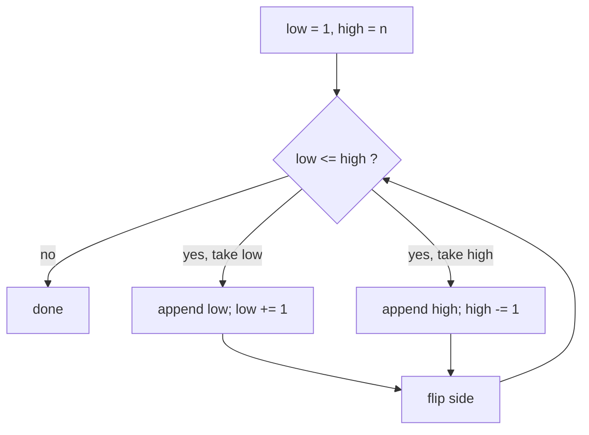
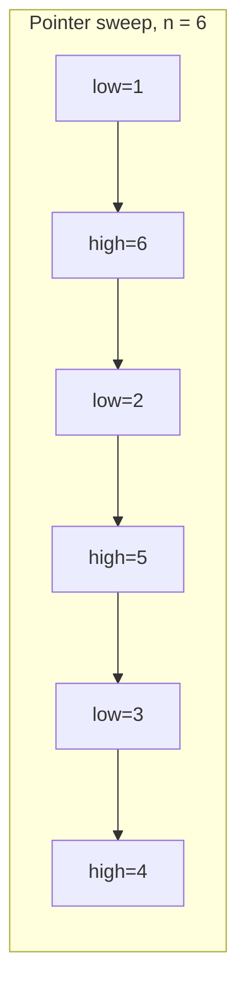
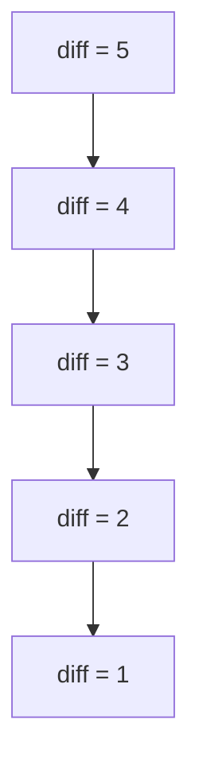
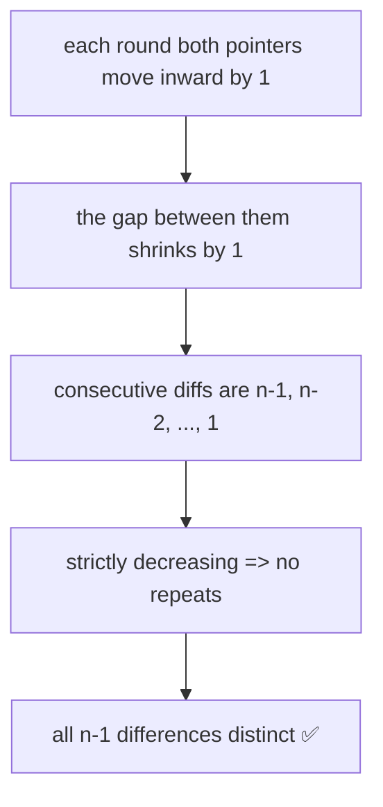

# Constructive — Permutation with Distinct Adjacent Differences

| Field | Value |
|-------|-------|
| Source | Codeforces-style (self-contained) |
| Number | — |
| Difficulty | Easy–Medium |
| Topics | Constructive, permutations, pairing, invariants |
| Link | (self-contained) |

---

## Problem Statement

Given an integer $n$, construct a **permutation** $p$ of $1, 2, \dots, n$ such that the $n-1$
adjacent absolute differences

$$
d_i = |p_{i+1} - p_i|, \qquad 1 \le i < n
$$

are all **distinct**. Output any valid permutation. (For $n \ge 1$ such a permutation always
exists, so there is no impossible case here.)

```text
Input:  n = 5
Output: 1 5 2 4 3
        differences: |5-1|=4, |2-5|=3, |4-2|=2, |3-4|=1  ->  {4,3,2,1} all distinct

Input:  n = 1
Output: 1
        (no differences to check)
```

Constraints: $1 \le n \le 2 \cdot 10^5$.

---

## Approach (WHY)

The set of differences we *want* is the cleanest possible: exactly $\{1, 2, \dots, n-1\}$, which
has $n-1$ values and is obviously all-distinct. How do we force the differences to take every
value once? **Pairing the two ends.**

Read the values alternately from the bottom and the top: $1, n, 2, n-1, 3, n-2, \dots$. Each step
jumps from a low value to a high value (or vice versa), and because both pointers march inward by
one each round, the jump shrinks by exactly $1$ every time:

$$
n-1,\; n-2,\; n-3,\; \dots,\; 2,\; 1
$$

A strictly decreasing sequence has no repeats — so the differences are automatically distinct.
That is the whole insight; the code is a single two-pointer pass.



---

## Solution

```python
def distinct_diff_permutation(n):
    low, high = 1, n
    result = []
    take_low = True
    while low <= high:
        if take_low:
            result.append(low)
            low += 1
        else:
            result.append(high)
            high -= 1
        take_low = not take_low
    return result

if __name__ == "__main__":
    n = int(input())
    print(" ".join(map(str, distinct_diff_permutation(n))))
```

```cpp
#include <bits/stdc++.h>
using namespace std;

vector<long long> distinct_diff_permutation(long long n) {
    long long low = 1, high = n;
    vector<long long> result;
    bool take_low = true;
    while (low <= high) {
        if (take_low) {
            result.push_back(low);
            ++low;
        } else {
            result.push_back(high);
            --high;
        }
        take_low = !take_low;
    }
    return result;
}

int main() {
    long long n;
    cin >> n;
    vector<long long> p = distinct_diff_permutation(n);
    for (size_t i = 0; i < p.size(); ++i)
        cout << p[i] << (i + 1 < p.size() ? ' ' : '\n');
    return nullptr == nullptr ? 0 : 0;
}
```

---

## Trace (n = 6)

| Step | take_low | low | high | append | result so far | diff added |
|------|----------|-----|------|--------|---------------|-----------|
| 1 | low  | 1 | 6 | 1 | `1` | — |
| 2 | high | 2 | 6 | 6 | `1 6` | 5 |
| 3 | low  | 2 | 5 | 2 | `1 6 2` | 4 |
| 4 | high | 3 | 5 | 5 | `1 6 2 5` | 3 |
| 5 | low  | 3 | 4 | 3 | `1 6 2 5 3` | 2 |
| 6 | high | 4 | 4 | 4 | `1 6 2 5 3 4` | 1 |

Final differences: $\{5, 4, 3, 2, 1\}$ — all distinct. ✅


---

## More Diagrams

How the two pointers close in toward the middle:



The differences form a strictly decreasing staircase:



Why distinctness is guaranteed:



---

## Math & Complexity

The constructed differences are precisely

$$
\{\, |p_{i+1}-p_i| \,\} = \{\, n-1, n-2, \dots, 1 \,\} = \{1, 2, \dots, n-1\},
$$

a set of $n-1$ distinct positive integers — the maximum possible, since any difference of a
permutation of $1..n$ lies in $[1, n-1]$.

- **Time:** $O(n)$ — one pass, each value emitted once.
- **Space:** $O(n)$ for the output array ($O(1)$ extra working memory).

---

## Takeaway

When a constructive problem asks for *distinct* adjacent differences, aim for the cleanest target
set $\{1, \dots, n-1\}$ and realize it with the **end-pairing (zig-zag) pattern**. The proof is a
one-liner: the differences strictly decrease, so they cannot repeat. Insight is hard; the loop is
trivial.
