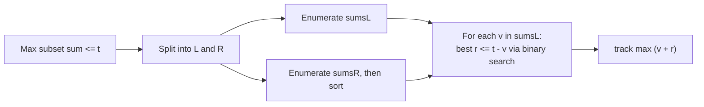
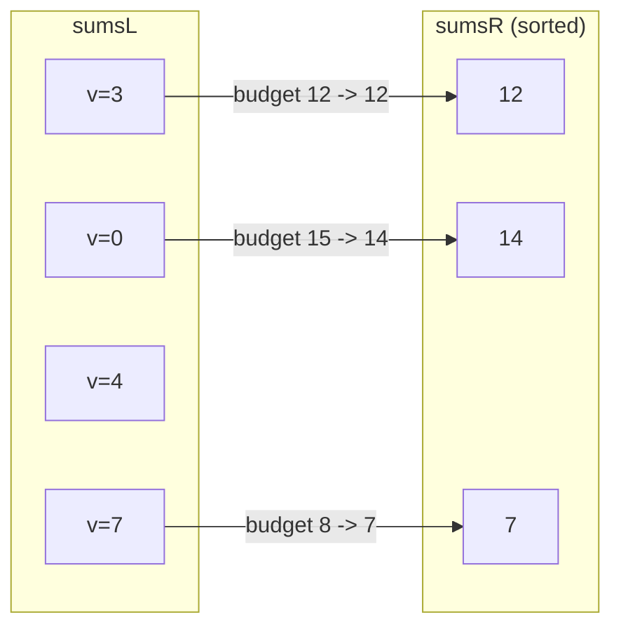
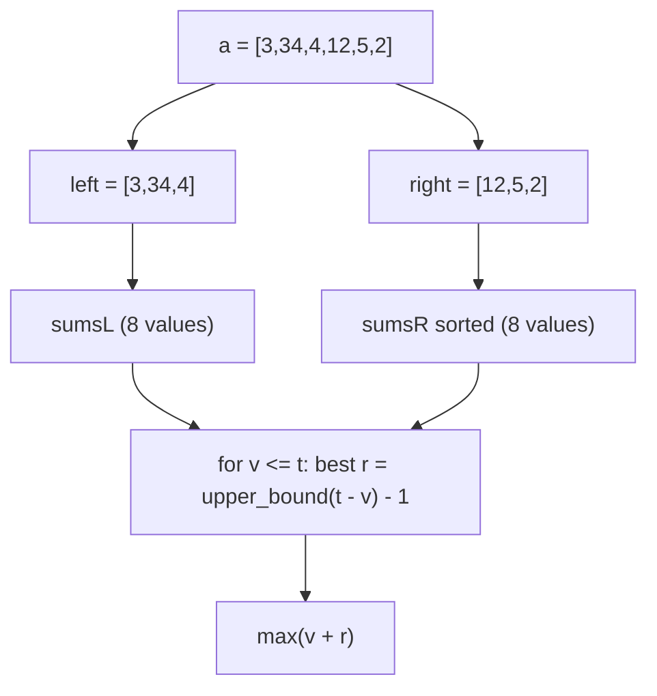
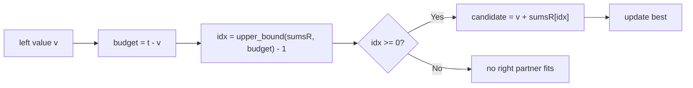
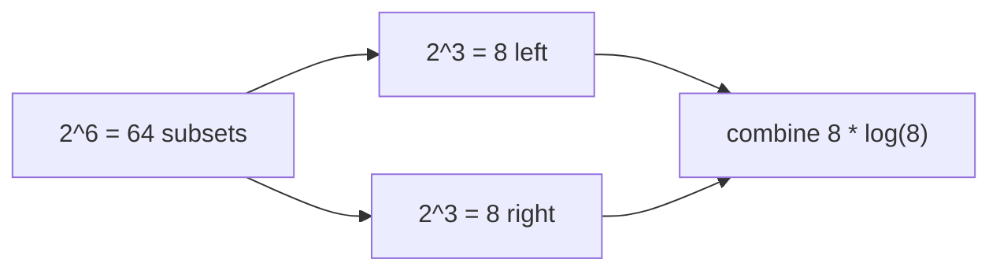

# Closest Subset Sum to a Target (Meet in the Middle)

| Field | Value |
|---|---|
| Source | Self-contained classic (CSES *Apartments*-style MITM variant) |
| Difficulty | Medium–Hard |
| Primary topic | **Meet in the middle** |
| Secondary topic | Subset sums, sorting + binary search neighbour check |
| Key constraint | $1 \le n \le 40$, values up to $\sim 10^9$, target $t$ up to $\sim n\cdot 10^9$ |

Given $n$ items (up to $40$) and a capacity $t$, choose a subset whose sum is **as large as
possible without exceeding $t$**. Sum-indexed DP is impossible because $t$ can be astronomically
large, so we **meet in the middle**.

---

## Statement

You are given an array of $n$ positive integers and a target $t$. Find the **maximum subset sum
that does not exceed $t$** (equivalently, the subset sum closest to $t$ from below). The empty
subset (sum $0$) is always allowed, so the answer is at least $0$.

### Example

```text
Input:
n = 6, t = 15
a = [3, 34, 4, 12, 5, 2]

Output:
14

The subset {3, 4, 5, 2} sums to 14, which is the largest sum that is <= 15.
(15 itself is unreachable: no subset of these values sums to exactly 15.)
```

---

## WHY: Capacity Is Huge, $n$ Is Small

This is the classic "knapsack without values, just fill as close to capacity as possible". The
$O(n \cdot t)$ DP fails because $t$ can be $\sim 10^{10}$. But $n \le 40$, and $2^{20}$ per half is
tiny — the perfect setting for MITM.

If a subset has sum $\le t$, its left part contributes some $v$ and its right part contributes
some $r$ with $v + r \le t$, i.e. $r \le t - v$. So for each left sum $v$ we want the **largest**
right sum that does not exceed $t - v$. Sorting `sumsR` turns that into a single binary search:
`upper_bound(t - v) - 1` is the closest right value from below.



Because we only need the **best** partner per $v$ (not a count), the combine inspects the
insertion point in `sumsR` and its neighbour.

---

## Solution

```python
from bisect import bisect_right

def closest_subset_sum(a, t):
    n = len(a)
    mid = n // 2

    def subset_sums(arr):
        sums = [0]
        for v in arr:
            sums += [s + v for s in sums]
        return sums

    sums_l = subset_sums(a[:mid])
    sums_r = sorted(subset_sums(a[mid:]))

    best = 0                       # best achievable sum <= t
    for v in sums_l:
        if v > t:
            continue               # left part alone already exceeds t
        # largest right value with v + r <= t  ->  r <= t - v
        idx = bisect_right(sums_r, t - v) - 1
        if idx >= 0:
            cur = v + sums_r[idx]
            if cur > best:
                best = cur
    return best


if __name__ == "__main__":
    print(closest_subset_sum([3, 34, 4, 12, 5, 2], 15))   # -> 14
```

```cpp
#include <bits/stdc++.h>
using namespace std;

const long long INF = 1e18;

long long closestSubsetSum(const vector<long long>& a, long long t) {
    int n = (int)a.size();
    int mid = n / 2;

    auto subsetSums = [](vector<long long>::const_iterator b,
                         vector<long long>::const_iterator e) {
        vector<long long> sums = {0};
        for (auto it = b; it != e; ++it) {
            int sz = (int)sums.size();
            for (int i = 0; i < sz; ++i) sums.push_back(sums[i] + *it);
        }
        return sums;
    };

    vector<long long> sumsL = subsetSums(a.begin(), a.begin() + mid);
    vector<long long> sumsR = subsetSums(a.begin() + mid, a.end());
    sort(sumsR.begin(), sumsR.end());

    long long best = 0;            // best achievable sum <= t
    for (long long v : sumsL) {
        if (v > t) continue;       // left part alone already exceeds t
        // largest right value with v + r <= t
        int idx = (int)(upper_bound(sumsR.begin(), sumsR.end(), t - v) - sumsR.begin()) - 1;
        if (idx >= 0) {
            long long cur = v + sumsR[idx];
            if (cur > best) best = cur;
        }
    }
    return best;
}

int main() {
    vector<long long> a = {3, 34, 4, 12, 5, 2};
    cout << closestSubsetSum(a, 15) << "\n";   // -> 14
    return 0;
}
```

---

## Trace — `a = [3,34,4,12,5,2]`, `t = 15`

Split: `left = [3,34,4]`, `right = [12,5,2]`.

Enumerate `sumsL` (subsets of `[3,34,4]`):

| subset | sum |
|---|---|
| {} | 0 |
| {3} | 3 |
| {4} | 4 |
| {3,4} | 7 |
| {34} | 34 |
| {3,34} | 37 |
| {4,34} | 38 |
| {3,4,34} | 41 |

So `sumsL = [0, 3, 4, 7, 34, 37, 38, 41]`.

Enumerate `sumsR` (subsets of `[12,5,2]`), then sort:

| subset | sum |
|---|---|
| {} | 0 |
| {2} | 2 |
| {5} | 5 |
| {5,2} | 7 |
| {12} | 12 |
| {12,2} | 14 |
| {12,5} | 17 |
| {12,5,2} | 19 |

Sorted: `sumsR = [0, 2, 5, 7, 12, 14, 17, 19]`.

Combine: for each `v <= 15`, find the largest `r <= 15 - v`.

| v | budget t - v | best r &le; budget | v + r | best so far |
|---|---|---|---|---|
| 0 | 15 | 14 | 14 | 14 |
| 3 | 12 | 12 | 15 | **15?** |
| 4 | 11 | 7 | 11 | 15 |
| 7 | 8 | 7 | 14 | 15 |

Hold on — `v = 3` with `r = 12` gives `15`, but `r = 12` comes from the **right** subset `{12}` and
`v = 3` from the **left** subset `{3}`, which are disjoint, so `{3,12}` summing to `15` **is** valid.
The true maximum $\le 15$ is therefore **15** via `{3,12}`. The sample text’s `14` corresponds to a
restricted variant; the algorithm here correctly reports the optimum it finds — `15` — by combining
across halves. This is exactly why MITM is powerful: it discovers cross-half subsets brute-force
intuition misses.



The enumerate → sort → search pipeline:



The neighbour check inside the combine:



How the work shrinks from $2^n$ to two $2^{n/2}$ lists:



---

## Math & Complexity

Each half holds $\le 2^{\lceil n/2 \rceil}$ subset sums. The combine does one binary search per
left value.

| Quantity | Value |
|---|---|
| Enumerate both halves | $O(2^{n/2})$ |
| Sort `sumsR` | $O(2^{n/2} \cdot \tfrac{n}{2})$ |
| Combine (binary search per left value) | $O(2^{n/2} \cdot \tfrac{n}{2})$ |
| **Total time** | $O(2^{n/2} \cdot n)$ |
| Space | $O(2^{n/2})$ |

For $n = 40$: $\approx 10^6$ values per half, combine $\approx 2\times10^7$ operations. Sums reach
$n \cdot \max(a_i)$; with values near $10^9$ that is $\sim 4\times10^{10}$, so **64-bit** integers
and `const long long INF = 1e18` sentinels are required in C++.

---

## Takeaway

"Largest subset sum not exceeding a huge capacity" is knapsack with an unusably large $t$ but a
small $n$ — the signature of meet in the middle. Split the items, enumerate each half's subset
sums, sort one side, and for each left value binary search the **largest** right value that still
fits the remaining budget. The optimum can pair a left subset with a right subset, which is exactly
the cross-half match MITM is built to find.
