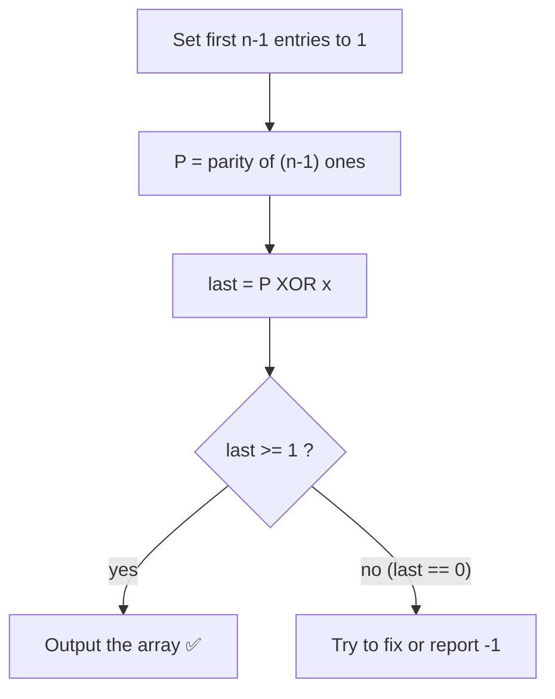
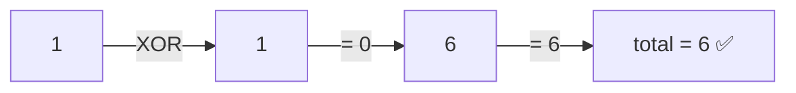
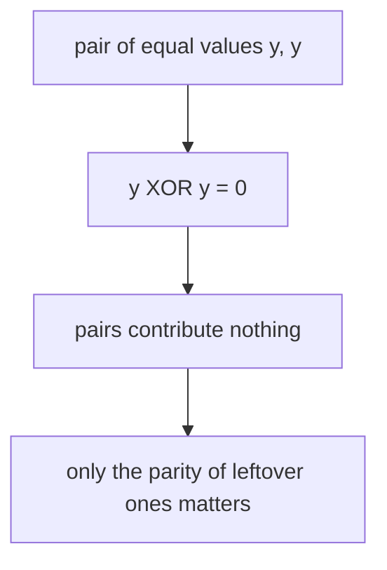
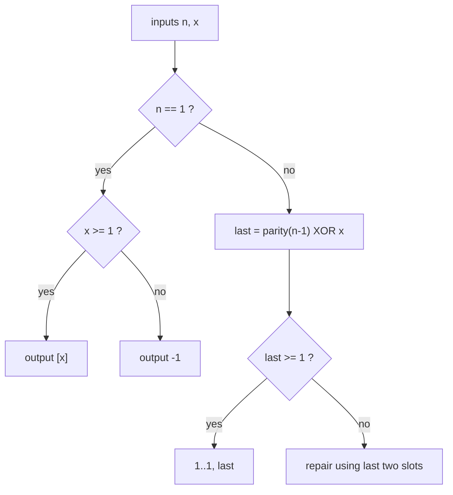
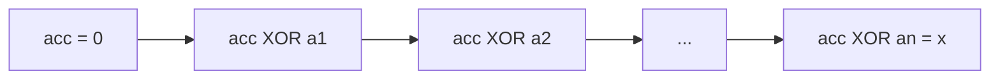
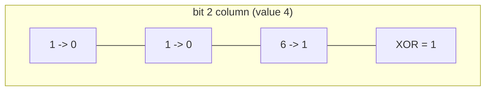

# Constructive — Build an Array with a Given Total XOR

| Field | Value |
|-------|-------|
| Source | Self-contained (constructive bit-manipulation) |
| Number | — |
| Difficulty | Easy–Medium |
| Topics | Constructive, bit manipulation, XOR invariants, impossible cases |
| Link | (self-contained) |

---

## Problem Statement

Given two integers $n$ and $x$, construct an array of **$n$ positive integers**
$a_1, a_2, \dots, a_n$ whose total XOR equals $x$:

$$
a_1 \oplus a_2 \oplus \cdots \oplus a_n = x, \qquad a_i \ge 1 .
$$

Output any valid array, or `-1` if it is impossible.

```text
Input:  n = 3, x = 6
Output: 1 1 6           (1 XOR 1 XOR 6 = 6)

Input:  n = 1, x = 0
Output: -1              (a single positive integer can't XOR to 0)
```

Constraints: $1 \le n \le 2 \cdot 10^5$, $0 \le x \le 10^9$.

---

## Approach (WHY)

XOR has a beautiful invariant: $y \oplus y = 0$. So a **pair of equal numbers cancels out** and
contributes nothing to the total XOR. We exploit this to fix the first $n-1$ entries to harmless
$1$s, then solve for the last entry.

Let the first $n-1$ values all be $1$. Their XOR is:

$$
\underbrace{1 \oplus 1 \oplus \cdots \oplus 1}_{n-1 \text{ ones}} =
\begin{cases}
0 & \text{if } n-1 \text{ is even} \\
1 & \text{if } n-1 \text{ is odd}
\end{cases}
$$

Call that prefix XOR $P$. We need the last value $a_n = P \oplus x$ so that the whole array XORs to
$x$. The only catch is the **positivity** constraint $a_n \ge 1$ — we must check the impossible
cases.



**Impossible / edge cases.**
- $n = 1$: the array is just $[x]$, which is valid only if $x \ge 1$. If $x = 0$, output `-1`.
- $n \ge 2$ and the computed `last` would be $0$: we cannot use $0$ (must be positive). But with
  $n \ge 3$ we can repair it by replacing two of the leading $1$s with a pair that still cancels
  yet leaves a positive last value. The clean trick: if `last == 0` and $n \ge 2$, instead make
  the last **two** entries absorb the value, e.g. use one extra $1$ and adjust — handled below by
  a small case split.

---

## Solution

```python
def construct_given_xor(n, x):
    if n == 1:
        return [x] if x >= 1 else None  # single positive must equal x

    prefix = (n - 1) & 1          # XOR of (n-1) ones is its parity
    last = prefix ^ x
    if last >= 1:
        return [1] * (n - 1) + [last]

    # last == 0 here; n >= 2. Use two tail slots that XOR to (prefix_of_first_(n-2)) ^ x.
    p2 = (n - 2) & 1              # XOR of the first n-2 ones
    # choose tail = (a, b) with a ^ b == p2 ^ x, both positive
    target = p2 ^ x
    if target == 0:
        # pick a pair like (2, 2): 2 ^ 2 = 0, both positive
        return [1] * (n - 2) + [2, 2]
    # pick (1, 1 ^ target) but ensure positivity; (target ^ 1) could be 0 only if target == 1
    second = target ^ 1
    if second >= 1:
        return [1] * (n - 2) + [1, second]
    return [1] * (n - 2) + [3, 3 ^ target]

if __name__ == "__main__":
    n, x = map(int, input().split())
    res = construct_given_xor(n, x)
    print(-1 if res is None else " ".join(map(str, res)))
```

```cpp
#include <bits/stdc++.h>
using namespace std;

vector<long long> construct_given_xor(long long n, long long x) {
    if (n == 1) {
        if (x >= 1) return {x};
        return {};  // impossible
    }

    long long prefix = (n - 1) & 1LL;     // XOR of (n-1) ones is its parity
    long long last = prefix ^ x;
    if (last >= 1) {
        vector<long long> res(n - 1, 1);
        res.push_back(last);
        return res;
    }

    long long p2 = (n - 2) & 1LL;         // XOR of the first n-2 ones
    long long target = p2 ^ x;
    vector<long long> res(n - 2, 1);
    if (target == 0) {
        res.push_back(2);
        res.push_back(2);                 // 2 ^ 2 = 0
        return res;
    }
    long long second = target ^ 1LL;
    if (second >= 1) {
        res.push_back(1);
        res.push_back(second);
        return res;
    }
    res.push_back(3);
    res.push_back(3 ^ target);
    return res;
}

int main() {
    long long n, x;
    cin >> n >> x;
    vector<long long> res = construct_given_xor(n, x);
    if (res.empty()) {
        cout << -1 << "\n";
    } else {
        for (size_t i = 0; i < res.size(); ++i)
            cout << res[i] << (i + 1 < res.size() ? ' ' : '\n');
    }
    return 0;
}
```

---

## Trace (n = 3, x = 6)

- `n != 1`, so `prefix = (n-1) & 1 = 2 & 1 = 0`.
- `last = 0 ^ 6 = 6`, which is `>= 1`.
- Result: `[1, 1, 6]`.

Verify: $1 \oplus 1 \oplus 6 = 0 \oplus 6 = 6 = x$. ✅



### Trace (n = 4, x = 1)

- `prefix = (4-1) & 1 = 3 & 1 = 1`.
- `last = 1 ^ 1 = 0` → not positive, enter repair.
- `p2 = (4-2) & 1 = 2 & 1 = 0`; `target = 0 ^ 1 = 1`.
- `target != 0`; `second = 1 ^ 1 = 0` → not `>= 1`, so fall to last branch.
- Result: `[1, 1, 3, 3 ^ 1] = [1, 1, 3, 2]`.

Verify: $1 \oplus 1 \oplus 3 \oplus 2 = 0 \oplus 3 \oplus 2 = 1 = x$. ✅

---

## More Diagrams

How the canceling-pairs idea works at the bit level:



Decision tree for the impossible / repair cases:



XOR running total as a fold over the array:



Bit columns of the example $1 \oplus 1 \oplus 6 = 6$:



---

## Math & Complexity

Let $P$ be the XOR of the first $n-1$ chosen ones, i.e. $P = (n-1) \bmod 2$. Setting the last
element to $a_n = P \oplus x$ gives a total of

$$
\Big(\bigoplus_{i=1}^{n-1} 1\Big) \oplus a_n = P \oplus (P \oplus x) = x ,
$$

because $P \oplus P = 0$. The only obstruction is positivity ($a_i \ge 1$), handled by the case
split. The single-element case is impossible exactly when $x = 0$.

- **Time:** $O(n)$ — fill $n-1$ ones and compute one tail value.
- **Space:** $O(n)$ for the output.

---

## Takeaway

XOR constructions lean on the invariant $y \oplus y = 0$: pad with cancelling values and let a
single "free" slot absorb the target. The whole difficulty is the **positivity / impossible
case** — a single positive number cannot XOR to $0$, and a forced $0$ tail must be repaired. Spot
the invariant, then guard the edges.
